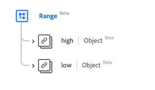

# [!UICONTROL Plage] type de données

[!UICONTROL Plage] est un type de données standard du modèle de données d’expérience (XDM) qui fournit un ensemble de valeurs liées par des valeurs faibles et élevées. Ce type de données est créé conformément aux spécifications HL7 FHIR Release 5.

| Nom d’affichage | Propriété | Type de données | Description |
| --- | --- | --- | --- |
| [!UICONTROL Élevé] | `high` | [[!UICONTROL Quantité simple]](../data-types/simple-quantity.md) | La limite la plus élevée. |
| [!UICONTROL Faible] | `low` | [[!UICONTROL Quantité simple]](../data-types/simple-quantity.md) | La limite la plus basse. |

Pour plus d’informations sur ce type de données, reportez-vous au référentiel XDM public :

* [Exemple renseigné](https://github.com/adobe/xdm/blob/master/extensions/industry/healthcare/fhir/datatypes/range.example.1.json)
* [Schéma complet](https://github.com/adobe/xdm/blob/master/extensions/industry/healthcare/fhir/datatypes/range.schema.json)
