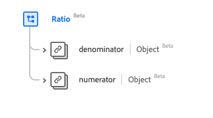

# Type de données [!UICONTROL Ratio]

[!UICONTROL Rapport] est un type de données standard du modèle de données d’expérience (XDM) qui fournit un rapport de deux valeurs [[!UICONTROL Quantité]](../data-types/quantity.md) via un numérateur et un dénominateur. Ce type de données est créé conformément aux spécifications HL7 FHIR Release 5.

| Nom d’affichage | Propriété | Type de données | Description |
| --- | --- | --- | --- |
| [!UICONTROL Dénominateur] | `denominator` | [[!UICONTROL Quantité simple]](../data-types/simple-quantity.md) | Valeur du dénominateur. |
| [!UICONTROL Numérateur] | `numerator` | [[!UICONTROL Quantité]](../data-types/quantity.md) | Valeur du numérateur. |

>[!NOTE]
>
> Les `denominator` et `numerator` ont des types de données différents en raison de la spécification créée conformément à la version 5 du FHIR HL7.

Pour plus d’informations sur ce type de données, reportez-vous au référentiel XDM public :

* [Exemple renseigné](https://github.com/adobe/xdm/blob/master/extensions/industry/healthcare/fhir/datatypes/ratio.example.1.json)
* [Schéma complet](https://github.com/adobe/xdm/blob/master/extensions/industry/healthcare/fhir/datatypes/ratio.schema.json)
