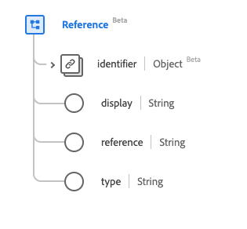

# Type de données [!UICONTROL Reference]

[!UICONTROL Reference] est un type de données standard du modèle de données d’expérience (XDM) qui fournit une référence d’une ressource à une autre. Ce type de données est créé conformément aux spécifications HL7 FHIR Release 5.

| Nom d’affichage | Propriété | Type de données | Description |
| --- | --- | --- | --- |
| [!UICONTROL Identifier] | `identifier` | [[!UICONTROL Identifier]](../data-types/identifier.md) | La référence logique lorsque la référence littérale est inconnue. |
| [!UICONTROL Display] | `display` | Chaîne | Texte secondaire de la référence. |
| [!UICONTROL Reference] | `reference` | Chaîne | Référence littérale, relative, interne ou URL absolue. |
| [!UICONTROL Type] | `type` | Chaîne | Type auquel la référence fait référence, représenté sous la forme d’un URI. |

Pour plus d’informations sur ce type de données, reportez-vous au référentiel XDM public :

* [Exemple renseigné](https://github.com/adobe/xdm/blob/master/extensions/industry/healthcare/fhir/datatypes/reference.example.1.json)
* [Schéma complet](https://github.com/adobe/xdm/blob/master/extensions/industry/healthcare/fhir/datatypes/reference.schema.json)
