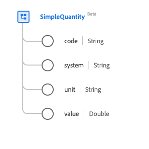

# Type de données [!UICONTROL Quantité simple]

[!UICONTROL  Quantité simple ] est un type de données standard du modèle de données d’expérience (XDM) qui fournit une quantité mesurée ou mesurable. Ce type de données est créé conformément aux spécifications HL7 FHIR Release 5.

| Nom d’affichage | Propriété | Type de données | Description |
| --- | --- | --- | --- |
| [!UICONTROL Code] | `code` | Chaîne | Forme codée de l’unité. |
| [!UICONTROL Système] | `system` | Chaîne | Système qui définit le formulaire unitaire codé, représenté sous la forme d’un URI. |
| [!UICONTROL Unité] | `unit` | Chaîne | Représentation de l’unité. |
| [!UICONTROL Valeur] | `value` | Double | Valeur numérique. |

Pour plus d’informations sur ce type de données, reportez-vous au référentiel XDM public :

* [Exemple renseigné](https://github.com/adobe/xdm/blob/master/extensions/industry/healthcare/fhir/datatypes/simplequantity.example.1.json)
* [Schéma complet](https://github.com/adobe/xdm/blob/master/extensions/industry/healthcare/fhir/datatypes/simplequantity.schema.json)
