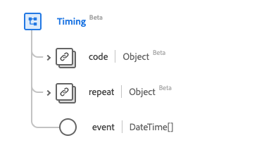

# Type de données [!UICONTROL Timing]

[!UICONTROL Minutage] est un type de données standard du modèle de données d’expérience (XDM) qui décrit un planning qui fournit des informations sur un événement qui peut se produire plusieurs fois. Ce type de données est créé conformément aux spécifications HL7 FHIR Release 5.

| Nom d’affichage | Propriété | Type de données | Description |
| --- | --- | --- | --- |
| [!UICONTROL Événement] | `event` | Tableau de date et heure | Lorsque l’événement se produit. |
| [!UICONTROL Répéter] | `repeat` | [[!UICONTROL Répéter]](../data-types/repeat.md) | Informations sur le moment où l’événement se produit. |
| [!UICONTROL Code] | `code` | [[!UICONTROL Concept codable]](../data-types/codeable-concept.md) | Le code relatif à l’événement. |

Pour plus d’informations sur ce type de données, reportez-vous au référentiel XDM public :

* [Exemple renseigné](https://github.com/adobe/xdm/blob/master/extensions/industry/healthcare/fhir/datatypes/timing.example.1.json)
* [Schéma complet](https://github.com/adobe/xdm/blob/master/extensions/industry/healthcare/fhir/datatypes/timing.schema.json)
