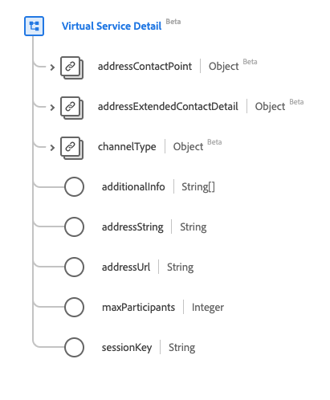

# Type de données [!UICONTROL Virtual Service Detail]

[!UICONTROL Virtual Service Detail] est un type de données standard du modèle de données d’expérience (XDM) qui décrit les détails de contact du service virtuel. Ce type de données est créé conformément aux spécifications HL7 FHIR Release 5.

| Nom d’affichage | Propriété | Type de données | Description |
| --- | --- | --- | --- |
| [!UICONTROL Address Contact Point] | `addressContactPoint` | [[!UICONTROL Contact Point]](../data-types/contact-point.md) | Détails d’un point de contact recourant à la technologie, tel qu’un téléphone, un fax ou un e-mail. |
| [!UICONTROL Address Extended Contact Detail] | `addressExtendedContactDetail` | [[!UICONTROL Extended Contact Detail]](../data-types/extended-contact-detail.md) | Coordonnées étendues. |
| [!UICONTROL Channel Type] | `channelType` | [[!UICONTROL Coding]](../data-types/coding.md) | Type de service virtuel auquel se connecter, tel que Teams, Zoom ou WhatsApp. |
| [!UICONTROL Additional Info] | `additionalInfo` | Tableau de chaînes | Adresse pour afficher les autres détails de connexion, représentés sous la forme d’un URI. |
| [!UICONTROL Address String] | `addressString` | Chaîne | Adresse à utiliser pour la connexion au service virtuel. |
| [!UICONTROL Address Url] | `addressUrl` | Chaîne | URL à utiliser pour la connexion au service virtuel, représentée sous la forme d’un URI. |
| [!UICONTROL Max Participants] | `maxParticipants` | Entier | Nombre maximal de participants pris en charge, avec une valeur minimale de `0`. |
| [!UICONTROL Session Key] | `sessionKey` | Chaîne | Clé de session requise par le service virtuel. |

Pour plus d’informations sur ce type de données, reportez-vous au référentiel XDM public :

* [Exemple renseigné](https://github.com/adobe/xdm/blob/master/extensions/industry/healthcare/fhir/datatypes/simplequantity.example.1.json)
* [Schéma complet](https://github.com/adobe/xdm/blob/master/extensions/industry/healthcare/fhir/datatypes/simplequantity.schema.json)
