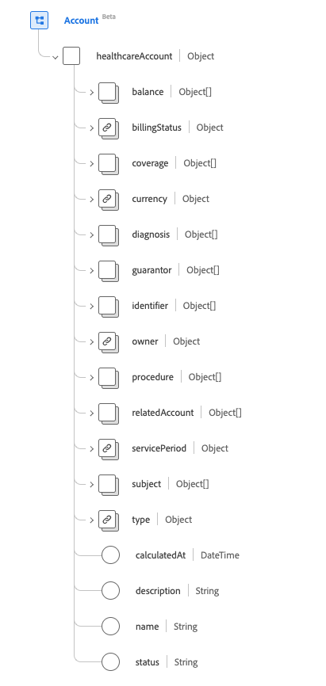
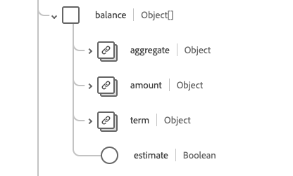
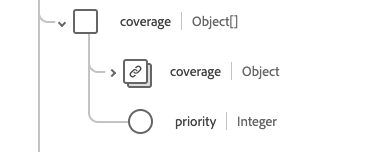
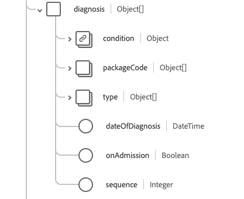
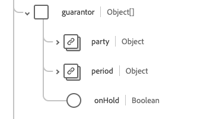
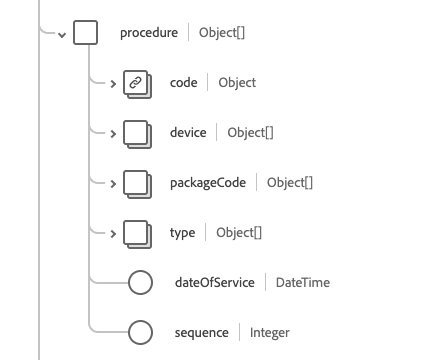
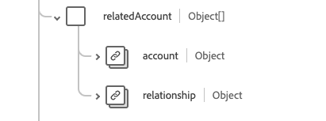

# [!UICONTROL Account] groupe de champs de schéma

[!UICONTROL Account] est un groupe de champs de schéma standard pour la [[!DNL XDM Individual Profile] classe](../../../classes/individual-profile.md) et le [[!DNL Provider class]](../../../classes/provider.md). Il fournit un `healthcareAccount` de champ de type objet unique qui est utilisé pour enregistrer les transactions, les services et d’autres informations financières liés aux services de santé fournis à un patient ou à un groupe de personnes (à des fins de police d’assurance ou de facturation, par exemple).

| Nom d’affichage | Propriété | Type de données | Description |
| --- | --- | --- | --- |
| [!UICONTROL Balance] | `balance` | Tableau d’objets | Soldes comptables qui sont calculés et traités par le système financier. Pour plus d’informations, consultez la [section ci-dessous](#balances). |
| [!UICONTROL Billing Status] | `billingStatus` | [[!UICONTROL Codeable Concept]](../data-types/codeable-concept.md) | Cela permet de suivre le cycle de vie du compte tout au long du processus de facturation. Il indique comment les transactions sont traitées lorsqu’elles sont affectées au compte. |
| [!UICONTROL Coverage] | `coverage` | Tableau d’objets | Partie(s) responsable(s) de la couverture des coûts de ce compte et ordre dans lequel ils doivent être appliqués. Pour plus d’informations, consultez la [section ci-dessous](#coverage). |
| [!UICONTROL Currency] | `currency` | [[!UICONTROL Codeable Concept]](../data-types/codeable-concept.md) | Devise par défaut du compte. |
| [!UICONTROL Diagnosis] | `diagnosis` | Tableau d’objets | L’ensemble des diagnostics pertinents pour la facturation est stocké ici sur le compte où ils peuvent être séquencés de manière appropriée avant le traitement pour produire une ou plusieurs réclamations. Pour plus d’informations, consultez la [section ci-dessous](#diagnosis). |
| [!UICONTROL Guarantor] | `guarantor` | Tableau d’objets | Les parties responsables de l&#39;équilibrage du compte si les autres options de paiement ne sont pas suffisantes. Pour plus d’informations, consultez la [section ci-dessous](#guarantor). |
| [!UICONTROL Identifier] | `identifier` | Tableau de [[!UICONTROL Identifier]](../data-types/identifier.md) | Identifiant unique utilisé pour référencer le compte. Il peut être destiné ou non à un usage humain (par exemple numéro de carte de crédit). |
| [!UICONTROL Owner] | `owner` | [[!UICONTROL Reference]](../data-types/reference.md) | Indique la zone de service, l’hôpital, le service, etc. chargé de la gestion du compte. |
| [!UICONTROL Procedure] | `procedure` | Tableau d’objets | L’ensemble des procédures pertinentes pour la facturation est stocké ici sur le compte où elles peuvent être séquencées de manière appropriée avant le traitement pour produire une ou plusieurs réclamations. Pour plus d’informations, consultez la [section ci-dessous](#procedure). |
| [!UICONTROL Related Account] | `relatedAccount` | Tableau d’objets | Autres comptes associés à ce compte. Pour plus d’informations, consultez la [section ci-dessous](#related-account). |
| [!UICONTROL Service Period] | `servicePeriod` | [[!UICONTROL Period]](../data-types/period.md) | Période des services associés à ce compte. |
| [!UICONTROL Subject] | `subject` | Tableau de [[!UICONTROL Reference]](../data-types/reference.md) | Identifie l’entité qui engage les dépenses. Bien que les bénéficiaires immédiats de services ou de biens puissent être des entités liées à l&#39;objet, les dépenses ont finalement été engagées par l&#39;objet du compte. |
| [!UICONTROL Type] | `type` | [[!UICONTROL Codeable Concept]](../data-types/codeable-concept.md) | Catégorise le compte à des fins de création de rapports et de recherche. |
| [!UICONTROL Calculated At] | `calculatedAt` | DateTime | Heure de calcul du solde. |
| [!UICONTROL Description] | `description` | Chaîne | Fournit des informations supplémentaires sur ce que le compte suit et comment il est utilisé. |
| [!UICONTROL Name] | `name` | Chaîne | Nom du compte. |
| [!UICONTROL Status] | `status` | Chaîne | Statut du compte. La valeur de cette propriété doit être égale à l’une des valeurs d’énumération connues suivantes. <li> `active` </li> <li> `inactive` </li> <li> `entered-in-error` </li> <li> `on-hold` </li> <li> `unknown`</li> |

Pour plus d’informations sur le groupe de champs , consultez le référentiel XDM public :

* [Exemple renseigné](https://github.com/adobe/xdm/blob/master/extensions/industry/healthcare/fhir/fieldgroups/account.example.1.json)
* [Schéma complet](https://github.com/adobe/xdm/blob/master/extensions/industry/healthcare/fhir/fieldgroups/account.schema.json)

## `balances` {#balances}

`balances` est fourni sous la forme d’un tableau d’objets . La structure de chaque objet est décrite ci-dessous.

| Nom d’affichage | Propriété | Type de données | Description |
| --- | --- | --- | --- |
| [!UICONTROL Aggregate] | `aggregate` | [[!UICONTROL Codeable Concept]](../data-types/codeable-concept.md) | Qui est censé payer cette partie du solde ? |
| [!UICONTROL Amount] | `amount` | [[!UICONTROL Money]](../data-types/money.md) | Solde réel calculé pour l’âge défini dans la propriété du terme. |
| [!UICONTROL Term] | `term` | [[!UICONTROL Codeable Concept]](../data-types/codeable-concept.md) | Durée du compte. |
| [!UICONTROL Estimate] | `estimate` | Booléen | Si le montant est une valeur estimée. |

## `coverage` {#coverage}

`coverage` est fourni sous la forme d’un tableau d’objets . La structure de chaque objet est décrite ci-dessous.

| Nom d’affichage | Propriété | Type de données | Description |
| --- | --- | --- | --- |
| [!UICONTROL Coverage] | `coverage` | [[!UICONTROL Reference]](../data-types/reference.md) | Partie(s) responsable(s) de la couverture des coûts de ce compte et ordre dans lequel ils doivent être appliqués. |
| [!UICONTROL Priority] | `priority` | Entier | Priorité de la couverture dans le cadre de ce compte, avec une valeur minimale de `0`. |

## `diagnosis` {#diagnosis}

`diagnosis` est fourni sous la forme d’un tableau d’objets . La structure de chaque objet est décrite ci-dessous.

| Nom d’affichage | Propriété | Type de données | Description |
| --- | --- | --- | --- |
| [!UICONTROL Condition] | `condition` | [[!UICONTROL Codeable Reference]](../data-types/codeable-reference.md) | Diagnostic pertinent pour le compte. |
| [!UICONTROL Package Code] | `packageCode` | Tableau de [[!UICONTROL Codeable Concept]](../data-types/codeable-concept.md) | Le code de package peut être utilisé pour regrouper des diagnostics qui peuvent être tarifés ou fournis sous la forme d’un produit unique (comme des médicaments). |
| [!UICONTROL Type] | `type` | Tableau de [[!UICONTROL Codeable Concept]](../data-types/codeable-concept.md) | Type que ce diagnostic présente pour le compte (par exemple, admission, facturation, décharge...). |
| [!UICONTROL Date Of Diagnosis] | `dateOfDiagnosis` | DateTime | Date du diagnostic (diagnostic codé). |
| [!UICONTROL On Admission] | `onAdmission` | Booléen | Si le diagnostic était présent à l’admission. |
| [!UICONTROL Squence] | `sequence` | Entier | Classement du diagnostic (pour chaque type), avec une valeur minimale de `0`. |

## `guarantor` {#guarantor}

`guarantor` est fourni sous la forme d’un tableau d’objets . La structure de chaque objet est décrite ci-dessous.

| Nom d’affichage | Propriété | Type de données | Description |
| --- | --- | --- | --- |
| [!UICONTROL Party] | `party` | [[!UICONTROL Reference]](../data-types/reference.md) | Entité responsable. |
| [!UICONTROL Period] | `period` | [[!UICONTROL Period]](../data-types/period.md) | Délai pendant lequel le garant accepte la responsabilité du compte. |
| [!UICONTROL On Hold] | `onHold` | Booléen | Un garant peut être placé en attente de crédit ou voir son rôle temporairement suspendu. |

## `procedure` {#procedure}

`procedure` est fourni sous la forme d’un tableau d’objets . La structure de chaque objet est décrite ci-dessous.

| Nom d’affichage | Propriété | Type de données | Description |
| --- | --- | --- | --- |
| [!UICONTROL Code] | `code` | [[!UICONTROL Codeable Reference]](../data-types/codeable-reference.md) | Procédure relative au compte. |
| [!UICONTROL Device] | `device` | Tableau de [[!UICONTROL Reference]](../data-types/reference.md) | Tous les appareils associés à la procédure relative au compte. |
| [!UICONTROL Type] | `type` | Tableau de [[!UICONTROL Codeable Concept]](../data-types/codeable-concept.md) | Comment la valeur de procédure doit être utilisée pour imputer le compte. |
| [!UICONTROL Package Code] | `packageCode` | Tableau de [[!UICONTROL Codeable Concept]](../data-types/codeable-concept.md) | Le code de package peut être utilisé pour regrouper des procédures qui peuvent être tarifées ou livrées sous la forme d&#39;un produit unique (comme des DRG). |
| [!UICONTROL Date Of Service] | `dateOfService` | DateTime | Date d&#39;utilisation d&#39;une procédure codée. Si vous faites référence à une procédure, la date de la procédure doit être utilisée. |
| [!UICONTROL Sequence] | `sequence` | Entier | Classement de la procédure (pour chaque type), avec une valeur minimale de `0`. |

## `relatedAccount` {#related-account}

`relatedAccount` est fourni sous la forme d’un tableau d’objets . La structure de chaque objet est décrite ci-dessous.

| Nom d’affichage | Propriété | Type de données | Description |
| --- | --- | --- | --- |
| [!UICONTROL Account] | `account` | [[!UICONTROL Reference]](../data-types/reference.md) | Référence à un compte associé. |
| [!UICONTROL Relationship] | `relationship` | [[!UICONTROL Codeable Concept]](../data-types/codeable-concept.md) | Relation du compte associé. |
