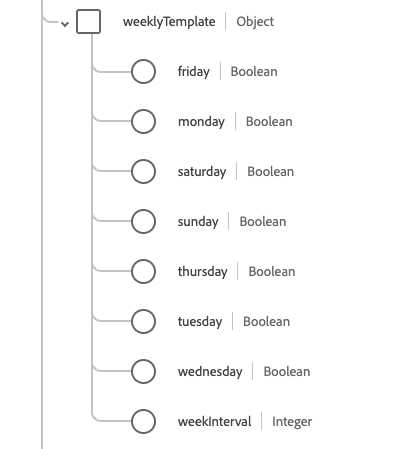

# [!UICONTROL Rendez-vous] groupe de champs de schéma

[!UICONTROL Rendez-vous] est un groupe de champs de schéma standard pour la [[!DNL XDM Individual Profile] classe](../../../classes/individual-profile.md) et le [[!DNL Provider class]](../../../classes/provider.md). Il fournit un `healthcareAppointment` de champ de type objet unique qui contient des informations sur une réservation d’un événement de santé parmi les patients, les praticiens, les personnes apparentées et/ou les appareils pour une date et une heure spécifiques.

| Nom d’affichage | Propriété | Type de données | Description |
| --- | --- | --- | --- |
| [!UICONTROL Compte] | `account` | Tableau de [[!UICONTROL référence]](../data-types/reference.md) | Ensemble de comptes qui doivent être utilisés pour la facturation. |
| [!UICONTROL Type de rendez-vous] | `appointmentType` | [[!UICONTROL Concept codable]](../data-types/codeable-concept.md) | Style du rendez-vous ou du patient réservé dans l&#39;emplacement (et non le type de service). |
| [!UICONTROL Basé sur] | `basedOn` | Tableau de [[!UICONTROL référence]](../data-types/reference.md) | La demande que la nomination est chargée d’évaluer, par exemple une demande de procédure. |
| [!UICONTROL Motif d’annulation] | `cancellationReason` | Tableau de [[!UICONTROL concept codable]](../data-types/codeable-concept.md) | Raison codée de l’annulation du rendez-vous. Elle est souvent utilisée dans le cadre de la création de rapports, de la facturation ou du traitement pour déterminer si d’autres actions sont requises ou si des frais spécifiques s’appliquent. |
| [!UICONTROL Classe] | `class` | Tableau de [[!UICONTROL concept codable]](../data-types/codeable-concept.md) | Concepts représentant la classification d’une rencontre avec un patient, comme ambulatoire, ambulatoire, hospitalisé ou d’urgence. |
| [!UICONTROL Identifiant] | `identifier` | Tableau d’[[!UICONTROL identifiant]](../data-types/identifier.md) | Liste d’identifiants uniques liés au rendez-vous. Ces identifiants sont attribués en fonction des règles métier ou lorsqu’un lien URL direct vers le rendez-vous ne convient pas. |
| [!UICONTROL Remarque] | `note` | Tableau d’[[!UICONTROL annotation]](../data-types/annotation.md) | Notes ou commentaires supplémentaires sur le rendez-vous. |
| [!UICONTROL Rendez-vous initial] | `originatingAppointment` | [[!UICONTROL Référence]](../data-types/reference.md) | Rendez-vous d&#39;origine dans un ensemble récurrent de rendez-vous associés. |
| [!UICONTROL Participant ] | `participant` | Tableau d’objets | Liste des participants impliqués dans la nomination. Pour plus d’informations, consultez la [section ci-dessous](#participant). |
| [!UICONTROL Instructions patient] | `patientInstruction` | Tableau de [[!UICONTROL référence codable]](../data-types/reference.md) | Diagnostic pertinent pour le rendez-vous. |
| [!UICONTROL Rendez-vous précédent] | `previousAppointment` | [[!UICONTROL Référence]](../data-types/reference.md) | La nomination précédente dans une série de nominations connexes. |
| [!UICONTROL Priorité] | `priority` | [[!UICONTROL Concept codable]](../data-types/codeable-concept.md) | La priorité de la nomination qui peut être utilisée pour prendre des décisions éclairées si vous avez besoin de redéfinir les priorités des nominations. iCal Standard spécifie `0` comme non défini, `1` comme priorité la plus élevée et `9` comme priorité la plus faible. |
| [!UICONTROL Motif] | `reason` | Tableau de [[!UICONTROL concept codable]](../data-types/codeable-concept.md) | Motif pour lequel le rendez-vous est planifié, qui correspond généralement à une condition ou à une procédure. |
| [!UICONTROL  Modèle de périodicité ] | `recurrenceTemplate` | Tableau d’objets | Contient les détails de la périodicité ou du modèle utilisé pour créer des rendez-vous périodiques.  Pour plus d’informations, consultez la [section ci-dessous](#recurrence). |
| [!UICONTROL Remplace] | `replaces` | Tableau de [[!UICONTROL référence]](../data-types/reference.md) | Le rendez-vous étant remplacé par ce rendez-vous. Dans les cas d’annulation, les détails de l’annulation se trouvent dans la propriété `cancellationReason` de la ressource référencée. |
| [!UICONTROL Période demandée] | `requestedPeriod` | Tableau de [[!UICONTROL Période]](../data-types/period.md) | Ensemble de périodes (comprenant éventuellement des heures) au cours desquelles il est préférable de planifier le rendez-vous. |
| [!UICONTROL Catégorie de services] | `serviceCategory` | Tableau de [[!UICONTROL concept codable]](../data-types/codeable-concept.md) | Une catégorisation large du service qui doit être effectué pendant la nomination. |
| [!UICONTROL Type de service] | `serviceType` | Tableau de [[!UICONTROL référence codable]](../data-types/codeable-reference.md) | Service spécifique à effectuer pendant le rendez-vous. |
| [!UICONTROL Emplacement] | `slot` | Tableau de [[!UICONTROL référence]](../data-types/reference.md) | Plages horaires des participants qui seront remplies par le rendez-vous. |
| [!UICONTROL Spécialité] | `speciality` | Tableau de [[!UICONTROL concept codable]](../data-types/codeable-concept.md) | La spécialité d&#39;un praticien requis pour effectuer le service demandé dans ce rendez-vous. |
| [!UICONTROL Objet] | `subject` | Tableau de [[!UICONTROL référence]](../data-types/reference.md) | Patient ou groupe associé au rendez-vous. |
| [!UICONTROL Informations annexes] | `supportingInformation` | Tableau de [[!UICONTROL référence]](../data-types/reference.md) | Informations supplémentaires fournies lors de la prise de rendez-vous pour l’appuyer. |
| [!UICONTROL Service virtuel] | `virtualService` | Tableau de [[!UICONTROL détails du service virtuel]](../data-types/virtual-service-detail.md) | Détails de connexion d’un service virtuel, comme une conférence téléphonique. |
| [!UICONTROL Date d’annulation] | `cancellationDate` | DateTime | Date et heure d’annulation du rendez-vous. |
| [!UICONTROL Créé] | `created` | DateTime | Date et heure de création du rendez-vous. |
| [!UICONTROL Description] | `description` | Chaîne | Brève description du rendez-vous. Des informations détaillées ou étendues doivent être insérées dans le champ `note`. |
| [!UICONTROL Fin] | `end` | DateTime | Date et heure de fin du rendez-vous. |
| [!UICONTROL  Durée en minutes ] | `minutesDuration` | Nombre entier | Nombre de minutes que dure le rendez-vous. Il peut s’agir d’une durée inférieure à la durée entre les heures de début et de fin. La valeur minimale acceptée est `0`. |
| [!UICONTROL Occurrence modifiée] | `occurenceChanged` | Booléen | Indicateur qui signale si ce rendez-vous diffère du modèle récurrent. |
| [!UICONTROL RecurrenceId] | `RecurrenceId` | Nombre entier | Numéro de séquence qui identifie un rendez-vous spécifique selon un modèle récurrent. La valeur minimale est `0`. |
| [!UICONTROL Début] | `start` | DateTime | Date et heure auxquelles le rendez-vous aura lieu. |
| [!UICONTROL Statut] | `status` | Chaîne | Statut du rendez-vous. La valeur de cette propriété doit être égale à l’une des valeurs d’énumération connues suivantes : <li> `proposed` </li> <li> `pending` </li> <li> `booked` </li> <li> `arrived` </li> <li> `fulfilled` </li> <li> `cancelled` </li> <li> `noshow` </li> <li> `entered-in-error` </li> <li> `checked-in` </li> <li> `waitlist` </li> |

Pour plus d’informations sur le groupe de champs , consultez le référentiel XDM public :

* [ Exemple renseigné ](https://github.com/adobe/xdm/blob/master/extensions/industry/healthcare/fhir/fieldgroups/appointment.example.1.json)
* [Schéma complet](https://github.com/adobe/xdm/blob/master/extensions/industry/healthcare/fhir/fieldgroups/appointment.schema.json)

## `participant` {#participant}

`participant` est fourni sous la forme d’un tableau d’objets . La structure de chaque objet est décrite ci-dessous.

| Nom d’affichage | Propriété | Type de données | Description |
| --- | --- | --- | --- |
| [!UICONTROL Acteur ] | `actor` | [[!UICONTROL Référence]](../data-types/reference.md) | Personne, appareil, lieu ou service participant au rendez-vous. |
| [!UICONTROL Période] | `period` | [[!UICONTROL Période]](../data-types/period.md) | Période pendant laquelle le participant (l’acteur) est impliqué dans la nomination. |
| [!UICONTROL Type] | `type` | Tableau de [[!UICONTROL concept codable]](../data-types/codeable-concept.md) | Le rôle du participant (acteur) dans la nomination. |
| [!UICONTROL Obligatoire] | `required` | Booléen | Indique si ce participant doit être présent. |
| [!UICONTROL statut] | `status` | Chaîne | Statut d’acceptation du participant. La valeur de cette propriété doit être égale à l’une des valeurs d’énumération connues suivantes : <li> `accepted` </li> <li> `declined` </li> <li> `tentative` </li> <li> `needs-action` </li> |

## `recurrenceTemplate` {#recurrence}

`recurrenceTemplate` est fourni sous la forme d’un tableau d’objets . La structure de chaque objet est décrite ci-dessous.

| Nom d’affichage | Propriété | Type de données | Description |
| --- | --- | --- | --- |
| [!UICONTROL  Modèle mensuel ] | `monthlyTemplate` | Tableau d’objets | Informations sur les rendez-vous mensuels récurrents. Pour plus d’informations, consultez la [section ci-dessous](#monthly-template). |
| [!UICONTROL Type de récurrence] | `recurrenceType` | [[!UICONTROL Concept codable]](../data-types/codeable-concept.md) | Fréquence à laquelle la série de rendez-vous doit se reproduire, par exemple hebdomadaire, mensuelle ou annuelle. |
| [!UICONTROL Fuseau horaire] | `timezone` | [[!UICONTROL Concept codable]](../data-types/codeable-concept.md) | Fuseau horaire du rendez-vous récurrent. |
| [!UICONTROL  Modèle hebdomadaire ] | `weeklyTemplate` | Tableau d’objets | Informations sur les rendez-vous périodiques hebdomadaires. Pour plus d’informations, consultez la [section ci-dessous](#weekly-template). |
| [!UICONTROL Modèle annuel] | `yearlyTemplate` | Objet | Informations sur les rendez-vous périodiques annuels. Contient une propriété, `yearInterval`, qui contient une valeur entière indiquant chaque année où le rendez-vous se répète. |
| [!UICONTROL Date d’exclusion] | `excludingDate` | Tableau de dates | Toutes les dates, telles que les jours fériés, qui doivent être exclues de la périodicité. |
| [!UICONTROL Exclusion De L’Id De Périodicité] | `excludingRecurrenceId` | Tableau d’entiers | Tous les identifiants de périodicité qui doivent être exclus de la périodicité. Il s’agit d’une alternative à `excludingDate` lorsque vous indiquez le `reccurenceID` de la nomination à exclure. |
| [!UICONTROL Date de la dernière occurrence] | `lastOccurenceDate` | Date | Date au-delà de laquelle aucun autre rendez-vous récurrent ne sera planifié. |
| [!UICONTROL Nombre d’occurrences] | `occurenceCount` | Nombre entier | Nombre de rendez-vous prévus dans la périodicité. La valeur minimale est `0`. |
| [!UICONTROL Date de l’occurrence] | `occurenceDate` | Tableau de dates | Liste des dates spécifiques auxquelles des rendez-vous sont planifiés. |

## `weeklyTemplate` {#weekly-template}

`weeklyTemplate` est fourni sous la forme d’un tableau d’objets . La structure de chaque objet est décrite ci-dessous.

| Nom d’affichage | Propriété | Type de données | Description |
| --- | --- | --- | --- |
| [!UICONTROL vendredi] | `friday` | Booléen | Indique que les rendez-vous périodiques doivent avoir lieu le vendredi. |
| [!UICONTROL lundi] | `monday` | Booléen | Indique que les rendez-vous récurrents doivent avoir lieu le lundi. |
| [!UICONTROL samedi] | `saturday` | Booléen | Indique que les rendez-vous récurrents doivent avoir lieu le samedi. |
| [!UICONTROL dimanche] | `sunday` | Booléen | Indique que les rendez-vous périodiques doivent avoir lieu le dimanche. |
| [!UICONTROL jeudi] | `thursday` | Booléen | Indique que les rendez-vous récurrents doivent avoir lieu le jeudi. |
| [!UICONTROL mardi] | `tuesday` | Booléen | Indique que les rendez-vous récurrents doivent avoir lieu le mardi. |
| [!UICONTROL Mercredi] | `wednesday` | Booléen | Indique que les rendez-vous récurrents doivent avoir lieu le mercredi. |
| [!UICONTROL Intervalle de semaines] | `weekInterval` | Nombre entier | Spécifie la fréquence de récurrence des rendez-vous, en termes de chaque nième semaine. La valeur par défaut est toutes les semaines. La valeur standard est donc de 2 ou plus. |

## `monthlyTemplate` {#monthly-template}

`monthlyTemplate` est fourni sous la forme d’un tableau d’objets . La structure de chaque objet est décrite ci-dessous.

| Nom d’affichage | Propriété | Type de données | Description |
| --- | --- | --- | --- |
| [!UICONTROL  Jour De La Semaine ] | `dayOfWeek` | [[!UICONTROL Codage]] | Indique que les rendez-vous doivent avoir lieu ce jour spécifique de la semaine. |
| [!UICONTROL énième semaine du mois] | `nthWeekOfMonth` | [[!UICONTROL Codage]](../data-types/coding.md) | Indique la nième semaine du mois au cours de laquelle le rendez-vous doit avoir lieu. |
| [!UICONTROL  Jour Du Mois ] | `dayOfMonth` | Nombre entier | Indique que les rendez-vous doivent avoir lieu ce jour spécifique du mois. |
| [!UICONTROL Intervalle mensuel] | `monthInterval` | Nombre entier | Indique que les rendez-vous récurrents doivent avoir lieu tous les mois. |

