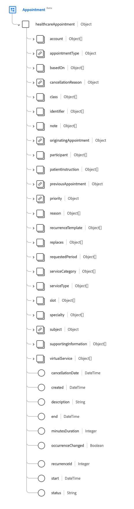
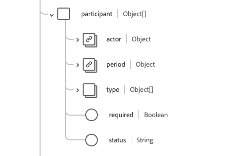
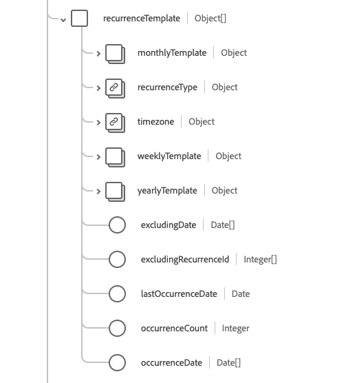
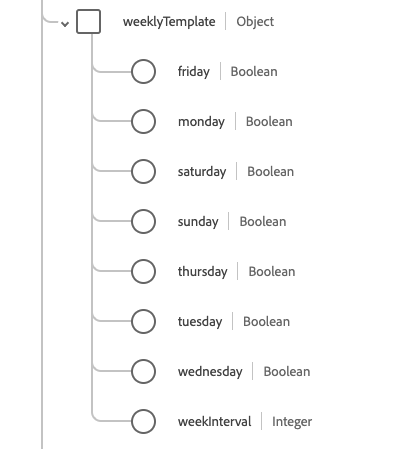
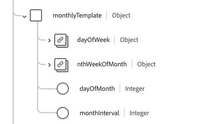

# [!UICONTROL Appointment] groupe de champs de schéma

[!UICONTROL Appointment] est un groupe de champs de schéma standard pour la [[!DNL XDM Individual Profile] classe](../../../classes/individual-profile.md) et le [[!DNL Provider class]](../../../classes/provider.md). Il fournit un `healthcareAppointment` de champ de type objet unique qui contient des informations sur une réservation d’un événement de santé parmi les patients, les praticiens, les personnes apparentées et/ou les appareils pour une date et une heure spécifiques.

| Nom d’affichage | Propriété | Type de données | Description |
| --- | --- | --- | --- |
| [!UICONTROL Account] | `account` | Tableau de [[!UICONTROL Reference]](../data-types/reference.md) | Ensemble de comptes qui doivent être utilisés pour la facturation. |
| [!UICONTROL Appointment Type] | `appointmentType` | [[!UICONTROL Codeable Concept]](../data-types/codeable-concept.md) | Style du rendez-vous ou du patient réservé dans l&#39;emplacement (et non le type de service). |
| [!UICONTROL Based On] | `basedOn` | Tableau de [[!UICONTROL Reference]](../data-types/reference.md) | La demande que la nomination est chargée d’évaluer, par exemple une demande de procédure. |
| [!UICONTROL Cancellation Reason] | `cancellationReason` | Tableau de [[!UICONTROL Codeable Concept]](../data-types/codeable-concept.md) | Raison codée de l’annulation du rendez-vous. Elle est souvent utilisée dans le cadre de la création de rapports, de la facturation ou du traitement pour déterminer si d’autres actions sont requises ou si des frais spécifiques s’appliquent. |
| [!UICONTROL Class] | `class` | Tableau de [[!UICONTROL Codeable Concept]](../data-types/codeable-concept.md) | Concepts représentant la classification d’une rencontre avec un patient, comme ambulatoire, ambulatoire, hospitalisé ou d’urgence. |
| [!UICONTROL Identifier] | `identifier` | Tableau de [[!UICONTROL Identifier]](../data-types/identifier.md) | Liste d’identifiants uniques liés au rendez-vous. Ces identifiants sont attribués en fonction des règles métier ou lorsqu’un lien URL direct vers le rendez-vous ne convient pas. |
| [!UICONTROL Note] | `note` | Tableau de [[!UICONTROL Annotation]](../data-types/annotation.md) | Notes ou commentaires supplémentaires sur le rendez-vous. |
| [!UICONTROL Originating Appointment] | `originatingAppointment` | [[!UICONTROL Reference]](../data-types/reference.md) | Rendez-vous d&#39;origine dans un ensemble récurrent de rendez-vous associés. |
| [!UICONTROL Participant] | `participant` | Tableau d’objets | Liste des participants impliqués dans la nomination. Pour plus d’informations, consultez la [section ci-dessous](#participant). |
| [!UICONTROL Patient Instruction] | `patientInstruction` | Tableau de [[!UICONTROL Codeable Reference]](../data-types/reference.md) | Diagnostic pertinent pour le rendez-vous. |
| [!UICONTROL Previous Appointment] | `previousAppointment` | [[!UICONTROL Reference]](../data-types/reference.md) | La nomination précédente dans une série de nominations connexes. |
| [!UICONTROL Priority] | `priority` | [[!UICONTROL Codeable Concept]](../data-types/codeable-concept.md) | La priorité de la nomination qui peut être utilisée pour prendre des décisions éclairées si vous avez besoin de redéfinir les priorités des nominations. iCal Standard spécifie `0` comme non défini, `1` comme priorité la plus élevée et `9` comme priorité la plus faible. |
| [!UICONTROL Reason] | `reason` | Tableau de [[!UICONTROL Codeable Concept]](../data-types/codeable-concept.md) | Motif pour lequel le rendez-vous est planifié, qui correspond généralement à une condition ou à une procédure. |
| [!UICONTROL Reccurence Template] | `recurrenceTemplate` | Tableau d’objets | Contient les détails de la périodicité ou du modèle utilisé pour créer des rendez-vous périodiques.  Pour plus d’informations, consultez la [section ci-dessous](#recurrence). |
| [!UICONTROL Replaces] | `replaces` | Tableau de [[!UICONTROL Reference]](../data-types/reference.md) | Le rendez-vous étant remplacé par ce rendez-vous. Dans les cas d’annulation, les détails de l’annulation se trouvent dans la propriété `cancellationReason` de la ressource référencée. |
| [!UICONTROL Requested Period] | `requestedPeriod` | Tableau de [[!UICONTROL Period]](../data-types/period.md) | Ensemble de périodes (comprenant éventuellement des heures) au cours desquelles il est préférable de planifier le rendez-vous. |
| [!UICONTROL Service Category] | `serviceCategory` | Tableau de [[!UICONTROL Codeable Concept]](../data-types/codeable-concept.md) | Une catégorisation large du service qui doit être effectué pendant la nomination. |
| [!UICONTROL Service Type] | `serviceType` | Tableau de [[!UICONTROL Codeable Reference]](../data-types/codeable-reference.md) | Service spécifique à effectuer pendant le rendez-vous. |
| [!UICONTROL Slot] | `slot` | Tableau de [[!UICONTROL Reference]](../data-types/reference.md) | Plages horaires des participants qui seront remplies par le rendez-vous. |
| [!UICONTROL Speciality] | `speciality` | Tableau de [[!UICONTROL Codeable Concept]](../data-types/codeable-concept.md) | La spécialité d&#39;un praticien requis pour effectuer le service demandé dans ce rendez-vous. |
| [!UICONTROL Subject] | `subject` | Tableau de [[!UICONTROL Reference]](../data-types/reference.md) | Patient ou groupe associé au rendez-vous. |
| [!UICONTROL Supporting Information] | `supportingInformation` | Tableau de [[!UICONTROL Reference]](../data-types/reference.md) | Informations supplémentaires fournies lors de la prise de rendez-vous pour l’appuyer. |
| [!UICONTROL Virtual Service] | `virtualService` | Tableau de [[!UICONTROL Virtual Service Detail]](../data-types/virtual-service-detail.md) | Détails de connexion d’un service virtuel, comme une conférence téléphonique. |
| [!UICONTROL Cancellation Date] | `cancellationDate` | DateTime | Date et heure d’annulation du rendez-vous. |
| [!UICONTROL Created] | `created` | DateTime | Date et heure de création du rendez-vous. |
| [!UICONTROL Description] | `description` | Chaîne | Brève description du rendez-vous. Des informations détaillées ou étendues doivent être insérées dans le champ `note`. |
| [!UICONTROL End] | `end` | DateTime | Date et heure de fin du rendez-vous. |
| [!UICONTROL Minutes Duration] | `minutesDuration` | Entier | Nombre de minutes que dure le rendez-vous. Il peut s’agir d’une durée inférieure à la durée entre les heures de début et de fin. La valeur minimale acceptée est `0`. |
| [!UICONTROL Occurence Changed] | `occurenceChanged` | Booléen | Indicateur qui signale si ce rendez-vous diffère du modèle récurrent. |
| [!UICONTROL RecurrenceId] | `RecurrenceId` | Entier | Numéro de séquence qui identifie un rendez-vous spécifique selon un modèle récurrent. La valeur minimale est `0`. |
| [!UICONTROL Start] | `start` | DateTime | Date et heure auxquelles le rendez-vous aura lieu. |
| [!UICONTROL Status] | `status` | Chaîne | Statut du rendez-vous. La valeur de cette propriété doit être égale à l’une des valeurs d’énumération connues suivantes : <li> `proposed` </li> <li> `pending` </li> <li> `booked` </li> <li> `arrived` </li> <li> `fulfilled` </li> <li> `cancelled` </li> <li> `noshow` </li> <li> `entered-in-error` </li> <li> `checked-in` </li> <li> `waitlist` </li> |

Pour plus d’informations sur le groupe de champs , consultez le référentiel XDM public :

* [Exemple renseigné](https://github.com/adobe/xdm/blob/master/extensions/industry/healthcare/fhir/fieldgroups/appointment.example.1.json)
* [Schéma complet](https://github.com/adobe/xdm/blob/master/extensions/industry/healthcare/fhir/fieldgroups/appointment.schema.json)

## `participant` {#participant}

`participant` est fourni sous la forme d’un tableau d’objets . La structure de chaque objet est décrite ci-dessous.

| Nom d’affichage | Propriété | Type de données | Description |
| --- | --- | --- | --- |
| [!UICONTROL Actor] | `actor` | [[!UICONTROL Reference]](../data-types/reference.md) | Personne, appareil, lieu ou service participant au rendez-vous. |
| [!UICONTROL Period] | `period` | [[!UICONTROL Period]](../data-types/period.md) | Période pendant laquelle le participant (l’acteur) est impliqué dans la nomination. |
| [!UICONTROL Type] | `type` | Tableau de [[!UICONTROL Codeable Concept]](../data-types/codeable-concept.md) | Le rôle du participant (acteur) dans la nomination. |
| [!UICONTROL Required] | `required` | Booléen | Indique si ce participant doit être présent. |
| [!UICONTROL status] | `status` | Chaîne | Statut d’acceptation du participant. La valeur de cette propriété doit être égale à l’une des valeurs d’énumération connues suivantes : <li> `accepted` </li> <li> `declined` </li> <li> `tentative` </li> <li> `needs-action` </li> |

## `recurrenceTemplate` {#recurrence}

`recurrenceTemplate` est fourni sous la forme d’un tableau d’objets . La structure de chaque objet est décrite ci-dessous.

| Nom d’affichage | Propriété | Type de données | Description |
| --- | --- | --- | --- |
| [!UICONTROL Monthly Template] | `monthlyTemplate` | Tableau d’objets | Informations sur les rendez-vous mensuels récurrents. Pour plus d’informations, consultez la [section ci-dessous](#monthly-template). |
| [!UICONTROL Recurrence Type] | `recurrenceType` | [[!UICONTROL Codeable Concept]](../data-types/codeable-concept.md) | Fréquence à laquelle la série de rendez-vous doit se reproduire, par exemple hebdomadaire, mensuelle ou annuelle. |
| [!UICONTROL Timezone] | `timezone` | [[!UICONTROL Codeable Concept]](../data-types/codeable-concept.md) | Fuseau horaire du rendez-vous récurrent. |
| [!UICONTROL Weekly Template] | `weeklyTemplate` | Tableau d’objets | Informations sur les rendez-vous périodiques hebdomadaires. Pour plus d’informations, consultez la [section ci-dessous](#weekly-template). |
| [!UICONTROL Yearly Template] | `yearlyTemplate` | Objet | Informations sur les rendez-vous périodiques annuels. Contient une propriété, `yearInterval`, qui contient une valeur entière indiquant chaque année où le rendez-vous se répète. |
| [!UICONTROL Excluding Date] | `excludingDate` | Tableau de dates | Toutes les dates, telles que les jours fériés, qui doivent être exclues de la périodicité. |
| [!UICONTROL Excluding Recurrence Id] | `excludingRecurrenceId` | Tableau d’entiers | Tous les identifiants de périodicité qui doivent être exclus de la périodicité. Il s’agit d’une alternative à `excludingDate` lorsque vous indiquez le `reccurenceID` de la nomination à exclure. |
| [!UICONTROL Last Occurence Date] | `lastOccurenceDate` | Date | Date au-delà de laquelle aucun autre rendez-vous récurrent ne sera planifié. |
| [!UICONTROL Occurence Count] | `occurenceCount` | Entier | Nombre de rendez-vous prévus dans la périodicité. La valeur minimale est `0`. |
| [!UICONTROL Occurence Date] | `occurenceDate` | Tableau de dates | Liste des dates spécifiques auxquelles des rendez-vous sont planifiés. |

## `weeklyTemplate` {#weekly-template}

`weeklyTemplate` est fourni sous la forme d’un tableau d’objets . La structure de chaque objet est décrite ci-dessous.

| Nom d’affichage | Propriété | Type de données | Description |
| --- | --- | --- | --- |
| [!UICONTROL Friday] | `friday` | Booléen | Indique que les rendez-vous périodiques doivent avoir lieu le vendredi. |
| [!UICONTROL Monday] | `monday` | Booléen | Indique que les rendez-vous récurrents doivent avoir lieu le lundi. |
| [!UICONTROL Saturday] | `saturday` | Booléen | Indique que les rendez-vous récurrents doivent avoir lieu le samedi. |
| [!UICONTROL Sunday] | `sunday` | Booléen | Indique que les rendez-vous périodiques doivent avoir lieu le dimanche. |
| [!UICONTROL Thursday] | `thursday` | Booléen | Indique que les rendez-vous récurrents doivent avoir lieu le jeudi. |
| [!UICONTROL Tuesday] | `tuesday` | Booléen | Indique que les rendez-vous récurrents doivent avoir lieu le mardi. |
| [!UICONTROL Wednesday] | `wednesday` | Booléen | Indique que les rendez-vous récurrents doivent avoir lieu le mercredi. |
| [!UICONTROL Week Interval] | `weekInterval` | Entier | Spécifie la fréquence de récurrence des rendez-vous, en termes de chaque nième semaine. La valeur par défaut est toutes les semaines. La valeur standard est donc de 2 ou plus. |

## `monthlyTemplate` {#monthly-template}

`monthlyTemplate` est fourni sous la forme d’un tableau d’objets . La structure de chaque objet est décrite ci-dessous.

| Nom d’affichage | Propriété | Type de données | Description |
| --- | --- | --- | --- |
| [!UICONTROL Day Of Week] | `dayOfWeek` | [[!UICONTROL Coding]] | Indique que les rendez-vous doivent avoir lieu ce jour spécifique de la semaine. |
| [!UICONTROL nth Week Of Month] | `nthWeekOfMonth` | [[!UICONTROL Coding]](../data-types/coding.md) | Indique la nième semaine du mois au cours de laquelle le rendez-vous doit avoir lieu. |
| [!UICONTROL Day Of Month] | `dayOfMonth` | Entier | Indique que les rendez-vous doivent avoir lieu ce jour spécifique du mois. |
| [!UICONTROL Month Interval] | `monthInterval` | Entier | Indique que les rendez-vous récurrents doivent avoir lieu tous les mois. |

