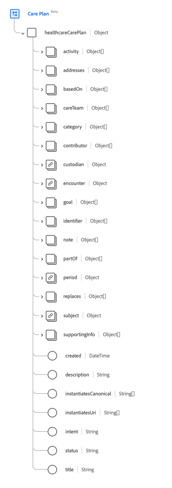
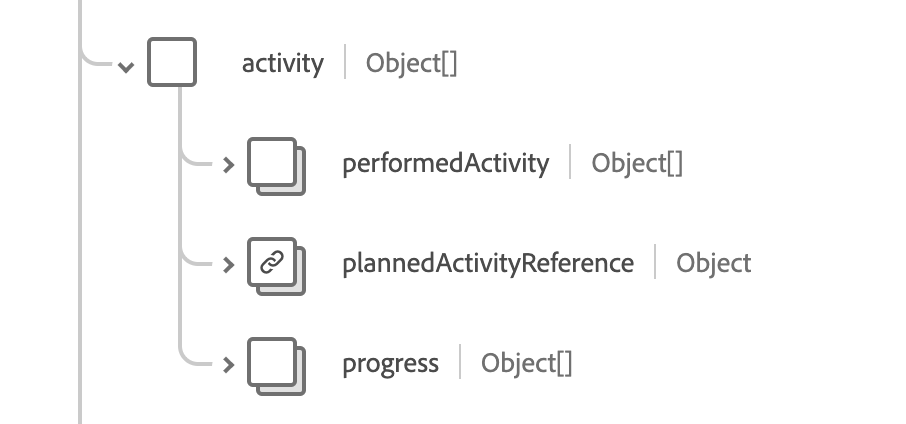

# Groupe de champs de schéma [!UICONTROL Care Plan]

[!UICONTROL Plan d’assistance] est un groupe de champs de schéma standard pour la [[!DNL XDM Individual Profile] classe](../../../classes/individual-profile.md). Il fournit un `healthcareCarePlan` de champ de type objet unique qui capture un plan de soins de santé pour un patient ou un groupe.

| Nom d’affichage | Propriété | Type de données | Description |
| --- | --- | --- | --- |
| [!UICONTROL Activité] | `activity` | Tableau d’objets | Identifie une action qui s&#39;est produite ou qui doit se produire dans le cadre du plan. Pour plus d’informations, consultez la [section ci-dessous](#activity). |
| [!UICONTROL  Adresses ] | `addresses` | Tableau de [[!UICONTROL référence codable]](../data-types/codeable-reference.md) | Identifie les affections ou préoccupations gérées par le plan de soins. |
| [!UICONTROL Basé sur] | `basedOn` | Tableau de [[!UICONTROL référence]](../data-types/reference.md) | Ressource de demande de niveau supérieur à laquelle répond en tout ou en partie ce régime d’assurance-maladie. |
| [!UICONTROL Équipe d’assistance] | `careTeam` | Tableau de [[!UICONTROL référence]](../data-types/reference.md) | Identifie toutes les personnes et organisations qui devraient être impliquées dans les soins envisagés par ce plan. |
| [!UICONTROL Catégorie] | `category` | Tableau de [[!UICONTROL concept codable]](../data-types/codeable-concept.md) | Identifie le type de plan à prendre en charge pour différencier plusieurs plans coexistants. |
| [!UICONTROL Contributeur] | `contributor` | Tableau de [[!UICONTROL référence]](../data-types/reference.md) | Identifie la ou les personnes, l’organisation ou l’appareil qui ont fourni le contenu du plan de soins. |
| [!UICONTROL Dépositaire] | `custodian` | [[!UICONTROL Référence]](../data-types/reference.md) | Lorsqu’il est renseigné, le dépositaire est responsable du plan de soins et l’attribue à celui-ci. |
| [!UICONTROL Rencontre] | `encounter` | [[!UICONTROL Référence]](../data-types/reference.md) | Rencontre au cours de laquelle le plan de soins a été créé. |
| [!UICONTROL Objectif] | `goal` | Tableau de [[!UICONTROL référence]](../data-types/reference.md) | Objectif(s) visé(s) de la réalisation du plan. |
| [!UICONTROL Identifiant] | `identifier` | Tableau d’[[!UICONTROL identifiant]](../data-types/identifier.md) | Identifiants d’entreprise attribués à ce plan d’assistance par l’intervenant ou d’autres systèmes qui restent constants lorsque la ressource est mise à jour et se propage de serveur en serveur. |
| [!UICONTROL Remarque] | `note` | Tableau d’[[!UICONTROL annotation]](../data-types/annotation.md) | Remarques générales sur le plan de soins non couvertes par les autres attributs. |
| [!UICONTROL Partie De] | `partOf` | Tableau de [[!UICONTROL référence]](../data-types/reference.md) | Le plan de soins plus vaste dans lequel ce plan de soins particulier est une composante ou une étape. |
| [!UICONTROL Période] | `period` | [[!UICONTROL Période]](../data-types/period.md) | Indique quand le plan est (ou est censé être) entré en vigueur et quand il se termine. |
| [!UICONTROL Remplace] | `replaces` | Tableau de [[!UICONTROL référence]](../data-types/reference.md) | Plan de soins terminé ou terminé dont la fonction est reprise par ce plan de soins. |
| [!UICONTROL Objet] | `subject` | [[!UICONTROL Référence]](../data-types/reference.md) | Indique le patient ou le groupe dont les soins prévus sont décrits par le plan. |
| [!UICONTROL Informations annexes] | `supportingInfo` | Tableau de [[!UICONTROL référence]](../data-types/reference.md) | Identifie les parties du dossier du patient qui ont influencé la formation du plan. Il peut s’agir de comorbidités, de procédures récentes, de limitations ou d’évaluations récentes. |
| [!UICONTROL Créé] | `created` | DateTime | Représente la date de création de ce régime d&#39;assurance maladie dans le système, qui est souvent une date générée par le système. |
| [!UICONTROL Description] | `description` | Chaîne | Description de la portée et de la nature du plan. |
| [!UICONTROL Instanciation canonique] | `instantiatesCanonical` | Tableau de chaînes | URL pointant vers un protocole, une ligne directrice, un questionnaire ou une autre définition défini par la FHIR auquel ce plan adhère en tout ou en partie. |
| [!UICONTROL  Instancie L’Uri ] | `instantiatesUri` | Tableau de chaînes | L’URL pointant vers un protocole, une directive, un questionnaire ou une autre définition géré de manière externe, auquel ce plan adhère en tout ou en partie, représenté sous la forme d’un URI. |
| [!UICONTROL Intention] | `intent` | Chaîne | L’intention du plan de soins. La valeur de cette propriété doit être égale à l’une des valeurs d’énumération connues suivantes. <li> `proposal` </li> <li> `plan` </li> <li> `order` </li> <li> `option` </li> <li> `directive` </li> |
| [!UICONTROL Statut] | `status` | Chaîne | Statut du plan de soins. La valeur de cette propriété doit être égale à l’une des valeurs d’énumération connues suivantes. <li> `draft` </li> <li> `active` </li> <li> `on-hold` </li> <li> `revoked` </li> <li> `completed` </li> <li> `entered-in-error` </li> <li> `unknown` </li> |
| [!UICONTROL Titre] | `title` | Chaîne | Nom du plan de soins. |

Pour plus d’informations sur le groupe de champs , consultez le référentiel XDM public :

* [Exemple renseigné](https://github.com/adobe/xdm/blob/master/extensions/industry/healthcare/fhir/fieldgroups/careplan.example.1.json)
* [Schéma complet](https://github.com/adobe/xdm/blob/master/extensions/industry/healthcare/fhir/fieldgroups/careplan.schema.json)

## `activity` {#activity}

`activity` est fourni sous la forme d’un tableau d’objets . La structure de chaque objet est décrite ci-dessous.

| Nom d’affichage | Propriété | Type de données | Description |
| --- | --- | --- | --- |
| [!UICONTROL Activité effectuée] | `performedActivity` | Tableau de [[!UICONTROL référence codable]](../data-types/codeable-reference.md) | Résultats de l’activité, tels qu’un rendez-vous ou une procédure. |
| [!UICONTROL Référence des activités prévues] | `plannedActivityReference` | [[!UICONTROL Référence]](../data-types/reference.md) | Détails de l’activité proposée. |
| [!UICONTROL Progression] | `progress` | Tableau d’[[!UICONTROL annotation]](../data-types/annotation.md) | Notes relatives au respect, au statut ou à la progression de l’activité. |
