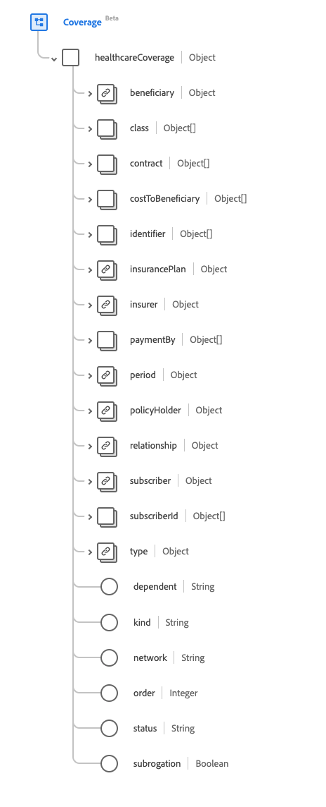
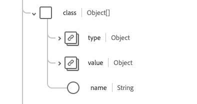
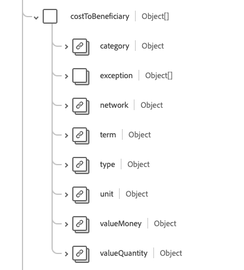
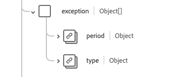
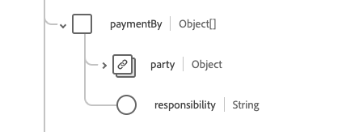

# [!UICONTROL Coverage] groupe de champs de schéma

[!UICONTROL Coverage] groupe de champs de schéma standard pour la [[!DNL Plan] classe](../../../classes/plan.md). Il fournit un champ unique de type objet `healthcareCoverage` qui est destiné à fournir les identifiants et descripteurs de haut niveau d’un régime d’assurance, généralement les informations qui figureraient sur une carte d’assurance, qui peuvent être utilisés pour payer, en tout ou en partie, la fourniture de produits et de services de soins de santé.

| Nom d’affichage | Propriété | Type de données | Description |
| --- | --- | --- | --- |
| [!UICONTROL Plan Beneficiary] | `beneficiary` | [[!UICONTROL Reference]](../data-types/reference.md) | La partie qui bénéficie de la couverture d&#39;assurance et le patient lorsque les produits ou services sont fournis. |
| [!UICONTROL Class] | `class` | Tableau d’objets | Une suite de classificateurs spécifiques au souscripteur. Pour plus d’informations, consultez la [section ci-dessous](#class). |
| [!UICONTROL Contact] | `contract` | Tableau de [[!UICONTROL Reference]](../data-types/reference.md) | Police(s) qui constituent cette couverture d’assurance. |
| [!UICONTROL Cost To Beneficiary] | `costToBeneficiary` | Tableau d’objets | Une suite de codes indiquant le poste de coût et le montant associé qui ont été détaillés dans la police et qui peuvent avoir été inclus sur la carte santé. Pour plus d’informations, consultez la [section ci-dessous](#cost-to-beneficiary). |
| [!UICONTROL Exception] | `exception` | Tableau d’objets | Une suite de codes indiquant les exceptions ou les réductions des coûts pour les patients et leurs périodes d&#39;effet. Pour plus d’informations, consultez la [section ci-dessous](#exception). |
| [!UICONTROL Identifier] | `identifier` | Tableau de [[!UICONTROL Identifier]](../data-types/identifier.md) | Identifiant de la couverture telle qu’elle est émise par l’assureur. |
| [!UICONTROL Insurance Plan] | `insurancePlan` | [[!UICONTROL Reference]](../data-types/reference.md) | Le plan d’assurance détaille, les avantages et les coûts qui constituent cette couverture d’assurance. |
| [!UICONTROL Insurer] | `insurer` | [[!UICONTROL Reference]](../data-types/reference.md) | Souscripteur, payeur ou compagnie d’assurance du programme ou du plan. |
| [!UICONTROL Payment By] | `paymentBy` | Tableau d’objets | Le lien vers le payeur et éventuellement ce qu’il sera responsable de payer. Pour plus d’informations, consultez la [section ci-dessous](#payment-by). |
| [!UICONTROL Coverage Start And End Dates] | `period` | [[!UICONTROL Period]](../data-types/period.md) | Période pendant laquelle la couverture est active. Une date de début manquante indique que la date de début n’est pas connue, une date de fin manquante signifie que la couverture est en cours. |
| [!UICONTROL Policy Holder] | `policyHolder` | [[!UICONTROL Reference]](../data-types/reference.md) | Partie qui détient la police d’assurance. |
| [!UICONTROL Beneficiary Relationship] | `relationship` | [[!UICONTROL Codeable Concept]](../data-types/codeable-concept.md) | Relation entre le bénéficiaire et l’abonné. |
| [!UICONTROL Subscriber] | `subscriber` | [[!UICONTROL Reference]](../data-types/reference.md) | Partie qui détient la relation contractuelle avec la police. |
| [!UICONTROL Subscriber Identifier] | `subscriberId` | Tableau de [[!UICONTROL Identifier]](../data-types/identifier.md) | ID attribué par l’assureur à l’abonné. |
| [!UICONTROL Type] | `type` | [[!UICONTROL Codeable Concept]](../data-types/codeable-concept.md) | Type de couverture. |
| [!UICONTROL Dependent Number] | `dependent` | Chaîne | Indicateur d’une personne à charge couverte. |
| [!UICONTROL Kind] | `kind` | Chaîne | Le type de couverture. La valeur de cette propriété doit être égale à l’une des valeurs d’énumération connues suivantes. <li> `insurance` </li> <li> `self-pay` </li> <li> `other` </li> |
| [!UICONTROL Insurer Network] | `network` | Chaîne | Le réseau de prestataires auquel le bénéficiaire peut demander un traitement qui sera couvert au tarif du réseau, sinon les conditions applicables en dehors du réseau. |
| [!UICONTROL Coverage Order] | `order` | Entier | Ordre relatif de la couverture, avec une valeur minimale de `0`. |
| [!UICONTROL Status] | `status` | Chaîne | Statut de la couverture. La valeur de cette propriété doit être égale à l’une des valeurs d’énumération connues suivantes. <li> `active` </li> <li> `cancelled` </li> <li> `draft` </li> <li> `entered-in-error` </li> |
| [!UICONTROL Subrogation] | `subrogation` | Booléen | Lorsqu’elle est `true`, cette instance d’assurance a été incluse non pas pour l’arbitrage, mais pour fournir aux assureurs les détails permettant de récupérer les coûts. |

Pour plus d’informations sur le groupe de champs , consultez le référentiel XDM public :

* [Exemple renseigné](https://github.com/adobe/xdm/blob/master/extensions/industry/healthcare/fhir/fieldgroups/coverage.example.1.json)
* [Schéma complet](https://github.com/adobe/xdm/blob/master/extensions/industry/healthcare/fhir/fieldgroups/coverage.schema.json)

## `class` {#class}

`class` est fourni sous la forme d’un tableau d’objets . La structure de chaque objet est décrite ci-dessous.

| Nom d’affichage | Propriété | Type de données | Description |
| --- | --- | --- | --- |
| [!UICONTROL Type] | `type` | Tableau de [[!UICONTROL Codeable Concept]](../data-types/codeable-concept.md) | Type de classification pour lequel un libellé de classe spécifique à l’assureur, ou un numéro et un nom facultatif, est fourni. Par exemple, le type peut être utilisé pour identifier une catégorie de couverture, un groupe d&#39;employeurs, une police ou un plan. |
| [!UICONTROL Value] | `value` | [[!UICONTROL Identifier]](../data-types/identifier.md) | Identifiant alphanumérique associé à l’étiquette émise par l’assureur. |
| [!UICONTROL Name] | `name` | Chaîne | Brève description de la classe . |

## `costToBeneficiary` {#cost-to-beneficiary}

`costToBeneficiary` est fourni sous la forme d’un tableau d’objets . La structure de chaque objet est décrite ci-dessous.

| Nom d’affichage | Propriété | Type de données | Description |
| --- | --- | --- | --- |
| [!UICONTROL Category] | `category` | [[!UICONTROL Codeable Concept]](../data-types/codeable-concept.md) | Code permettant d’identifier le type général d’avantages en vertu desquels les produits et services sont fournis. |
| [!UICONTROL Network] | `network` | [[!UICONTROL Codeable Concept]](../data-types/codeable-concept.md) | Code permettant d’indiquer si les avantages se rapportent aux fournisseurs intégrés au réseau ou à ceux hors réseau. |
| [!UICONTROL Term] | `term` | [[!UICONTROL Codeable Concept]](../data-types/codeable-concept.md) | Terme des valeurs telles que la prestation maximale à vie. |
| [!UICONTROL Type] | `type` | [[!UICONTROL Codeable Concept]](../data-types/codeable-concept.md) | La catégorie des coûts liés au traitement qui sont centrés sur le patient. |
| [!UICONTROL Unit] | `unit` | [[!UICONTROL Codeable Concept]](../data-types/codeable-concept.md) | Indique si les avantages s&#39;appliquent à une personne ou à la famille. |

## `exception` {#exception}

`exception` est fourni sous la forme d’un tableau d’objets . La structure de chaque objet est décrite ci-dessous.

| Nom d’affichage | Propriété | Type de données | Description |
| --- | --- | --- | --- |
| [!UICONTROL Type] | `type` | [[!UICONTROL Codeable Concept]](../data-types/codeable-concept.md) | Code de l’exception spécifique. |
| [!UICONTROL Period] | `period` | [[!UICONTROL Period]](../data-types/period.md) | La période pendant laquelle l’exception est active. |

## `paymentBy` {#payment-by}

`paymentBy` est fourni sous la forme d’un tableau d’objets . La structure de chaque objet est décrite ci-dessous.

| Nom d’affichage | Propriété | Type de données | Description |
| --- | --- | --- | --- |
| [!UICONTROL Party] | `party` | [[!UICONTROL Reference]](../data-types/reference.md) | La liste des parties fournissant des paiements hors assurance pour les coûts de traitement. |
| [!UICONTROL Responsibility] | `responsibility` | Chaîne | Description de la responsabilité financière. |
