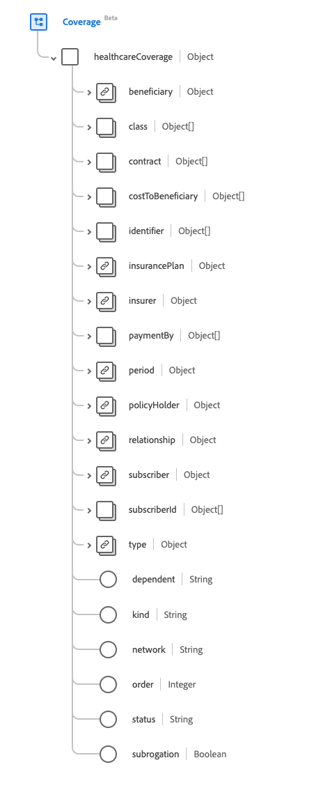

# [!UICONTROL Couverture] groupe de champs de schéma

[!UICONTROL Couverture] est un groupe de champs de schéma standard pour la [[!DNL Plan] classe](../../../classes/plan.md). Il fournit un seul champ de type objet `healthcareCoverage` destiné à fournir les identifiants et les descripteurs de haut niveau d’un régime d’assurance, généralement les informations qui apparaîtront sur une carte d’assurance, qui peut être utilisée, en partie ou en totalité, pour la fourniture de produits et services de santé.

| Nom d’affichage | Propriété | Type de données | Description |
| --- | --- | --- | --- |
| [!UICONTROL Bénéficiaire du plan] | `beneficiary` | [[!UICONTROL Référence]](../data-types/reference.md) | La personne qui bénéficie de la couverture d’assurance et le patient lorsque des produits ou des services sont fournis. |
| [!UICONTROL Classe] | `class` | Tableau d’objets | Suite de classificateurs spécifiques au sous-rédacteur. Pour plus d’informations, consultez la [section ci-dessous](#class) . |
| [!UICONTROL Contact] | `contract` | Tableau de [[!UICONTROL Référence]](../data-types/reference.md) | La ou les polices qui constituent cette couverture d’assurance. |
| [!UICONTROL Coût À Bénéficiaire] | `costToBeneficiary` | Tableau d’objets | Suite de codes indiquant le poste de coût et le montant associé qui ont été détaillés dans la stratégie et qui peuvent avoir été inclus sur la carte d’intégrité. Pour plus d’informations, consultez la [section ci-dessous](#cost-to-beneficiary) . |
| [!UICONTROL Exception] | `exception` | Tableau d’objets | Suite de codes indiquant des exceptions ou des réductions des coûts des patients et de leurs périodes d’efficacité. Pour plus d’informations, consultez la [section ci-dessous](#exception) . |
| [!UICONTROL Identifiant] | `identifier` | Tableau de [[!UICONTROL Identifiant]](../data-types/identifier.md) | Identifiant de la couverture tel qu’il est émis par l’assureur. |
| [!UICONTROL Plan d’assurance] | `insurancePlan` | [[!UICONTROL Référence]](../data-types/reference.md) | Le plan d’assurance détaille, les prestations et les coûts qui constituent cette couverture d’assurance. |
| [!UICONTROL Assurateur] | `insurer` | [[!UICONTROL Référence]](../data-types/reference.md) | Le souscripteur, le payeur ou la société d’assurance du programme ou du plan. |
| [!UICONTROL Paiement Par] | `paymentBy` | Tableau d’objets | Lien vers le payeur et éventuellement ce qu&#39;il sera chargé de payer. Pour plus d’informations, consultez la [section ci-dessous](#payment-by) . |
| [!UICONTROL Dates De Début Et De Fin De La Couverture] | `period` | [[!UICONTROL Période]](../data-types/period.md) | Période pendant laquelle la couverture est active. Une date de début manquante indique que la date de début n’est pas connue, une date de fin manquante signifie que la couverture est en cours. |
| [!UICONTROL Holder] de stratégie | `policyHolder` | [[!UICONTROL Référence]](../data-types/reference.md) | Personne qui détient la police d’assurance. |
| [!UICONTROL &#x200B; &lbrace;Lien bénéficiaire] | `relationship` | [[!UICONTROL Concept codeable]](../data-types/codeable-concept.md) | La relation du bénéficiaire avec l’abonné. |
| [!UICONTROL Abonné] | `subscriber` | [[!UICONTROL Référence]](../data-types/reference.md) | Partie qui détient la relation contractuelle avec la politique. |
| [!UICONTROL Identifiant d’abonné] | `subscriberId` | Tableau de [[!UICONTROL Identifiant]](../data-types/identifier.md) | L’identifiant de l’abonné attribué à l’assureur. |
| [!UICONTROL Type] | `type` | [[!UICONTROL Concept codeable]](../data-types/codeable-concept.md) | Type de couverture. |
| [!UICONTROL Numéro dépendant] | `dependent` | Chaîne | L’indicateur d’une personne à charge sous la couverture. |
| [!UICONTROL Kind] | `kind` | Chaîne | Le genre de couverture. La valeur de cette propriété doit être égale à l’une des valeurs d’énumération connues suivantes. <li> `insurance` </li> <li> `self-pay` </li> <li> `other` </li> |
| [!UICONTROL Réseau d’assurance] | `network` | Chaîne | Le réseau de fournisseurs auquel le bénéficiaire peut demander un traitement qui sera couvert au tarif du réseau, sinon les conditions et conditions d&#39;absence du réseau s&#39;appliquent. |
| [!UICONTROL Ordre de couverture] | `order` | Nombre entier | Ordre relatif de la couverture, avec une valeur minimale de `0`. |
| [!UICONTROL Statut] | `status` | Chaîne | État de la couverture. La valeur de cette propriété doit être égale à l’une des valeurs d’énumération connues suivantes. <li> `active` </li> <li> `cancelled` </li> <li> `draft` </li> <li> `entered-in-error` </li> |
| [!UICONTROL Subrogation] | `subrogation` | Booléen | Lorsque `true`, cette instance d&#39;assurance a été incluse non pas à des fins d&#39;arbitrage, mais pour fournir aux assureurs les détails pour récupérer les coûts. |

Pour plus d’informations sur le groupe de champs, reportez-vous au référentiel XDM public :

* [Exemple renseigné](https://github.com/adobe/xdm/blob/master/extensions/industry/healthcare/fhir/fieldgroups/coverage.example.1.json)
* [Schéma complet](https://github.com/adobe/xdm/blob/master/extensions/industry/healthcare/fhir/fieldgroups/coverage.schema.json)

## `class` {#class}

`class` est fourni sous la forme d’un tableau d’objets. La structure de chaque objet est décrite ci-dessous.

| Nom d’affichage | Propriété | Type de données | Description |
| --- | --- | --- | --- |
| [!UICONTROL Type] | `type` | Tableau de [[!UICONTROL Concept codeable]](../data-types/codeable-concept.md) | Le type de classification pour lequel une étiquette de classe spécifique à l’assureur, ou un numéro et un nom facultatif, est fourni. Par exemple, le type peut être utilisé pour identifier une catégorie de couverture, un groupe d’employeurs, une stratégie ou un plan. |
| [!UICONTROL Valeur] | `value` | [[!UICONTROL Identifiant]](../data-types/identifier.md) | Identifiant alphanumérique associé au libellé émis par l&#39;assureur. |
| [!UICONTROL Nom] | `name` | Chaîne | Brève description de la classe. |

## `costToBeneficiary` {#cost-to-beneficiary}

`costToBeneficiary` est fourni sous la forme d’un tableau d’objets. La structure de chaque objet est décrite ci-dessous.

| Nom d’affichage | Propriété | Type de données | Description |
| --- | --- | --- | --- |
| [!UICONTROL Catégorie] | `category` | [[!UICONTROL Concept codeable]](../data-types/codeable-concept.md) | Le code permettant d’identifier le type général d’avantages sous lequel les produits et les services sont fournis. |
| [!UICONTROL Réseau] | `network` | [[!UICONTROL Concept codeable]](../data-types/codeable-concept.md) | Le code permettant d’indiquer si les avantages se rapportent aux fournisseurs en réseau ou hors réseau. |
| [!UICONTROL Term] | `term` | [[!UICONTROL Concept codeable]](../data-types/codeable-concept.md) | Terme des valeurs, tel que l’allocation de durée de vie maximale. |
| [!UICONTROL Type] | `type` | [[!UICONTROL Concept codeable]](../data-types/codeable-concept.md) | La catégorie des coûts liés au traitement pour les patients. |
| [!UICONTROL Unit] | `unit` | [[!UICONTROL Concept codeable]](../data-types/codeable-concept.md) | Indique si les avantages s’appliquent à un individu ou à la famille. |

## `exception` {#exception}

`exception` est fourni sous la forme d’un tableau d’objets. La structure de chaque objet est décrite ci-dessous.

| Nom d’affichage | Propriété | Type de données | Description |
| --- | --- | --- | --- |
| [!UICONTROL Type] | `type` | [[!UICONTROL Concept codeable]](../data-types/codeable-concept.md) | Le code de l’exception spécifique. |
| [!UICONTROL Période] | `period` | [[!UICONTROL Période]](../data-types/period.md) | La période pendant laquelle l’exception est active. |

## `paymentBy` {#payment-by}

`paymentBy` est fourni sous la forme d’un tableau d’objets. La structure de chaque objet est décrite ci-dessous.

| Nom d’affichage | Propriété | Type de données | Description |
| --- | --- | --- | --- |
| [!UICONTROL Party] | `party` | [[!UICONTROL Référence]](../data-types/reference.md) | La liste des parties qui ne verse pas d’assurance pour les frais de traitement. |
| [!UICONTROL Responsabilité] | `responsibility` | Chaîne | Description de la responsabilité financière. |
