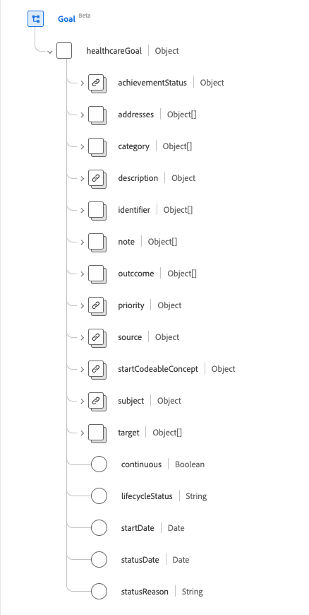
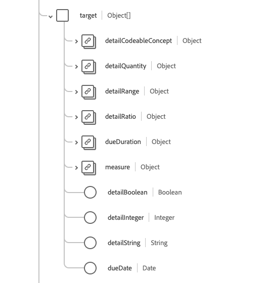

# [!UICONTROL Objectif] groupe de champs de schéma

[!UICONTROL Objectif] est un groupe de champs de schéma standard pour la [[!DNL XDM Individual Profile] classe](../../../classes/individual-profile.md) et le [[!DNL Provider class]](../../../classes/provider.md). Il fournit un `healthcareGoal` de champ de type objet unique qui décrit les objectifs prévus pour les soins d’un patient, d’un groupe ou d’une organisation.

| Nom d’affichage | Propriété | Type de données | Description |
| --- | --- | --- | --- |
| [!UICONTROL Statut de réalisation] | `achievementStatus` | [[!UICONTROL Concept codable]](../data-types/codeable-concept.md) | Décrit la progression ou l’absence de progression vers l’objectif par rapport à la cible. |
| [!UICONTROL &#x200B; Adresses &#x200B;] | `addresses` | Tableau de [[!UICONTROL référence]](../data-types/reference.md) | Les conditions et autres éléments du dossier de santé qui doivent être pris en compte par l’objectif. |
| [!UICONTROL Catégorie] | `category` | Tableau de [[!UICONTROL concept codable]](../data-types/codeable-concept.md) | Indique une catégorie à laquelle l’objectif appartient, telle que le régime alimentaire ou le comportement. |
| [!UICONTROL Description] | `description` | [[!UICONTROL Concept codable]](../data-types/codeable-concept.md) | Code ou texte décrivant l’objectif. |
| [!UICONTROL Identifiant] | `identifier` | Tableau d’[[!UICONTROL identifiant]](../data-types/identifier.md) | Identifiants d’entreprise affectés à cet objectif par l’intervenant ou d’autres systèmes qui restent constants lorsque la ressource est mise à jour et se propage de serveur en serveur. |
| [!UICONTROL Remarque] | `note` | Tableau d’[[!UICONTROL annotation]](../data-types/annotation.md) | Commentaires concernant l’objectif. |
| [!UICONTROL Résultat] | `outcome` | Tableau de [[!UICONTROL référence codable]](../data-types/codeable-reference.md) | Indique le changement (ou l’absence de changement) lors de l’évaluation de l’état de l’objectif. |
| [!UICONTROL Priorité] | `priority` | [[!UICONTROL Concept codable]](../data-types/codeable-concept.md) | Détermine le niveau d’importance mutuellement convenu associé à l’atteinte ou au maintien de l’objectif. |
| [!UICONTROL Source] | `source` | [[!UICONTROL Référence]](../data-types/reference.md) | Indique la source de l’objectif, comme le patient ou le praticien. |
| [!UICONTROL Démarrer le concept codable] | `startCodeableConcept` | [[!UICONTROL Concept codable]](../data-types/codeable-concept.md) | Événement au terme duquel l’objectif doit être atteint. |
| [!UICONTROL Objet |]`subject` | [[!UICONTROL Référence]](../data-types/reference.md) | Identifie le patient, le groupe ou l&#39;organisation pour lequel l&#39;objectif est établi. |
| [!UICONTROL Target] | `target` | Tableau d’objets | Indique la chronologie d’étapes spécifiques dans l’objectif. Pour plus d’informations, consultez la [section ci-dessous](#target). |
| [!UICONTROL &#x200B; Continu &#x200B;] | `continous` | Booléen | Indique si, après avoir atteint l’objectif, une activité continue est nécessaire pour maintenir l’objectif. |
| [!UICONTROL Statut du cycle de vie] | `lifecycleStatus` | Chaîne | Statut du cycle de vie de l’objectif. La valeur de cette propriété doit être égale à l’une des valeurs d’énumération connues suivantes. <li> `proposed` </li> <li> `planned` </li> <li> `accepted` </li> <li> `active` </li> <li> `on-hold` </li> <li> `completed` </li> <li> `cancelled` </li> <li> `entered-in-error` </li> <li> `rejected` </li> |
| [!UICONTROL Date de début] | `startDate` | Date | Date à laquelle l’objectif doit commencer à être poursuivi. |
| [!UICONTROL Date du statut] | `statusDate` | Date | Indique la date de création du statut. |
| [!UICONTROL Motif du statut] | `statusReason` | Chaîne | Capture la raison du statut actuel. |

Pour plus d’informations sur le groupe de champs , consultez le référentiel XDM public :

* [Exemple renseigné](https://github.com/adobe/xdm/blob/master/extensions/industry/healthcare/fhir/fieldgroups/goal.example.1.json)
* [Schéma complet](https://github.com/adobe/xdm/blob/master/extensions/industry/healthcare/fhir/fieldgroups/goal.example.1.json)

## `target` {#target}

`target` est fourni sous la forme d’un tableau d’objets . La structure de chaque objet est décrite ci-dessous.

| Nom d’affichage | Propriété | Type de données | Description |
| --- | --- | --- | --- |
| [!UICONTROL Concept codable En Détail] | `detailCodeableConcept` | [[!UICONTROL Concept codable]](../data-types/codeable-concept.md) | Code cible à atteindre pour signifier la réalisation de l’objectif. |
| [!UICONTROL Quantité détaillée] | `detailQuantity` | [[!UICONTROL Quantité]](../data-types/quantity.md) | Quantité cible à atteindre pour signifier la réalisation de l’objectif. |
| [!UICONTROL Plage détaillée] | `detailRange` | [[!UICONTROL Plage]](../data-types/range.md) | Plage cible à atteindre pour signifier la réalisation de l’objectif. |
| [!UICONTROL Rapport Détail] | `detailRatio` | [[!UICONTROL Rapport]](../data-types/ratio.md) | Taux cible à atteindre pour signifier la réalisation de l’objectif. |
| [!UICONTROL Mesure] | `measure` | [[!UICONTROL Concept codable]](../data-types/codeable-concept.md) | Le paramètre dont la valeur est est suivie. |
| [!UICONTROL Booléen du détail] | `detailBoolean` | Booléen | Indique la réalisation de l’objectif. |
| [!UICONTROL Entier détaillé] | `detailInteger` | Entier | Nombre cible à atteindre pour signifier la réalisation de l’objectif. |
| [!UICONTROL Chaîne détaillée] | `detailString` | Chaîne | Valeur cible à atteindre pour signifier la réalisation de l’objectif. |
| [!UICONTROL Date d’échéance] | `dueDate` | Date | Date à laquelle l’objectif doit être atteint. |
