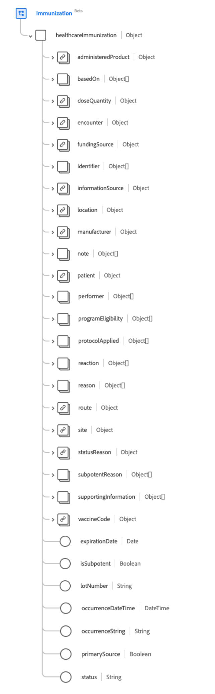
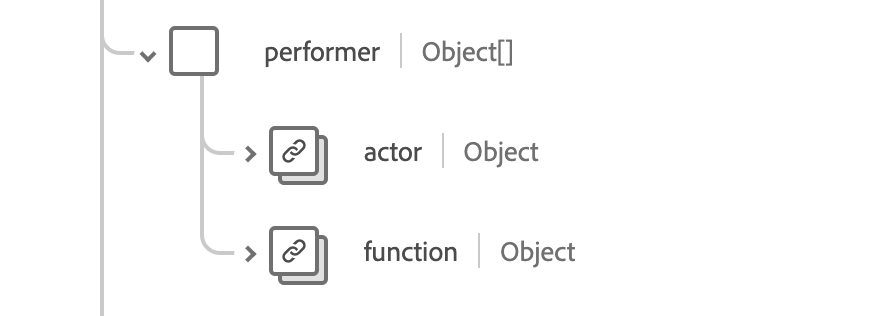
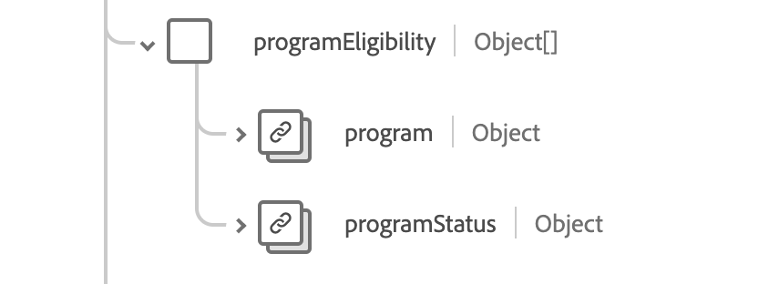
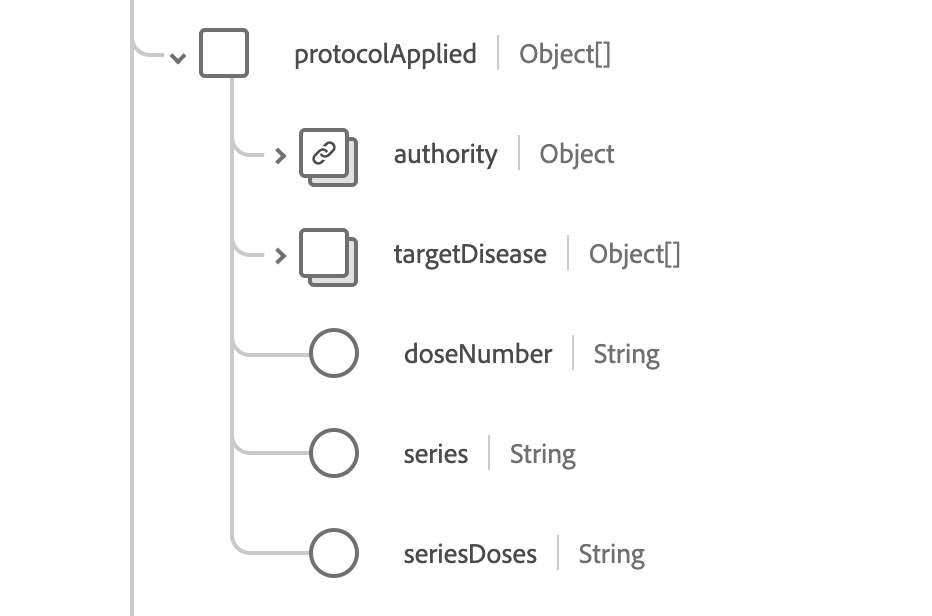
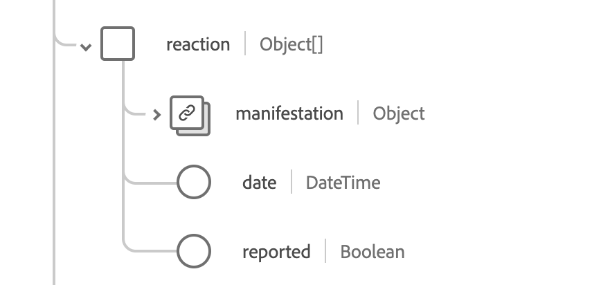

# [!UICONTROL Immunization] groupe de champs de schéma

[!UICONTROL Immunization] groupe de champs de schéma standard pour la [[!DNL XDM Experience Event] classe](../../../classes/experienceevent.md). Il fournit un `healthcareImmunization` de champ de type objet unique qui recueille les informations sur les événements de vaccination.

| Nom d’affichage | Propriété | Type de données | Description |
| --- | --- | --- | --- |
| [!UICONTROL Administered Product] | `administeredProduct` | [[!UICONTROL Codeable Reference]](../data-types/codeable-reference.md) | Le produit administré. |
| [!UICONTROL Based On] | `basedOn` | Tableau de [[!UICONTROL Reference]](../data-types/reference.md) | Autorité sur laquelle se fonde l’événement de vaccination. |
| [!UICONTROL Dose Quantity] | `doseQuantity` | [[!UICONTROL Simple Quantity]](../data-types/simple-quantity.md) | La quantité de vaccin administrée. |
| [!UICONTROL Encounter] | `encounter` | [[!UICONTROL Reference]](../data-types/reference.md) | La rencontre à laquelle l&#39;immunisation faisait partie. |
| [!UICONTROL Funding Source] | `fundingSource` | [[!UICONTROL Codeable Concept]](../data-types/codeable-concept.md) | La source de financement du vaccin. |
| [!UICONTROL Identifier] | `identifier` | Tableau de [[!UICONTROL Identifier]](../data-types/identifier.md) | Identifiant de l’entreprise. |
| [!UICONTROL Information Source] | `informationSource` | [[!UICONTROL Codeable Reference]](../data-types/codeable-reference.md) | Indique la source de l’enregistrement signalé. |
| [!UICONTROL Location] | `location` | [[!UICONTROL Reference]](../data-types/reference.md) | Emplacement où la vaccination a eu lieu. |
| [!UICONTROL Manufacturer] | `manufacturer` | [[!UICONTROL Codeable Reference]](../data-types/codeable-reference.md) | Le fabricant du vaccin. |
| [!UICONTROL Note] | `note` | Tableau de [[!UICONTROL Annotation]](../data-types/annotation.md) | Notes de vaccination supplémentaires. |
| [!UICONTROL Patient] | `patient` | [[!UICONTROL Reference]](../data-types/reference.md) | Qui a été vacciné. |
| [!UICONTROL Batch] | `performer` | Tableau d’objets | Qui a effectué l’événement de vaccination. Pour plus d’informations, consultez la [section ci-dessous](#performer). |
| [!UICONTROL Program Eligibility] | `programEligibility` | Tableau d’objets | Admissibilité du patient à un programme de vaccination spécifique. Pour plus d’informations, consultez la [section ci-dessous](#program-eligibility). |
| [!UICONTROL Protocol Applied] | `protocolApplied` | Tableau d’objets | Protocole fourni par le fournisseur. Pour plus d’informations, consultez la [section ci-dessous](#protocol-applied). |
| [!UICONTROL Reaction] | `reaction` | Tableau d’objets | Les détails d&#39;une réaction après immunisation. Pour plus d’informations, consultez la [section ci-dessous](#reaction). |
| [!UICONTROL Reason] | `reason` | Tableau de [[!UICONTROL Codeable Reference]](../data-types/codeable-reference.md) | La raison de la vaccination. |
| [!UICONTROL Route] | `route` | [[!UICONTROL Codeable Concept]](../data-types/codeable-concept.md) | Comment le vaccin est entré dans le corps. |
| [!UICONTROL Site] | `site` | [[!UICONTROL Codeable Concept]](../data-types/codeable-concept.md) | Site sur le corps où le vaccin a été administré |
| [!UICONTROL Status Reason] | `statusReason` | [[!UICONTROL Codeable Concept]](../data-types/codeable-concept.md) | Raison du statut actuel. |
| [!UICONTROL Subpotent Reason] | `subpotentReason` | Tableau de [[!UICONTROL Codeable Concept]](../data-types/codeable-concept.md) | La raison pour laquelle le vaccin est sous-puissant. |
| [!UICONTROL Supporting Information] | `supportingInformation` | Tableau de [[!UICONTROL Reference]](../data-types/reference.md) | Informations supplémentaires à l’appui de la vaccination. |
| [!UICONTROL Vaccine Code] | `vaccineCode` | [[!UICONTROL Codeable Concept]](../data-types/codeable-concept.md) | Le code du vaccin administré. |
| [!UICONTROL Expiration Date] | `expirationDate` | Date | La date de péremption du vaccin. |
| [!UICONTROL Is Subpotent] | `isSubpotent` | Booléen | Indicateur de sous-puissance du vaccin. |
| [!UICONTROL Lot Number] | `lotNumber` | Chaîne | Le numéro de lot du vaccin. |
| [!UICONTROL Occurence DateTime] | `occurenceDateTime` | DateTime | La date d’administration du vaccin. |
| [!UICONTROL Occurence String] | `occurenceString` | Chaîne | La date d’administration du vaccin. |
| [!UICONTROL Primary Source] | `primarySource` | Booléen | Indique si les données ont été capturées à partir d’une source principale. |
| [!UICONTROL Status] | `status` | Chaîne | État de la vaccination. La valeur de cette propriété doit être égale à l’une des valeurs d’énumération connues suivantes. <li> `completed` </li> <li> `entered-in-error` </li> <li> `not-done` </li> |

Pour plus d’informations sur le groupe de champs , consultez le référentiel XDM public :

* [Exemple renseigné](https://github.com/adobe/xdm/blob/master/extensions/industry/healthcare/fhir/fieldgroups/immunization.example.1.json)
* [Schéma complet](https://github.com/adobe/xdm/blob/master/extensions/industry/healthcare/fhir/fieldgroups/immunization.schema.json)

## `performer` {#performer}

`performer` est fourni sous la forme d’un tableau d’objets . La structure de chaque objet est décrite ci-dessous.

| Nom d’affichage | Propriété | Type de données | Description |
| --- | --- | --- | --- |
| [!UICONTROL Actor] | `actor` | [[!UICONTROL Reference]](../data-types/reference.md) | La personne ou l’organisation qui exécutait le spectacle. |
| [!UICONTROL Function] | `function` | [[!UICONTROL Codeable Concept]](../data-types/codeable-concept.md) | Quel type de performance a été effectué ? |

## `programEligibility` {#program-eligibility}

`programEligibility` est fourni sous la forme d’un tableau d’objets . La structure de chaque objet est décrite ci-dessous.

| Nom d’affichage | Propriété | Type de données | Description |
| --- | --- | --- | --- |
| [!UICONTROL Program] | `program` | [[!UICONTROL Codeable Concept]](../data-types/codeable-concept.md) | Programme pour lequel l’éligibilité est déclarée. |
| [!UICONTROL Program Status] | `programStatus` | [[!UICONTROL Codeable Concept]](../data-types/codeable-concept.md) | Statut d&#39;éligibilité du patient au programme. |

## `protocolApplied` {#protocol-applied}

`protocolApplied` est fourni sous la forme d’un tableau d’objets . La structure de chaque objet est décrite ci-dessous.

| Nom d’affichage | Propriété | Type de données | Description |
| --- | --- | --- | --- |
| [!UICONTROL Authority] | `authority` | [[!UICONTROL Reference]](../data-types/reference.md) | Qui est responsable de la publication des recommandations ? |
| [!UICONTROL Target Disease] | `targetDisease` | Tableau de [[!UICONTROL Codeable Concept]](../data-types/codeable-concept.md) | La maladie évitable ciblée par le vaccin. |
| [!UICONTROL Dose Number] | `doseNumber` | Chaîne | Le numéro de dose dans la série. |
| [!UICONTROL Series] | `series` | Chaîne | Nom de la série de vaccins. |
| [!UICONTROL Series Doses] | `seriesDoses` | Chaîne | Nombre recommandé de doses pour l’immunité. |

## `reaction` {#reaction}

`reaction` est fourni sous la forme d’un tableau d’objets . La structure de chaque objet est décrite ci-dessous.

| Nom d’affichage | Propriété | Type de données | Description |
| --- | --- | --- | --- |
| [!UICONTROL Manifestation] | `manifestation` | [[!UICONTROL Codeable Reference]](../data-types/codeable-concept.md) | Informations supplémentaires sur la réaction. |
| [!UICONTROL Date] | `date` | DateTime | Quand la réaction a commencé. |
| [!UICONTROL Reported] | `reported` | Chaîne | Indique si la réaction a été auto-déclarée. |
