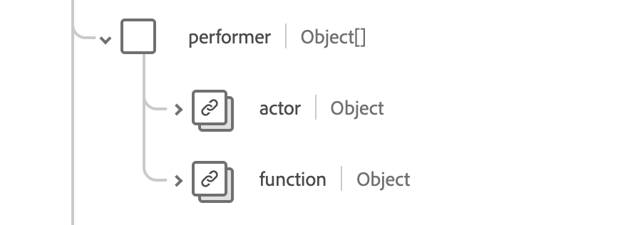

# [!UICONTROL Groupe de champs de schéma d’immunisation]

[!UICONTROL La vaccination] est un groupe de champs de schéma standard pour la [[!DNL XDM Experience Event] classe](../../../classes/experienceevent.md). Il fournit un champ de type d’objet unique `healthcareImmunization` qui capture les informations sur les événements d’immunisation.

| Nom d’affichage | Propriété | Type de données | Description |
| --- | --- | --- | --- |
| [!UICONTROL Produit géré] | `administeredProduct` | [[!UICONTROL Référence codeable]](../data-types/codeable-reference.md) | Produit administré. |
| [!UICONTROL Basé Sur] | `basedOn` | Tableau de [[!UICONTROL Référence]](../data-types/reference.md) | Autorité sur laquelle repose l’événement d’immunisation. |
| [!UICONTROL Dose Quantity] | `doseQuantity` | [[!UICONTROL Quantité simple]](../data-types/simple-quantity.md) | La quantité de vaccin administrée. |
| [!UICONTROL Rencontre] | `encounter` | [[!UICONTROL Référence]](../data-types/reference.md) | La rencontre avec l&#39;immunisation faisait partie. |
| [!UICONTROL Financer Source] | `fundingSource` | [[!UICONTROL Concept codeable]](../data-types/codeable-concept.md) | La source de financement du vaccin. |
| [!UICONTROL Identifiant] | `identifier` | Tableau de [[!UICONTROL Identifiant]](../data-types/identifier.md) | Identifiant de l’entreprise. |
| [!UICONTROL Source d’informations] | `informationSource` | [[!UICONTROL Référence codeable]](../data-types/codeable-reference.md) | Indique la source de l’enregistrement signalé. |
| [!UICONTROL Emplacement] | `location` | [[!UICONTROL Référence]](../data-types/reference.md) | L&#39;endroit où la vaccination a eu lieu. |
| [!UICONTROL Fabricant] | `manufacturer` | [[!UICONTROL Référence codeable]](../data-types/codeable-reference.md) | Le fabricant du vaccin. |
| [!UICONTROL Remarque] | `note` | Tableau de [[!UICONTROL Annotation]](../data-types/annotation.md) | Remarques supplémentaires sur la vaccination. |
| [!UICONTROL Patient] | `patient` | [[!UICONTROL Référence]](../data-types/reference.md) | Qui a été vacciné. |
| [!UICONTROL Lot] | `performer` | Tableau d’objets | Qui a effectué l’événement d’immunisation. Pour plus d’informations, consultez la [section ci-dessous](#performer) . |
| [!UICONTROL Eligibilité de programme] | `programEligibility` | Tableau d’objets | L’éligibilité du patient pour un programme de vaccination spécifique. Pour plus d’informations, consultez la [section ci-dessous](#program-eligibility) . |
| [!UICONTROL Protocole appliqué] | `protocolApplied` | Tableau d’objets | Protocole fourni par le fournisseur. Pour plus d’informations, consultez la [section ci-dessous](#protocol-applied) . |
| [!UICONTROL Réaction] | `reaction` | Tableau d’objets | Les détails d&#39;une réaction après la vaccination. Pour plus d’informations, consultez la [section ci-dessous](#reaction) . |
| [!UICONTROL Motif] | `reason` | Tableau de [[!UICONTROL référence codeable]](../data-types/codeable-reference.md) | La raison de la vaccination. |
| [!UICONTROL Route] | `route` | [[!UICONTROL Concept codeable]](../data-types/codeable-concept.md) | Comment le vaccin est entré dans le corps. |
| [!UICONTROL Site] | `site` | [[!UICONTROL Concept codeable]](../data-types/codeable-concept.md) | Le site sur le corps où le vaccin a été administré |
| [!UICONTROL Raison de l’état] | `statusReason` | [[!UICONTROL Concept codeable]](../data-types/codeable-concept.md) | Raison de l’état actuel. |
| [!UICONTROL Motif du sous-contenu] | `subpotentReason` | Tableau de [[!UICONTROL Concept codeable]](../data-types/codeable-concept.md) | La raison pour laquelle le vaccin est soumis. |
| [!UICONTROL Informations complémentaires] | `supportingInformation` | Tableau de [[!UICONTROL Référence]](../data-types/reference.md) | Informations supplémentaires à l&#39;appui de la vaccination. |
| [!UICONTROL Code de vaccin] | `vaccineCode` | [[!UICONTROL Concept codeable]](../data-types/codeable-concept.md) | Le code pour le vaccin administré. |
| [!UICONTROL Date d’expiration] | `expirationDate` | Date | Date d’expiration du vaccin. |
| [!UICONTROL Is Subpotent] | `isSubpotent` | Booléen | Indicateur pour savoir si le vaccin est soumis ou non. |
| [!UICONTROL Numéro de lot] | `lotNumber` | Chaîne | Le grand numéro du vaccin. |
| [!UICONTROL Occurence DateTime] | `occurenceDateTime` | DateTime | La date d&#39;administration du vaccin. |
| [!UICONTROL Chaîne d’occurrence] | `occurenceString` | Chaîne | La date d&#39;administration du vaccin. |
| [!UICONTROL Source de Principal] | `primarySource` | Booléen | Indique si les données ont été capturées à partir d’une source principale. |
| [!UICONTROL Statut] | `status` | Chaîne | État de la vaccination. La valeur de cette propriété doit être égale à l’une des valeurs d’énumération connues suivantes. <li> `completed` </li> <li> `entered-in-error` </li> <li> `not-done` </li> |

Pour plus d’informations sur le groupe de champs, reportez-vous au référentiel XDM public :

* [Exemple renseigné](https://github.com/adobe/xdm/blob/master/extensions/industry/healthcare/fhir/fieldgroups/immunization.example.1.json)
* [Schéma complet](https://github.com/adobe/xdm/blob/master/extensions/industry/healthcare/fhir/fieldgroups/immunization.schema.json)

## `performer` {#performer}

`performer` est fourni sous la forme d’un tableau d’objets. La structure de chaque objet est décrite ci-dessous.

| Nom d’affichage | Propriété | Type de données | Description |
| --- | --- | --- | --- |
| [!UICONTROL Acteur] | `actor` | [[!UICONTROL Référence]](../data-types/reference.md) | La personne ou l’organisation qui effectuait les performances. |
| [!UICONTROL Fonction] | `function` | [[!UICONTROL Concept codeable]](../data-types/codeable-concept.md) | Quel type de performance a été effectué. |

## `programEligibility` {#program-eligibility}

`programEligibility` est fourni sous la forme d’un tableau d’objets. La structure de chaque objet est décrite ci-dessous.

| Nom d’affichage | Propriété | Type de données | Description |
| --- | --- | --- | --- |
| [!UICONTROL Programme] | `program` | [[!UICONTROL Concept codeable]](../data-types/codeable-concept.md) | Programme pour lequel l’éligibilité est déclarée. |
| [!UICONTROL État du programme] | `programStatus` | [[!UICONTROL Concept codeable]](../data-types/codeable-concept.md) | Le statut d&#39;éligibilité du patient pour le programme. |

## `protocolApplied` {#protocol-applied}

`protocolApplied` est fourni sous la forme d’un tableau d’objets. La structure de chaque objet est décrite ci-dessous.

| Nom d’affichage | Propriété | Type de données | Description |
| --- | --- | --- | --- |
| [!UICONTROL Autorité] | `authority` | [[!UICONTROL Référence]](../data-types/reference.md) | Qui est chargé de publier les recommandations. |
| [!UICONTROL Maladie cible] | `targetDisease` | Tableau de [[!UICONTROL Concept codeable]](../data-types/codeable-concept.md) | La maladie évitable que le vaccin cible. |
| [!UICONTROL &#x200B; Nombre de points] | `doseNumber` | Chaîne | Numéro de la dose dans la série. |
| [!UICONTROL Series] | `series` | Chaîne | Nom de la série de vaccins. |
| [!UICONTROL Portes de série] | `seriesDoses` | Chaîne | Nombre recommandé de doses pour l’immunité. |

## `reaction` {#reaction}

`reaction` est fourni sous la forme d’un tableau d’objets. La structure de chaque objet est décrite ci-dessous.

| Nom d’affichage | Propriété | Type de données | Description |
| --- | --- | --- | --- |
| [!UICONTROL Manifestation] | `manifestation` | [[!UICONTROL Référence codeable]](../data-types/codeable-concept.md) | Informations supplémentaires sur la réaction. |
| [!UICONTROL Date] | `date` | DateTime | Quand la réaction a commencé. |
| [!UICONTROL Signalé] | `reported` | Chaîne | Indique si la réaction a été auto-signalée. |
