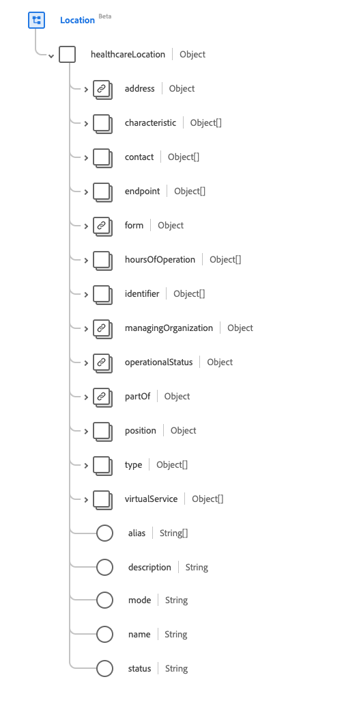

# [!UICONTROL Location] groupe de champs de schéma

[!UICONTROL Location] groupe de champs de schéma standard pour la [[!DNL Location] classe](../classes/location.md). Il fournit un `healthcareLocation` de champ de type objet unique qui capture les détails et les informations de position d’un emplacement.

| Nom d’affichage | Propriété | Type de données | Description |
| --- | --- | --- | --- |
| [!UICONTROL Address] | `address` | [[!UICONTROL Address]](../data-types/address.md) | Adresse de l’emplacement physique. |
| [!UICONTROL Characteristic] | `characteristic` | Tableau de [[!UICONTROL Codeable Concept]](../data-types/codeable-concept.md) | Ensemble des caractéristiques de l’emplacement. |
| [!UICONTROL Contact] | `contact` | Tableau de [[!UICONTROL Extended Contact Details]](../data-types/extended-contact-detail.md) | Coordonnées du lieu. |
| [!UICONTROL Endpoint] | `endpoint` | Tableau de [[!UICONTROL Reference]](../data-types/reference.md) | Points d’entrée techniques permettant d’accéder aux services d’exploitation pour l’emplacement. |
| [!UICONTROL Form] | `form` | [[!UICONTROL Codeable Concept]](../data-types/codeable-concept.md) | Forme physique de l’emplacement. |
| [!UICONTROL Hours of Operation] | `hoursOfOperation` | Tableau de [[!UICONTROL Availability]](../data-types/availability.md) | Les jours et heures d’ouverture standard de cet emplacement (y compris les exceptions). |
| [!UICONTROL Identifier] | `identifier` | Tableau de [[!UICONTROL Identifier]](../data-types/identifier.md) | Code ou numéro unique identifiant l’emplacement. |
| [!UICONTROL Managing Organization] | `managingOrganization` | [[!UICONTROL Reference]](../data-types/reference.md) | Organisation responsable de l’approvisionnement et de la maintenance. |
| [!UICONTROL Operational Status] | `operationalStatus` | [[!UICONTROL Coding]](../data-types/coding.md) | Statut opérationnel de l’emplacement. |
| [!UICONTROL Part Of Location] | `partOf` | [[!UICONTROL Reference]](../data-types/reference.md) | Emplacement dont fait partie cet emplacement. |
| [!UICONTROL Position] | `position` | Objet | La situation géographique absolue. Contient trois propriétés au format Double : <li>`longitude` : Longitude avec référence WGS84</li> <li>`latitude` : Latitude avec référence WGS84.</li> <li>`altitude` : Altitude avec référence WGS84.</li> |
| [!UICONTROL Type] | `type` | Tableau de [[!UICONTROL Codeable Concept]](../data-types/codeable-concept.md) | Type de fonction exécutée à l’emplacement. |
| [!UICONTROL Virtual Service] | `virtualService` | Tableau de [[!UICONTROL Virtual Service Detail]](../data-types/virtual-service-detail.md) | Détails de connexion d’un service virtuel. |
| [!UICONTROL Alias] | `alias` | Tableau de chaînes | Liste d’autres noms sous lesquels l’emplacement est ou était connu. |
| [!UICONTROL Description] | `description` | Chaîne | Informations supplémentaires pour identifier l’emplacement au-delà de son nom. |
| [!UICONTROL Mode] | `mode` | Chaîne | Mode de l’emplacement. La valeur de cette propriété doit être égale à l’une des valeurs d’énumération connues suivantes. <li> `instance` </li> <li> `kind` </li> |
| [!UICONTROL Name] | `name` | Chaîne | Nom de l’emplacement. |
| [!UICONTROL Status] | `status` | Chaîne | Statut de l’emplacement. La valeur de cette propriété doit être égale à l’une des valeurs d’énumération connues suivantes. <li> `active` </li> <li> `inactive` </li> <li> `suspended` </li> |

Pour plus d’informations sur le groupe de champs , consultez le référentiel XDM public :

* [Exemple renseigné](https://github.com/adobe/xdm/blob/master/extensions/industry/healthcare/fhir/fieldgroups/location.example.1.json)
* [Schéma complet](https://github.com/adobe/xdm/blob/master/extensions/industry/healthcare/fhir/fieldgroups/location.schema.json)
