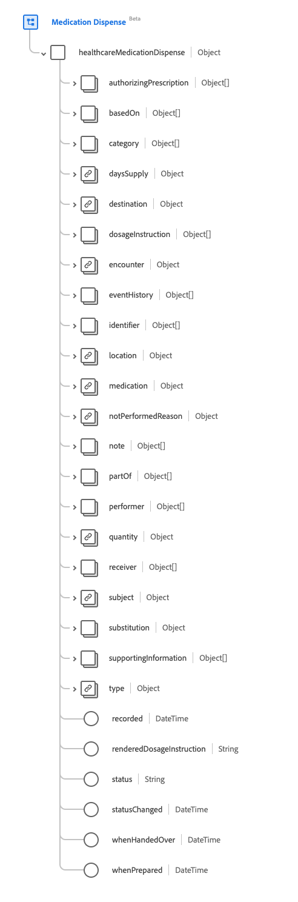
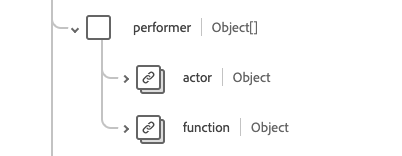

# Groupe de champs de schéma [!UICONTROL Distribution de médicaments]

[!UICONTROL Distribution des médicaments] est un groupe de champs de schéma standard pour la [[!DNL Medication] classe](../../../classes/medication.md), la [[!DNL XDM Individual Profile] classe](../../../classes/individual-profile.md) et le [[!DNL Provider class]](../../../classes/provider.md). Il fournit un `healthcareMedicationDispense` de champ de type objet unique qui recueille les informations sur un médicament qui doit être ou a été délivré pour une personne/patient nommé(e).

| Nom d’affichage | Propriété | Type de données | Description |
| --- | --- | --- | --- |
| [!UICONTROL Autorisation de prescription] | `authorizingPrescription` | Tableau de [[!UICONTROL référence]](../data-types/reference.md) | Ordre permettant de délivrer la prescription. |
| [!UICONTROL Basé sur] | `basedOn` | Tableau de [[!UICONTROL référence]](../data-types/reference.md) | Le plan sur lequel repose la délivrance du médicament. |
| [!UICONTROL Catégorie] | `category` | Tableau de [[!UICONTROL concept codable]](../data-types/codeable-concept.md) | La catégorie à laquelle appartient le médicament distribué, par exemple la catégorie légale du médicament ou la classification du médicament. |
| [!UICONTROL Jours d&#39;approvisionnement] | `daysSupply` | [[!UICONTROL Quantité simple]](../data-types/simple-quantity.md) | Nombre de jours pendant lesquels le médicament sera administré au patient. |
| [!UICONTROL  Destination ] | `destination` | [[!UICONTROL Référence]](../data-types/reference.md) | L’installation ou l’emplacement où le médicament a été ou sera expédié dans le cadre de l’événement de distribution. |
| [!UICONTROL Instructions posologiques] | `dosageInstruction` | Tableau de [[!UICONTROL Posologie]](../data-types/dosage.md) | Décrit comment le médicament doit être utilisé par le patient. |
| [!UICONTROL Rencontre] | `encounter` | [[!UICONTROL Référence]](../data-types/reference.md) | Rencontre qui définit le contexte de cet événement. |
| [!UICONTROL Historique des événements] | `eventHistory` | Tableau de [[!UICONTROL référence]](../data-types/reference.md) | Un résumé des événements qui se sont produits autour de la délivrance. |
| [!UICONTROL Identifiant] | `identifier` | Tableau d’[[!UICONTROL identifiant]](../data-types/identifier.md) | Identifiants associés à la délivrance. Les identifiants doivent être définis par des processus d’entreprise et/ou utilisés pour s’y référer lorsqu’une référence URL directe n’est pas appropriée. |
| [!UICONTROL Emplacement] | `location` | [[!UICONTROL Référence]](../data-types/reference.md) | Emplacement physique principal où le médicament a été délivré. |
| [!UICONTROL Médicaments] | `medication` | [[!UICONTROL Référence codable]](../data-types/codeable-reference.md) | Permet d’identifier le médicament demandé. Il doit s’agir d’un lien vers une ressource qui représente les détails du médicament ou d’un code qui identifie le médicament. |
| [!UICONTROL Raison non exécutée] | `notPerformedReason` | [[!UICONTROL Référence codable]](../data-types/codeable-reference.md) | La raison pour laquelle le médicament n’a pas été délivré. |
| [!UICONTROL Remarque] | `note` | Tableau d’[[!UICONTROL annotation]](../data-types/annotation.md) | Informations supplémentaires sur la délivrance. |
| [!UICONTROL Partie De] | `partOf` | Tableau de [[!UICONTROL référence]](../data-types/reference.md) | La procédure ou la demande de médicament qui a déclenché la délivrance. |
| [!UICONTROL Intervenant] | `performer` | Tableau d’objets | Indique qui ou qui a effectué l’événement de distribution. Pour plus d’informations, consultez la [section ci-dessous](#performer). |
| [!UICONTROL Quantité] | `quantity` | [[!UICONTROL Quantité simple]](../data-types/simple-quantity.md) | La quantité de médicaments qui a été délivrée, y compris l’unité de mesure. |
| [!UICONTROL récepteur] | `receiver` | Tableau de [[!UICONTROL référence]](../data-types/reference.md) | Indique la personne qui a pris le médicament ou l’endroit où le médicament a été livré. |
| [!UICONTROL Objet] | `subject` | [[!UICONTROL Référence]](../data-types/reference.md) | Lien vers une ressource représentant la personne ou le groupe auquel le médicament sera administré. |
| [!UICONTROL Substitution ] | `substitution` | Objet | Indique si la substitution a été effectuée ou non dans le cadre de la distribution. Contient quatre propriétés : <li>`wasSubstituted` : valeur booléenne qui est vraie si le distributeur a demandé une substitution.</li> <li>`type` : valeur [[!UICONTROL Concept codable]](../data-types/codeable-concept.md) qui fournit un code indiquant si une substitution a été effectuée.</li> <li>`reason` : tableau de valeurs [[!UICONTROL Concept codable]](../data-types/codeable-concept.md) qui contient le ou les motifs de la substitution.</li> <li>`responsibleParty` : valeur [[!UICONTROL Référence]](../data-types/reference.md) qui fournit la personne ou la partie responsable de la substitution. </li> |
| [!UICONTROL Informations annexes] | `supportingInformation` | Tableau de [[!UICONTROL référence]](../data-types/reference.md) | Informations supplémentaires à l’appui de la délivrance du médicament. |
| [!UICONTROL Type] | `type` | [[!UICONTROL Concept codable]](../data-types/codeable-concept.md) | Décrit le type d’événement de distribution qui est effectué, tel qu’un remplissage d’urgence ou un remplissage partiel. |
| [!UICONTROL enregistré] | `recorded` | DateTime | Date et heure auxquelles l&#39;activité de distribution a démarré si `whenPrepared` ou `whenHandedOver` n&#39;est pas renseignée. |
| [!UICONTROL Instructions de dosage générées] | `renderedDosageInstruction` | Chaîne | Représentation complète de la dose incluse dans toutes les instructions posologiques. A utiliser lorsque des instructions posologiques multiples sont incluses pour représenter un dosage complexe tel qu’une augmentation ou une diminution des doses. |
| [!UICONTROL Statut] | `status` | Chaîne | Statut de la distribution. La valeur de cette propriété doit être égale à l’une des valeurs d’énumération connues suivantes. <li> `preperation` </li> <li> `in-progress` </li> <li> `cancelled` </li> <li> `on-hold` </li> <li> `completed` </li> <li> `entered-in-error` </li> <li> `stopped` </li> <li> `declined` </li> <li> `unknown` </li> |
| [!UICONTROL Statut modifié] | `statusChanged` | DateTime | Date et heure auxquelles le statut de l&#39;enregistrement de distribution a changé. |
| [!UICONTROL En Cas De Remise] | `whenHandedOver` | DateTime | Date et heure auxquelles le médicament a été délivré au patient. |
| [!UICONTROL Une fois préparé] | `whenPrepared` | DateTime | La date et l’heure auxquelles le médicament délivré a été emballé et examiné. |

Pour plus d’informations sur le groupe de champs , consultez le référentiel XDM public :

* [Exemple renseigné](https://github.com/adobe/xdm/blob/master/extensions/industry/healthcare/fhir/fieldgroups/medicationdispense.example.1.json)
* [Schéma complet](https://github.com/adobe/xdm/blob/master/extensions/industry/healthcare/fhir/fieldgroups/medicationdispense.schema.json)

## `performer` {#performer}

`performer` est fourni sous la forme d’un tableau d’objets . La structure de chaque objet est décrite ci-dessous.

| Nom d’affichage | Propriété | Type de données | Description |
| --- | --- | --- | --- |
| [!UICONTROL Acteur ] | `actor` | [[!UICONTROL Référence]](../data-types/reference.md) | Le praticien (ou un professionnel similaire) qui a effectué l’action. Il faut supposer que l&#39;acteur est le distributeur du médicament. |
| [!UICONTROL Fonction] | `function` | [[!UICONTROL Concept codable]](../data-types/codeable-concept.md) | Type d’intervenant dans la délivrance, tel que la personne qui a saisi la date, l’emballeur ou le vérificateur final. |
