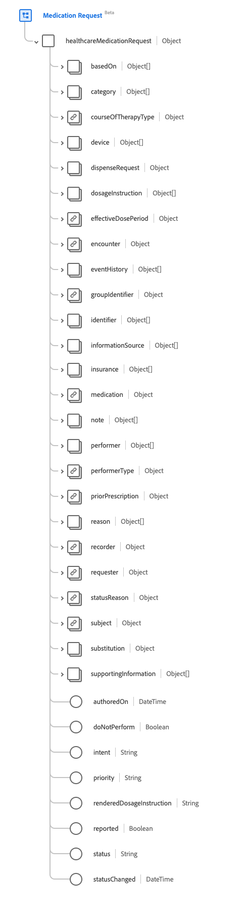
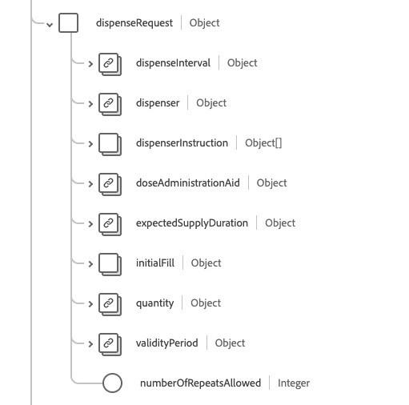

# Groupe de champs de schéma [!UICONTROL Demande de médicament]

[!UICONTROL Demande de médicament] est un groupe de champs de schéma standard pour la [[!DNL Medication] classe](../../../classes/medication.md), la [[!DNL XDM Individual Profile] classe](../../../classes/individual-profile.md) et la [[!DNL Provider class]](../../../classes/provider.md). Il fournit un `healthcareMedicationDispense` de champ de type objet unique qui capture une commande ou une demande à la fois pour la fourniture du médicament et les instructions pour l&#39;administration du médicament à un patient.

| Nom d’affichage | Propriété | Type de données | Description |
| --- | --- | --- | --- |
| [!UICONTROL Basé sur] | `basedOn` | Tableau de [[!UICONTROL référence]](../data-types/reference.md) | Plan ou demande auquel répond cette demande de médication. |
| [!UICONTROL Catégorie] | `category` | Tableau de [[!UICONTROL concept codable]](../data-types/codeable-concept.md) | Catégorisation ou regroupement de la demande de médicament. |
| [!UICONTROL Type De Traitement Du Cours] | `courseOfTherapyType` | [[!UICONTROL Concept codable]](../data-types/codeable-concept.md) | Description du schéma général d’administration du médicament au patient. |
| [!UICONTROL Appareil] | `device` | Tableau de [[!UICONTROL référence codable]](../data-types/codeable-reference.md) | Type de dispositif à utiliser pour l’administration du médicament. |
| [!UICONTROL Demande de distribution] | `dispenseRequest` | Objet | Indique les détails spécifiques de la demande de distribution, souvent appelée ordonnance de médicaments. Pour plus d’informations, consultez la [section ci-dessous](#dispense-request). |
| [!UICONTROL Instructions posologiques] | `dosageInstructions` | Tableau de [[!UICONTROL Posologie]](../data-types/dosage.md) | Instructions spécifiques sur la façon dont le médicament doit être utilisé par le patient. |
| [!UICONTROL Période de dose efficace] | `effectiveDosePeriod` | [[!UICONTROL Période]](../data-types/period.md) | La période pendant laquelle le médicament doit être pris. Lorsqu’il y a plusieurs lignes de `dosageInstruction` (par exemple, lors de la réduction progressive des doses), il s’agit de la date la plus proche et de la date la plus tardive des instructions de dosage. |
| [!UICONTROL Rencontre] | `encounter` | [[!UICONTROL Référence]](../data-types/reference.md) | Rencontre au cours de laquelle la requête a été créée. |
| [!UICONTROL Historique des événements] | `eventHistory` | Tableau de [[!UICONTROL référence]](../data-types/reference.md) | Créez un lien vers les enregistrements des événements liés à la demande de médicament, tels que le respect de la demande, les moments de transitions d’état clés ou les mises à jour pertinentes. |
| [!UICONTROL Identifiant du groupe] | `groupIdentifier` | [[!UICONTROL Identifiant]](../data-types/identifier.md) | Identifiant partagé sur plusieurs instances de requête indépendantes qui ont été activées par un seul auteur. |
| [!UICONTROL Identifiant] | `identifier` | Tableau d’[[!UICONTROL identifiant]](../data-types/identifier.md) | Identifiants associés à la demande de médicament, définis par des processus d’entreprise et/ou utilisés pour s’y référer lorsqu’une référence URL directe à la ressource elle-même n’est pas appropriée. |
| Source d’informations][!UICONTROL  | `informationSource` | Tableau de [[!UICONTROL référence]](../data-types/reference.md) | Personne ou organisation qui a fourni les informations pour la demande si la source n’est pas la `requester`. |
| [!UICONTROL Assurance] | `insurance` | Tableau de [[!UICONTROL référence]](../data-types/reference.md) | Les régimes d&#39;assurance, les extensions de couverture, les autorisations préalables et/ou les prédéterminations qui peuvent être nécessaires pour fournir le service demandé. |
| [!UICONTROL Médicaments] | `medication` | [[!UICONTROL Référence codable]](../data-types/codeable-reference.md) | Permet d’identifier le médicament demandé. Il doit s’agir d’un lien vers une ressource qui représente les détails du médicament ou d’un code qui identifie le médicament. |
| [!UICONTROL Remarque] | `note` | Tableau d’[[!UICONTROL annotation]](../data-types/annotation.md) | Informations supplémentaires sur la prescription qui n’ont pas pu être transmises par les autres attributs. |
| [!UICONTROL Intervenant] | `performer` | Tableau de [[!UICONTROL référence]](../data-types/reference.md) | L’intervenant spécifié pour le traitement/l’administration du médicament. Pour les dispositifs, il s&#39;agit du dispositif qui est destiné à effectuer l&#39;administration du médicament. |
| [!UICONTROL Type d’intervenant] | `performerType` | [[!UICONTROL Concept codable]](../data-types/codeable-concept.md) | Indique le type d&#39;intervenant pour l&#39;administration du médicament. |
| [!UICONTROL Ordonnance antérieure] | `priorPrescription` | [[!UICONTROL Référence]](../data-types/reference.md) | Référence à une commande ou une prescription remplacée par cette demande. |
| [!UICONTROL Raison] | `reason` | Tableau de [[!UICONTROL référence codable]](../data-types/reference.md) | La raison ou l’indication pour commander ou ne pas commander le médicament. |
| [!UICONTROL Enregistreur] | `recorder` | [[!UICONTROL Référence]](../data-types/reference.md) | Personne qui a saisi la commande au nom d&#39;une autre personne. |
| [!UICONTROL demandeur] | `requester` | [[!UICONTROL Référence]](../data-types/reference.md) | Personne, organisation ou appareil qui a initié la demande et qui est responsable de son activation. |
| [!UICONTROL Motif du statut] | `statusReason` | [[!UICONTROL Concept codable]](../data-types/codeable-concept.md) | Raison du statut actuel de la requête. |
| [!UICONTROL Objet] | `subject` | [[!UICONTROL Référence]](../data-types/reference.md) | Personne ou groupe pour lequel le médicament a été demandé. |
| [!UICONTROL Substitution ] | `substitution` | Objet | Indique si une substitution peut ou doit faire partie de la distribution. Contient trois propriétés : <li>`allowedBoolean` : valeur booléenne qui est vraie si le prescripteur autorise une substitution.</li> <li>`allowedCodeableConcept` : valeur [[!UICONTROL Concept codable]](../data-types/codeable-concept.md) qui fournit un code si le prescripteur autorise une substitution.</li> <li>`reason` : valeur [[!UICONTROL Concept codable]](../data-types/codeable-concept.md) qui indique une raison de la substitution.</li> |
| [!UICONTROL Informations annexes] | `supportingInformation` | Tableau de [[!UICONTROL référence]](../data-types/reference.md) | Informations destinées à aider le patient à prendre son médicament, telles que sa taille et son poids. |
| [!UICONTROL Créé le] | `authoredOn` | DateTime | Date (et éventuellement heure) à laquelle la prescription a été rédigée. |
| [!UICONTROL Ne Pas Effectuer] | `doNotPerform` | Booléen | Un indicateur booléen qui est vrai est que le patient doit arrêter (ou ne pas commencer) la prise du médicament. |
| [!UICONTROL Intention] | `intent` | Chaîne | Objet de la requête. La valeur de cette propriété doit être égale à l’une des valeurs d’énumération connues suivantes. <li> `proposal` </li> <li> `plan` </li> <li> `order` </li> <li> `original-order` </li> <li> `reflex-order` </li> <li> `filler-order` </li> <li> `instance-order` </li> <li> `option` </li> |
| [!UICONTROL Priorité] | `priority` | Chaîne | Priorité de la requête. La valeur de cette propriété doit être égale à l’une des valeurs d’énumération connues suivantes. <li> `routine` </li> <li> `urgent` </li> <li> `asap` </li> <li> `stat` </li> |
| [!UICONTROL Instructions de dosage générées] | `renderedDosageInstruction` | Chaîne | Représentation complète de la dose incluse dans toutes les instructions posologiques. A utiliser lorsque des instructions posologiques multiples sont incluses pour représenter un dosage complexe tel qu’une augmentation ou une diminution des doses. |
| [!UICONTROL Signalé] | `reported` | Booléen | Indique si cet enregistrement a été capturé en tant qu’enregistrement signalé secondaire plutôt qu’en tant qu’enregistrement source de vérité principal original. |
| [!UICONTROL Statut] | `status` | Chaîne | Statut de la distribution. La valeur de cette propriété doit être égale à l’une des valeurs d’énumération connues suivantes. <li> `preperation` </li> <li> `in-progress` </li> <li> `cancelled` </li> <li> `on-hold` </li> <li> `completed` </li> <li> `entered-in-error` </li> <li> `stopped` </li> <li> `declined` </li> <li> `unknown` </li> |
| [!UICONTROL Statut modifié] | `statusChanged` | DateTime | Date (et éventuellement heure) à laquelle le statut de a changé. |

Pour plus d’informations sur le groupe de champs , consultez le référentiel XDM public :

* [Exemple renseigné](https://github.com/adobe/xdm/blob/master/extensions/industry/healthcare/fhir/fieldgroups/medicationrequest.example.1.json)
* [Schéma complet](https://github.com/adobe/xdm/blob/master/extensions/industry/healthcare/fhir/fieldgroups/medicationrequest.schema.json)

## `dispenseRequest` {#dispense-request}

`dispenseRequest` est fourni sous la forme d’un tableau d’objets . La structure de chaque objet est décrite ci-dessous.

| Nom d’affichage | Propriété | Type de données | Description |
| --- | --- | --- | --- |
| [!UICONTROL Intervalle de distribution] | `dispenseInterval` | [[!UICONTROL Durée]](../data-types/duration.md) | La période minimale qui doit s&#39;écouler entre les doses du médicament. |
| [!UICONTROL Distributeur] | `dispenser` | [[!UICONTROL Référence]](../data-types/reference.md) | Organisme auquel le médicament sera délivré conformément aux indications du prescripteur. |
| [!UICONTROL Instructions relatives au distributeur] | `dispenserInstruction` | Tableau d’[[!UICONTROL annotation]](../data-types/annotation.md) | Informations supplémentaires pour le dispensateur, telles que des conseils à fournir au patient |
| [!UICONTROL Aide À L’Administration Des Doses] | `doseAdministrationAid` | [[!UICONTROL Concept codable]](../data-types/codeable-concept.md) | Informations sur le type d’emballage d’observance à fournir pour la délivrance du médicament. |
| [!UICONTROL Durée prévue de l&#39;approvisionnement] | `expectedSupplyDuration` | [[!UICONTROL Durée]](../data-types/duration.md) | La période pendant laquelle le produit fourni est censé être utilisé, ou la durée prévue de la distribution. |
| [!UICONTROL Remplissage initial] | `initialFill` | Objet | Informations pour le remplissage initial. Contient deux propriétés : <li>`quantity` : Valeur [[!UICONTROL  Quantité simple]](../data-types/simple-quantity.md) qui fournit le montant à fournir lors de la première distribution.</li> <li>`duration` : une valeur [[!UICONTROL Durée]](../data-types/duration.md) qui fournit la durée prévue de la première distribution.</li> |
| [!UICONTROL Quantité] | `quantity` | [[!UICONTROL Quantité simple]](../data-types/simple-quantity.md) | Quantité à distribuer pour un remplissage. |
| [!UICONTROL Période de validité] | `validityPeriod` | [[!UICONTROL Période]](../data-types/period.md) | Durée de validité de la prescription. |
| [!UICONTROL Nombre De Répétitions Autorisé] | `numberOfRepeatsAllowed` | Entier | Nombre de rechargements autorisés, avec une valeur minimale de 0. |
