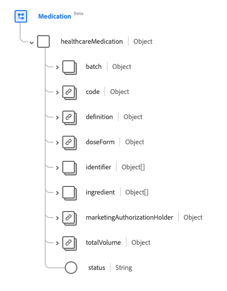
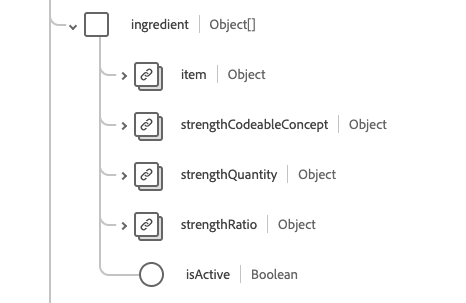

# [!UICONTROL Medication] groupe de champs de schéma

[!UICONTROL Medication] groupe de champs de schéma standard pour la [[!DNL Medication] classe](../../../classes/medication.md). Il fournit un `healthcareMedication` de champ de type objet unique qui capture les informations d’un médicament.

| Nom d’affichage | Propriété | Type de données | Description |
| ---|  --- | --- | --- |
| [!UICONTROL Batch] | `batch` | Objet | Détails sur un médicament emballé. Contient deux propriétés : <li>`lotNumber` : valeur de chaîne pour l’identifiant attribué au lot.</li> <li>`expirationDate` : valeur DateTime indiquant le moment d’expiration du lot.</li> |
| [!UICONTROL Code] | `code` | [[!UICONTROL Codeable Concept]](../data-types/codeable-concept.md) | Le code qui identifie ce médicament. |
| [!UICONTROL Definition] | `definition` | [[!UICONTROL Reference]](../data-types/reference.md) | La définition du médicament. |
| [!UICONTROL Dose Form] | `doseForm` | [[!UICONTROL Codeable Concept]](../data-types/codeable-concept.md) | Décrit la forme posologique du médicament, comme des comprimés ou des gélules. |
| [!UICONTROL Identifier] | `identifier` | Tableau de [[!UICONTROL Identifier]](../data-types/identifier.md) | Identifiant du médicament. |
| [!UICONTROL Ingredient] | `ingredient` | Tableau d’objets | Décrit les informations sur les ingrédients du médicament. Pour plus d’informations, consultez la [section ci-dessous](#ingredient). |
| [!UICONTROL Marketing Authorization Holder] | `marketingAuthorizationHolder` | [[!UICONTROL Reference]](../data-types/reference.md) | L&#39;organisation qui a l&#39;autorisation de commercialiser le médicament. |
| [!UICONTROL Total Volume] | `totalVolume` | [[!UICONTROL Quantity]](../data-types/quantity.md) | La quantité de produit fournie dans le médicament lorsque le code du produit ne déduit pas la taille de l’emballage. |
| [!UICONTROL Status] | `status` | Chaîne | Le statut du médicament. La valeur de cette propriété doit être égale à l’une des valeurs d’énumération connues suivantes. <li> `active` </li> <li> `inactive` </li> <li> `entered-in-error` </li> |

Pour plus d’informations sur le groupe de champs , consultez le référentiel XDM public :

* [Exemple renseigné](https://github.com/adobe/xdm/blob/master/extensions/industry/healthcare/fhir/fieldgroups/medication.example.1.json)
* [Schéma complet](https://github.com/adobe/xdm/blob/master/extensions/industry/healthcare/fhir/fieldgroups/medication.schema.json)

## `ingredient` {#ingredient}

`ingredient` est fourni sous la forme d’un tableau d’objets . La structure de chaque objet est décrite ci-dessous.

| Nom d’affichage | Propriété | Type de données | Description |
| --- | --- | --- | --- |
| [!UICONTROL Item] | `item` | [[!UICONTROL Codeable Reference]](../data-types/codeable-reference.md) | L&#39;ingrédient décrit. |
| [!UICONTROL Strength Codeable Concept] | `strengthCodeableConcept` | [[!UICONTROL Codeable Concept]](../data-types/codeable-concept.md) | Quantité de l’ingrédient présent, exprimée dans une terminologie définie par le système. |
| [!UICONTROL Strength Quantity] | `strengthQuantity` | [[!UICONTROL Quantity]](../data-types/quantity.md) | Quantité de l’ingrédient présent. |
| [!UICONTROL Strength Ratio] | `strengthRatio` | [[!UICONTROL Ratio]](../data-types/ratio.md) | Rapport de l’ingrédient présent. |
| [!UICONTROL Is Active] | `isActive` | Booléen | Indique si l&#39;ingrédient est actif. |
