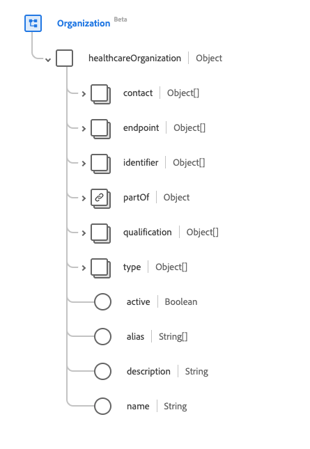

# Groupe de champs de schéma [!UICONTROL Organisation]

[!UICONTROL Organization] est un groupe de champs de schéma standard pour la [[!DNL XDM Individual Profile] classe](../../../classes/individual-profile.md) et la [[!DNL Provider class]](../../../classes/provider.md). Il fournit un champ unique de type objet `healthcareOrganization` qui contient des informations concernant les regroupements de personnes ou d’organisations ayant un objectif commun.

| Nom d’affichage | Propriété | Type de données | Description |
| ---| --- | --- | --- |
| [!UICONTROL Détails du contact] | `contact` | Tableau des [[!UICONTROL coordonnées étendues]](../data-types/extended-contact-detail.md) | Les coordonnées des appareils de communication disponibles pour l’organisation spécifique. Il peut s’agir d’adresses, de numéros de téléphone, de numéros de fax, de numéros de téléphone mobile, d’adresses électroniques et de sites Web. |
| [!UICONTROL Point de terminaison] | `endpoint` | Tableau de [[!UICONTROL Référence]](../data-types/reference.md) | Points d’entrée techniques permettant d’accéder aux services utilisés pour l’organisation. |
| [!UICONTROL Identifiant] | `indentifier` | Tableau de [[!UICONTROL Identifiant]](../data-types/identifier.md) | Identifiant utilisé pour identifier l’organisation sur plusieurs systèmes disparates. |
| [!UICONTROL Partie De L’Organisation] | `partOf` | [[!UICONTROL Référence]](../data-types/reference.md) | L’organisation à laquelle cette organisation fait partie. |
| [!UICONTROL Qualification] | `qualification` | Tableau d’objets | Les certifications, accréditations, formations, désignations et licences officielles qui autorisent et/ou approuvent d&#39;une autre manière la prestation de soins par l&#39;organisation. Pour plus d’informations, consultez la [section ci-dessous](#qualification) . |
| [!UICONTROL Type] | `type` | Tableau de [[!UICONTROL Concept codeable]](../data-types/codeable-concept.md) | Le genre d&#39;organisation qu&#39;elle est. |
| [!UICONTROL Actif] | `active` | Booléen | Si l’enregistrement de l’organisation est toujours en cours d’utilisation. |
| [!UICONTROL Alias] | `alias` | Tableau de chaînes | Liste des noms alternatifs que l’organisation est connue ou qu’elle a connus dans le passé. |
| [!UICONTROL Description] | `description` | Chaîne | Description de l’organisation qui fournit un contexte général pour s’assurer que la bonne organisation est sélectionnée. |
| [!UICONTROL Nom] | `name` | Chaîne | Nom associé à l’organisation. |

Pour plus d’informations sur le groupe de champs, reportez-vous au référentiel XDM public :

* [Exemple renseigné](https://github.com/adobe/xdm/blob/master/extensions/industry/healthcare/fhir/fieldgroups/coverage.example.1.json)
* [Schéma complet](https://github.com/adobe/xdm/blob/master/extensions/industry/healthcare/fhir/fieldgroups/coverage.schema.json)

## `qualification` {#qualification}

`qualification` est fourni sous la forme d’un tableau d’objets. La structure de chaque objet est décrite ci-dessous.

| Nom d’affichage | Propriété | Type de données | Description |
| --- | --- | --- | --- |
| [!UICONTROL Code] | `code` | [[!UICONTROL Concept codeable]](../data-types/codeable-concept.md) | Représentation codée de la qualification. |
| [!UICONTROL Identifiant] | `identifier` | Tableau de [[!UICONTROL Identifiant]](../data-types/identifier.md) | Identifiant attribué à cette qualification pour cette organisation. |
| [!UICONTROL Émetteur] | `issuer` | [[!UICONTROL Référence]](../data-types/reference.md) | Organisation qui réglemente et publie la qualification. |
| [!UICONTROL Période] | `period` | [[!UICONTROL Période]](../data-types/period.md) | Période pendant laquelle la qualification est valide. |
