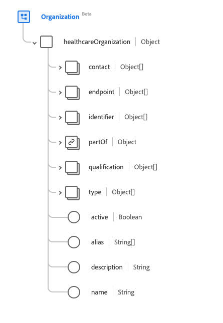
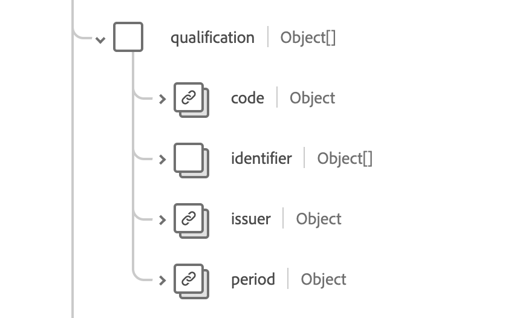

# [!UICONTROL Organization] groupe de champs de schéma

[!UICONTROL Organization] est un groupe de champs de schéma standard pour la [[!DNL XDM Individual Profile] classe](../../../classes/individual-profile.md) et le [[!DNL Provider class]](../../../classes/provider.md). Il fournit un `healthcareOrganization` de champ de type objet unique qui contient des informations concernant des regroupements de personnes ou d’organisations ayant un objectif commun.

| Nom d’affichage | Propriété | Type de données | Description |
| ---| --- | --- | --- |
| [!UICONTROL Contact Details] | `contact` | Tableau de [[!UICONTROL Extended Contact Details]](../data-types/extended-contact-detail.md) | Coordonnées des appareils de communication disponibles pour l’organisation spécifique. Il peut s’agir d’adresses, de numéros de téléphone, de fax, de numéros de mobile, d’adresses e-mail et de sites web. |
| [!UICONTROL End Point] | `endpoint` | Tableau de [[!UICONTROL Reference]](../data-types/reference.md) | Points d’entrée techniques permettant d’accéder aux services exploités pour l’organisation. |
| [!UICONTROL Identifier] | `indentifier` | Tableau de [[!UICONTROL Identifier]](../data-types/identifier.md) | Identifiant utilisé pour identifier l’organisation sur plusieurs systèmes disparates. |
| [!UICONTROL Part Of Organization] | `partOf` | [[!UICONTROL Reference]](../data-types/reference.md) | L’organisation dont cette organisation fait partie. |
| [!UICONTROL Qualification] | `qualification` | Tableau d’objets | Les certifications, accréditations, formations, désignations et licences officielles qui autorisent et/ou approuvent la prestation de soins par l’organisation. Pour plus d’informations, consultez la [section ci-dessous](#qualification). |
| [!UICONTROL Type] | `type` | Tableau de [[!UICONTROL Codeable Concept]](../data-types/codeable-concept.md) | Le genre d&#39;organisation que c&#39;est. |
| [!UICONTROL Active] | `active` | Booléen | Indique si l&#39;enregistrement de l&#39;organisation est toujours en cours d&#39;utilisation. |
| [!UICONTROL Alias] | `alias` | Tableau de chaînes | Liste d’autres noms sous lesquels l’organisation est connue ou était connue par le passé. |
| [!UICONTROL Description] | `description` | Chaîne | La description de l’organisation qui permet de fournir un contexte général pour s’assurer que la bonne organisation est sélectionnée. |
| [!UICONTROL Name] | `name` | Chaîne | Nom associé à l’organisation. |

Pour plus d’informations sur le groupe de champs , consultez le référentiel XDM public :

* [Exemple renseigné](https://github.com/adobe/xdm/blob/master/extensions/industry/healthcare/fhir/fieldgroups/coverage.example.1.json)
* [Schéma complet](https://github.com/adobe/xdm/blob/master/extensions/industry/healthcare/fhir/fieldgroups/coverage.schema.json)

## `qualification` {#qualification}

`qualification` est fourni sous la forme d’un tableau d’objets . La structure de chaque objet est décrite ci-dessous.

| Nom d’affichage | Propriété | Type de données | Description |
| --- | --- | --- | --- |
| [!UICONTROL Code] | `code` | [[!UICONTROL Codeable Concept]](../data-types/codeable-concept.md) | Représentation codée de la qualification. |
| [!UICONTROL Identifier] | `identifier` | Tableau de [[!UICONTROL Identifier]](../data-types/identifier.md) | Identifiant attribué à cette qualification pour cette organisation. |
| [!UICONTROL Issuer] | `issuer` | [[!UICONTROL Reference]](../data-types/reference.md) | Organisation qui réglemente et émet la qualification. |
| [!UICONTROL Period] | `period` | [[!UICONTROL Period]](../data-types/period.md) | Période de validité de la qualification. |
