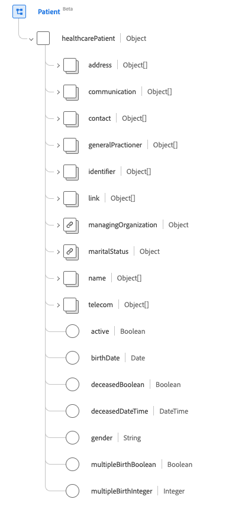

# Groupe de champs de schéma [!UICONTROL Patient]

[!UICONTROL Patient] est un groupe de champs de schéma standard pour la [[!DNL XDM Individual Profile] classe](../../../classes/individual-profile.md). Il fournit un champ unique de type objet `healthcarePatient` qui capture les données démographiques et d’autres détails administratifs sur un individu ou un animal recevant des soins ou d’autres services liés à la santé.

| Nom d’affichage | Propriété | Type de données | Description |
| --- | --- | --- | --- |
| [!UICONTROL Adresse] | `address` | Tableau de [[!UICONTROL Address]](../data-types/address.md) | Informations sur l’adresse du patient. |
| [!UICONTROL Communication] | `communication` | Tableau d’objets | Un langage qui peut être utilisé pour communiquer avec le patient au sujet de sa santé. Pour plus d’informations, consultez la [section ci-dessous](#communication) . |
| [!UICONTROL Contacts du patient] | `contact` | Tableau d’objets | Partie de contact d’un patient, comme un tuteur, un partenaire ou un ami. Pour plus d’informations, consultez la [section ci-dessous](#contact) . |
| [!UICONTROL Praticien général] | `generalPractioner` | Tableau de [[!UICONTROL Référence]](../data-types/reference.md) | Prestataire de soins primaires du patient. |
| [!UICONTROL Identifiant] | `identifier` | Tableau de [[!UICONTROL Identifiant]](../data-types/identifier.md) | Identifiant du patient. |
| [!UICONTROL Détails du lien du patient] | `link` | Tableau d’objets | Lien vers la ressource d’un patient ou d’une personne associée qui concerne la même personne. Pour plus d’informations, consultez la [section ci-dessous](#link) . |
| [!UICONTROL Gestion de l’organisation] | `managingOrganization` | [[!UICONTROL Référence]](../data-types/reference.md) | L&#39;organisation de la garde du dossier du patient. |
| [!UICONTROL État civil] | `maritalStatus` | [[!UICONTROL Concept codeable]](../data-types/codeable-concept.md) | État civil du patient. |
| [!UICONTROL Nom] | `name` | Tableau de [[!UICONTROL Nom humain]](../data-types/human-name.md) | Nom associé au patient. |
| [!UICONTROL Détails du contact] | `telecom` | Tableau de [[!UICONTROL Point de contact]](../data-types/contact-point.md) | coordonnées, telles qu’un numéro de téléphone ou une adresse électronique, par lesquelles le patient peut être contacté. |
| [!UICONTROL Est Actif] | `active` | Booléen | Indique si le dossier du patient est en cours d’utilisation. |
| [!UICONTROL Date de naissance] | `birthDate` | Date | La date de naissance du patient. |
| [!UICONTROL Indicateur déposé] | `deceasedBoolean` | Booléen | Indique si le patient est décédé ou non. |
| [!UICONTROL Heure de date de décès] | `deceasedDateTime` | DateTime | Date et heure du décès du patient. |
| [!UICONTROL Genre] | `gender` | Chaîne | Identité de genre de la personne. La valeur de cette propriété doit être égale à l’une des valeurs d’énumération connues suivantes. <li> `female` </li> <li> `male` </li> <li> `other` </li> <li> `unknown`</li> |
| [!UICONTROL Fait Partie De Plusieurs Naissances] | `multipleBirthBoolean` | Booléen | Indique si le patient fait partie d’une naissance multiple. |
| [!UICONTROL Numéro de naissance] | `multipleBirthInteger` | Nombre entier | Numéro de naissance dans la séquence. |

Pour plus d’informations sur le groupe de champs, reportez-vous au référentiel XDM public :

* [Exemple renseigné](https://github.com/adobe/xdm/blob/master/extensions/industry/healthcare/fhir/fieldgroups/patient.example.1.json)
* [Schéma complet](https://github.com/adobe/xdm/blob/master/extensions/industry/healthcare/fhir/fieldgroups/patient.schema.json)

## `communication` {#communication}

`communication` est fourni sous la forme d’un tableau d’objets. La structure de chaque objet est décrite ci-dessous.

| Nom d’affichage | Propriété | Type de données | Description |
| --- | --- | --- | --- |
| [!UICONTROL Langue] | `language` | [[!UICONTROL Concept codeable]](../data-types/codeable-concept.md) | Le langage qui peut être utilisé pour communiquer avec la personne au sujet de sa santé. |
| [!UICONTROL Is Preferred Language] | `preferred` | Booléen | Indique si la langue est leur langue préférée ou non. |

## `contact` {#contact}

`contact` est fourni sous la forme d’un tableau d’objets. La structure de chaque objet est décrite ci-dessous.

| Nom d’affichage | Propriété | Type de données | Description |
| --- | --- | --- | --- |
| [!UICONTROL Adresse de contact] | `address` | [[!UICONTROL Adresse]](../data-types/address.md) | Adresse de la personne de contact. |
| [!UICONTROL Nom du contact] | `name` | [[!UICONTROL Nom de l’homme]](../data-types/human-name.md) | Nom de la personne de contact. |
| [!UICONTROL Contact Organization] | `organization` | [[!UICONTROL Référence]](../data-types/reference.md) | L’organisation associée à la personne de contact. |
| [!UICONTROL Période de contact] | `period` | [[!UICONTROL Période]](../data-types/period.md) | Période pendant laquelle le contact a été ou est en cours d’utilisation. |
| [!UICONTROL Relationship&#39;] | `relationship` | [[!UICONTROL Concept codeable]](../data-types/codeable-concept.md) | La relation entre le patient et la personne de contact. |
| [!UICONTROL Détails du contact] | `telecom` | Tableau d’objets | Les coordonnées de la personne de contact. Pour plus d’informations, consultez la [section ci-dessous](#telecom) . |
| [!UICONTROL Genre] | `gender` | Chaîne | Identité de genre de la personne. La valeur de cette propriété doit être égale à l’une des valeurs d’énumération connues suivantes. <li> `female` </li> <li> `male` </li> <li> `other` </li> <li> `unknown`</li> |

### `telecom` {#telecom}

`telecom` est fourni sous la forme d’un tableau d’objets. La structure de chaque objet est décrite ci-dessous.

| Nom d’affichage | Propriété | Type de données | Description |
| --- | --- | --- | --- |
| [!UICONTROL Point de contact] | `contactPoint` | [[!UICONTROL Point de contact]](../data-types/contact-point.md) | Les coordonnées de la personne. |

## `link` {#link}

`link` est fourni sous la forme d’un tableau d’objets. La structure de chaque objet est décrite ci-dessous.

| Nom d’affichage | Propriété | Type de données | Description |
| --- | --- | --- | --- |
| [!UICONTROL Other] (Autre) | `other` | [[!UICONTROL Référence]](../data-types/reference.md) | Lien vers la ressource d’un patient ou d’une personne associée qui concerne la même personne. |
| [!UICONTROL Type] | `type` | Chaîne | Type de lien entre les deux ressources du patient. |
