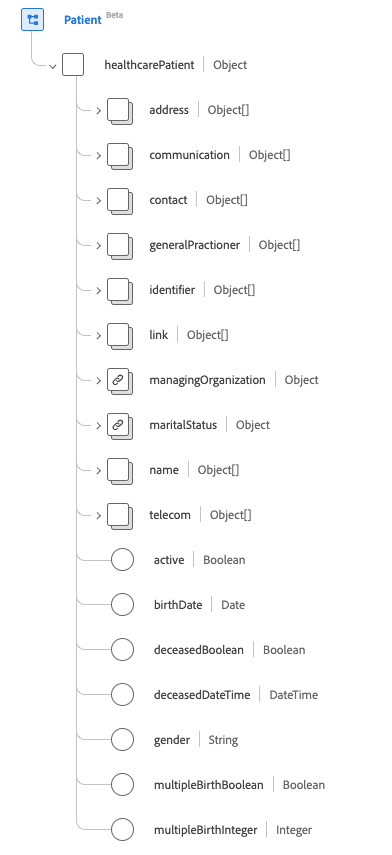
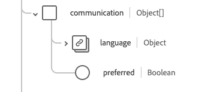
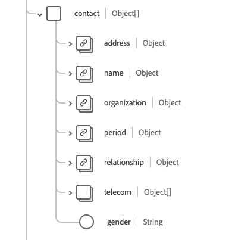
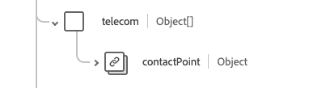
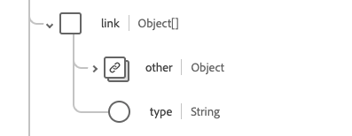

# Groupe de champs de schéma [!UICONTROL Patient]

[!UICONTROL Patient] est un groupe de champs de schéma standard pour la [[!DNL XDM Individual Profile] classe](../../../classes/individual-profile.md). Il fournit un `healthcarePatient` de champ de type objet unique qui recueille les données démographiques et d’autres détails administratifs sur une personne ou un animal recevant des soins ou d’autres services liés à la santé.

| Nom d’affichage | Propriété | Type de données | Description |
| --- | --- | --- | --- |
| [!UICONTROL Adresse] | `address` | Tableau d’[[!UICONTROL adresses]](../data-types/address.md) | Informations sur l’adresse du patient. |
| [!UICONTROL  Communication ] | `communication` | Tableau d’objets | Un langage qui peut être utilisé pour communiquer avec le patient sur son état de santé. Pour plus d’informations, consultez la [section ci-dessous](#communication). |
| [!UICONTROL Contacts du patient] | `contact` | Tableau d’objets | Partie de contact du patient, tel qu&#39;un tuteur, un partenaire ou un ami. Pour plus d’informations, consultez la [section ci-dessous](#contact). |
| [!UICONTROL Médecin généraliste] | `generalPractioner` | Tableau de [[!UICONTROL référence]](../data-types/reference.md) | Le principal prestataire de soins du patient. |
| [!UICONTROL Identifiant] | `identifier` | Tableau d’[[!UICONTROL identifiant]](../data-types/identifier.md) | Identifiant du patient. |
| [!UICONTROL Détails du lien du patient] | `link` | Tableau d’objets | Un lien vers la ressource d&#39;un patient ou d&#39;une personne apparentée qui concerne la même personne. Pour plus d’informations, consultez la [section ci-dessous](#link). |
| [!UICONTROL Organisation de gestion] | `managingOrganization` | [[!UICONTROL Référence]](../data-types/reference.md) | Organisation gardienne du dossier du patient. |
| [!UICONTROL État civil] | `maritalStatus` | [[!UICONTROL Concept codable]](../data-types/codeable-concept.md) | État civil du patient. |
| [!UICONTROL Nom] | `name` | Tableau de [[!UICONTROL Nom humain]](../data-types/human-name.md) | Nom associé au patient. |
| [!UICONTROL Coordonnées] | `telecom` | Tableau de [[!UICONTROL points de contact]](../data-types/contact-point.md) | Coordonnées, telles qu’un numéro de téléphone ou une adresse e-mail, permettant de contacter le patient. |
| [!UICONTROL Est actif] | `active` | Booléen | Indique si le dossier du patient est en cours d&#39;utilisation. |
| [!UICONTROL Date de naissance] | `birthDate` | Date | Date de naissance du patient. |
| [!UICONTROL Indicateur Décédé] | `deceasedBoolean` | Booléen | Indique si le patient est décédé ou non. |
| [!UICONTROL Date et heure du décès] | `deceasedDateTime` | DateTime | Date et heure du décès du patient. |
| [!UICONTROL Genre] | `gender` | Chaîne | Identité sexuelle de la personne. La valeur de cette propriété doit être égale à l’une des valeurs d’énumération connues suivantes. <li> `female` </li> <li> `male` </li> <li> `other` </li> <li> `unknown`</li> |
| [!UICONTROL Fait Partie De Naissances Multiples] | `multipleBirthBoolean` | Booléen | Indique si le patient fait partie d’une grossesse multiple. |
| [!UICONTROL Numéro de naissance] | `multipleBirthInteger` | Entier | Numéro de naissance dans la séquence. |

Pour plus d’informations sur le groupe de champs , consultez le référentiel XDM public :

* [Exemple renseigné](https://github.com/adobe/xdm/blob/master/extensions/industry/healthcare/fhir/fieldgroups/patient.example.1.json)
* [Schéma complet](https://github.com/adobe/xdm/blob/master/extensions/industry/healthcare/fhir/fieldgroups/patient.schema.json)

## `communication` {#communication}

`communication` est fourni sous la forme d’un tableau d’objets . La structure de chaque objet est décrite ci-dessous.

| Nom d’affichage | Propriété | Type de données | Description |
| --- | --- | --- | --- |
| [!UICONTROL Langue] | `language` | [[!UICONTROL Concept codable]](../data-types/codeable-concept.md) | Langue pouvant être utilisée pour communiquer avec la personne au sujet de sa santé. |
| [!UICONTROL Est la langue préférée] | `preferred` | Booléen | Indique si la langue est leur langue préférée ou non. |

## `contact` {#contact}

`contact` est fourni sous la forme d’un tableau d’objets . La structure de chaque objet est décrite ci-dessous.

| Nom d’affichage | Propriété | Type de données | Description |
| --- | --- | --- | --- |
| [!UICONTROL Adresse du contact] | `address` | [[!UICONTROL Adresse]](../data-types/address.md) | Adresse de la personne de contact. |
| [!UICONTROL Nom du contact] | `name` | [[!UICONTROL Nom Humain]](../data-types/human-name.md) | Nom de la personne de contact. |
| [!UICONTROL Contacter l’organisation] | `organization` | [[!UICONTROL Référence]](../data-types/reference.md) | Organisation associée à la personne de contact. |
| [!UICONTROL Période du contact] | `period` | [[!UICONTROL Période]](../data-types/period.md) | Période au cours de laquelle le contact a été utilisé ou est en cours d’utilisation. |
| [!UICONTROL Relation&#39;] | `relationship` | [[!UICONTROL Concept codable]](../data-types/codeable-concept.md) | La relation entre le patient et la personne de contact. |
| [!UICONTROL Coordonnées] | `telecom` | Tableau d’objets | Coordonnées de la personne de contact. Pour plus d’informations, consultez la [section ci-dessous](#telecom). |
| [!UICONTROL Genre] | `gender` | Chaîne | Identité sexuelle de la personne. La valeur de cette propriété doit être égale à l’une des valeurs d’énumération connues suivantes. <li> `female` </li> <li> `male` </li> <li> `other` </li> <li> `unknown`</li> |

### `telecom` {#telecom}

`telecom` est fourni sous la forme d’un tableau d’objets . La structure de chaque objet est décrite ci-dessous.

| Nom d’affichage | Propriété | Type de données | Description |
| --- | --- | --- | --- |
| [!UICONTROL  Point de contact ] | `contactPoint` | [[!UICONTROL  Point de contact ]](../data-types/contact-point.md) | Coordonnées de la personne. |

## `link` {#link}

`link` est fourni sous la forme d’un tableau d’objets . La structure de chaque objet est décrite ci-dessous.

| Nom d’affichage | Propriété | Type de données | Description |
| --- | --- | --- | --- |
| [!UICONTROL Autre] | `other` | [[!UICONTROL Référence]](../data-types/reference.md) | Un lien vers la ressource d&#39;un patient ou d&#39;une personne apparentée qui concerne la même personne. |
| [!UICONTROL Type] | `type` | Chaîne | Type de lien entre les deux ressources patient. |
