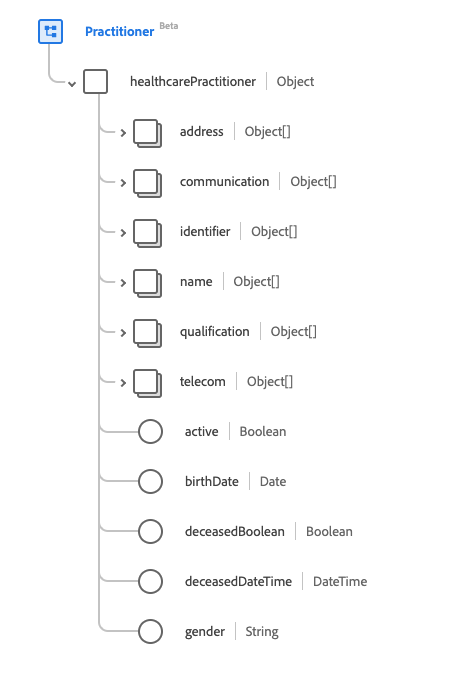
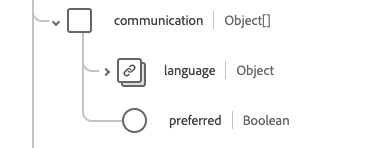
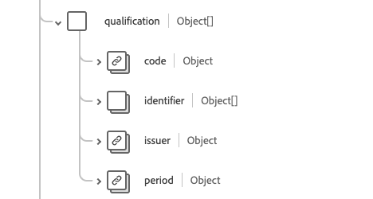

# Groupe de champs de schéma [!UICONTROL Praticien]

[!UICONTROL Praticien] est un groupe de champs de schéma standard pour la [[!DNL XDM Individual Profile] classe](../../../classes/individual-profile.md) et le [[!DNL Provider class]](../../../classes/provider.md). Il fournit un champ unique de type objet `healthcarePractioner` qui contient des informations sur une personne directement ou indirectement impliquée dans la fourniture de soins de santé ou de services associés.

| Nom d’affichage | Propriété | Type de données | Description |
| --- | --- | --- | --- |
| [!UICONTROL Adresse] | `address` | Tableau d’[[!UICONTROL adresses]](../data-types/address.md) | Adresse(s) du praticien qui se trouve(nt) hors de son lieu de travail, telle(s) qu&#39;une adresse personnelle. |
| [!UICONTROL  Communication ] | `communication` | Tableau d’objets | Langue pouvant être utilisée pour communiquer avec le praticien. Voir la [section ci-dessous](#communication) pour plus d’informations |
| [!UICONTROL Identifiant] | `identifier` | Tableau d’[[!UICONTROL identifiant]](../data-types/identifier.md) | Identifiant qui s’applique à cette personne dans ce rôle. |
| [!UICONTROL Nom] | `name` | Tableau de [[!UICONTROL nom humain]](../data-types/human-name.md) | Nom(s) associé(s) au praticien. |
| [!UICONTROL Qualification ] | `qualification` | Tableau d’objets | Les qualifications officielles, les certifications, les accréditations, la formation, les licences ou autres documents similaires qui autorisent ou concernent autrement la prestation de soins par le praticien. Pour plus d’informations, consultez la [section ci-dessous](#qualification). |
| [!UICONTROL Coordonnées] | `telecom` | Tableau de [[!UICONTROL points de contact]](../data-types/contact-point.md) | Coordonnées du praticien. |
| [!UICONTROL Actif] | `active` | Booléen | Indique si l’enregistrement des praticiens est en cours d’utilisation. |
| [!UICONTROL Date de naissance] | `birthDate` | Date | Date de naissance du praticien. |
| [!UICONTROL Indicateur Décédé] | `deceasedBoolean` | Booléen | Indique si le praticien est décédé. |
| [!UICONTROL Date et heure du décès] | `deceasedDateTime` | DateTime | Date et heure du décès du praticien. |
| [!UICONTROL Genre] | `gender` | Chaîne | Identité sexuelle de la personne. La valeur de cette propriété doit être égale à l’une des valeurs d’énumération connues suivantes. <li> `female` </li> <li> `male` </li> <li> `other` </li> <li> `unknown`</li> |

Pour plus d’informations sur le groupe de champs , consultez le référentiel XDM public :

* [Exemple renseigné](https://github.com/adobe/xdm/blob/master/extensions/industry/healthcare/fhir/fieldgroups/practitioner.example.1.json)
* [Schéma complet](https://github.com/adobe/xdm/blob/master/extensions/industry/healthcare/fhir/fieldgroups/practitioner.schema.json)

## `communication` {#communication}

`communication` est fourni sous la forme d’un tableau d’objets . La structure de chaque objet est décrite ci-dessous.

| Nom d’affichage | Propriété | Type de données | Description |
| --- | --- | --- | --- |
| [!UICONTROL Langue] | `language` | [[!UICONTROL Concept codable]](../data-types/codeable-concept.md) | Langue pouvant être utilisée pour communiquer avec la personne au sujet de sa santé. |
| [!UICONTROL Est la langue préférée] | `preferred` | Booléen | Indique si la langue est leur langue préférée ou non. |

## `qualification` {#qualification}

`qualification` est fourni sous la forme d’un tableau d’objets . La structure de chaque objet est décrite ci-dessous.

| Nom d’affichage | Propriété | Type de données | Description |
| --- | --- | --- | --- |
| [!UICONTROL Code] | `code` | [[!UICONTROL Concept codable]](../data-types/codeable-concept.md) | Représentation codée de la qualification. |
| [!UICONTROL Identifiant] | `identifier` | Tableau d’[[!UICONTROL identifiant]](../data-types/identifier.md) | Identifiant de la qualification. |
| [!UICONTROL Émetteur] | `issuer` | [[!UICONTROL Référence]](../data-types/reference.md) | L’organisation qui réglemente et délivre la qualification. |
| [!UICONTROL Période] | `period` | [[!UICONTROL Période]](../data-types/period.md) | La période pendant laquelle la qualification est valide. |
