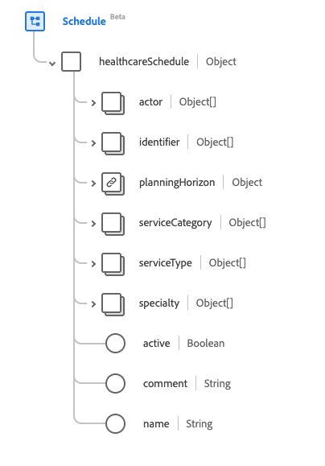

# [!UICONTROL Schedule] groupe de champs de schéma

[!UICONTROL Schedule] est un groupe de champs de schéma standard pour la [[!DNL XDM Individual Profile] classe](../../../classes/individual-profile.md) et le [[!DNL Provider class]](../../../classes/provider.md). Il fournit un seul champ de type objet `healthcareSchedule` qui est un conteneur pour les créneaux horaires qui peuvent être disponibles pour la réservation de rendez-vous.

| Nom d’affichage | Propriété | Type de données | Description |
| --- | --- | --- | --- |
| [!UICONTROL Actor] | `actor` | Tableau de [[!UICONTROL Reference]](../data-types/reference.md) | Emplacements qui font référence à cette planification et qui fournissent les détails de disponibilité à ces ressources référencées. |
| [!UICONTROL Identifier] | `identifier` | Tableau de [[!UICONTROL Identifier]](../data-types/identifier.md) | Identifiants externes du planning. |
| [!UICONTROL Planning Horizon] | `planningHorizon` | [[!UICONTROL Period]](../data-types/period.md) | Période couverte par les créneaux horaires qui font référence à cette planification, même s&#39;il n&#39;en existe aucun. |
| [!UICONTROL Service Category] | `serviceCategory` | Tableau de [[!UICONTROL Codeable Concept]](../data-types/codeable-concept.md) | Une catégorisation large du service qui doit être effectué pendant la nomination. |
| [!UICONTROL Service Type] | `serviceType` | Tableau de [[!UICONTROL Codeable Reference]](../data-types/codeable-reference.md) | Service spécifique à effectuer pendant le rendez-vous. |
| [!UICONTROL Speciality] | `specialty` | Tableau de [[!UICONTROL Codeable Concept]](../data-types/codeable-concept.md) | La spécialité du praticien qui serait nécessaire pour effectuer le service demandé dans le rendez-vous. |
| [!UICONTROL Active] | `active` | Booléen | Indique si l&#39;enregistrement du planning est en cours d&#39;utilisation. |
| [!UICONTROL Comment] | `comment` | Chaîne | Commentaires sur la disponibilité dans le but de décrire toute information étendue, telle que les contraintes personnalisées sur les emplacements. |
| [!UICONTROL Name] | `name` | Chaîne | Description du planning tel qu’il serait présenté à un client lors de la recherche. |

Pour plus d’informations sur le groupe de champs , consultez le référentiel XDM public :

* [Exemple renseigné](https://github.com/adobe/xdm/blob/master/extensions/industry/healthcare/fhir/fieldgroups/schedule.example.1.json)
* [Schéma complet](https://github.com/adobe/xdm/blob/master/extensions/industry/healthcare/fhir/fieldgroups/schedule.schema.json)
