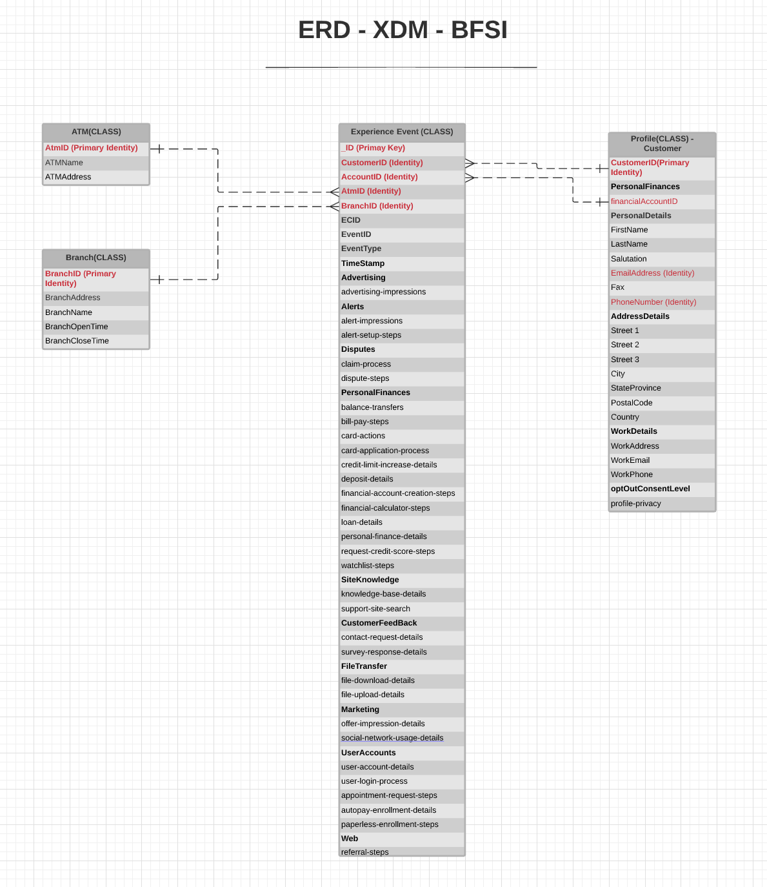

# [!UICONTROL Financial services] modèle de données du secteur ERD

Le diagramme de relation d’entité (ERD) suivant représente un modèle de données normalisé pour le secteur de la banque, des services financiers et de l’assurance (BFSI). L’ERD est délibérément présenté de manière dénormalisée et en tenant compte de la manière dont les données sont stockées dans Adobe Experience Platform.

>[!NOTE]
>
>L’ERD tel que décrit est une recommandation sur la manière dont vous devez modéliser vos données pour ce cas d’utilisation du secteur. Pour utiliser ce modèle de données dans Experience Platform, vous devez créer vous-même les schémas recommandés et leurs relations. Consultez les guides sur la gestion des [schémas](../../ui/resources/schemas.md) et [relations](../../tutorials/relationship-ui.md) dans l’interface utilisateur pour plus d’informations.

Utilisez la légende suivante pour interpréter cet ERD :

* Chaque entité affichée dans est basée sur une classe [Modèle de données d’expérience (XDM)](../composition.md#class) sous-jacente.
* Les champs mis en retrait sous un champ parent représentent un champ enfant, ou sous-champ, appartenant au groupe de champs du parent.
* Les champs les plus importants pour une entité donnée sont surlignés en rouge.
* Toutes les propriétés pouvant être utilisées pour identifier des clients individuels sont marquées comme « identité », l’une de ces propriétés étant marquée comme « identité principale ».
* Les relations d’entité sont marquées comme non dépendantes, car les événements basés sur des cookies ne peuvent souvent pas déterminer la personne ou l’individu qui a effectué la transaction.

>[!NOTE]
>
>L’entité Événement d’expérience comprend un champ « _ID », qui représente l’attribut d’identifiant unique (`_id`) fourni par la classe XDM ExperienceEvent. Consultez le document de référence sur [XDM ExperienceEvent](../../classes/experienceevent.md) pour plus d’informations sur ce qui est attendu pour cette valeur.

## Cas d’utilisation [!UICONTROL Financial services]

Le tableau suivant décrit les classes et groupes de champs de schéma recommandés pour plusieurs cas d’utilisation financiers courants.

| Cas d’utilisation | Classes et groupes de champs recommandés |
| --- | --- |
| Favorisez la personnalisation à l’échelle pour les segments préférés grâce à des informations de rapports omnicanaux et à l’automatisation des parcours pour augmenter les inscriptions à un programme de récompenses préféré. | <ul><li>**[[!UICONTROL Product]](../../classes/product.md)** :<ul><li>[[!UICONTROL Product Category]](../../field-groups/product/product-category.md)</li></ul></li><li>**[[!UICONTROL XDM ExperienceEvent]](../../classes/experienceevent.md)** :<ul><li>[[!UICONTROL Card Actions]](../../field-groups/event/card-actions.md)</li><li>[[!UICONTROL Quote Request Details]](../../field-groups/event/quote-request-details.md)</li><li>[[!UICONTROL Deposit Details]](../../field-groups/event/deposit-details.md)</li><li>[[!UICONTROL Channel Details]](../../field-groups/event/channel-details.md)</li><li>[[!UICONTROL Balance Transfers]](../../field-groups/event/balance-transfers.md)</li></ul></li><li>**[[!UICONTROL XDM Individual Profile]](../../classes/individual-profile.md)** :<ul><li>[[!UICONTROL Demographic Details]](../../field-groups/profile/demographic-details.md)</li><li>[[!UICONTROL Personal Contact Details]](../../field-groups/profile/personal-contact-details.md)</li><li>[[!UICONTROL Loyalty Details]](../../field-groups/profile/loyalty-details.md)</li></ul></li></ul> |
| Optimisez la personnalisation cross-canal sur les canaux en ligne et hors ligne. | <ul><li>**[[!UICONTROL Product]](../../classes/product.md)**:<ul><li>[[!UICONTROL Product Category]](../../field-groups/product/product-category.md)</li></ul></li><li>**[[!UICONTROL XDM ExperienceEvent]](../../classes/experienceevent.md)** :<ul><li>[[!UICONTROL Channel Details]](../../field-groups/event/channel-details.md)</li></ul></li><li>**[[!UICONTROL XDM Individual Profile]](../../classes/individual-profile.md)**:<ul><li>[[!UICONTROL Demographic Details]](../../field-groups/profile/demographic-details.md)</li><li>[[!UICONTROL Personal Contact Details]](../../field-groups/profile/personal-contact-details.md)</li><li>[[!UICONTROL Loyalty Details]](../../field-groups/profile/loyalty-details.md)</li></ul></li></ul> |
| Stimulez de nouvelles opportunités de chiffre d’affaires en utilisant les informations acquises par l’analyse de comportement cross-canal, en identifiant les modèles d’utilisation de produit qui peuvent conduire à de nouvelles offres de produit. | <ul><li>**[[!UICONTROL Policy]](../../classes/policy.md)**</li><li>**[[!UICONTROL Product]](../../classes/product.md)** :<ul><li>[[!UICONTROL Product Category]](../../field-groups/product/product-category.md)</li></ul></li><li>**[[!UICONTROL XDM ExperienceEvent]](../../classes/experienceevent.md)** :<ul><li>[[!UICONTROL Card Actions]](../../field-groups/event/card-actions.md)</li><li>[[!UICONTROL Support Site Search]](../../field-groups/event/support-site-search.md)</li><li>[[!UICONTROL Deposit Details]](../../field-groups/event/deposit-details.md)</li><li>[[!UICONTROL Channel Details]](../../field-groups/event/channel-details.md)</li></ul></li><li>**[[!UICONTROL XDM Individual Profile]](../../classes/individual-profile.md)**:<ul><li>[[!UICONTROL Demographic Details]](../../field-groups/profile/demographic-details.md)</li><li>[[!UICONTROL Personal Contact Details]](../../field-groups/profile/personal-contact-details.md)</li><li>[[!UICONTROL Loyalty Details]](../../field-groups/profile/loyalty-details.md)</li></ul></li></ul> |
