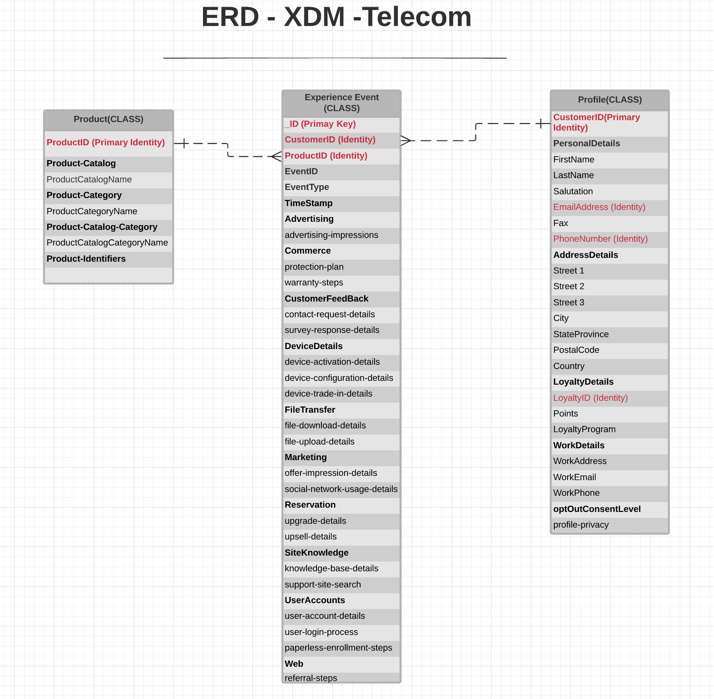

# [!UICONTROL Telecommunications] modèle de données du secteur ERD

Le diagramme de relation d&#39;entité suivant (ERD) représente un modèle de données normalisé pour l&#39;industrie des télécommunications. L’ERD est délibérément présenté de manière dénormalisée et en tenant compte de la manière dont les données sont stockées dans Adobe Experience Platform.

>[!NOTE]
>
>L’ERD tel que décrit est une recommandation sur la manière dont vous devez modéliser vos données pour ce cas d’utilisation du secteur. Pour utiliser ce modèle de données dans Experience Platform, vous devez créer vous-même les schémas recommandés et leurs relations. Consultez les guides sur la gestion des [schémas](../../ui/resources/schemas.md) et [relations](../../tutorials/relationship-ui.md) dans l’interface utilisateur pour plus d’informations.

Utilisez la légende suivante pour interpréter cet ERD :

* Chaque entité affichée dans est basée sur une classe [Modèle de données d’expérience (XDM)](../composition.md#class) sous-jacente.
* Les champs mis en retrait sous un champ parent représentent un champ enfant, ou sous-champ, appartenant au groupe de champs du parent.
* Les champs les plus importants pour une entité donnée sont surlignés en rouge.
* Toutes les propriétés pouvant être utilisées pour identifier des clients individuels sont marquées comme « identité », l’une de ces propriétés étant marquée comme « identité principale ».
* Les relations d’entité sont marquées comme non dépendantes, car les événements basés sur des cookies ne peuvent souvent pas déterminer la personne ou l’individu qui a effectué la transaction.

>[!NOTE]
>
>L’entité Événement d’expérience comprend un champ « _ID », qui représente l’attribut d’identifiant unique (`_id`) fourni par la classe XDM ExperienceEvent. Consultez le document de référence sur [XDM ExperienceEvent](../../classes/experienceevent.md) pour plus d’informations sur ce qui est attendu pour cette valeur.

## Cas d’utilisation [!UICONTROL Telecommunications]

Le tableau suivant décrit les classes et les groupes de champs de schéma recommandés pour plusieurs cas d’utilisation courants du secteur des télécommunications.

| Cas d’utilisation | Classes et groupes de champs recommandés |
| --- | --- |
| Comprenez les clients qui sont de bons candidats pour des opportunités de vente incitative ou croisée en fonction de leurs avoirs actuels et de leur comportement de navigation. | <ul><li>**[XDM ExperienceEvent](../../classes/experienceevent.md)** :<ul><li>[[!UICONTROL Upsell Details]](../../field-groups/event/upsell-details.md)</li><li>[[!UICONTROL Upgrade Details]](../../field-groups/event/upgrade-details.md)</li></ul></li><li>**[[!UICONTROL XDM Individual Profile]](../../classes/individual-profile.md)**:<ul><li>[[!UICONTROL Telecom Subscription]](../../field-groups/profile/telecom-subscription.md)</li><li>[[!UICONTROL Demographic Details]](../../field-groups/profile/demographic-details.md)</li><li>[[!UICONTROL Personal Contact Details]](../../field-groups/profile/personal-contact-details.md)</li></ul></li></ul> |
| Recibler les abandons de panier par le biais d’annonces pertinentes et d’e-mails personnalisés automatisés. Supprimer les publicités lors de leur conversion. | <ul><li>**[XDM ExperienceEvent](../../classes/experienceevent.md)** :<ul><li>[[!UICONTROL Commerce Details]](../../field-groups/event/upsell-details.md) (pour capturer les abandons de panier)</li></ul></li><li>**[[!UICONTROL XDM Individual Profile]](../../classes/individual-profile.md)**:<ul><li>[[!UICONTROL Telecom Subscription]](../../field-groups/profile/telecom-subscription.md)</li><li>[[!UICONTROL Demographic Details]](../../field-groups/profile/demographic-details.md)</li><li>[[!UICONTROL Personal Contact Details]](../../field-groups/profile/personal-contact-details.md)</li></ul></li></ul> |
| Lorsqu’un client est marqué comme susceptible d’être résilié (en fonction d’une interaction d’un employé ou d’un algorithme de machine learning automatisé), envoyez les détails du client aux canaux numériques et non numériques. | <ul><li>**[XDM ExperienceEvent](../../classes/experienceevent.md)** :<ul><li>[[!UICONTROL Campaign Marketing Details]](../../field-groups/event/campaign-marketing-details.md)</li><li>[[!UICONTROL Channel Details]](../../field-groups/event/channel-details.md)</li><li>Un groupe de champs personnalisés contenant du contenu personnalisé</li></ul></li><li>**[[!UICONTROL XDM Individual Profile]](../../classes/individual-profile.md)** :<ul><li>[[!UICONTROL Demographic Details]](../../field-groups/profile/demographic-details.md)</li><li>[[!UICONTROL Personal Contact Details]](../../field-groups/profile/personal-contact-details.md)</li></ul></li></ul> |

{style="table-layout:auto"}
