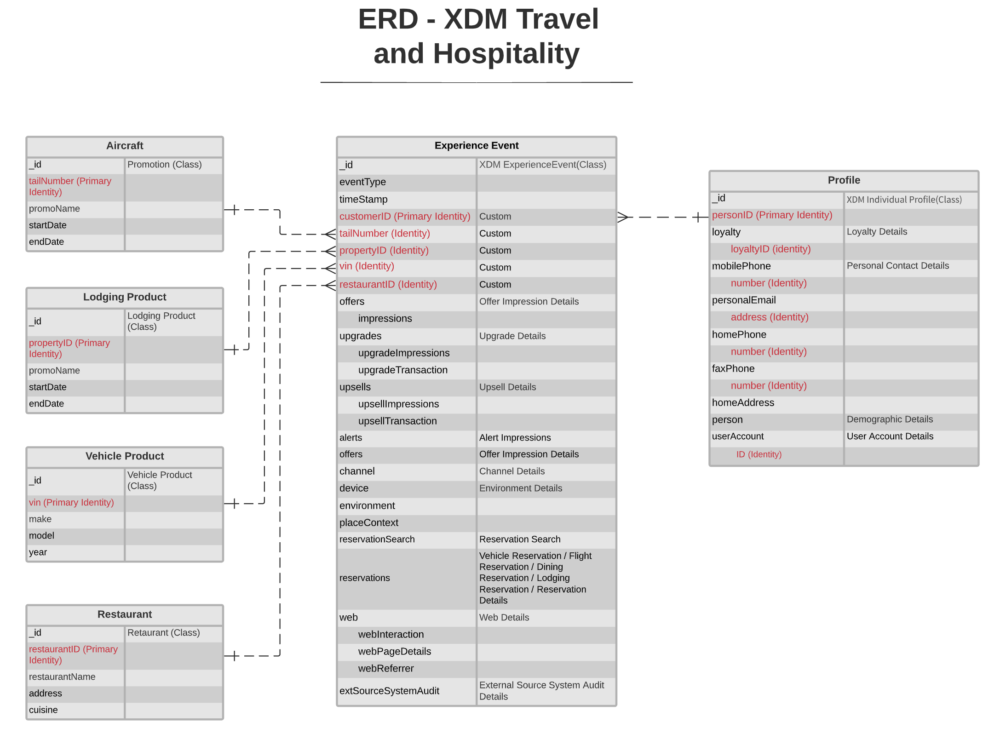

# [!UICONTROL Voyage et hébergement] modèle de données du secteur ERD

Le diagramme de relation d’entité suivant (ERD) représente un modèle de données normalisé pour l’industrie du voyage et de l’accueil. L’ERD est délibérément présenté de manière dénormalisée et en tenant compte de la manière dont les données sont stockées dans Adobe Experience Platform.

>[!NOTE]
>
>L’ERD tel que décrit est une recommandation sur la manière dont vous devez modéliser vos données pour ce cas d’utilisation du secteur. Pour utiliser ce modèle de données dans Experience Platform, vous devez créer vous-même les schémas recommandés et leurs relations. Consultez les guides sur la gestion des [schémas](../../ui/resources/schemas.md) et [relations](../../tutorials/relationship-ui.md) dans l’interface utilisateur pour plus d’informations.

Utilisez la légende suivante pour interpréter cet ERD :

* Chaque entité affichée dans est basée sur une classe [Modèle de données d’expérience (XDM)](../composition.md#class) sous-jacente.
* Les champs mis en retrait sous un champ parent représentent un champ enfant, ou sous-champ, appartenant au groupe de champs du parent.
* Les champs les plus importants pour une entité donnée sont surlignés en rouge.
* Toutes les propriétés pouvant être utilisées pour identifier des clients individuels sont marquées comme « identité », l’une de ces propriétés étant marquée comme « identité principale ».
* Les relations d’entité sont marquées comme non dépendantes, car les événements basés sur des cookies ne peuvent souvent pas déterminer la personne ou l’individu qui a effectué la transaction.

>[!NOTE]
>
>L’entité Événement d’expérience comprend un champ « _ID », qui représente l’attribut d’identifiant unique (`_id`) fourni par la classe XDM ExperienceEvent. Consultez le document de référence sur [XDM ExperienceEvent](../../classes/experienceevent.md) pour plus d’informations sur ce qui est attendu pour cette valeur.

## [!UICONTROL Voyage et hébergement] cas pratiques

Le tableau suivant décrit les classes et les groupes de champs de schéma recommandés pour plusieurs cas d’utilisation courants du secteur du voyage et de l’hôtellerie.

| Cas d’utilisation | Classes et groupes de champs recommandés |
| --- | --- |
| Vente croisée de restaurants et d&#39;autres attractions locales aux clients du marché et aux clients ayant des réservations d&#39;hôtel à venir. | <ul><li>**[XDM ExperienceEvent](../../classes/experienceevent.md)** :<ul><li>[Détails de la réservation](../../field-groups/event/reservation-details.md)</li><li>[Réservation de logement](../../field-groups/event/lodging-reservation.md)</li><li>[Réservation de restaurant](../../field-groups/event/dining-reservation.md)</li></ul></li><li>**[Profil individuel XDM](../../classes/individual-profile.md)** :<ul><li>[Détails démographiques](../../field-groups/profile/demographic-details.md)</li><li>[Coordonnées personnelles](../../field-groups/profile/personal-contact-details.md)</li><li>[Détails du contact professionnel](../../field-groups/profile/work-contact-details.md)</li></ul></li></ul> |
| Des restaurants haut de gamme et d&#39;autres attractions résidentes pour les clients du marché et les clients ayant des réservations d&#39;hôtel à venir. | <ul><li>**[XDM ExperienceEvent](../../classes/experienceevent.md)** :<ul><li>[Détails de la réservation](../../field-groups/event/reservation-details.md)</li><li>[Réservation de restaurant](../../field-groups/event/dining-reservation.md)</li></ul></li><li>**[Profil individuel XDM](../../classes/individual-profile.md)** :<ul><li>[Détails démographiques](../../field-groups/profile/demographic-details.md)</li><li>[Coordonnées personnelles](../../field-groups/profile/personal-contact-details.md)</li><li>[Détails du contact professionnel](../../field-groups/profile/work-contact-details.md)</li><li>[Détails de fidélité](../../field-groups/profile/loyalty-details.md)</li></ul></li></ul> |
| Hôtel de haut de gamme et autres attractions résidentes pour les clients du marché et les clients ayant des réservations d&#39;hôtel à venir. | <ul><li>**[XDM ExperienceEvent](../../classes/experienceevent.md)** :<ul><li>[Détails de la réservation](../../field-groups/event/reservation-details.md)</li><li>[Réservation de logement](../../field-groups/event/lodging-reservation.md)</li></ul></li><li>**[Profil individuel XDM](../../classes/individual-profile.md)** :<ul><li>[Détails démographiques](../../field-groups/profile/demographic-details.md)</li><li>[Coordonnées personnelles](../../field-groups/profile/personal-contact-details.md)</li><li>[Détails du contact professionnel](../../field-groups/profile/work-contact-details.md)</li><li>[Détails de fidélité](../../field-groups/profile/loyalty-details.md)</li></ul></li></ul> |
| Vol de mise à niveau et autres attractions locales à destination des clients du marché et des clients ayant des réservations d&#39;hôtel à venir. | <ul><li>**[XDM ExperienceEvent](../../classes/experienceevent.md)** :<ul><li>[Détails de la réservation](../../field-groups/event/reservation-details.md)</li><li>[Réservation de vol](../../field-groups/event/flight-reservation.md)</li></ul></li><li>**[Profil individuel XDM](../../classes/individual-profile.md)** :<ul><li>[Détails démographiques](../../field-groups/profile/demographic-details.md)</li><li>[Coordonnées personnelles](../../field-groups/profile/personal-contact-details.md)</li><li>[Détails du contact professionnel](../../field-groups/profile/work-contact-details.md)</li><li>[Détails de fidélité](../../field-groups/profile/loyalty-details.md)</li></ul></li></ul> |

{style="table-layout:auto"}
