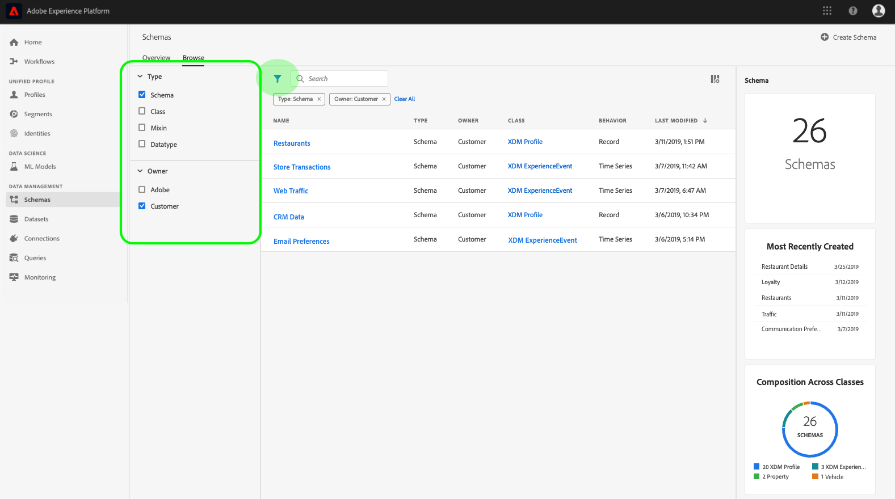
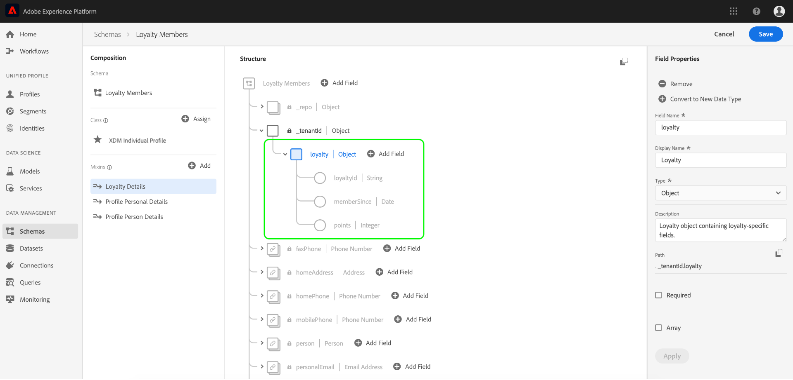
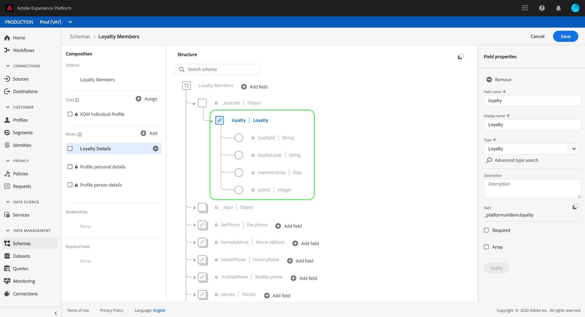

# Création d’un schéma à l’aide de l’éditeur de Schéma

Le registre des Schémas fournit une interface utilisateur et une API RESTful à partir de laquelle vous pouvez vue et gérer toutes les ressources de la bibliothèque de Schémas de la plate-forme Adobe Experience Platform. La bibliothèque de Schémas contient les ressources mises à votre disposition par Adobe, les partenaires de la plateforme d’expérience et les fournisseurs dont vous utilisez les applications, ainsi que les ressources que vous définissez et enregistrez dans le registre des Schémas.

Ce didacticiel décrit les étapes de création d’un schéma à l’aide de l’éditeur de Schéma dans la plate-forme d’expérience. Si vous préférez composer un schéma à l&#39;aide de l&#39;API Schéma Registry, lisez d&#39;abord le guide [du développeur](../api/getting-started.md) Schéma Registry avant de tenter le didacticiel [créant un schéma à l&#39;aide de l&#39;API](create-schema-api.md).

Ce didacticiel comprend également des étapes pour [définir une nouvelle classe](#create-new-class) que vous pouvez ensuite utiliser pour composer un schéma.

## Prise en main

Ce didacticiel nécessite une bonne compréhension des différents aspects d’Adobe Experience Platform impliqués dans l’utilisation de l’éditeur de Schéma. Avant de commencer ce didacticiel, veuillez consulter la documentation relative aux concepts suivants :

* [Modèle de données d’expérience (XDM)](../home.md): Cadre normalisé selon lequel la plate-forme organise les données d’expérience client.
* [Principes de base de la composition](../schema/composition.md)des schémas : Présentation des schémas XDM et de leurs blocs de création, y compris les classes, les mixins, les types de données et les champs.
* [Profil](../../profile/home.md)client en temps réel : Fournit un profil de consommation unifié en temps réel basé sur des données agrégées provenant de plusieurs sources.

Ce didacticiel nécessite que vous ayez accès à la plate-forme d’expérience. Si vous n’avez pas accès à une organisation IMS dans Experience Platform, contactez votre administrateur système avant de continuer.

## Parcourir les schémas existants dans l’espace de travail Schémas

L’espace de travail Schémas de la plate-forme d’expérience fournit une visualisation de la bibliothèque de Schémas, ce qui vous permet de vue et de gérer tous les schémas disponibles et d’en créer de nouveaux. L’espace de travail comprend également l’éditeur de Schéma, la trame sur laquelle vous allez composer un schéma tout au long de ce didacticiel.

Après vous être connecté à Experience Platform, cliquez sur **Schémas** dans le volet de navigation de gauche et vous serez redirigé vers l’espace de travail Schémas. Vous verrez une liste de schémas (une représentation de la bibliothèque de Schémas) où vous pouvez vue, gérer et personnaliser tous les schémas qui vous sont accessibles. La liste comprend le nom, le type, la classe et le comportement (enregistrement ou série chronologique) sur lesquels le schéma est basé, ainsi que la date et l’heure de la dernière modification du schéma.

Cliquez sur l’icône de filtre en regard de la barre de recherche pour utiliser les fonctionnalités de filtrage pour toutes les ressources du registre, y compris les classes, les mixins et les types de données.

## Création et attribution d’un nom à un schéma

Pour commencer à composer un schéma, cliquez sur **Créer un Schéma** dans le coin supérieur droit de l’espace de travail Schémas.

L’éditeur *de* Schéma s’affiche. C&#39;est la toile sur laquelle vous allez composer votre schéma. Lorsque vous accédez à l’éditeur, un &quot;Schéma sans titre&quot; dans la section *Structure* du canevas est automatiquement créé pour que vous puissiez commencer à le personnaliser.

Sur le côté droit de l’éditeur, vous trouverez les Propriétés *du* Schéma dans lesquelles vous pouvez attribuer un nom au schéma (à l’aide du champ Nom **d’** affichage). Une fois le nom saisi, la trame se met à jour pour refléter le nouveau nom du schéma.

Il convient de tenir compte de plusieurs points importants lors du choix d’un nom pour votre schéma :

* Les noms des Schémas doivent être courts et descriptifs afin que le schéma puisse être facilement trouvé dans la bibliothèque ultérieurement.
* Les noms de Schéma doivent être uniques, ce qui signifie qu&#39;ils doivent également être suffisamment précis pour ne pas être réutilisés à l&#39;avenir. Par exemple, si votre organisation dispose de programmes de fidélité distincts pour différentes marques, il serait sage de nommer votre schéma &quot;Membres de fidélité de la marque A&quot; afin de faciliter la distinction entre les autres schémas liés à la fidélité que vous pourrez définir plus tard.
* Vous pouvez éventuellement fournir des informations supplémentaires sur le schéma à l’aide du champ **Description** .

Ce didacticiel compose un schéma d’assimilation de données relatives aux membres d’un programme de fidélité. Par conséquent, le schéma est nommé &quot;Membres de fidélité&quot;.

## Attribuer une classe

La section *Composition* se trouve à gauche de l’éditeur. Il contient actuellement deux sous-sections : *Schéma* et *classe*.

Maintenant que le schéma a un nom, il est temps d&#39;attribuer la classe que le schéma va mettre en oeuvre. Cliquez sur **Attribuer** en regard de *Classe*.

La boîte de dialogue *Attribuer une classe* s&#39;affiche. Cette fenêtre affiche une liste de toutes les classes disponibles, y compris toutes les classes définies par votre organisation (le propriétaire étant &quot;Client&quot;) ainsi que les classes standard définies par Adobe.

Cliquez sur le nom de la classe pour afficher la description de la classe. Vous pouvez également choisir de **Prévisualisation Structure** de classe pour afficher les champs et les métadonnées associés à la classe.

Ce didacticiel utilise la classe de Profil XDM Individuel. Cliquez sur le bouton radio en regard de la classe pour la sélectionner, puis cliquez sur **Attribuer une classe**.

La trame réapparaît. La section *Classe* contient désormais la classe que vous avez sélectionnée (Profil individuel XDM) et les champs fournis par la classe de Profil individuel XDM sont désormais visibles dans la section *Structure* .

Les champs apparaissent au format &quot;fieldName&quot;. | Type de données&quot;. Les étapes de définition des champs de schéma dans l’interface utilisateur sont décrites plus loin dans ce didacticiel.

>[!NOTE] Vous pouvez [modifier la classe d&#39;un schéma](#change-class) à tout moment au cours du processus de composition initial avant que le schéma n&#39;ait été enregistré, mais cela doit se faire avec une extrême prudence. Les mixins ne sont compatibles qu&#39;avec certaines classes. Par conséquent, modifier la classe réinitialise le canevas et les champs que vous avez ajoutés.

## Ajouter un mixin

Maintenant qu&#39;une classe a été affectée, la section *Composition* contient une troisième sous-section : *Mélanges*.

Vous pouvez maintenant commencer à ajouter des champs à votre schéma en ajoutant des mixins. Un mixin est un groupe d’un ou de plusieurs champs qui décrivent un concept particulier. Ce didacticiel utilise des mixins pour décrire les membres du programme de fidélité et capturer des informations clés telles que le nom, l’anniversaire, le numéro de téléphone, l’adresse, etc.

Pour ajouter un mixin, cliquez sur **Ajouter** dans la sous-section *Mélanges* .

La boîte de dialogue *Ajouter Mixin* s’affiche. Les mixins ne sont destinés qu&#39;à des classes spécifiques. Par conséquent, la liste des mixins n&#39;affiche que ceux compatibles avec la classe que vous avez sélectionnée (dans ce cas, la classe de Profil XDM Individuel).

La sélection du bouton radio en regard d&#39;un mixin vous donne la possibilité de **Prévisualisation de la structure** de mixin. Sélectionnez le mixin &quot;Détails de la personne du Profil&quot;, puis cliquez sur **Ajouter Mixin**.

Le canevas de schéma réapparaît. La section *Mélanges* liste désormais le mixin &quot;Détails de la personne du Profil&quot; et la section *Structure* inclut les champs fournis par le mixin.

Ce mixin fournit plusieurs champs sous le nom de niveau supérieur &quot;personne&quot; avec le type de données &quot;Personne&quot;. Ce groupe de champs décrit des informations sur un individu, notamment son nom, sa date de naissance et son sexe.

>[!NOTE] N&#39;oubliez pas que les champs peuvent utiliser des types scalaires (tels que chaîne, entier, tableau ou date) comme type de données, ainsi que tout &quot;type de données&quot; (un groupe de champs représentant un concept commun) dans le registre des Schémas.

Notez que le champ &quot;nom&quot; possède un type de données &quot;Nom de la personne&quot;, ce qui signifie qu’il décrit également un concept commun et qu’il contient des sous-champs liés au nom, tels que le prénom, le nom et le nom complet.

Cliquez sur les différents champs de la trame pour afficher les champs supplémentaires qu’ils contribuent à la structure du schéma.

## Ajouter un autre mixin

Vous pouvez maintenant répéter les mêmes étapes pour ajouter un autre mixin. Lorsque vous vue cette fois la boîte de dialogue *Ajouter Mixin* , notez que le mixin &quot;Détails de la personne du Profil&quot; a été grisé et que le bouton radio situé à côté ne peut pas être sélectionné. Cela vous évite de dupliquer accidentellement des mixins que vous avez déjà inclus dans le schéma actuel.

Vous pouvez maintenant ajouter le mixin &quot;Détails personnels du Profil&quot; à partir de la boîte de dialogue *Ajouter Mixin* .

Une fois ajouté, le canevas réapparaît. Les &quot;Détails personnels du Profil&quot; sont maintenant répertoriés sous *Mélanges* dans la section *Composition* , et les champs pour l&#39;adresse de domicile, le téléphone mobile et d&#39;autres ont été ajoutés sous *Structure*.

Tout comme le champ &quot;nom&quot;, les champs que vous venez d’ajouter représentent des concepts à champs multiples. Par exemple, &quot;homeAddress&quot; possède un type de données &quot;Address&quot; et &quot;mobilePhone&quot; un type de données &quot;Phone Number&quot;. Vous pouvez cliquer sur chacun de ces champs pour les développer et afficher les champs supplémentaires inclus dans le type de données.

## Définir un nouveau mixin

Le schéma &quot;Membres fidèles&quot; est destiné à capturer les données relatives aux membres d’un programme de fidélité. Il nécessite donc certains champs spécifiques liés à la fidélité. Aucun mixin standard ne contient les champs nécessaires, vous devrez donc définir un nouveau mixin.

Cette fois-ci, lorsque vous ouvrez la boîte de dialogue *Ajouter Mixin* , sélectionnez **Créer un nouveau mixin**. Vous serez alors invité à fournir un nom **** d&#39;affichage et une **description** pour votre mixin.

Comme pour les noms de classe, le nom du mixin doit être court et simple, décrivant ce que le mixin contribuera au schéma. Elles sont également uniques, de sorte que vous ne pourrez pas réutiliser le nom et devez donc vous assurer qu&#39;il est suffisamment spécifique.

Pour ce didacticiel, nommez le nouveau mixin &quot;Détails de fidélité&quot;.

Cliquez sur **Ajouter Mixin** pour revenir à l’éditeur de schéma. Les &quot;Détails de fidélité&quot; doivent maintenant apparaître sous *Mélanges* sur le côté gauche de la trame, mais aucun champ n’y est associé pour le moment et aucun nouveau champ n’apparaît donc sous *Structure*.

## Ajouter champs au mixin

Maintenant que vous avez créé le mixin &quot;Détails de fidélité&quot;, il est temps de définir les champs que le mixin va contribuer au schéma.

Pour commencer, cliquez sur le nom du mixin dans la section *Mélanges* . Une fois que vous avez effectué cette opération, *les propriétés* du mixin s’affichent sur le côté droit de l’éditeur et un bouton Champ **** Ajouter s’affiche en regard du nom du schéma sous *Structure*.

Cliquez sur Champ **** Ajouter en regard de &quot;Membres fidèles&quot; pour créer un nouveau noeud dans la structure. Ce noeud (appelé &quot;_locataireId&quot; dans cet exemple) représente l’ID de client de votre organisation IMS, précédé d’un trait de soulignement. La présence de l’ID de client indique que les champs que vous ajoutez sont contenus dans l’espace de nommage de votre organisation.

En d&#39;autres termes, les champs que vous ajoutez sont propres à votre organisation et seront enregistrés dans le Registre des Schémas dans une zone spécifique accessible uniquement à votre organisation IMS. Les champs que vous définissez doivent toujours être ajoutés à votre espace de nommage pour éviter les collisions avec des noms provenant d’autres classes standard, mixins, types de données et champs.

À l’intérieur de ce noeud avec espacement de noms se trouve un &quot;nouveau champ&quot;. C&#39;est le début du mixin &quot;Détails de fidélité&quot;.

En utilisant les propriétés *de* champ sur le côté droit de l’éditeur, début en créant un champ &quot;fidélité&quot; avec le type &quot;Objet&quot; qui sera utilisé pour conserver vos champs liés à la fidélité. Lorsque vous avez terminé, cliquez sur **Appliquer**.

Les modifications sont appliquées et le nouvel objet &quot;fidélité&quot; s’affiche. Cliquez sur Champ **** Ajouter en regard de l’objet pour ajouter d’autres champs liés à la fidélité. Un &quot;nouveau champ&quot; apparaît et la section Propriétés *du* champ est visible sur le côté droit de la trame.

Chaque champ nécessite les informations suivantes :

* **Nom du champ :** Le nom du champ, écrit dans le boîtier du chameau. Exemple : loyaltyLevel
* **Nom d’affichage :** Nom du champ, écrit en cas de titre. Exemple : Niveau de fidélité
* **Type :** Type de données du champ. Cela inclut les types scalaires de base et tous les types de données définis dans le registre de Schémas. Exemples : chaîne, entier, booléen, Personne, Adresse, Numéro de téléphone, etc.
* **Description :** Une description facultative du champ doit être incluse, écrite en cas de phrase. (200 caractères max.)

Le premier champ de l’objet Loyalty sera une chaîne appelée &quot;loyaltyId&quot;. Lorsque vous définissez le type du nouveau champ sur &quot;Chaîne&quot;, la fenêtre Propriétés *du* champ est renseignée avec plusieurs options permettant d’appliquer des contraintes, notamment la valeur **** par défaut, le **format** et la longueur **maximale.**

Différentes options de contrainte sont disponibles en fonction du type de données sélectionné. Puisque &quot;loyaltyId&quot; sera une adresse électronique, sélectionnez &quot;email&quot; dans le menu déroulant **Format** . Sélectionnez **Appliquer** pour appliquer vos modifications.

## Ajouter d’autres champs à mixer

Maintenant que vous avez ajouté le champ &quot;loyaltyId&quot;, vous pouvez ajouter d’autres champs pour capturer des informations relatives à la fidélité, telles que :

* Points (entiers)
* Membre depuis (date)

Chaque champ est ajouté en cliquant sur Champ **** Ajouter sur l’objet de fidélité et en renseignant les informations requises.

Une fois terminé, l’objet Fidélité contient des champs pour : Identifiant de fidélité, points et membre depuis.

## Ajouter champ &quot;enum&quot; à mixer

Lors de la définition de champs dans l’éditeur de Schéma, vous pouvez appliquer d’autres options aux types de champs de base afin de limiter davantage les données que le champ peut contenir.

Par exemple, un champ &quot;Niveau de fidélité&quot;, où la valeur ne peut être que l’une des quatre options possibles. Pour ajouter ce champ au schéma, cliquez sur Champ **** Ajouter en regard de l’objet &quot;fidélité&quot; et renseignez les champs obligatoires sous Propriétés *du* champ.

Pour **Type**, sélectionnez &quot;Chaîne&quot; et d&#39;autres cases à cocher s&#39;affichent pour **Tableau**, **Enum** et **Identité.**

Cochez la case **Enum** pour ouvrir la section Valeurs ** Enum ci-dessous. Vous pouvez saisir ici la **valeur** (dans chamelCase) et le **libellé** (un nom facultatif et facile à lire dans Title Case) pour chaque niveau de fidélité acceptable.

Une fois toutes les propriétés de champ remplies, cliquez sur **Appliquer** et le champ &quot;loyaltyLevel&quot; sera ajouté à l’objet &quot;loyalty&quot;.

Plus d&#39;informations sur les contraintes supplémentaires disponibles :

* **Obligatoire :** Indique que le champ est requis pour l’assimilation de données. Toute donnée téléchargée dans un jeu de données basé sur ce schéma qui ne contient pas ce champ échouera lors de l’assimilation.
* **Tableau :** Indique que le champ contient un tableau de valeurs, chacune avec le type de données spécifié. Par exemple, la sélection d’un type de données &quot;String&quot; et la coche &quot;Array&quot; signifient que le champ contient un tableau de chaînes.
* **Enum :** Indique que ce champ doit contenir l’une des valeurs d’une liste énumérée de valeurs possibles.
* **Identité :** Indique que ce champ est un champ d’identité. D&#39;autres informations sur les champs d&#39;identité sont fournies [plus loin dans ce didacticiel](#identity-field).

## Convertir un objet à champs multiples en un type de données

Après avoir ajouté plusieurs champs spécifiques à la fidélité, l’objet &quot;fidélité&quot; contient désormais une structure de données commune qui peut s’avérer utile dans d’autres schémas.

Lorsque vous pensez qu’une structure à champs multiples peut être réutilisable et que vous aimeriez avoir la souplesse nécessaire pour utiliser la même structure de données ailleurs, l’éditeur de Schéma permet de convertir cette structure en type de données.

Les types de données permettent l&#39;utilisation cohérente de structures à champs multiples et offrent plus de flexibilité qu&#39;un mixin, car ils peuvent être utilisés n&#39;importe où dans un schéma. Pour ce faire, définissez le **type** d’un champ d’un mixin sur celui de tout type de données défini dans le registre.

Pour convertir l’objet &quot;loyalty&quot; en type de données, cliquez sur le champ &quot;loyalty&quot; sous *Structure* et sélectionnez **Convertir en nouveau type** de données sur le côté droit de l’éditeur sous Propriétés *du* champ. Une petite fenêtre contextuelle verte s’affiche, confirmant &quot;Objet converti en type de données&quot;.

Maintenant, lorsque vous regardez sous *Structure*, vous pouvez voir que le champ &quot;fidélité&quot; a un type de données &quot;fidélité&quot; et que les champs ont de petites icônes de verrouillage à côté indiquant qu’ils ne sont plus des champs individuels, mais qu’ils font plutôt partie d’une structure à champs multiples.

Dans un schéma ultérieur, vous pouvez désormais attribuer un champ au **type** de fidélité et inclure automatiquement les champs Niveau de fidélité, Points, Membre depuis et Identifiant de fidélité.

## Définir un champ de schéma comme champ d’identité {#identity-field}

Les Schémas sont utilisés pour ingérer des données dans la plateforme d’expérience et ces données sont en fin de compte utilisées pour identifier les individus et rassembler des informations provenant de sources multiples. Pour faciliter ce processus, les champs clés peuvent être marqués comme des champs &quot;Identité&quot;.

Experience Platform facilite la désignation d’un champ d’identité grâce à l’utilisation d’une case à cocher **Identité** dans l’éditeur de Schémas.

Par exemple, il peut y avoir des milliers de membres du programme de fidélité appartenant au même &quot;niveau&quot;, mais chaque membre du programme de fidélité a un &quot;loyaltyId&quot; unique (qui dans ce cas est l&#39;adresse électronique du membre individuel). Le fait que &quot;loyaltyId&quot; soit un identifiant unique pour chaque membre en fait un bon candidat pour un champ d&#39;identité, contrairement à &quot;level&quot;.

Dans la section *Structure* de l’éditeur, cliquez sur le champ &quot;loyaltyId&quot; que vous avez créé et la case à cocher **Identity** apparaît sous Propriétés *du* champ. Cochez la case et vous aurez la possibilité de définir cette option comme identité **** principale. Cochez également cette case.

Ensuite, vous devez fournir un espace de noms **d’identité**. Il existe plusieurs espaces de nommage prédéfinis, mais comme &quot;loyaltyId&quot; est l&#39;adresse électronique du membre, sélectionnez &quot;Email&quot; dans la liste déroulante. Vous pouvez maintenant cliquer sur **Appliquer** pour confirmer les mises à jour du champ &quot;loyaltyId&quot;.

Désormais, toutes les données saisies dans le champ &quot;loyaltyId&quot; seront utilisées pour identifier cette personne et assembler une seule vue de ce client.

>[!NOTE] Une fois qu’un champ de schéma a été défini comme identité principale, vous recevrez un message d’erreur si vous tentez par la suite de définir un autre champ dans le schéma comme principal. Chaque schéma ne peut contenir qu&#39;un seul champ d&#39;identité principal.

Pour en savoir plus sur l&#39;utilisation des identités, consultez la documentation [Identity Service](../../identity-service/home.md) .

<!-- ## Relationship

Schemas define a static view of a concept, but do not provide specific details on how data based on these schemas (datasets, etc) may relate to one another. Adobe Experience Platform allows you to describe these relationships through the **Relationship** checkbox in the schema editor. 

In order to define a relationship, click on the field and check the **Relationship** checkbox on the right-side of the canvas. 

More information about relationships and other schema metadata can be found in the [Schema Registry API Developer Guide](../schema_registry_developer_guide.md). -->

## Activation du schéma à utiliser dans le Profil client en temps réel {#profile}

L’éditeur de Schéma permet d’activer un schéma à utiliser avec le Profil [client en temps](../../profile/home.md)réel. Profil fournit une vue holistique de chaque client en construisant un profil robuste de 360° d’attributs du client ainsi qu’un compte horodaté de chaque interaction du client dans tout système intégré à Experience Platform.

Pour qu&#39;un schéma puisse être activé pour une utilisation avec le Profil client en temps réel, une identité principale doit être définie. Vous recevrez un message d&#39;erreur &quot;Identité principale manquante&quot; si vous tentez d&#39;activer un schéma sans avoir préalablement défini d&#39;identité principale.

Pour activer le schéma &quot;Membres de la fidélité&quot; à utiliser dans le Profil, commencez par cliquer sur &quot;Membres de la fidélité&quot; dans la section *Structure* de l&#39;éditeur.

Sur le côté droit de l’éditeur, sous Propriétés *du* Schéma, des informations sur le schéma s’affichent, y compris son nom d’affichage, sa description et son type. En plus de cette information, il y a un bouton bascule intitulé **Profil**.

Cliquez sur **Profil** et une fenêtre contextuelle s’affiche, vous demandant de confirmer que vous souhaitez activer le schéma pour le Profil.

>[!NOTE] Une fois qu’un schéma a été activé pour le Profil client en temps réel et enregistré, il ne peut pas être désactivé.

## Étapes suivantes

Maintenant que vous avez fini de composer un schéma &quot;Membres fidèles&quot;, vous pouvez voir le schéma complet dans la section *Structure* de l&#39;éditeur. Cliquez sur **Enregistrer** et le schéma sera enregistré dans la bibliothèque de Schémas, ce qui le rendra accessible par le registre des Schémas.

Votre nouveau schéma peut désormais être utilisé pour importer des données dans la plate-forme. N&#39;oubliez pas qu&#39;une fois que le schéma a été utilisé pour ingérer des données, seuls des changements additifs peuvent être apportés. Pour plus d’informations sur le contrôle des versions de schéma, consultez les [bases de la composition](../schema/composition.md) des schémas.

Le schéma &quot;Membres de la fidélité&quot; est également disponible pour être affiché et géré à l’aide de l’API de registre du Schéma. Pour commencer à travailler avec l&#39;API, début en lisant le guide [du développeur de l&#39;API de registre de](../api/getting-started.md)Schéma.

## Annexe

Les informations suivantes sont complémentaires au didacticiel de l’éditeur de Schémas.

### Create a new class {#create-new-class}

Experience Platform offre la possibilité de définir un schéma basé sur une classe unique pour votre entreprise.

Ouvrez la boîte de dialogue *Attribuer une classe* en cliquant sur **Attribuer** dans la section *Classe* de l&#39;éditeur de Schémas. Dans la boîte de dialogue, sélectionnez **Créer une classe**.

Vous pouvez ensuite attribuer à votre nouvelle classe un nom **** d’affichage (un nom court, descriptif, unique et convivial pour la classe), une **description** et un **comportement** (&quot;Enregistrement&quot; ou &quot;Série de temps&quot;) pour les données que le schéma va définir.

>[!NOTE] Lors de la création d&#39;un schéma qui implémente une classe définie par votre organisation, n&#39;oubliez pas que les mixins sont disponibles pour une utilisation uniquement avec des classes compatibles. La classe que vous avez définie étant nouvelle, aucun mixin compatible n’est répertorié dans la boîte de dialogue *Ajouter Mixin* . Vous devez sélectionner **Créer un nouveau mixin** et définir un mixin à utiliser avec cette classe. La prochaine fois que vous composez un schéma qui implémente la nouvelle classe, le mixin que vous avez défini sera répertorié et disponible pour utilisation.

### Modification de la classe d’un schéma {#change-class}

A tout moment au cours du processus initial de composition du schéma, avant l&#39;enregistrement du schéma, vous pouvez modifier la classe sur laquelle le schéma est basé.

>[!WARNING] Veuillez faire attention avant de changer de classe. Les mixins ne sont compatibles qu&#39;avec certaines classes. Par conséquent, modifier la classe réinitialise le canevas et supprime tous les champs que vous avez ajoutés à ce point.

Pour modifier la classe, cliquez sur **Attribuer** en regard de *la classe* dans la section *Composition* de l’éditeur.

Lorsque la boîte de dialogue *Attribuer une classe* s&#39;ouvre, vous pouvez choisir une nouvelle classe dans la liste disponible. Cliquez sur **Attribuer une classe** et une nouvelle boîte de dialogue s&#39;ouvre vous demandant de confirmer que vous souhaitez affecter une nouvelle classe.

Si vous confirmez le changement de classe, le canevas sera réinitialisé et tous les progrès de la composition seront perdus.