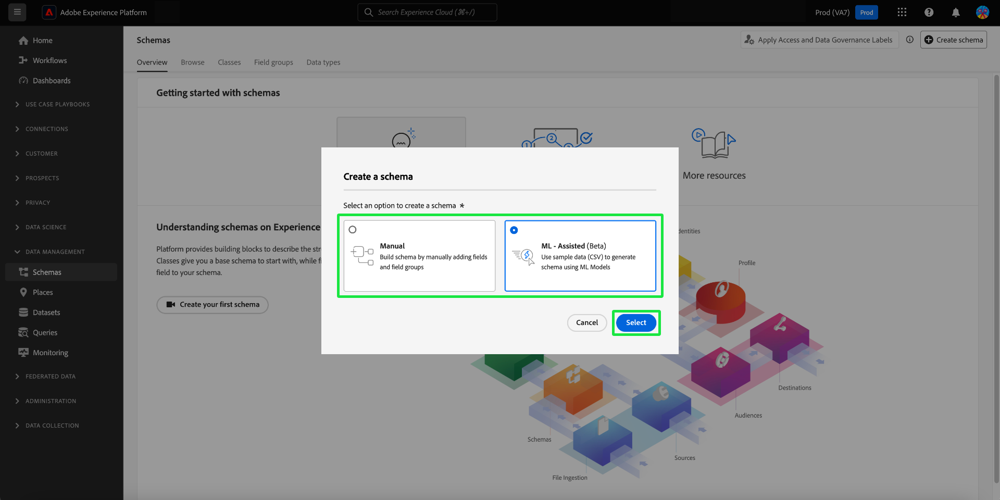

# Créer un schéma à l’aide de l’[!DNL Schema Editor]

L’interface utilisateur d’Adobe Experience Platform vous permet de créer et de gérer des schémas de [!DNL Experience Data Model] (XDM) dans une zone de travail visuelle interactive appelée l’[!DNL Schema Editor]. Ce tutoriel explique comment créer un schéma à l’aide de l’[!DNL Schema Editor].

À des fins de démonstration, les étapes de ce tutoriel concernent la création d’un exemple de schéma qui décrit les membres d’un programme de fidélité des clients. Vous pouvez utiliser ces étapes pour créer un schéma différent pour vos propres besoins. Cependant, il est recommandé de suivre d’abord la création de l’exemple de schéma pour découvrir les fonctionnalités de l’[!DNL Schema Editor].

>[!NOTE]
>
>Si vous ingérez des données CSV dans Experience Platform, vous pouvez [mapper ces données à un schéma XDM créé par des recommandations générées par l’IA](../../ingestion/tutorials/map-csv/recommendations.md) (actuellement en version bêta) sans avoir à créer manuellement le schéma.
>
>Si vous préférez composer un schéma à l’aide de l’API [!DNL Schema Registry], veuillez commencer par lire le [[!DNL Schema Registry] guide du développeur](../api/getting-started.md) avant de vous lancer dans le tutoriel sur la [création d’un schéma à l’aide de l’API](create-schema-api.md).

## Prise en main

Ce tutoriel demande une bonne compréhension des différents aspects d’Adobe Experience Platform relatifs à la création de schémas. Avant de commencer ce tutoriel, veuillez consulter la documentation relative aux concepts suivants :

* [[!DNL Experience Data Model (XDM)]](../home.md) : cadre normalisé selon lequel [!DNL Experience Platform] organise les données de l’expérience client.
   * [Principes de base de la composition des schémas](../schema/composition.md) : présentation des schémas XDM et de leurs blocs de création, notamment les classes, les groupes de champs de schéma, les types de données et les champs individuels.
* [[!DNL Real-Time Customer Profile]](../../profile/home.md) : fournit un profil de consommateur unifié en temps réel, basé sur des données agrégées provenant de plusieurs sources.

## Ouvrez l’espace de travail des [!UICONTROL schémas] {#browse}

L’espace de travail des [!UICONTROL schémas] dans l’interface utilisateur de [!DNL Experience Platform] offre une visualisation de la [!DNL Schema Library], ce qui vous permet d’afficher et de gérer les schémas disponibles pour votre organisation. L’espace de travail comprend également l’[!DNL Schema Editor], la zone de travail sur laquelle vous allez composer un schéma tout au long de ce tutoriel.

Connectez-vous à [!DNL Experience Platform] et sélectionnez **[!UICONTROL Schémas]** dans le volet de navigation de gauche pour ouvrir l’espace de travail des **[!UICONTROL schémas]**. L’onglet **[!UICONTROL Parcourir]** affiche une liste des schémas (une représentation du [!DNL Schema Library]) que vous pouvez afficher et personnaliser. La liste comprend le nom, le type, la classe et le comportement (enregistrement ou série chronologique) sur lesquels repose le schéma, ainsi que la date et l’heure de la dernière modification du schéma.

Reportez-vous au guide sur l’[exploration des ressources XDM existantes dans l’interface utilisateur](../ui/explore.md) pour plus d’informations.

## Création et attribution d’un nom à un schéma {#create}

Pour commencer à composer un schéma, sélectionnez **[!UICONTROL Créer un schéma]** dans le coin supérieur droit de l’espace de travail **[!UICONTROL Schémas]**.

![Onglet [!UICONTROL Schémas] de l’espace de travail [!UICONTROL Parcourir] avec [!UICONTROL Créer un schéma] en surbrillance.](../images/tutorials/create-schema/create-schema-button.png)

La boîte de dialogue [!UICONTROL Créer un schéma] s’affiche. Dans cette boîte de dialogue, vous pouvez choisir de créer manuellement un schéma en ajoutant des champs et des groupes de champs, ou de charger un fichier CSV et d’utiliser des algorithmes ML pour générer un schéma. Sélectionnez un workflow de création de schéma dans la boîte de dialogue.

### [!BADGE Beta &#x200B;]{type=Informative} création manuelle ou assistée par machine learning de schéma {#manual-or-assisted}

Pour découvrir comment utiliser un algorithme ML afin de recommander une structure de schéma basée sur un fichier chargé, consultez le guide de création de schéma assisté par machine learning [machine learning](../ui/ml-assisted-schema-creation.md). Ce guide de l’interface utilisateur se concentre sur le workflow de création manuelle .

### Choisir une classe de base {#choose-a-class}

Le workflow [!UICONTROL Créer un schéma] s’affiche. Choisissez ensuite une classe de base pour le schéma. Vous pouvez choisir entre les classes principales [!UICONTROL XDM Individual Profile] et [!UICONTROL XDM ExperienceEvent] ou [!UICONTROL Other] si ces classes ne répondent pas à vos besoins. L’option [!UICONTROL Autres] classes vous permet de [créer une classe](#create-new-class) ou de choisir parmi d’autres classes préexistantes.

Consultez la documentation [[!UICONTROL Profil individuel XDM]](../classes/individual-profile.md) et [[!UICONTROL XDM ExperienceEvent]](../classes/experienceevent.md) pour plus d’informations sur ces classes. Pour les besoins de ce tutoriel, sélectionnez **[!UICONTROL Profil individuel XDM]** suivi de **[!UICONTROL Suivant]**.

![Le workflow [!UICONTROL Créer un schéma] avec les options [!UICONTROL Profil individuel XDM] et [!UICONTROL Suivant] en surbrillance.](../images/tutorials/create-schema/individual-profile-base-class.png)

### Nom et révision {#name-and-review}

Après avoir sélectionné une classe, la section [!UICONTROL Nom et révision] s’affiche. Dans cette section, vous indiquez un nom et une description pour identifier votre schéma. Plusieurs éléments importants doivent être pris en compte lors du choix d’un nom pour votre schéma :

* Le nom d’un schéma doit être court et descriptif afin qu’il puisse être facilement retrouvé par la suite.
* Le nom d’un schéma doit être unique, ce qui signifie qu’il doit également être suffisamment précis pour ne pas être réutilisé à l’avenir. Par exemple, si votre organisation dispose de programmes de fidélité distincts pour différentes marques, nous vous conseillons de nommer votre schéma « Brand A Loyalty Members » pour faciliter la distinction avec d’autres schémas relatifs à la fidélité que vous pourriez définir ultérieurement.
* Vous pouvez également utiliser la description du schéma pour fournir toute information contextuelle supplémentaire le concernant.

Ce tutoriel décrit la composition d’un schéma pour ingérer les données relatives aux membres d’un programme de fidélité, c’est pourquoi le schéma est nommé « [!DNL Loyalty Members] ».

&#x200B;La structure de base du schéma (fournie par la classe ) s’affiche dans la zone de travail pour que vous puissiez consulter et vérifier la structure de classe et de schéma sélectionnée.

Saisissez un [!UICONTROL nom d’affichage du schéma] convivial dans le champ de texte. Saisissez ensuite une description appropriée pour vous aider à identifier votre schéma. Une fois que vous avez révisé votre structure de schéma et que vos paramètres vous conviennent, sélectionnez **[!UICONTROL Terminer]** pour créer votre schéma.

![La section [!UICONTROL Nom et révision] du workflow [!UICONTROL Créer un schéma] avec le [!UICONTROL Nom d’affichage du schéma], [!UICONTROL Description] et [!UICONTROL Terminer] en surbrillance.](../images/ui/resources/schemas/name-and-review.png)

### Composer le schéma {#compose-your-schema}

L’[!DNL Schema Editor] apparaît. C’est la zone de travail sur laquelle vous allez composer votre schéma. Le schéma doté d’un titre est automatiquement créé dans la section **[!UICONTROL Structure]** de la zone de travail lorsque vous accédez à l’éditeur, avec les champs standard inclus dans la classe de base que vous avez sélectionnée. La classe affectée pour le schéma est également répertoriée sous **[!UICONTROL Classe]** dans la section **[!UICONTROL Composition]**.

>[!NOTE]
>
>Vous pouvez mettre à jour le nom d’affichage et la description facultative du schéma à partir de la barre latérale **[!UICONTROL Propriétés du schéma]**. Une fois qu’un nouveau nom est saisi, la zone de travail se met automatiquement à jour pour refléter le nouveau nom du schéma.

>[!NOTE]
>
>Vous pouvez [modifier la classe d’un schéma](#change-class) à tout moment au cours du processus de composition initial avant que le schéma ne soit enregistré, mais cela doit être fait avec la plus grande prudence. Les groupes de champs ne sont compatibles qu’avec certaines classes. Par conséquent, la modification de la classe réinitialisera la zone de travail et tous les champs que vous avez ajoutés.

## Ajouter un groupe de champs {#field-group}

Vous pouvez maintenant commencer à ajouter des champs à votre schéma grâce à l’ajout de groupes de schémas. Un groupe de champs est un groupe d’un ou de plusieurs champs souvent utilisés conjointement pour décrire un concept particulier. Ce tutoriel utilise des groupes de champs pour décrire les membres du programme de fidélité et recueillir des informations clés telles que le nom, la date d’anniversaire, le numéro de téléphone, l’adresse, etc.

Pour ajouter un groupe de champs, cliquez sur **[!UICONTROL Ajouter]** dans la sous-section **[!UICONTROL Groupes de champs]**.

Une nouvelle boîte de dialogue apparait. Elle présente la liste des groupes de champs disponibles. Chaque groupe de champs est uniquement destiné à une utilisation avec une classe spécifique. Par conséquent, la boîte de dialogue ne répertorie que les groupes de champs compatibles avec la classe que vous avez sélectionnée (dans ce cas, la classe [!DNL XDM Individual Profile]). Si vous utilisez une classe XDM standard, la liste des groupes de champs sera triée intelligemment en fonction de la popularité de l’utilisation.

![Boîte de dialogue [!UICONTROL Ajouter des groupes de champs].](../images/tutorials/create-schema/field-group-popularity.png)

Vous pouvez utiliser l’un des filtres dans le rail de gauche pour limiter la liste des groupes de champs standard à des [secteurs](../schema/industries/overview.md) comme la vente au détail, les services financiers et les services de santé.

![ La boîte de dialogue [!UICONTROL Ajouter des groupes de champs] avec les groupes de champs du secteur mis en surbrillance.](../images/tutorials/create-schema/industry-field-groups.png)

Lorsqu’un groupe de champs est sélectionné dans la liste, il s’affiche dans le rail de droite. Si vous le souhaitez, vous pouvez sélectionner plusieurs groupes de champs en les ajoutant chacun à la liste dans le rail de droite avant de confirmer la sélection. En outre, l’icône qui s’affiche sur le côté droit du groupe de champs sélectionné vous permet de prévisualiser la structure des champs qu’il présente.

![ La boîte de dialogue [!UICONTROL Ajouter des groupes de champs] avec l’icône d’aperçu du groupe de champs sélectionné en surbrillance.](../images/tutorials/create-schema/preview-field-group-button.png)

Lors de la prévisualisation d’un groupe de champs, une description détaillée du schéma du groupe de champs est fournie dans le rail droit. Vous pouvez également parcourir les champs du groupe de champs dans la zone de travail. Lorsque vous sélectionnez différents champs, le rail de droite se met à jour pour afficher les détails du champ en question. Sélectionnez **[!UICONTROL Retour]** lorsque vous avez terminé la prévisualisation pour retourner à la boîte de dialogue de sélection du groupe de champs.

![Boîte de dialogue [!UICONTROL Prévisualiser le groupe de champs] avec le groupe de champs Détails démographiques prévisualisé.](../images/tutorials/create-schema/preview-field-group.png)

Pour ce tutoriel, sélectionnez le groupe de champs **[!UICONTROL Détails démographiques]**, puis cliquez sur **[!UICONTROL Ajouter un groupe de champs]**.

![La boîte de dialogue [!UICONTROL Ajouter des groupes de champs] avec le groupe de champs Détails démographiques sélectionné et [!UICONTROL Ajouter des groupes de champs] mis en surbrillance.](../images/tutorials/create-schema/demographic-details.png)

La zone de travail du schéma réapparaît. La section **[!UICONTROL Groupes de champs]** répertorie désormais« [!UICONTROL Détails démographiques] » et la section **[!UICONTROL Structure]** inclut les champs fournis par le groupe de champs. Vous pouvez sélectionner le nom du groupe de champs sous la section **[!UICONTROL Groupes de champs]** pour mettre en surbrillance les champs spécifiques qu’il fournit dans la zone de travail.

>[!NOTE]
>
>Dans l’éditeur de schémas, les classes et les groupes de champs standard (générés par Adobe) sont indiqués par l’icône de cadenas (icône de cadenas . Le cadenas s’affiche dans le rail de gauche à côté du nom de la classe ou du groupe de champs, ainsi qu’à côté de tout champ du diagramme de schéma qui fait partie d’une ressource générée par le système.
>
>

Ce groupe de champs fournit plusieurs champs sous le nom de niveau supérieur `person` avec le type de données « [!UICONTROL Personne] ». Ce groupe de champs décrit les informations sur un individu, notamment son nom, sa date de naissance et son genre.

>[!NOTE]
>
>N’oubliez pas que les champs peuvent utiliser des types scalaires (chaîne, entier, tableau ou date), ainsi que tout type de données (un groupe de champs représentant un concept commun) défini dans [!DNL Schema Registry].

Notez que le champ `name` possède un type de données « [!UICONTROL Nom complet] », ce qui signifie qu’il décrit lui aussi un concept commun et contient des sous-champs liés au nom, tels que le prénom, le nom de famille, le titre de courtoisie et le suffixe.

Sélectionnez les différents champs dans la zone de travail pour afficher les champs supplémentaires contribuant à la structure du schéma.

## Ajouter d’autres groupes de champs {#field-group-2}

Vous pouvez maintenant répéter les mêmes étapes pour ajouter un autre groupe de champs. Lorsque la boîte de dialogue **[!UICONTROL Ajouter un groupe de champs]** s’affiche cette fois-ci, vous remarquerez que les « [!UICONTROL Details démographiques] » sont grisés et que la case à cocher adjacente ne peut pas être sélectionnée. Cela vous évite de dupliquer accidentellement des groupes de champs que vous avez déjà inclus dans le schéma actuel.

Pour ce tutoriel, sélectionnez les groupes de champs standard **[!UICONTROL Coordonnées personnelles]** et **[!UICONTROL Détails de fidélité]** dans la liste, puis sélectionnez **[!UICONTROL Ajouter des groupes de champs]** pour les ajouter au schéma.

![ La boîte de dialogue [!UICONTROL Ajouter des groupes de champs] avec deux nouveaux groupes de champs sélectionnés et [!UICONTROL Ajouter des groupes de champs] en surbrillance.](../images/tutorials/create-schema/more-field-groups.png)

La zone de travail réapparaît avec les groupes de champs ajoutés sous **[!UICONTROL Groupes de champs]** dans la section **[!UICONTROL Composition]** et leurs champs composites ajoutés à la structure du schéma.

## Définir un groupe de champs personnalisé {#define-field-group}

Le schéma [!UICONTROL Membres du programme de fidélité] est destiné à capturer des données relatives aux membres d’un programme de fidélité. Le groupe de champs standard [!UICONTROL Détails de fidélité] que vous avez ajouté au schéma fournit la plupart de ces informations, notamment le type de programme, les points, la date d’inscription, etc.

Cependant, il peut arriver que vous souhaitiez inclure d’autres champs personnalisés non couverts par des groupes de champs standard afin d’atteindre vos cas d’utilisation. Dans le cas de l’ajout de champs de fidélité personnalisés, vous disposez de deux options :

1. Créer un groupe de champs personnalisé pour capturer ces champs. Il s’agit de la méthode qui sera abordée dans ce tutoriel.
1. Étendre le groupe de champs standard [!UICONTROL Détails de fidélité] avec des champs personnalisés. Cela entraîne la conversion de [!UICONTROL Détails de fidélité] en un groupe de champs personnalisés et le groupe de champs standard d’origine ne sera plus disponible. Consultez le Guide de l’interface utilisateur des [!UICONTROL Schémas] pour plus d’informations sur [l’ajout de champs personnalisés à la structure des groupes de champs standard](../ui/resources/schemas.md#custom-fields-for-standard-groups).

Pour créer un groupe de champs, sélectionnez **[!UICONTROL Ajouter]** dans la sous-section **[!UICONTROL Groupes de champs]** comme avant, mais cette fois, sélectionnez **[!UICONTROL Créer un nouveau groupe de champs]** dans la partie supérieure de la boîte de dialogue qui s’affiche. Vous êtes alors invité à fournir un nom d’affichage et une description pour le nouveau groupe de champs. Pour ce tutoriel, nommez le nouveau groupe de champs « [!DNL Custom Loyalty Details] », puis sélectionnez **[!UICONTROL Ajouter des groupes de champs]**.

![ La boîte de dialogue [!UICONTROL Ajouter des groupes de champs] avec [!UICONTROL Créer un groupe de champs], [!UICONTROL Nom d’affichage] et [!UICONTROL Description] en surbrillance.](../images/tutorials/create-schema/create-new-field-group.png)

>[!NOTE]
>
>Comme pour les noms de classe, le nom du groupe de champs doit être court et simple, décrivant ce que le groupe de champs va apporter au schéma. Ces noms sont également uniques. Vous ne pourrez donc pas réutiliser le nom et devrez donc veiller à ce qu’il soit suffisamment spécifique.

« [!DNL Custom Loyalty Details] » devrait maintenant apparaître sous **[!UICONTROL Groupes de champs]** sur le côté gauche de la zone de travail, mais aucun champ n’y est encore associé et, par conséquent, aucun nouveau champ n’apparaît sous **[!UICONTROL Structure]**.

## Ajouter des champs au groupe de champs {#field-group-fields}

Maintenant que vous avez créé le groupe de champs « [!DNL Custom Loyalty Details] », il est temps de définir les champs que le groupe de champs va ajouter au schéma.

Pour commencer, sélectionnez l’icône **plus (+)** située à côté du nom du schéma dans la zone de travail.

Un espace reservé « [!UICONTROL Champ sans titre] » apparaît dans la zone de travail, et le rail de droite se met à jour pour afficher les options de configuration du champ.

![L’éditeur de schémas avec un [!UICONTROL Champ sans titre] et le schéma [!UICONTROL Propriétés du champ] mis en surbrillance.](../images/tutorials/create-schema/untitled-field.png)

Dans ce scénario, le schéma doit comporter un champ de type objet qui décrit en détail le niveau de fidélité actuel de la personne. À l’aide des commandes du rail de droite, commencez à créer un champ `loyaltyTier` de type « [!UICONTROL Objet] » qui sera utilisé pour contenir vos champs associés.

Sous **[!UICONTROL Attribuer à]**, vous devez sélectionner un groupe de champs auquel affecter le champ. N’oubliez pas que tous les champs de schéma appartiennent à une classe ou à un groupe de champs. Comme ce schéma utilise une classe standard, votre seule option est de sélectionner un groupe de champs. Commencez à saisir le nom « [!DNL Custom Loyalty Details] », puis sélectionnez le groupe de champs dans la liste.

Lorsque vous avez terminé, sélectionnez **[!UICONTROL Appliquer]**.

![L’éditeur de schémas avec l’objet Niveau de fidélité ajouté au schéma [!UICONTROL Propriétés du champ] mis en surbrillance.](../images/tutorials/create-schema/loyalty-tier-object.png)

Les modifications sont appliquées et le nouvel objet « `loyaltyTier` » s’affiche. Puisqu’il s’agit d’un champ personnalisé, il est automatiquement imbriqué dans un espace de noms d’objet associé à l’identifiant du client de votre organisation, précédé d’un trait de soulignement (`_tenantId` dans cet exemple).

>[!NOTE]
>
>La présence de l’ID du client indique que les champs que vous ajoutez sont contenus dans l’espace de noms de votre organisation.
>
>En d’autres termes, les champs que vous ajoutez sont propres à votre organisation et vont être enregistrés dans [!DNL Schema Registry] dans une zone spécifique accessible uniquement par votre organisation. Les champs que vous définissez doivent toujours être ajoutés à votre espace de noms client pour empêcher les conflits avec des noms provenant d’autres classes, groupes de champs, types de données et champs standard.

Sélectionnez l’icône **plus (+)** à côté de l’objet `loyaltyTier` pour commencer à ajouter des sous-champs. Un espace reservé au nouveau champ apparaît et la section **[!UICONTROL Propriétés du champ]** est visible sur le côté droit de la zone de travail.

Chaque champ nécessite les informations suivantes :

* **[!UICONTROL Nom du champ] :** le nom du champ, écrit de façon à ce que les mots soient liés sans espace ni ponctuation, et en mettant en capitale la première lettre de chaque mot (Camel Case). Aucune espace n’est autorisé. Il s’agit du nom utilisé pour référencer le champ dans le code et dans d’autres applications en aval.
   * Exemple : loyaltyLevel
* **[!UICONTROL Nom d’affichage] :** le nom du champ, écrit avec la première lettre de chaque mot important en majuscule (Title Case). Il s’agit du nom qui s’affiche dans la zone de travail lors de l’affichage ou de la modification du schéma.
   * Exemple : Loyalty Level
* **[!UICONTROL Type] :** le type de données du champ. Cela inclut les types scalaires de base et tous les types de données définis dans [!DNL Schema Registry]. Exemples : [!UICONTROL chaîne], [!UICONTROL entier], [!UICONTROL booléen], [!UICONTROL personne], [!UICONTROL adresse], [!UICONTROL numéro de téléphone], etc.
* **[!UICONTROL Description] :** une description facultative du champ doit être incluse avec un maximum de 200 caractères.

Le premier champ de l’objet `loyaltyTier` sera une chaîne de caractères appelée `id`, représentant l’ID du niveau actuel du membre du programme de fidélité. L’ID de niveau sera unique pour chaque membre du programme de fidélité, car cette entreprise définit différents seuils de point de niveau de fidélité pour chaque client en fonction de différents facteurs. Définissez le type du nouveau champ sur « [!UICONTROL Chaîne] » et la section **[!UICONTROL Propriétés du champ]** se remplit de plusieurs options pour l’application de contraintes, y compris la valeur par défaut, le format et la longueur maximale. Pour en savoir plus, consultez la documentation sur [les bonnes pratiques relatives aux champs de validation des données](../schema/best-practices.md#data-validation-fields).

Comme `id` est une chaîne à structure libre générée de manière aléatoire, aucune autre contrainte n’est nécessaire. Sélectionnez **[!UICONTROL Appliquer]** pour appliquer vos modifications.

## Ajouter des champs supplémentaires au groupe de champs {#field-group-fields-2}

Maintenant que vous avez ajouté le champ `id`, vous pouvez ajouter des champs supplémentaires pour recueillir des informations relatives à la fidélité, par exemple :

* Seuil de point actuel (entier) : nombre minimal de points de fidélité que le membre doit conserver pour rester au niveau actuel.
* Seuil de point de niveau supérieur (entier) : nombre de points de fidélité que le membre doit acquérir pour passer au niveau supérieur.
* Date d’entrée en vigueur (date et heure) : date à laquelle le membre du programme de fidélité a rejoint ce niveau.

Pour ajouter chaque champ au schéma, sélectionnez l’icône **plus (+)** à côté de l’objet `loyalty` et renseignez les informations requises.

Une fois cette étape terminée, l’objet `loyaltyTier` contiendra des champs pour `id`, `currentThreshold`, `nextThreshold`, et `effectiveDate`.

## Ajouter un champ d’énumération au groupe de champs {#enum}

Lorsque vous définissez des champs dans le [!DNL Schema Editor], vous pouvez appliquer certaines options supplémentaires aux types de champs de base afin de fournir d’autres contraintes aux données que le champ peut contenir. Les cas d’utilisation de ces contraintes sont expliqués dans le tableau suivant :

| Contrainte | Description |
| --- | --- |
| [!UICONTROL Obligatoire] | Indique que le champ est obligatoire pour l’ingestion de données. Toute donnée chargée dans un jeu de données basé sur ce schéma qui ne contient pas ce champ sera défaillante lors de l’ingestion. |
| [!UICONTROL Tableau] | Indique que le champ contient un tableau de valeurs, chacune avec le type de données spécifié. Par exemple, l’utilisation de cette contrainte sur un champ avec un type de données « [!UICONTROL Chaîne] » indique que le champ contiendra un tableau de chaînes. |
| [!UICONTROL Énumération et valeurs suggérées] | Une énumération indique que ce champ doit contenir une des valeurs d’une liste énumérée de valeurs possibles. Vous pouvez également utiliser cette option pour fournir une liste des valeurs suggérées pour un champ de chaîne sans limiter le champ à ces valeurs. |
| [!UICONTROL Identité] | Indique que ce champ est un champ d’identité. Vous trouverez plus d’informations sur les champs d’identité [dans la suite de ce tutoriel](#identity-field). |
| [!UICONTROL Relation] | Bien que les relations de schéma puissent être déduites par l’utilisation du schéma d’union et [!DNL Real-Time Customer Profile], cela s’applique uniquement aux schémas partageant la même classe. La contrainte [!UICONTROL Relation] indique que ce champ fait référence à l’identité principale d’un schéma basée sur une classe différente, ce qui implique une relation entre les deux schémas. Pour plus d’informations, consultez le tutoriel sur [la définition d’une relation](./relationship-ui.md). |

{style="table-layout:auto"}

>[!NOTE]
>
>Tous les champs obligatoires d’identité ou de relation sont répertoriés dans leurs sections respectives du rail de gauche, ce qui vous permet de localiser facilement ces champs, quelle que soit la complexité du schéma.

Pour ce tutoriel, l’objet `loyaltyTier` dans le schéma nécessite un nouveau champ d’énumération qui décrit la classe de niveau, où la valeur ne peut être que l’une des quatre options possibles. Pour ajouter ce champ au schéma, sélectionnez l’icône **plus (+)** à côté de l’objet `loyaltyTier` et remplissez les champs requis pour **[!UICONTROL Nom du champ]** et **[!UICONTROL Nom d’affichage]**. Pour **[!UICONTROL Type]**, sélectionnez « [!UICONTROL Chaîne] ».

![Éditeur de schémas avec l’objet de classe de niveau ajouté et mis en surbrillance dans les [!UICONTROL Propriétés du champ].](../images/tutorials/create-schema/tier-class-type.png)

D’autres cases à cocher s’affichent pour le champ une fois son type sélectionné, y compris les cases à cocher pour **[!UICONTROL Tableau]**, **[!UICONTROL Énumération et valeurs suggérées]**, **[!UICONTROL Identité]** et **[!UICONTROL Relation]**.

Sélectionnez la case à cocher **[!UICONTROL Énumération et valeurs suggérées]**, puis sélectionnez **[!UICONTROL Énumération]**. Ici, vous pouvez saisir la **[!UICONTROL valeur]** (en Camel Case -Casse mixte) et le **[!UICONTROL nom d’affichage]** (nom facultatif et facile à lire écrit en Title Case - 1ère lettre des mots en majuscule) pour chaque classe de fidélité acceptable.

Une fois toutes les propriétés de champ renseignées, sélectionnez **[!UICONTROL Appliquer]** pour ajouter le champ `tierClass` à l’objet `loyaltyTier`.

![Les propriétés des champs énumération et suggérer des valeurs sont terminées avec [!UICONTROL Appliquer] en surbrillance.](../images/tutorials/create-schema/tier-class-enum.png)

## Conversion d’un objet à plusieurs champs en un type de données {#datatype}

L’objet `loyaltyTier` contient désormais plusieurs champs et représente une structure de données commune qui peut s’avérer utile dans d’autres schémas. Le [!DNL Schema Editor] vous permet d’appliquer facilement des objets à champs multiples réutilisables en convertissant la structure de ces objets en types de données.

Les types de données permettent l’utilisation cohérente de structures à champs multiples, avec plus de flexibilité qu’un groupe de champs, car elles peuvent être utilisées n’importe où dans un schéma. Pour ce faire, définissez la valeur **[!UICONTROL type]** du champ sur celle de tout type de données défini dans le [!DNL Schema Registry].

Pour convertir l’objet `loyaltyTier` pour un type de données, sélectionnez le champ `loyaltyTier` dans la zone de travail, puis sélectionnez **[!UICONTROL Convertir en nouveau type de données]** sur le côté droit de l’éditeur sous **[!UICONTROL Propriétés du champ]**.

![L’éditeur de schémas avec l’objet loyaltyTier et [!UICONTROL Convertir en nouveau type de données] mis en surbrillance.](../images/tutorials/create-schema/convert-data-type.png)

Une notification s’affiche, confirmant que la conversion de l’objet a réussi. Dans la zone de travail, vous pouvez maintenant voir que le champ `loyaltyTier` comporte désormais une icône de lien et que le rail droit indique qu’il possède un type de données « [!DNL Loyalty Tier] ».

Dans un prochain schéma, vous pourrez désormais attribuer un champ en tant que type « [!DNL Loyalty Tier] », ce qui inclurait automatiquement des champs pour l’ID, la classe de niveau, les seuils de point et la date d’entrée en vigueur.

>[!NOTE]
>
>Vous pouvez également créer et modifier des types de données personnalisés indépendamment de la modification des schémas. Consultez le guide sur la [création et modification des types de données](../ui/resources/data-types.md) pour plus d’informations.

## Rechercher et filtrer des champs de schéma

Votre schéma contient désormais plusieurs groupes de champs en plus des champs fournis par sa classe de base. Lorsque vous utilisez des schémas plus volumineux, vous pouvez cocher les cases situées à côté des noms des groupes de champs dans le rail de gauche pour filtrer les champs affichés uniquement par rapport aux groupes de champs qui vous intéressent.

Si vous recherchez un champ spécifique dans votre schéma, vous pouvez également utiliser la barre de recherche pour filtrer les champs affichés par nom, quel que soit le groupe de champs sous lequel ils sont fournis.

>[!IMPORTANT]
>
>La fonction de recherche prend en compte les filtres de groupes de champs sélectionnés lors de l’affichage des champs correspondants. Si une requête de recherche n’affiche pas les résultats attendus, vous devrez peut-être vérifier par deux fois que vous n’êtes pas en train de filtrer un groupe de champs approprié.

## Définition d’un champ de schéma comme champ d’identité {#identity-field}

La structure de données standard fournie par les schémas peut être exploitée pour identifier les données appartenant à la même personne sur plusieurs sources, ce qui permet d’utiliser divers cas d’utilisation en aval, tels que la segmentation, la création de rapports, l’analyse de la science des données, etc. Pour regrouper des données en fonction d’identités individuelles, les champs clés doivent être marqués comme des champs d’[!UICONTROL identité] dans les schémas applicables.

[!DNL Experience Platform] permet de désigner facilement un champ d’identité grâce à une case à cocher **[!UICONTROL Identité]** dans le [!DNL Schema Editor]. Cependant, vous devez déterminer quel champ est le meilleur candidat à utiliser comme identité, en fonction de la nature de vos données.

Par exemple, il peut y avoir des milliers de membres du programme de fidélité appartenant au même niveau de fidélité, et plusieurs d’entre eux peuvent partager la même adresse physique. Dans ce scénario, cependant, chaque membre du programme de fidélité fournit lors de l’inscription son adresse électronique personnelle. Puisque les adresses e-mail personnelles sont généralement gérées par une seule personne, le champ `personalEmail.address` (fourni par le groupe de champs [!UICONTROL Coordonnées personnelles]) est un bon candidat pour un champ d’identité.

>[!IMPORTANT]
>
>Les étapes décrites ci-dessous expliquent comment ajouter un descripteur d’identité à un champ de schéma existant. Au lieu de définir des champs d’identité dans la structure du schéma lui-même, vous pouvez également utiliser un champ `identityMap` pour contenir des informations d’identité.
>
>Si vous envisagez d’utiliser `identityMap`, gardez à l’esprit qu’il remplacera toute identité principale que vous ajoutez directement au schéma. Pour plus d’informations, consultez la section sur `identityMap` dans les [principes de base du guide de composition de schémas](../schema/composition.md#identityMap).

Sélectionnez le champ `personalEmail.address` dans la zone de travail, et la case à cocher **[!UICONTROL Identité]** apparaît sous **[!UICONTROL Propriétés du champ]**. Cochez la case et vous aurez la possibilité de la définir comme **[!UICONTROL Identité principale]**. Cochez également cette case.

>[!NOTE]
>
>Chaque schéma ne peut contenir qu’un seul champ d’identité principal. Une fois qu’un champ du schéma a été défini comme identité principale, vous recevrez un message d’erreur si vous tentez par la suite de définir un autre champ d’identité du schéma comme identité principale.

Ensuite, vous devez fournir un **[!UICONTROL Espace de noms d’identité]** à partir des espaces de noms prédéfinis dans la liste déroulante. Puisque ce champ correspond à l’adresse e-mail du client, sélectionnez « [!UICONTROL E-mail] » dans la liste déroulante. Sélectionnez **[!UICONTROL Appliquer]** pour confirmer les mises à jour du champ `personalEmail.address`.

>[!NOTE]
>
>Pour obtenir la liste des espaces de noms standard et leurs définitions, consultez la [[!DNL Identity Service] documentation](../../identity-service/troubleshooting-guide.md#standard-namespaces).

Après application de la modification, l’icône `personalEmail.address` affiche un symbole d’empreinte digitale, indiquant qu’il s’agit désormais d’un champ d’identité. Le champ est également répertorié dans le rail de gauche sous **[!UICONTROL Identités]**.

Désormais, toutes les données ingérées dans le champ `personalEmail.address` seront utilisées pour aider à identifier cet individu et à établir une vue unique de ce client. Pour en savoir plus sur l’utilisation des identités dans [!DNL Experience Platform], veuillez consultez la documentation d’[[!DNL Identity Service]](../../identity-service/home.md).

## Activer le schéma pour l’utiliser dans [!DNL Real-Time Customer Profile] {#profile}

[[!DNL Real-Time Customer Profile]](../../profile/home.md) exploite les données d’identité dans [!DNL Experience Platform] afin de fournir une vue holistique de chaque client individuel. Le service crée des profils fiables et complets des attributs des clients, ainsi que des comptes horodatés de chaque interaction des clients dans n’importe quel système intégré à [!DNL Experience Platform].

Pour qu’un schéma puisse être utilisé avec [!DNL Real-Time Customer Profile], il doit avoir une identité principale définie. Vous recevrez un message d’erreur si vous tentez d’activer un schéma sans avoir préalablement défini une identité principale.

Pour utiliser le schéma « Membres du programme de fidélité » dans [!DNL Profile], commencez par sélectionner le titre du schéma dans la zone de travail.

Dans la partie droite de l’éditeur, des informations sur le schéma sont affichées, notamment son nom d’affichage, sa description et son type. En plus de ces informations, vous trouverez également un bouton **[!UICONTROL Profile]**.

Sélectionnez **[!UICONTROL Profile]** et une fenêtre pop-up s’affiche, vous demandant de confirmer que vous souhaitez activer le schéma pour [!DNL Profile].

>[!WARNING]
>
>Une fois qu’un schéma a été activé pour [!DNL Real-Time Customer Profile] et enregistré, il ne peut pas être désactivé.

Sélectionnez **[!UICONTROL Activer]** pour confirmer votre choix. Vous pouvez de nouveau sélectionner le bouton **[!UICONTROL Profile]** pour désactiver le schéma si vous le souhaitez, mais une fois que le schéma a été enregistré alors que [!DNL Profile] est activé, il ne peut plus être désactivé.

## Actions supplémentaires {#more}

Dans l’éditeur de schémas, vous pouvez également effectuer des actions rapides pour copier la structure JSON du schéma ou supprimer le schéma. Sélectionnez [!UICONTROL Plus] en haut de la vue pour afficher une liste déroulante avec des actions rapides.

### Supprimer un schéma {#delete-a-schema}

>[!CONTEXTUALHELP]
>id="platform_schemas_delete_profileenabledwithdatasets"
>title="Impossible de supprimer le schéma"
>abstract="Le schéma ne peut pas être supprimé, car il a été activé pour Profile et contient des jeux de données associés."

>[!CONTEXTUALHELP]
>id="platform_schemas_delete_profileenablednodatasets"
>title="Impossible de supprimer le schéma"
>abstract="Le schéma ne peut pas être supprimé, car il a été activé pour Profile."

>[!CONTEXTUALHELP]
>id="platform_schemas_delete_withdatasetsnotprofileenabled"
>title="Impossible de supprimer le schéma"
>abstract="Le schéma ne peut pas être supprimé, car il comporte des jeux de données associés."

Un schéma peut être supprimé de l’interface utilisateur de l’éditeur de schémas à l’aide d’actions [!UICONTROL Plus] et également à partir des détails du schéma dans l’onglet [!UICONTROL Parcourir]. Certaines conditions empêchent la suppression d’un schéma. Un schéma ne peut pas être supprimé si :

* Le schéma est activé pour Profil.
* Le schéma est activé pour Profil et est associé à des jeux de données.
* Le schéma est associé à des jeux de données mais n’est pas activé pour Profil.

### Copier la structure JSON {#copy-json-structure}

Sélectionnez **[!UICONTROL Copier la structure JSON]** pour générer une payload d’exportation pour tout schéma de la bibliothèque des schémas. Cette action copie la structure JSON dans le presse-papiers. Le fichier JSON exporté peut ensuite être utilisé pour importer le schéma et les ressources associées dans un autre sandbox ou une autre organisation. Cela rend le partage et la réutilisation des schémas entre différents environnements simples et efficaces.

## Étapes suivantes et ressources supplémentaires

Maintenant que vous avez fini de composer le schéma, vous pouvez voir le schéma complet dans la zone de travail. Sélectionnez **[!UICONTROL Enregistrer]** pour enregistrer le schéma dans [!DNL Schema Library] et pouvoir y accéder depuis [!DNL Schema Registry].

Votre nouveau schéma peut maintenant être utilisé pour ingérer des données dans [!DNL Experience Platform]. Pour rappel, une fois que le schéma a été utilisé pour ingérer des données, seules des modifications additives peuvent être apportées. Reportez-vous aux [principes de base de la composition des schémas](../schema/composition.md) pour plus d’informations sur le contrôle de version des schémas.

Vous pouvez maintenant suivre le tutoriel sur la [définition d’une relation de schéma dans l’interface utilisateur](./relationship-ui.md) pour ajouter un nouveau champ de relation au schéma « Membres du programme de fidélité ».

Vous pouvez également consulter et gérer le schéma « Membres du programme de fidélité » à l’aide de l’API [!DNL Schema Registry]. Pour commencer à utiliser l’API, consultez d’abord le [[!DNL Schema Registry API] guide de développement](../api/getting-started.md).

### Ressources vidéo

>[!WARNING]
>
>L’interface utilisateur [!DNL Experience Platform] affichée dans les vidéos suivantes est obsolète. Consultez la documentation pour découvrir les dernières captures dʼécran et fonctionnalités de lʼinterface utilisateur.

La vidéo suivante montre comment créer un schéma simple dans l’interface utilisateur [!DNL Experience Platform].

>[!VIDEO](https://video.tv.adobe.com/v/3430220?quality=12&learn=on&captions=fre_fr)

La vidéo suivante est destinée à vous aider à mieux comprendre l’utilisation des groupes et classes de champ.

>[!VIDEO](https://video.tv.adobe.com/v/3413606?quality=12&learn=on&captions=fre_fr)

## Annexe

Les sections suivantes apportent des informations supplémentaires sur l’utilisation de [!DNL Schema Editor].

### Création d’une nouvelle classe {#create-new-class}

[!DNL Experience Platform] offre la possibilité de définir un schéma basé sur une classe propre à votre organisation. Pour apprendre à créer une nouvelle classe, consultez le guide sur la [création et modification de classes dans l’interface utilisateur](../ui/resources/classes.md#create).

### Modification de la classe d’un schéma {#change-class}

Vous pouvez modifier la classe d’un schéma à tout moment au cours du processus de composition initiale, avant que le schéma ne soit enregistré.

>[!WARNING]
>
>La réattribution de la classe d’un schéma doit être effectuée avec une extrême prudence. Les groupes de champs ne sont compatibles qu’avec certaines classes. Par conséquent, la modification de la classe réinitialisera la zone de travail et tous les champs que vous avez ajoutés.

Pour apprendre à modifier la classe d’un schéma, consultez le guide sur la [gestion des schémas dans l’interface utilisateur](../ui/resources/schemas.md#change-class).
