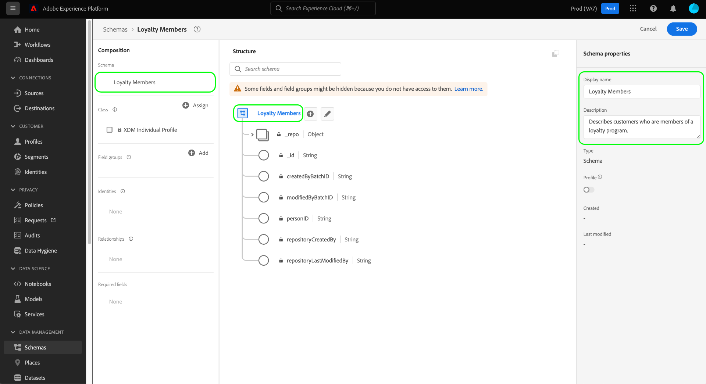

# Créez un schéma à l’aide du [!DNL Schema Editor]

L’interface utilisateur de Adobe Experience Platform vous permet de créer et de gérer des [!DNL Experience Data Model] Schémas (XDM) dans une zone de travail visuelle interactive appelée [!DNL Schema Editor]. Ce tutoriel explique comment créer un schéma à l’aide du [!DNL Schema Editor].

À des fins de démonstration, les étapes de ce tutoriel impliquent la création d’un exemple de schéma qui décrit les membres d’un programme de fidélité des clients. Bien que vous puissiez utiliser ces étapes pour créer un schéma différent à vos propres fins, il est recommandé de suivre d’abord la création de l’exemple de schéma pour découvrir les fonctionnalités de [!DNL Schema Editor].

>[!NOTE]
>
>Si vous ingérez des données CSV dans Platform, vous pouvez [mapper ces données à un schéma XDM créé par des recommandations générées par l’IA](../../ingestion/tutorials/map-csv/recommendations.md) (actuellement en version bêta) sans avoir à créer manuellement le schéma.
>
>Si vous préférez composer un schéma à l’aide de la méthode [!DNL Schema Registry] API, commencez par lire la [[!DNL Schema Registry] guide de développement](../api/getting-started.md) avant de lancer le tutoriel sur [création d’un schéma à l’aide de l’API](create-schema-api.md).

## Prise en main

Ce tutoriel nécessite une compréhension pratique des différents aspects de Adobe Experience Platform impliqués dans la création de schémas. Avant de commencer ce tutoriel, veuillez consulter la documentation relative aux concepts suivants :

* [[!DNL Experience Data Model (XDM)]](../home.md) : cadre normalisé selon lequel [!DNL Platform] organise les données de l’expérience client.
   * [Principes de base de la composition des schémas](../schema/composition.md): Présentation des schémas XDM et de leurs blocs de création, notamment les classes, les groupes de champs de schéma, les types de données et les champs individuels.
* [[!DNL Real-Time Customer Profile]](../../profile/home.md) : fournit un profil de consommateur unifié en temps réel, basé sur des données agrégées provenant de plusieurs sources.

## Ouvrez le [!UICONTROL Schémas] workspace {#browse}

Le [!UICONTROL Schémas] de l’espace de travail [!DNL Platform] L’interface utilisateur d’ offre une visualisation de la [!DNL Schema Library], ce qui vous permet d’afficher la gestion des schémas disponibles pour votre organisation. L’espace de travail comprend également la fonction [!DNL Schema Editor], le canevas sur lequel vous pouvez composer un schéma tout au long de ce tutoriel.

Après vous être connecté à [!DNL Experience Platform], sélectionnez **[!UICONTROL Schémas]** dans le volet de navigation de gauche pour ouvrir la **[!UICONTROL Schémas]** workspace. Le **[!UICONTROL Parcourir]** affiche une liste des schémas (une représentation de la fonction [!DNL Schema Library]) que vous pouvez afficher et personnaliser. La liste comprend le nom, le type, la classe et le comportement (enregistrement ou série chronologique) sur lesquels repose le schéma, ainsi que la date et l’heure de la dernière modification du schéma.

Consultez le guide sur la [exploration des ressources XDM existantes dans l’interface utilisateur](../ui/explore.md) pour plus d’informations.

## Création et attribution d’un nom à un schéma {#create}

Pour commencer à composer un schéma, sélectionnez **[!UICONTROL Créer un schéma]** dans le coin supérieur droit du **[!UICONTROL Schémas]** workspace. Un menu déroulant s’affiche, vous permettant de choisir entre les classes principales. [!UICONTROL XDM Individual Profile] et [!UICONTROL XDM ExperienceEvent]. Si ces classes ne répondent pas à vos besoins, vous pouvez également sélectionner **[!UICONTROL Parcourir]** pour effectuer un choix parmi d’autres classes disponibles ou [créer une classe](#create-new-class).

Pour les besoins de ce tutoriel, sélectionnez **[!UICONTROL XDM Individual Profile]**.

Le [!DNL Schema Editor] apparaît. C’est le canevas sur lequel vous allez composer votre schéma. Un schéma sans titre est automatiquement créé dans la variable **[!UICONTROL Structure]** de la zone de travail lorsque vous arrivez dans l’éditeur, avec les champs standard inclus dans tous les schémas en fonction de cette classe. La classe affectée pour le schéma est également répertoriée sous **[!UICONTROL Classe]** in **[!UICONTROL Composition]** .

>[!NOTE]
>
>Vous pouvez [modifier la classe d’un schéma](#change-class) à tout moment au cours du processus de composition initial avant que le schéma ne soit enregistré, mais cela doit être fait avec la plus grande prudence. Les groupes de champs ne sont compatibles qu’avec certaines classes. Par conséquent, la modification de la classe réinitialise le canevas et les champs que vous avez ajoutés.

Sous **[!UICONTROL Propriétés du schéma]**, indiquez un nom d’affichage et une description facultative du schéma. Une fois qu’un nom est saisi, le canevas se met à jour pour tenir compte du nouveau nom du schéma.

Plusieurs éléments importants doivent être pris en compte lors du choix d’un nom pour votre schéma :

* Les noms des schémas doivent être courts et descriptifs afin que le schéma puisse être facilement retrouvé ultérieurement.
* Le nom d’un schéma doit être unique, ce qui signifie qu’il doit également être suffisamment précis pour ne pas être réutilisé à l’avenir. Par exemple, si votre organisation dispose de programmes de fidélité distincts pour différentes marques, nous vous conseillons de nommer votre schéma « Brand A Loyalty Members » pour faciliter la distinction avec d’autres schémas relatifs à la fidélité que vous pourriez définir ultérieurement.
* Vous pouvez également utiliser la description du schéma pour fournir toute information contextuelle supplémentaire concernant le schéma.

Ce tutoriel compose un schéma pour ingérer des données relatives aux membres d’un programme de fidélité. Par conséquent, le schéma est nommé &quot;[!DNL Loyalty Members]&quot;.

## Ajouter un groupe de champs {#field-group}

Vous pouvez maintenant commencer à ajouter des champs à votre schéma en ajoutant des groupes de champs. Un groupe de champs est un groupe d’un ou de plusieurs champs souvent utilisés conjointement pour décrire un concept particulier. Ce tutoriel utilise des groupes de champs pour décrire les membres du programme de fidélité et recueillir des informations clés telles que le nom, l’anniversaire, le numéro de téléphone, l’adresse, etc.

Pour ajouter un groupe de champs, sélectionnez **[!UICONTROL Ajouter]** dans le **[!UICONTROL Groupes de champs]** sous-section .

Une nouvelle boîte de dialogue s’affiche, affichant une liste des groupes de champs disponibles. Chaque groupe de champs est destiné uniquement à une utilisation avec une classe spécifique. Par conséquent, la boîte de dialogue répertorie uniquement les groupes de champs compatibles avec la classe que vous avez sélectionnée (dans ce cas, la variable [!DNL XDM Individual Profile] ). Si vous utilisez une classe XDM standard, la liste des groupes de champs sera triée intelligemment en fonction de la popularité de l’utilisation.

Vous pouvez sélectionner l’un des filtres dans le rail de gauche pour réduire la liste des groupes de champs standard à des [industries](../schema/industries/overview.md) comme la vente au détail, les services financiers et la santé.

Si vous sélectionnez un groupe de champs dans la liste, il s’affiche dans le rail de droite. Vous pouvez sélectionner plusieurs groupes de champs si vous le souhaitez, en ajoutant chacun d’eux à la liste dans le rail de droite avant de le confirmer. En outre, une icône s’affiche sur le côté droit du groupe de champs actuellement sélectionné, ce qui vous permet de prévisualiser la structure des champs qu’il fournit.

Lors de la prévisualisation d’un groupe de champs, une description détaillée du schéma du groupe de champs est fournie dans le rail droit. Vous pouvez également parcourir les champs du groupe de champs dans la zone de travail fournie. Lorsque vous sélectionnez différents champs, le rail de droite se met à jour pour afficher les détails du champ en question. Sélectionner **[!UICONTROL Précédent]** lorsque vous avez terminé la prévisualisation, revenez à la boîte de dialogue de sélection du groupe de champs.

Pour ce tutoriel, sélectionnez la variable **[!UICONTROL Détails démographiques]** groupe de champs, puis sélectionnez **[!UICONTROL Ajouter un groupe de champs]**.

Le canevas du schéma réapparaît. Le **[!UICONTROL Groupes de champs]** La section répertorie désormais &quot;[!UICONTROL Détails démographiques]&quot; et la variable **[!UICONTROL Structure]** inclut les champs fournis par le groupe de champs. Vous pouvez sélectionner le nom du groupe de champs sous le champ **[!UICONTROL Groupes de champs]** pour mettre en surbrillance les champs spécifiques qu’il fournit dans la zone de travail.

Ce groupe de champs met à disposition plusieurs champs sous le nom de niveau supérieur. `person` avec le type de données &quot;[!UICONTROL Personne]&quot;. Ce groupe de champs décrit les informations sur un individu, notamment son nom, sa date de naissance et son genre.

>[!NOTE]
>
>N’oubliez pas que les champs peuvent utiliser des types scalaires (chaîne, entier, tableau ou date, par exemple), ainsi que tout type de données (un groupe de champs représentant un concept commun) défini dans la variable [!DNL Schema Registry].

Notez que la variable `name` a un type de données &quot;[!UICONTROL Nom complet]&quot;, ce qui signifie qu’il décrit également un concept commun et contient des sous-champs liés au nom, tels que le prénom, le nom, le titre de politesse et le suffixe.

Sélectionnez les différents champs de la zone de travail pour afficher les champs supplémentaires qui contribuent à la structure du schéma.

## Ajouter d’autres groupes de champs {#field-group-2}

Vous pouvez maintenant répéter les mêmes étapes pour ajouter un autre groupe de champs. Lorsque vous affichez la variable **[!UICONTROL Ajouter un groupe de champs]** cette fois, notez que le[!UICONTROL Détails démographiques]&quot;a été grisé et la case à cocher à côté ne peut pas être sélectionnée. Cela vous évite de dupliquer accidentellement des groupes de champs que vous avez déjà inclus dans le schéma actuel.

Pour ce tutoriel, sélectionnez les groupes de champs standard. **[!UICONTROL Détails du contact personnel]** et **[!UICONTROL Détails de fidélité]** dans la liste, puis sélectionnez **[!UICONTROL Ajouter des groupes de champs]** pour les ajouter au schéma.

Le canevas réapparaît avec les groupes de champs ajoutés sous **[!UICONTROL Groupes de champs]** dans le **[!UICONTROL Composition]** et leurs champs composites ajoutés à la structure du schéma.

## Définition d’un groupe de champs personnalisé {#define-field-group}

Le [!UICONTROL Loyalty Members] est destiné à capturer des données relatives aux membres d’un programme de fidélité, ainsi que la variable [!UICONTROL Détails de fidélité] le groupe de champs que vous avez ajouté au schéma fournit la plupart de ces informations, notamment le type de programme, les points, la date de jointure, etc.

Cependant, il peut arriver que vous souhaitiez inclure d’autres champs personnalisés non couverts par des groupes de champs standard afin d’atteindre vos cas d’utilisation. Dans le cas de l’ajout de champs de fidélité personnalisés, vous disposez de deux options :

1. Créez un groupe de champs personnalisé pour capturer ces champs. Il s’agit de la méthode qui sera abordée dans ce tutoriel.
1. Étendre la norme [!UICONTROL Détails de fidélité] groupe de champs avec des champs personnalisés. Cette cause [!UICONTROL Détails de fidélité] pour être converti en groupe de champs personnalisé et le groupe de champs standard d’origine ne sera plus disponible. Voir [!UICONTROL Schémas] Guide de l’interface utilisateur pour plus d’informations sur [l’ajout de champs personnalisés à la structure des groupes de champs standard ;](../ui/resources/schemas.md#custom-fields-for-standard-groups).

Pour créer un groupe de champs, sélectionnez **[!UICONTROL Ajouter]** dans le **[!UICONTROL Groupes de champs]** sous-section comme avant, mais cette fois, sélectionnez **[!UICONTROL Créer un groupe de champs]** près de la partie supérieure de la boîte de dialogue qui s’affiche. Vous êtes alors invité à fournir un nom d’affichage et une description pour le nouveau groupe de champs. Pour ce tutoriel, nommez le nouveau groupe de champs &quot;[!DNL Custom Loyalty Details]&quot;, puis sélectionnez **[!UICONTROL Ajouter des groupes de champs]**.

>[!NOTE]
>
>Comme pour les noms de classe, le nom du groupe de champs doit être court et simple, décrivant ce que le groupe de champs va apporter au schéma. Ces noms sont également uniques. Vous ne pourrez donc pas réutiliser le nom et devrez donc veiller à ce qu’il soit suffisamment spécifique.

&quot;[!DNL Custom Loyalty Details]&quot; devrait maintenant apparaître sous **[!UICONTROL Groupes de champs]** sur le côté gauche du canevas, mais aucun champ n’y est encore associé et, par conséquent, aucun nouveau champ n’apparaît sous **[!UICONTROL Structure]**.

## Ajouter des champs au groupe de champs {#field-group-fields}

Maintenant que vous avez créé le[!DNL Custom Loyalty Details]&quot;groupe de champs, il est temps de définir les champs que le groupe de champs va contribuer au schéma.

Pour commencer, sélectionnez l’option **plus (+)** en regard du nom du schéma dans la zone de travail.

Un &quot;[!UICONTROL Champ sans titre]&quot;espace réservé apparaît dans la zone de travail, et le rail de droite se met à jour pour afficher les options de configuration du champ.

Dans ce scénario, le schéma doit comporter un champ de type objet qui décrit en détail le niveau de fidélité actuel de la personne. À l’aide des commandes du rail de droite, commencez à créer une `loyaltyTier` champ de type &quot;[!UICONTROL Objet]&quot; qui sera utilisé pour contenir vos champs associés.

Sous **[!UICONTROL Attribuer à]**, vous devez sélectionner un groupe de champs auquel affecter le champ. N’oubliez pas que tous les champs de schéma appartiennent à une classe ou à un groupe de champs. Comme ce schéma utilise une classe standard, votre seule option est de sélectionner un groupe de champs. Commencez à saisir le nom &quot;[!DNL Custom Loyalty Details]&quot;, puis sélectionnez le groupe de champs dans la liste.

Lorsque vous avez terminé, sélectionnez **[!UICONTROL Appliquer]**.

Les modifications sont appliquées et le `loyaltyTier` s’affiche. Puisqu’il s’agit d’un champ personnalisé, il est automatiquement imbriqué dans un espace de noms d’objet associé à l’identifiant du client de votre entreprise, précédé d’un trait de soulignement (`_tenantId` dans cet exemple).

>[!NOTE]
>
>La présence de l’objet d’identifiant du client indique que les champs que vous ajoutez sont contenus dans l’espace de noms de votre organisation.
>
>En d’autres termes, les champs que vous ajoutez sont propres à votre organisation et vont être enregistrés dans la variable [!DNL Schema Registry] dans une zone spécifique accessible uniquement à votre entreprise. Les champs que vous définissez doivent toujours être ajoutés à votre espace de noms client pour empêcher les collisions avec des noms provenant d’autres classes, groupes de champs, types de données et champs standard.

Sélectionnez la **plus (+)** en regard de l’icône `loyaltyTier` pour commencer à ajouter des sous-champs. Un nouvel espace réservé de champ s’affiche et la variable **[!UICONTROL Propriétés du champ]** est visible sur le côté droit de la zone de travail.

Chaque champ nécessite les informations suivantes :

* **[!UICONTROL Nom du champ]:** Nom du champ, écrit en majuscules. Exemple : loyaltyLevel
* **[!UICONTROL Nom d’affichage]:** Nom du champ, écrit en majuscules de titre. Exemple : Loyalty Level
* **[!UICONTROL Type]:** Type de données du champ. Cela inclut les types scalaires de base et tous les types de données définis dans la variable [!DNL Schema Registry]. Exemples : [!UICONTROL Chaîne], [!UICONTROL Entier], [!UICONTROL Booléen], [!UICONTROL Personne], [!UICONTROL Adresse], [!UICONTROL Numéro de téléphone], etc.
* **[!UICONTROL Description]:** Une description facultative du champ doit être incluse avec un maximum de 200 caractères.

Le premier champ de la variable `loyaltyTier` sera une chaîne appelée `id`, représentant l’identifiant du niveau actuel du membre de fidélité. L’identifiant de niveau sera unique pour chaque membre du programme de fidélité, car cette entreprise définit différents seuils de point de niveau de fidélité pour chaque client en fonction de différents facteurs. Définissez le type du nouveau champ sur &quot;[!UICONTROL Chaîne]&quot;, et la variable **[!UICONTROL Propriétés du champ]** est renseignée avec plusieurs options permettant d’appliquer des contraintes, notamment la valeur par défaut, le format et la longueur maximale.

Depuis `id` est une chaîne à structure libre générée de manière aléatoire, aucune autre contrainte n’est nécessaire. Sélectionnez **[!UICONTROL Appliquer]** pour appliquer vos modifications.

## Ajouter d’autres champs au groupe de champs {#field-group-fields-2}

Maintenant que vous avez ajouté la variable `id` vous pouvez ajouter des champs supplémentaires pour capturer les informations du niveau de fidélité, telles que :

* Seuil de point actuel (entier) : Nombre minimum de points de fidélité que le membre doit conserver pour rester dans le niveau actuel.
* Seuil de point de niveau suivant (entier) : Nombre de points de fidélité que le membre doit acquérir pour passer au niveau supérieur.
* Date d’entrée en vigueur (date et heure) : Date à laquelle le membre du programme de fidélité a rejoint ce niveau.

Pour ajouter chaque champ au schéma, sélectionnez l’option **plus (+)** en regard de l’icône `loyalty` et renseignez les informations requises.

Une fois l’opération terminée, la variable `loyaltyTier` contient des champs pour `id`, `currentThreshold`, `nextThreshold`, et `effectiveDate`.

## Ajouter un champ d’énumération au groupe de champs {#enum}

Lors de la définition de champs dans la variable [!DNL Schema Editor], vous pouvez appliquer d’autres options aux types de champ de base afin de fournir des contraintes supplémentaires sur les données que le champ peut contenir. Les cas d’utilisation de ces contraintes sont expliqués dans le tableau suivant :

| Contrainte | Description |
| --- | --- |
| [!UICONTROL Obligatoire] | Indique que le champ est requis pour l’ingestion des données. Toute donnée chargée dans un ensemble de données basé sur ce schéma qui ne contient pas ce champ sera défaillante lors de l’ingestion. |
| [!UICONTROL Tableau] | Indique que le champ contient un tableau de valeurs, chacune avec le type de données spécifié. Par exemple, l’utilisation de cette contrainte sur un champ avec un type de données &quot;[!UICONTROL Chaîne]&quot; indique que le champ contiendra un tableau de chaînes. |
| [!UICONTROL Énumération et valeurs proposées] | Une énumération indique que ce champ doit contenir l&#39;une des valeurs d&#39;une liste énumérée de valeurs possibles. Vous pouvez également utiliser cette option pour fournir une liste des valeurs suggérées pour un champ de chaîne sans contraindre le champ à ces valeurs. |
| [!UICONTROL Identité] | Indique que ce champ est un champ d’identité. Vous trouverez plus d’informations sur les champs d’identité [dans la suite de ce tutoriel](#identity-field). |
| [!UICONTROL Relation] | Bien que les relations de schéma puissent être déduites par l’utilisation du schéma d’union et [!DNL Real-Time Customer Profile], cela s’applique uniquement aux schémas qui partagent la même classe. Le [!UICONTROL Relation] La contrainte indique que ce champ fait référence à l’identité Principale d’un schéma basée sur une classe différente, ce qui implique une relation entre les deux schémas. Voir le tutoriel sur [définition d’une relation](./relationship-ui.md) pour plus d’informations. |

{style=&quot;table-layout:auto&quot;}

>[!NOTE]
>
>Tous les champs obligatoires, d’identité ou de relation sont répertoriés dans leurs sections respectives du rail de gauche, ce qui vous permet de localiser facilement ces champs, quelle que soit la complexité du schéma.

Pour ce tutoriel, la variable `loyaltyTier` dans le schéma nécessite un nouveau champ enum qui décrit la classe de niveau, où la valeur ne peut être que l’une des quatre options possibles. Pour ajouter ce champ au schéma, sélectionnez l’option **plus (+)** en regard de l’icône `loyaltyTier` et remplissez les champs requis pour **[!UICONTROL Nom du champ]** et **[!UICONTROL Nom d’affichage]**. Pour **[!UICONTROL Type]**, sélectionnez &quot;[!UICONTROL Chaîne]&quot;.

D’autres cases à cocher s’affichent pour le champ une fois son type sélectionné, y compris les cases à cocher pour **[!UICONTROL Tableau]**, **[!UICONTROL Énumération et valeurs proposées]**, **[!UICONTROL Identité]**, et **[!UICONTROL Relation]**.

Sélectionnez la **[!UICONTROL Énumération et valeurs proposées]** , puis sélectionnez **[!UICONTROL Enum]**. Vous pouvez y saisir la variable **[!UICONTROL Valeur]** (en CamelCase) et **[!UICONTROL Nom d’affichage]** (nom facultatif et facile à lire en Casse Titre) pour chaque classe de niveau de fidélité acceptable.

Une fois toutes les propriétés de champ renseignées, sélectionnez **[!UICONTROL Appliquer]** pour ajouter la variable `tierClass` au champ `loyaltyTier` .

## Conversion d’un objet à plusieurs champs en un type de données {#datatype}

Le `loyaltyTier` contient désormais plusieurs champs et représente une structure de données commune qui peut s’avérer utile dans d’autres schémas. Le [!DNL Schema Editor] permet d’appliquer facilement des objets à champs multiples réutilisables en convertissant la structure de ces objets en types de données.

Les types de données permettent l’utilisation cohérente de structures à champs multiples et offrent plus de flexibilité qu’un groupe de champs, car ils peuvent être utilisés n’importe où dans un schéma. Pour ce faire, définissez la variable **[!UICONTROL Type]** à celle de tout type de données défini dans la variable [!DNL Schema Registry].

Pour convertir la variable `loyaltyTier` pour un type de données, sélectionnez l’objet `loyaltyTier` dans la zone de travail, puis sélectionnez **[!UICONTROL Convertir en nouveau type de données]** sur le côté droit de l’éditeur sous **[!UICONTROL Propriétés du champ]**.

Une notification s’affiche, confirmant que la conversion de l’objet a réussi. Dans la zone de travail, vous pouvez maintenant voir que la variable `loyaltyTier` comporte désormais une icône de lien et le rail droit indique qu’il possède un type de données &quot;[!DNL Loyalty Tier]&quot;.

Dans un prochain schéma, vous pourrez désormais attribuer un champ sous la forme &quot;[!DNL Loyalty Tier]&quot;type et inclurait automatiquement des champs pour l’ID, la classe de niveau, les seuils de point et la date d’entrée en vigueur.

>[!NOTE]
>
>Vous pouvez également créer et modifier des types de données personnalisés indépendamment de la modification des schémas. Consultez le guide sur la [création et modification des types de données](../ui/resources/data-types.md) pour plus d’informations.

## Recherche et filtrage des champs de schéma

Votre schéma contient désormais plusieurs groupes de champs en plus des champs fournis par sa classe de base. Lorsque vous utilisez des schémas plus volumineux, vous pouvez cocher les cases en regard des noms des groupes de champs dans le rail de gauche pour filtrer les champs affichés uniquement par rapport aux groupes de champs qui vous intéressent.

Si vous recherchez un champ spécifique dans votre schéma, vous pouvez également utiliser la barre de recherche pour filtrer les champs affichés par nom, quel que soit le groupe de champs sous lequel ils sont fournis.

>[!IMPORTANT]
>
>La fonction de recherche prend en compte les filtres de groupe de champs sélectionnés lors de l’affichage des champs correspondants. Si une requête de recherche n’affiche pas les résultats attendus, vous devrez peut-être vérifier deux fois que vous ne filtrez aucun groupe de champs approprié.

## Définition d’un champ de schéma comme champ d’identité {#identity-field}

La structure de données standard fournie par les schémas peut être utilisée pour identifier les données appartenant à la même personne sur plusieurs sources, ce qui permet d’utiliser divers cas d’utilisation en aval, tels que la segmentation, la création de rapports, l’analyse de la science des données, etc. Pour regrouper des données en fonction d’identités individuelles, les champs clés doivent être marqués comme [!UICONTROL Identité] dans les schémas applicables.

[!DNL Experience Platform] permet de désigner facilement un champ d’identité à l’aide d’une **[!UICONTROL Identité]** dans la [!DNL Schema Editor]. Cependant, vous devez déterminer quel champ est le meilleur candidat à utiliser comme identité, en fonction de la nature de vos données.

Par exemple, il peut y avoir des milliers de membres du programme de fidélité appartenant au même niveau de fidélité, et plusieurs peuvent partager la même adresse physique. Dans ce scénario, cependant, lors de l’inscription, chaque membre du programme de fidélité fournit son adresse électronique personnelle. Puisque les adresses électroniques personnelles sont généralement gérées par une seule personne, le champ `personalEmail.address` (fourni par la variable [!UICONTROL Détails du contact personnel] groupe de champs) est un bon candidat pour un champ d’identité.

>[!IMPORTANT]
>
>Les étapes décrites ci-dessous expliquent comment ajouter un descripteur d’identité à un champ de schéma existant. Au lieu de définir des champs d’identité dans la structure du schéma lui-même, vous pouvez également utiliser une `identityMap` pour contenir des informations d’identité.
>
>Si vous envisagez d’utiliser `identityMap`, gardez à l’esprit qu’il remplacera toute identité Principale que vous ajoutez directement au schéma. Voir la section sur `identityMap` dans le [principes de base du guide de composition de schémas](../schema/composition.md#identityMap) pour plus d’informations.

Sélectionnez la `personalEmail.address` dans la zone de travail, et la variable **[!UICONTROL Identité]** la case à cocher apparaît sous **[!UICONTROL Propriétés du champ]**. Cochez la case et sélectionnez l’option permettant de définir cette valeur comme **[!UICONTROL Identité Principal]** apparaît. Cochez également cette case.

>[!NOTE]
>
>Chaque schéma ne peut contenir qu’un seul champ d’identité principal. Une fois qu’un champ de schéma a été défini comme identité Principale, vous recevrez un message d’erreur si vous tentez par la suite de définir un autre champ d’identité dans le schéma comme Principal.

Ensuite, vous devez fournir un **[!UICONTROL Espace de noms d’identité]** dans la liste des espaces de noms prédéfinis dans la liste déroulante. Puisque ce champ correspond à l’adresse électronique du client, sélectionnez &quot;[!UICONTROL Email]&quot; dans la liste déroulante. Sélectionner **[!UICONTROL Appliquer]** pour confirmer les mises à jour de la variable `personalEmail.address` champ .

>[!NOTE]
>
>Pour obtenir la liste des espaces de noms standard et leurs définitions, voir [[!DNL Identity Service] documentation](../../identity-service/troubleshooting-guide.md#standard-namespaces).

Après application de la modification, l’icône pour `personalEmail.address` affiche un symbole d’empreinte digitale, indiquant qu’il s’agit désormais d’un champ d’identité. Le champ est également répertorié dans le rail de gauche sous **[!UICONTROL Identités]**.

Désormais, toutes les données ingérées dans la variable `personalEmail.address` sera utilisé pour aider à identifier cet individu et à assembler une vue unique de ce client. Pour en savoir plus sur l’utilisation des identités dans [!DNL Experience Platform], veuillez consulter la section [[!DNL Identity Service]](../../identity-service/home.md) documentation.

## Activation du schéma à utiliser dans [!DNL Real-Time Customer Profile] {#profile}

[[!DNL Real-Time Customer Profile]](../../profile/home.md) tire parti des données d’identité dans [!DNL Experience Platform] afin de fournir une vue d’ensemble de chaque client. Le service crée des profils robustes de 360° d’attributs du client, ainsi que des comptes horodatés de chaque interaction que les clients ont eue avec n’importe quel système intégré à [!DNL Experience Platform].

Pour qu’un schéma puisse être utilisé avec [!DNL Real-Time Customer Profile], une identité Principale doit être définie pour celui-ci. Vous recevrez un message d’erreur si vous tentez d’activer un schéma sans d’abord définir une identité Principale.

Pour activer le schéma &quot;Loyalty Members&quot; à utiliser dans [!DNL Profile], commencez par sélectionner le titre du schéma dans la zone de travail.

Sur le côté droit de l’éditeur, des informations sur le schéma sont affichées, notamment son nom d’affichage, sa description et son type. Outre ces informations, il existe une **[!UICONTROL Profil]** bouton bascule .

Sélectionner **[!UICONTROL Profil]** et une fenêtre contextuelle s’affiche, vous demandant de confirmer que vous souhaitez activer le schéma pour [!DNL Profile].

>[!WARNING]
>
>Une fois qu’un schéma a été activé pour [!DNL Real-Time Customer Profile] et enregistré, il ne peut pas être désactivé.

Sélectionner **[!UICONTROL Activer]** pour confirmer votre choix. Vous pouvez sélectionner la variable **[!UICONTROL Profil]** basculez à nouveau pour désactiver le schéma si vous le souhaitez, mais une fois le schéma enregistré pendant [!DNL Profile] est activée, elle ne peut plus être désactivée.

## Étapes suivantes et ressources supplémentaires

Maintenant que vous avez fini de composer le schéma, vous pouvez voir le schéma complet dans la zone de travail. Sélectionner **[!UICONTROL Enregistrer]** et le schéma sera enregistré dans la variable [!DNL Schema Library], en le rendant accessible par le [!DNL Schema Registry].

Votre nouveau schéma peut maintenant être utilisé pour ingérer des données dans [!DNL Platform]. Pour rappel, une fois que le schéma a été utilisé pour ingérer des données, seules des modifications additives peuvent être apportées. Reportez-vous aux [principes de base de la composition des schémas](../schema/composition.md) pour plus d’informations sur le contrôle de version des schémas.

Vous pouvez maintenant suivre le tutoriel sur [définition d’une relation de schéma dans l’interface utilisateur](./relationship-ui.md) pour ajouter un nouveau champ de relation au schéma &quot;Loyalty Members&quot;.

Le schéma &quot;Loyalty Members&quot; peut également être visualisé et géré à l’aide de la variable [!DNL Schema Registry] API. Pour commencer à utiliser l’API, lisez d’abord le [[!DNL Schema Registry API] guide de développement](../api/getting-started.md).

### Ressources vidéo

>[!WARNING]
>
>Le [!DNL Platform] L’interface utilisateur affichée dans les vidéos suivantes est obsolète. Consultez la documentation pour découvrir les dernières captures dʼécran et fonctionnalités de lʼinterface utilisateur.

La vidéo suivante montre comment créer un schéma simple dans le [!DNL Platform] Interface utilisateur.

>[!VIDEO](https://video.tv.adobe.com/v/27012?quality=12&learn=on)

La vidéo suivante est destinée à vous aider à mieux comprendre l’utilisation des groupes et classes de terrain.

>[!VIDEO](https://video.tv.adobe.com/v/27013?quality=12&learn=on)

## Annexe

Les sections suivantes apportent des informations supplémentaires sur l’utilisation de la variable [!DNL Schema Editor].

### Création d’une nouvelle classe {#create-new-class}

[!DNL Experience Platform] offre la possibilité de définir un schéma basé sur une classe propre à votre organisation. Pour savoir comment créer une classe, consultez le guide sur [création et modification de classes dans l’interface utilisateur](../ui/resources/classes.md#create).

### Modification de la classe d’un schéma {#change-class}

Vous pouvez modifier la classe d’un schéma à tout moment pendant le processus de composition initial avant l’enregistrement du schéma.

>[!WARNING]
>
>La réattribution de la classe pour un schéma doit être effectuée avec une extrême prudence. Les groupes de champs ne sont compatibles qu’avec certaines classes. Par conséquent, la modification de la classe réinitialise le canevas et les champs que vous avez ajoutés.

Pour savoir comment modifier la classe d’un schéma, consultez le guide sur [gestion des schémas dans l’interface utilisateur](../ui/resources/schemas.md#change-class).
