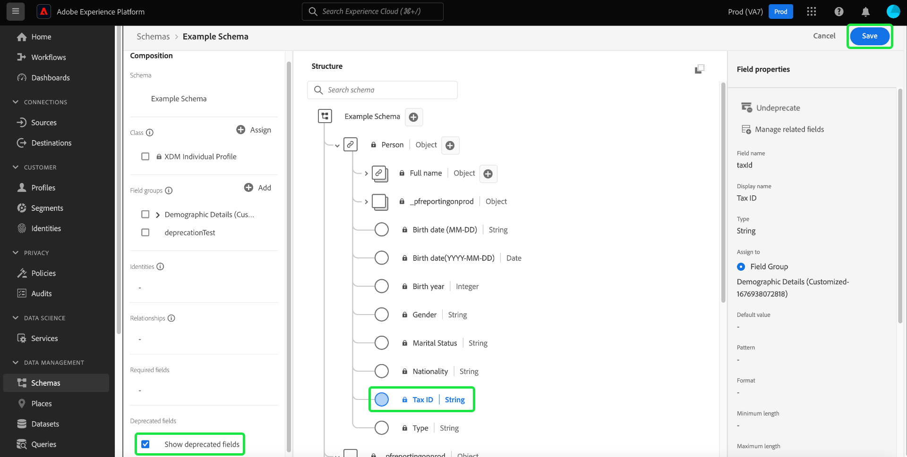

# Rendre obsolète un champ XDM dans l’IU

Le modèle de données d’expérience (XDM) vous offre la possibilité de gérer votre modèle de données en fonction des besoins de votre entreprise en rendant obsolètes les champs de schéma une fois les données ingérées. Les champs superflus peuvent être rendus obsolètes. Ils seront alors supprimés de l’affichage de l’IU et masqués des IU en aval. Pour votre confort, une case à cocher dans l’éditeur de schémas permet d’afficher les champs obsolètes et, le cas échéant, d’annuler l’obsolescence.

Comme les champs obsolètes sont masqués de l’IU par défaut, cela simplifie votre schéma dans l’éditeur de schémas et empêche l’ajout de champs non souhaités aux dépendances en aval telles que le créateur de segments, le concepteur de parcours, etc. L’obsolescence des champs est également rétrocompatible. Les autres systèmes qui utilisent les champs obsolètes, tels que les audiences et les requêtes, continueront à les évaluer comme prévu. Un champ obsolète utilisé dans une audience existante garde toute sa validité : le champ s’affiche comme prévu dans la zone de travail du créateur de segments et il est évalué en fonction des données disponibles dans les champs obsolètes. Il s’agit d’un changement sans rupture qui n’a aucune incidence négative sur les flux de données existants.

>[!NOTE]
>
>Avant l’ingestion des données dans un schéma, vous pouvez supprimer les groupes de champs inutiles. Pour plus d’informations, consultez la documentation suivante : [Supprimer un groupe de champs d’un schéma](../ui/resources/schemas.md#remove-fields).

Une fois les données ingérées dans votre schéma, vous ne pouvez plus supprimer les champs du schéma sans introduire de changement avec rupture. Dans ce cas, vous pouvez rendre obsolète un champ inutile d’un schéma ou d’une ressource personnalisée à l’aide de l’[éditeur de schémas](./create-schema-ui.md) ou de l’[API Schema Registry](https://developer.adobe.com/experience-platform-apis/references/schema-registry/).

Dans cette documentation, vous allez apprendre à rendre obsolètes les champs de différentes ressources XDM à l’aide de l’éditeur de schémas dans l’IU d’Experience Platform. Pour rendre obsolète un champ XDM à l’aide de l’API, suivez les étapes du tutoriel [Rendre obsolète un champ XDM à l’aide de l’API Schema Registry](./field-deprecation-api.md).

## Rendre obsolète un champ {#deprecate}

Pour rendre obsolète un champ personnalisé, accédez à l’éditeur de schémas du schéma à modifier. Dans la section [!UICONTROL Structure] de la zone de travail, sélectionnez le champ que vous souhaitez rendre obsolète, puis cliquez sur **[!UICONTROL Rendre obsolète]** dans les [!UICONTROL Propriétés du champ].

Une boîte de dialogue s’affiche pour confirmer vos choix et vous informer que le champ sera supprimé de l’affichage de l’IU du schéma d’union et masqué des IU en aval. Pour acter l’obsolescence, cliquez sur **[!UICONTROL Confirmer]**.

Le champ est maintenant supprimé de l’affichage de l’IU.

>[!NOTE]
>
>Une fois obsolètes, les IU en aval telles que les tableaux de bord de segmentation, Customer Journey Analytics et Adobe Journey Optimizer n’affichent plus les champs obsolètes dans le cadre de leur workflow. Toutefois, les IU en aval ont la possibilité d’afficher les champs obsolètes si nécessaire et de continuer à les traiter normalement. Pour plus d’informations, consultez les documentations respectives. Les requêtes et les audiences qui utilisent le champ obsolète continueront à s’exécuter comme prévu.

## Afficher les champs obsolètes {#show-deprecated}

Pour afficher les champs précédemment rendus obsolètes, accédez au schéma approprié dans l’éditeur de schémas. Dans la section [!UICONTROL Composition] de la zone de travail, cochez la case **[!UICONTROL Afficher les champs obsolètes]**.

Le champ obsolète s’affiche désormais dans l’affichage de l’IU. Cliquez sur **[!UICONTROL Enregistrer]** pour confirmer les paramètres.

## Annuler l’obsolescence des champs {#undeprecate-fields}

Pour annuler l’obsolescence d’un champ, procédez comme suit : [affichez le champ obsolète](#show-deprecated) comme décrit ci-dessus, puis sélectionnez le champ obsolète dans la section [!UICONTROL Structure] de l’éditeur. Sélectionnez ensuite **[!UICONTROL Annuler l’obsolescence]** dans la barre latérale [!UICONTROL Propriétés du champ], puis cliquez sur **[!UICONTROL Enregistrer]**.

La boîte de dialogue [!UICONTROL Annuler l’obsolescence du champ] s’affiche. Pour confirmer les modifications, cliquez sur **[!UICONTROL Confirmer]**.

![La boîte de dialogue [!UICONTROL Annuler l’obsolescence du champ] avec l’option Confirmer mise en surbrillance.](../images/tutorials/field-deprecation/undeprecate-field-dialog.png)

Le champ s’affiche désormais de manière standard dans l’affichage de l’IU et dans les IU en aval. Vous avez à présent la possibilité de rendre le champ obsolète à nouveau.

## Étapes suivantes

Dans ce document, vous avez appris à rendre obsolètes les champs XDM à l’aide de l’IU de l’éditeur de schémas. Pour plus d’informations sur la configuration des champs pour les ressources personnalisées, consultez le guide sur la [définition des champs XDM dans l’API](./custom-fields-api.md). Pour plus d’informations sur la gestion des descripteurs, consultez le [guide de point d’entrée des descripteurs](../api/descriptors.md).
