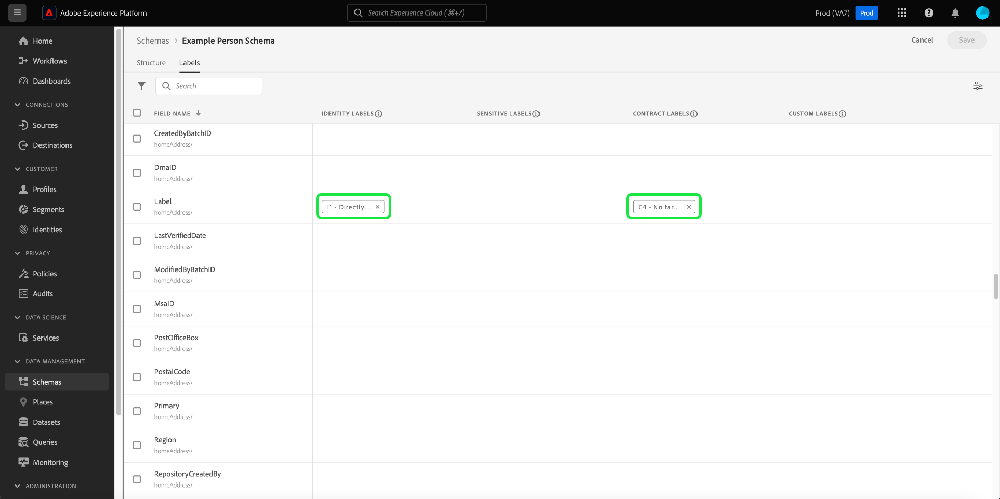

# Gérer les libellés d’utilisation des données pour un schéma

Toutes les données introduites dans Adobe Experience Platform sont contraintes par des schémas de modèle de données d’expérience (XDM). Ces données peuvent être soumises à des restrictions d’utilisation définies par votre organisation ou par des réglementations juridiques. Pour en tenir compte, Experience Platform vous permet de restreindre l’utilisation de certains jeux de données et champs à l’aide de [libellés d’utilisation des données](../../data-governance/labels/overview.md).

Un libellé appliqué à un champ de schéma indique les politiques d’utilisation qui s’appliquent aux données contenues dans ce champ spécifique.

Les libellés peuvent être appliqués à des schémas individuels et aux champs de ces schémas. Lorsque des libellés sont appliqués directement à un schéma, ils sont propagés à tous les jeux de données existants et futurs basés sur ce schéma.

En outre, tout libellé de champ que vous ajoutez dans un schéma se propage à tous les autres schémas qui utilisent le même champ à partir d’une classe ou d’un groupe de champs partagé. Cela permet de s’assurer que les règles d’utilisation de champs similaires sont cohérentes dans l’ensemble de votre modèle de données.

Ce tutoriel décrit les étapes à suivre pour ajouter des libellés à un schéma à l’aide de l’éditeur de schémas de l’interface utilisateur d’Experience Platform.

## Prise en main

Ce guide nécessite une compréhension professionnelle des composants suivants d’Adobe Experience Platform :

* [[!DNL Experience Data Model (XDM) System]](../home.md) : cadre normalisé selon lequel [!DNL Experience Platform] organise les données de l’expérience client.
   * [Éditeur de schémas](../ui/overview.md) : découvrez comment créer et gérer des schémas et d’autres ressources dans l’interface utilisateur d’Experience Platform.
* [[!DNL Adobe Experience Platform Data Governance]](../../data-governance/home.md) : fournit l’infrastructure permettant d’appliquer des restrictions d’utilisation des données aux opérations Experience Platform, à l’aide de politiques définissant les actions marketing qui peuvent (ou ne peuvent pas) être effectuées sur des données libellées.

## Sélectionner un schéma ou un champ auquel ajouter des libellés {#select-schema-field}

>[!CONTEXTUALHELP]
>id="platform_schemas_editgovernancelabels"
>title="Modifier les libellés de gouvernance"
>abstract="Appliquez un libellé à un champ de schéma pour indiquer les stratégies d&#39;utilisation qui s&#39;appliquent aux données contenues dans ce champ."

Pour commencer à ajouter des libellés, vous devez d’abord [sélectionner un schéma existant à modifier](../ui/resources/schemas.md#edit) ou [créer un schéma](../ui/resources/schemas.md#create) pour afficher sa structure dans l’éditeur de schémas.

Pour modifier les libellés d’un champ individuel, vous pouvez sélectionner le champ dans la zone de travail, puis sélectionner **[!UICONTROL Manage access]** dans le rail de droite.

>[!IMPORTANT]
>
>300 libellés au maximum peuvent être appliqués à n’importe quel schéma.

Vous pouvez également sélectionner l’onglet **[!UICONTROL Labels]** , choisir le champ de votre choix dans la liste, puis sélectionner **[!UICONTROL Apply Access and Data Governance Labels]** dans le rail de droite.

![Sélectionnez un champ dans l’onglet [!UICONTROL Labels]](../images/tutorials/labels/select-field-on-labels-tab.png)

Pour modifier les libellés de l’ensemble du schéma, dans l’onglet **[!UICONTROL Labels]** , cochez la case située sous l’icône de filtre. Cela sélectionne tous les champs disponibles dans le schéma. Sélectionnez ensuite **[!UICONTROL Apply Access and Data Governance Labels]** dans le rail de droite.

![Sélectionnez le nom du schéma dans l’onglet [!UICONTROL Labels] &#x200B;](../images/tutorials/labels/select-schema-on-labels-tab.png)

>[!NOTE]
>
>Un message d’exclusion de responsabilité s’affiche lorsque vous tentez de modifier les libellés d’un schéma ou d’un champ pour la première fois, expliquant comment l’utilisation des libellés affecte les opérations en aval en fonction des politiques de votre entreprise. Sélectionnez **[!UICONTROL Proceed]** pour continuer la modification.
>
>

## Modifier les libellés du schéma ou du champ {#edit-labels}

Une boîte de dialogue s’affiche, vous permettant de modifier les libellés du champ sélectionné. Si vous avez sélectionné un champ de type objet individuel, le rail de droite répertorie les sous-champs auxquels les libellés appliqués se propageront.

>[!NOTE]
>
>Si vous modifiez les champs de l’ensemble du schéma, le rail de droite ne répertorie pas les champs applicables et affiche le nom du schéma à la place.

Utilisez la liste affichée pour sélectionner les libellés que vous souhaitez ajouter au schéma ou au champ. Lorsque des libellés sont sélectionnés, la section **[!UICONTROL Applied labels]** se met à jour pour afficher les libellés qui ont été sélectionnés jusqu’à présent.

Pour filtrer les libellés affichés par type, sélectionnez la catégorie de votre choix dans le rail de gauche. Pour créer un libellé personnalisé, sélectionnez **[!UICONTROL Create label]**.

Une fois que les libellés de votre choix vous conviennent, sélectionnez **[!UICONTROL Save]** pour les appliquer au champ ou au schéma.

L’onglet **[!UICONTROL Labels]** réapparaît, affichant les libellés appliqués pour le schéma.

## Étapes suivantes

Ce guide explique comment gérer les libellés d’utilisation des données pour les schémas et les champs. Pour plus d’informations sur la gestion des libellés d’utilisation des données, y compris sur la manière de les ajouter à des jeux de données spécifiques plutôt qu’au niveau du schéma, consultez le [guide de l’interface utilisateur des libellés d’utilisation des données](../../data-governance/labels/user-guide.md).
