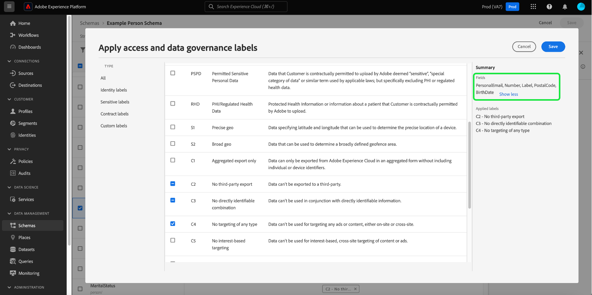

# Gestion des libellés d’utilisation des données pour un schéma

>[!IMPORTANT]
>
>L’étiquetage basé sur les schémas fait partie de [contrôle d’accès basé sur les attributs](../../access-control/abac/overview.md), actuellement disponible dans une version limitée pour les clients de santé basés aux États-Unis. Cette fonctionnalité sera disponible pour tous les clients Real-time Customer Data Platform une fois qu’elle sera entièrement publiée.

Toutes les données introduites dans Adobe Experience Platform sont contraintes par les schémas du modèle de données d’expérience (XDM). Ces données peuvent être soumises à des restrictions d’utilisation définies par votre organisation ou par des réglementations juridiques. Pour en tenir compte, la plateforme vous permet de restreindre l’utilisation de certains jeux de données et champs par l’utilisation de [libellés d’utilisation des données](../../data-governance/labels/overview.md).

Un libellé appliqué à un champ de schéma indique les stratégies d’utilisation qui s’appliquent aux données contenues dans ce champ spécifique.

Bien que des libellés puissent être appliqués à des jeux de données individuels (et à des champs de ces jeux de données), vous pouvez également appliquer des libellés au niveau du schéma. Lorsque des libellés sont appliqués directement à un schéma, ces libellés sont propagés à tous les jeux de données existants et futurs basés sur ce schéma.

Ce tutoriel décrit les étapes à suivre pour ajouter des libellés à un schéma à l’aide de l’éditeur de schémas dans l’interface utilisateur de Platform.

## Prise en main

Ce guide nécessite une compréhension professionnelle des composants suivants d’Adobe Experience Platform :

* [[!DNL Experience Data Model (XDM) System]](../home.md) : cadre normalisé selon lequel [!DNL Experience Platform] organise les données de l’expérience client.
   * [Éditeur de schéma](../ui/overview.md): Découvrez comment créer et gérer des schémas et d’autres ressources dans l’interface utilisateur de Platform.
* [[!DNL Adobe Experience Platform Data Governance]](../../data-governance/home.md): Fournit l’infrastructure permettant d’appliquer des restrictions d’utilisation des données aux opérations de Platform, à l’aide de stratégies qui définissent les actions marketing qui peuvent (ou ne peuvent pas) être effectuées sur des données étiquetées.

## Sélectionner un schéma ou un champ auquel ajouter des libellés

Les libellés ne peuvent être appliqués qu’aux schémas et ne peuvent pas être ajoutés aux composants qui constituent ces schémas (classes, groupes de champs et types de données). Pour commencer à ajouter des libellés, vous devez d’abord [sélectionner un schéma existant à modifier ;](../ui/resources/schemas.md#edit) ou [créer un nouveau schéma](../ui/resources/schemas.md#create) pour afficher sa structure dans l’éditeur de schémas.

Pour modifier les libellés d’un champ, vous pouvez sélectionner le champ dans la zone de travail, puis sélectionner **[!UICONTROL Gérer l’accès]** dans le rail de droite.

Vous pouvez également sélectionner la variable **[!UICONTROL Étiquettes]** , sélectionnez le champ de votre choix dans la liste, puis sélectionnez **[!UICONTROL Modification des étiquettes de gouvernance]** dans le rail de droite.

![Sélectionnez un champ dans le [!UICONTROL Étiquettes] tab](../images/tutorials/labels/select-field-on-labels-tab.png)

Pour modifier les libellés de l’ensemble du schéma, sélectionnez l’icône représentant un crayon () en regard du nom du schéma sous le **[!UICONTROL Étiquettes]** .

![Sélectionnez le nom du schéma dans la [!UICONTROL Étiquettes] tab](../images/tutorials/labels/select-schema-on-labels-tab.png)

>[!NOTE]
>
>Un message d’avertissement s’affiche lorsque vous tentez pour la première fois de modifier les libellés d’un schéma ou d’un champ, expliquant comment l’utilisation des libellés affecte les opérations en aval en fonction des stratégies de votre entreprise. Sélectionner **[!UICONTROL Continuer]** pour continuer la modification.
>
>

## Modification des libellés du schéma ou du champ

Une boîte de dialogue s’affiche, vous permettant de modifier les libellés du champ sélectionné. Si vous avez sélectionné un champ de type objet individuel, le rail de droite répertorie les sous-champs vers lesquels les libellés appliqués seront propagés.

>[!NOTE]
>
>Si vous modifiez des champs pour l’ensemble du schéma, le rail de droite ne répertorie pas les champs applicables et affiche le nom du schéma à la place.

Utilisez la liste affichée pour sélectionner les libellés à ajouter au schéma ou au champ. Lorsque les libellés sont sélectionnés, la variable **[!UICONTROL Libellés appliqués]** mises à jour de section pour afficher les libellés qui ont été sélectionnés jusqu’à présent.

Pour filtrer les libellés affichés par type, sélectionnez la catégorie de votre choix dans le rail de gauche. Pour créer une étiquette personnalisée, sélectionnez **[!UICONTROL Créer une étiquette]**.

Une fois que vous êtes satisfait des libellés que vous choisissez, sélectionnez **[!UICONTROL Enregistrer]** pour les appliquer au champ ou au schéma.

Le **[!UICONTROL Étiquettes]** réapparaît, affichant les libellés appliqués pour le schéma.

## Étapes suivantes

Ce guide explique comment gérer les libellés d’utilisation des données pour les schémas et les champs. Pour plus d’informations sur la gestion des libellés d’utilisation des données, notamment sur la manière de les ajouter à des jeux de données spécifiques plutôt qu’au niveau du schéma, voir la section [Guide d’utilisation des libellés d’utilisation des données](../../data-governance/labels/user-guide.md).
