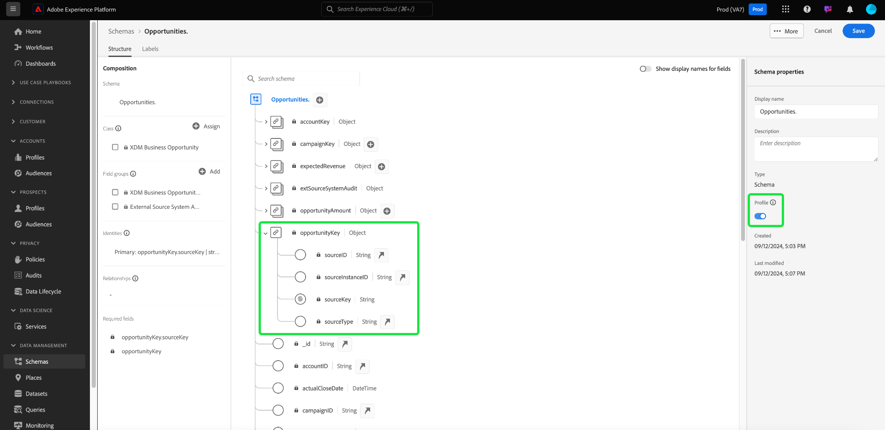
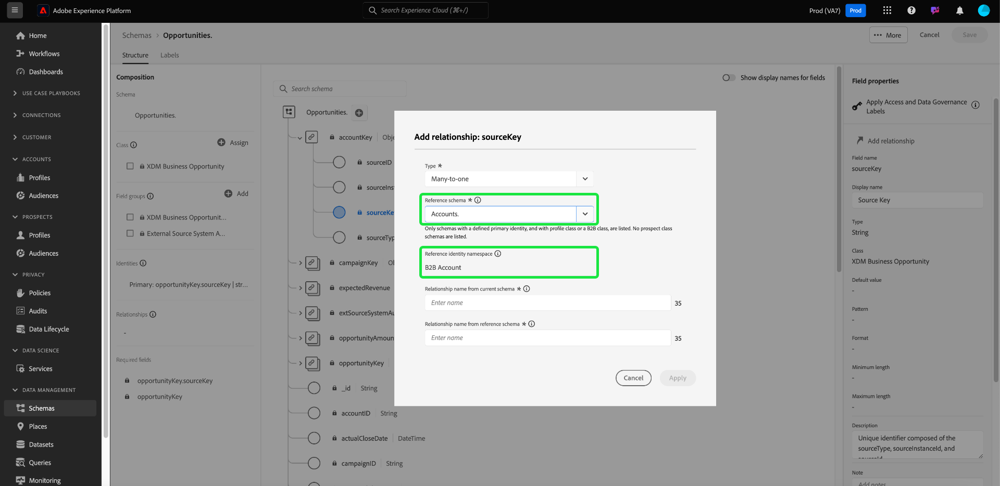
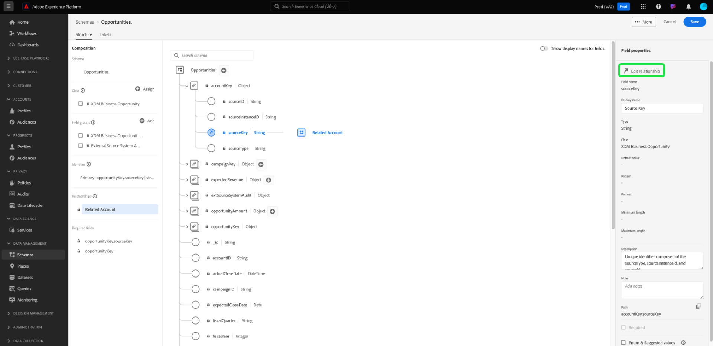

# Définir une relation plusieurs-à-un entre deux schémas dans l’édition B2B de Real-time Customer Data Platform {#relationship-b2b}

>[!CONTEXTUALHELP]
>id="platform_xdm_b2b_reference_schema"
>title="Schéma de référence"
>abstract="Sélectionnez le schéma avec lequel vous souhaitez établir une relation. Selon la classe du schéma, il peut également avoir des relations existantes avec d&#39;autres entités dans le contexte B2B. Pour en savoir plus sur la manière dont les classes de schéma B2B se connectent entre elles, consultez la documentation."

L’édition B2B d’Adobe Real-Time Customer Data Platform fournit plusieurs classes de modèle de données d’expérience (XDM) qui capturent les entités de données B2B fondamentales, y compris les [comptes](../classes/b2b/business-account.md), les [opportunités](../classes/b2b/business-opportunity.md), les [campagnes](../classes/b2b/business-campaign.md), etc. En créant des schémas basés sur ces classes et en les activant pour une utilisation dans [Real-Time Customer Profile](../../profile/home.md), vous pouvez fusionner les données de sources disparates dans une représentation unifiée appelée schéma d’union.

Cependant, les schémas d’union ne peuvent contenir que des champs capturés par des schémas qui partagent la même classe. C’est là que les relations de schéma entrent en jeu. En implémentant des relations dans vos schémas B2B, vous pouvez décrire la manière dont ces entités commerciales se relient les unes aux autres et peut inclure des attributs provenant de plusieurs classes dans les cas d’utilisation de la segmentation en aval.

Le diagramme suivant illustre la manière dont les différentes classes B2B peuvent se relier les unes aux autres dans une mise en oeuvre de base :

Ce tutoriel décrit les étapes de définition d’une relation multiple-à-un entre deux schémas dans Real-Time CDP B2B Edition.

>[!NOTE]
>
>Si vous n’utilisez pas l’édition B2B de Real-Time Customer Data Platform ou si vous souhaitez créer une relation un-à-un, reportez-vous au guide sur la [création d’une relation un-à-un](./relationship-ui.md) à la place.
>
>Ce tutoriel se concentre sur la manière d’établir manuellement des relations entre les schémas B2B dans l’interface utilisateur de Platform. Si vous importez des données à partir d’une connexion source B2B, vous pouvez utiliser un utilitaire de génération automatique pour créer les schémas, les identités et les relations requis à la place. Pour plus d’informations sur [à l’aide de l’utilitaire de génération automatique](../../sources/connectors/adobe-applications/marketo/marketo-namespaces.md), consultez la documentation des sources sur les espaces de noms et schémas B2B.

## Commencer

Ce tutoriel nécessite une compréhension pratique de [!DNL XDM System] et de l’éditeur de schémas dans l’interface utilisateur de [!DNL Experience Platform]. Avant de commencer ce tutoriel, consultez la documentation suivante :

* [Système XDM en Experience Platform](../home.md) : présentation de XDM et de sa mise en oeuvre dans [!DNL Experience Platform].
* [Principes de base de composition des schémas](../schema/composition.md) : une présentation des blocs de création de schémas XDM.
* [Créez un schéma à l’aide de  [!DNL Schema Editor]](create-schema-ui.md) : tutoriel sur les principes de base de la création et de la modification de schémas dans l’interface utilisateur.

## Définition d’un schéma source et de référence

Vous devez avoir déjà créé les deux schémas qui seront définis dans la relation. À des fins de démonstration, ce tutoriel crée une relation entre les opportunités commerciales (définies dans un schéma &quot;[!DNL Opportunities]&quot;) et leur compte professionnel associé (défini dans un schéma &quot;[!DNL Accounts]&quot;).

Les relations de schéma sont représentées par un champ dédié dans un **schéma source** qui fait référence au champ d’identité principal d’un **schéma de référence**. Dans les étapes suivantes, &quot;[!DNL Opportunities]&quot; sert de schéma source, tandis que &quot;[!DNL Accounts]&quot; fait office de schéma de référence.

### Comprendre les identités dans les relations B2B

>[!CONTEXTUALHELP]
>id="platform_xdm_b2b_identity_namespace"
>title="Espace de noms d&#39;identité de référence"
>abstract="L&#39;espace de noms (type) du champ d&#39;identité principal du schéma de référence. Le schéma de référence doit disposer d&#39;un champ d&#39;identité principal établi pour pouvoir participer à une relation. Pour en savoir plus sur les identités dans les relations B2B, consultez la documentation."

Pour établir une relation, le schéma de référence doit avoir une identité principale définie. Lors de la définition d’une identité principale pour une entité B2B, gardez à l’esprit que les identifiants d’entité basés sur des chaînes peuvent se chevaucher si vous les collectez sur différents systèmes ou emplacements, ce qui peut entraîner des conflits de données dans Platform.

Pour en tenir compte, toutes les classes B2B standard contiennent des champs &quot;key&quot; conformes au type de données [[!UICONTROL B2B Source] ](../data-types/b2b-source.md). Ce type de données fournit des champs pour un identifiant de chaîne pour l’entité B2B, ainsi que d’autres informations contextuelles sur la source de l’identifiant. L’un de ces champs, `sourceKey`, concatène les valeurs des autres champs du type de données afin de produire un identifiant unique complet pour l’entité. Ce champ doit toujours être utilisé comme identité principale pour les schémas d’entité B2B.

>[!NOTE]
>
>Lorsque [vous définissez un champ XDM en tant qu’identité](../ui/fields/identity.md), vous devez fournir un espace de noms d’identité pour définir l’identité sous . Il peut s’agir d’un espace de noms standard fourni par Adobe ou d’un espace de noms personnalisé défini par votre organisation. En pratique, l’espace de noms est simplement une chaîne contextuelle et peut être définie sur n’importe quelle valeur, à condition qu’il soit significatif pour votre organisation pour la classification du type d’identité. Pour plus d’informations, consultez la présentation sur les [espaces de noms d’identité](../../identity-service/features/namespaces.md) .

À titre de référence, les sections suivantes décrivent la structure de chaque schéma utilisé dans ce tutoriel avant la définition d’une relation. Prenez note de l’emplacement où les identités primaires ont été définies dans la structure du schéma et les espaces de noms personnalisés qu’elles utilisent.

### Schéma des opportunités

Le schéma source &quot;[!DNL Opportunities]&quot; est basé sur la classe [!UICONTROL XDM Business Opportunity]. L’un des champs fournis par la classe, `opportunityKey`, sert d’identifiant pour le schéma. Plus précisément, le champ `sourceKey` sous l’objet `opportunityKey` est défini comme identité principale du schéma sous un espace de noms personnalisé appelé [!DNL B2B Opportunity].

Comme vous pouvez le constater sous **[!UICONTROL Propriétés du champ]**, ce schéma a été activé pour une utilisation dans [!DNL Real-Time Customer Profile].

### schéma [!DNL Accounts]

Le schéma de référence &quot;[!DNL Accounts]&quot; est basé sur la classe [!UICONTROL XDM Account]. Le champ `accountKey` de niveau racine contient le `sourceKey` qui agit comme son identité principale sous un espace de noms personnalisé appelé [!DNL B2B Account]. Ce schéma a également été activé pour une utilisation dans Profile.

## Définir un champ de relation pour le schéma source {#relationship-field}

>[!CONTEXTUALHELP]
>id="platform_xdm_b2b_relationship_name_current"
>title="Nom de la relation à partir du schéma actuel"
>abstract="Libellé décrivant la relation entre le schéma actuel et le schéma de référence (par exemple, « Compte associé »). Ce libellé est utilisé dans Profil et Segmentation pour donner un contexte aux données des entités B2B associées. Pour en savoir plus sur la création de relations de schémas B2B, consultez la documentation."

>[!CONTEXTUALHELP]
>id="platform_xdm_b2b_relationship_name_reference"
>title="Nom de la relation à partir du schéma de référence"
>abstract="Libellé qui décrit la relation entre le schéma de référence et le schéma actuel (par exemple, « Opportunités liées »). Ce libellé est utilisé dans Profil et Segmentation pour donner un contexte aux données des entités B2B associées. Pour en savoir plus sur la création de relations de schémas B2B, consultez la documentation."

Pour définir une relation entre deux schémas, le schéma source doit disposer d’un champ dédié qui indique l’identité principale du schéma de référence. Les classes B2B standard incluent des champs source clés dédiés pour les entités commerciales les plus courantes. Par exemple, la classe [!UICONTROL XDM Business Opportunity] contient des champs de clé source pour un compte associé (`accountKey`) et une campagne associée (`campaignKey`). Cependant, vous pouvez également ajouter d’autres champs [!UICONTROL B2B Source] au schéma à l’aide de groupes de champs personnalisés si vous avez besoin de plus que les composants par défaut.

>[!NOTE]
>
>Actuellement, seules les relations multiples-à-un et une-à-un peuvent être définies d’un schéma source à un schéma de référence. Pour les relations de type &quot;un à plusieurs&quot;, vous devez définir le champ de relation dans le schéma qui représente le &quot;plusieurs&quot;.

Pour définir un champ de relation, sélectionnez le champ en question dans la zone de travail, suivi de **[!UICONTROL Ajouter une relation]** dans la barre latérale [!UICONTROL Propriétés du schéma]. Dans le cas du schéma [!DNL Opportunities], il s’agit du champ `accountKey.sourceKey` , car l’objectif est d’établir une relation multiple-à-un avec un compte.

La boîte de dialogue [!UICONTROL Ajouter une relation] s’affiche. Utilisez cette boîte de dialogue pour spécifier les détails de la relation. Par défaut, le type de relation est défini sur **[!UICONTROL Multiple-à-un]**.

Sous **[!UICONTROL Schéma de référence]**, utilisez la barre de recherche ou le menu déroulant pour trouver le nom du schéma de référence. Lorsque vous mettez en surbrillance le nom du schéma de référence, le champ **[!UICONTROL Espace de noms d’identité de référence]** se met automatiquement à jour vers l’espace de noms de l’identité principale du schéma de référence.

>[!NOTE]
>
>La liste des schémas de référence disponibles est filtrée pour ne contenir que les schémas appropriés. Les schémas **must** ont une identité principale affectée et sont soit une classe B2B, soit la classe Individual Profile. Les schémas de classe Prospect ne sont pas en mesure d’avoir des relations.

Sous **[!UICONTROL Nom de la relation du schéma actuel]** et **[!UICONTROL Nom de la relation du schéma de référence]**, fournissez des noms conviviaux pour la relation dans le contexte des schémas source et de référence, respectivement. Lorsque vous avez terminé, sélectionnez **[!UICONTROL Appliquer]** pour confirmer les modifications et enregistrer la relation.

>[!NOTE]
>
>Les noms de relation doivent comporter 35 caractères ou moins.

Le canevas réapparaît, le champ de relation étant désormais marqué du nom convivial que vous avez fourni précédemment. Le nom de la relation est également répertorié dans le rail de gauche pour référence facile.

Si vous affichez la structure du schéma de référence, le marqueur de relation s’affiche en regard du champ d’identité principal du schéma et dans le rail de gauche.

## Modification d’une relation de schéma B2B {#edit-schema-relationship}

Une fois une relation de schéma établie, sélectionnez le champ de relation dans le schéma source, suivi de **[!UICONTROL Modifier la relation]**.

>[!NOTE]
>
>Pour afficher toutes les relations associées, sélectionnez le champ d’identité principal dans le schéma de référence, suivi de [!UICONTROL Afficher les relations].
>{width="100" zoomable="yes"}

La boîte de dialogue [!UICONTROL Modifier la relation] s’affiche. Dans cette boîte de dialogue, vous pouvez modifier le schéma de référence et les noms des relations, ou supprimer la relation. Le type de relation multiple-à-un ne peut pas être modifié.

Pour préserver l’intégrité des données et éviter les interruptions de la segmentation et d’autres processus, tenez compte des instructions suivantes lors de la gestion des relations de schéma avec les jeux de données liés :

* Évitez de supprimer directement des relations si un schéma est associé à un jeu de données, car cela peut avoir un impact négatif sur la segmentation. Supprimez plutôt le jeu de données associé avant de supprimer la relation.
* Vous ne pouvez pas modifier le schéma de référence sans supprimer au préalable la relation existante. Toutefois, cette opération doit être effectuée avec précaution, car la suppression d’une relation avec un jeu de données associé peut entraîner des conséquences inattendues.
* L’ajout de nouvelles relations à un schéma avec des jeux de données liés existants peut ne pas fonctionner comme prévu et peut entraîner des conflits potentiels.

## Filtrage et recherche de relations {#filter-and-search}

Vous pouvez filtrer et rechercher des relations spécifiques dans vos schémas à partir de l’onglet [!UICONTROL Relationships] de l’espace de travail [!UICONTROL Schemas] . Vous pouvez utiliser cette vue pour localiser et gérer rapidement vos relations. Lisez le document sur l’ [exploration des ressources de schéma](../ui/explore.md#lookup) pour obtenir des instructions détaillées sur les options de filtrage.

## Étapes suivantes

En suivant ce tutoriel, vous avez créé avec succès une relation multiple-à-un entre deux schémas à l’aide de [!DNL Schema Editor]. Une fois que les données ont été ingérées à l’aide de jeux de données basés sur ces schémas et que ces données ont été activées dans l’entrepôt de données Profile, vous pouvez utiliser des attributs des deux schémas pour les [cas d’utilisation de segmentation multi-classe](../../rtcdp/segmentation/b2b.md).
