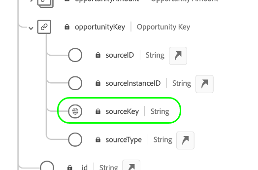

# Définition d’une relation multiple-à-un entre deux schémas dans Real-time Customer Data Platform B2B Edition {#relationship-b2b}

>[!CONTEXTUALHELP]
>id="platform_xdm_b2b_reference_schema"
>title="Schéma de référence"
>abstract="Sélectionnez le schéma avec lequel vous souhaitez établir une relation. Selon la classe du schéma, il peut également exister des relations existantes avec d’autres entités dans le contexte B2B. Consultez la documentation pour découvrir comment les classes de schéma B2B se connectent entre elles."

L’édition B2B d’Adobe Real-time Customer Data Platform fournit plusieurs classes de modèle de données d’expérience (XDM) qui capturent les entités de données B2B fondamentales, y compris [comptes](../classes/b2b/business-account.md), [opportunités](../classes/b2b/business-opportunity.md), [campagnes](../classes/b2b/business-campaign.md), etc. En créant des schémas basés sur ces classes et en les activant pour une utilisation dans [Real-time Customer Profile](../../profile/home.md), vous pouvez fusionner des données provenant de sources disparates dans une représentation unifiée appelée schéma d’union.

Toutefois, les schémas d’union ne peuvent contenir que des champs capturés par des schémas qui partagent la même classe. C’est là que les relations de schéma entrent en jeu. En implémentant des relations dans vos schémas B2B, vous pouvez décrire la manière dont ces entités commerciales se relient les unes aux autres et peut inclure des attributs provenant de plusieurs classes dans les cas d’utilisation de la segmentation en aval.

Le diagramme suivant illustre la manière dont les différentes classes B2B peuvent se relier les unes aux autres dans une mise en oeuvre de base :

Ce tutoriel décrit les étapes de définition d’une relation multiple-à-un entre deux schémas dans Real-Time CDP B2B Edition.

>[!NOTE]
>
>Si vous n’utilisez pas l’édition B2B de Real-time Customer Data Platform ou si vous souhaitez créer une relation un-à-un, consultez le guide sur [création d’une relation un-à-un](./relationship-ui.md) au lieu de .
>
>Ce tutoriel se concentre sur la manière d’établir manuellement des relations entre les schémas B2B dans l’interface utilisateur de Platform. Si vous importez des données à partir d’une connexion source B2B, vous pouvez utiliser un utilitaire de génération automatique pour créer les schémas, les identités et les relations requis à la place. Pour plus d’informations sur les sources, consultez la documentation sur les espaces de noms et schémas B2B . [utilisation de l’utilitaire de génération automatique](../../sources/connectors/adobe-applications/marketo/marketo-namespaces.md).

## Prise en main

Ce tutoriel nécessite une compréhension pratique de [!DNL XDM System] et de l’éditeur de schémas dans le [!DNL Experience Platform] Interface utilisateur. Avant de commencer ce tutoriel, consultez la documentation suivante :

* [Système XDM en Experience Platform](../home.md): Présentation de XDM et de son implémentation dans [!DNL Experience Platform].
* [Principes de base de composition des schémas](../schema/composition.md) : une présentation des blocs de création de schémas XDM.
* [Créez un schéma à l’aide du [!DNL Schema Editor]](create-schema-ui.md): Tutoriel abordant les principes de base de la création et de la modification de schémas dans l’interface utilisateur.

## Définition d’un schéma source et de destination

Vous devez avoir déjà créé les deux schémas qui seront définis dans la relation. À des fins de démonstration, ce tutoriel crée une relation entre les opportunités commerciales (définies dans un &quot;[!DNL Opportunities]&quot;&quot; et leur compte d’entreprise associé (défini dans un &quot;[!DNL Accounts]&quot;).

Les relations de schéma sont représentées par un champ dédié dans une **schéma source** qui fait référence au champ d’identité Principal d’un **schéma de destination**. Dans les étapes suivantes, &quot;[!DNL Opportunities]&quot; sert de schéma source, tandis que &quot;[!DNL Accounts]&quot; agit comme schéma de destination.

### Comprendre les identités dans les relations B2B

>[!CONTEXTUALHELP]
>id="platform_xdm_b2b_identity_namespace"
>title="Espace de noms d’identité de référence"
>abstract="L’espace de noms (type) du champ d’identité Principal du schéma de référence. Le schéma de référence doit disposer d’un champ d’identité Principal établi pour pouvoir participer à une relation. Consultez la documentation pour en savoir plus sur les identités dans les relations B2B."

Pour établir une relation, le schéma de destination doit avoir une identité Principale définie. Lors de la définition d’une identité Principale pour une entité B2B, gardez à l’esprit que les identifiants d’entité basés sur des chaînes peuvent se chevaucher si vous les collectez sur différents systèmes ou emplacements, ce qui peut entraîner des conflits de données dans Platform.

Pour ce faire, toutes les classes B2B standard contiennent des champs &quot;clés&quot; conformes à la [[!UICONTROL Source B2B] type de données](../data-types/b2b-source.md). Ce type de données fournit des champs pour un identifiant de chaîne pour l’entité B2B, ainsi que d’autres informations contextuelles sur la source de l’identifiant. Un de ces champs, `sourceKey`, concatène les valeurs des autres champs du type de données afin de produire un identifiant totalement unique pour l’entité. Ce champ doit toujours être utilisé comme identité Principale pour les schémas d’entité B2B.

>[!NOTE]
>
>When [définition d’un champ XDM en tant qu’identité](../ui/fields/identity.md), vous devez fournir un espace de noms d’identité pour définir l’identité sous . Il peut s’agir d’un espace de noms standard fourni par Adobe ou d’un espace de noms personnalisé défini par votre organisation. En pratique, l’espace de noms est simplement une chaîne contextuelle et peut être définie sur n’importe quelle valeur, à condition qu’il soit significatif pour votre organisation pour la classification du type d’identité. Consultez la présentation sur [espaces de noms d’identité](../../identity-service/namespaces.md) pour plus d’informations.

À titre de référence, les sections suivantes décrivent la structure de chaque schéma utilisé dans ce tutoriel avant de définir une relation. Prenez note de l’emplacement où les identités Principales ont été définies dans la structure du schéma et les espaces de noms personnalisés qu’elles utilisent.

### [!DNL Opportunities] schema

Le schéma source &quot;[!DNL Opportunities]&quot; est basé sur la variable [!UICONTROL Opportunités commerciales XDM] classe . Un des champs fournis par la classe, `opportunityKey`, sert d’identifiant au schéma. Plus précisément, la variable `sourceKey` sous le champ `opportunityKey` est défini comme identité Principale du schéma sous un espace de noms personnalisé appelé [!DNL B2B Opportunity].

Comme vous pouvez le voir sous **[!UICONTROL Propriétés du schéma]**, ce schéma a été activé pour une utilisation dans [!DNL Real-time Customer Profile].

### [!DNL Accounts] schema

Le schéma de destination &quot;[!DNL Accounts]&quot; est basé sur la variable [!UICONTROL Compte XDM] classe . Au niveau racine `accountKey` contient le champ `sourceKey` qui agit comme son identité Principale sous un espace de noms personnalisé appelé [!DNL B2B Account]. Ce schéma a également été activé pour une utilisation dans Profile.

## Définition d’un champ de relation pour le schéma source {#relationship-field}

>[!CONTEXTUALHELP]
>id="platform_xdm_b2b_relationship_name_current"
>title="Nom de la relation à partir du schéma actuel"
>abstract="Libellé décrivant la relation entre le schéma actuel et le schéma de référence (par exemple, &quot;Compte associé&quot;). Ce libellé est utilisé dans Profile et Segmentation pour donner un contexte aux données des entités B2B associées. Consultez la documentation pour en savoir plus sur la création de relations de schéma B2B."

>[!CONTEXTUALHELP]
>id="platform_xdm_b2b_relationship_name_reference"
>title="Nom de la relation à partir du schéma de référence"
>abstract="Libellé qui décrit la relation entre le schéma de référence et le schéma actuel (par exemple, &quot;Opportunités liées&quot;). Ce libellé est utilisé dans Profile et Segmentation pour donner un contexte aux données des entités B2B associées. Consultez la documentation pour en savoir plus sur la création de relations de schéma B2B."

Pour définir une relation entre deux schémas, le schéma source doit disposer d’un champ dédié qui référence l’identité Principale du schéma de destination. Les classes B2B standard incluent des champs source clés dédiés pour les entités commerciales les plus courantes. Par exemple, la variable [!UICONTROL Opportunités commerciales XDM] contient les champs de clé source pour un compte associé (`accountKey`) et une campagne associée (`campaignKey`). Cependant, vous pouvez également ajouter d’autres [!UICONTROL Source B2B] des champs du schéma à l’aide de groupes de champs personnalisés si vous avez besoin de plus que les composants par défaut.

>[!NOTE]
>
>Actuellement, seules les relations de type &quot;plusieurs à un&quot; et &quot;un à un&quot; peuvent être définies d’un schéma source à un schéma de destination. Pour les relations de type &quot;un à plusieurs&quot;, vous devez définir le champ de relation dans le schéma qui représente le &quot;plusieurs&quot;.

Pour définir un champ de relation, sélectionnez l’icône de flèche () en regard du champ en question dans la zone de travail. Dans le cas de la fonction [!DNL Opportunities] schéma, il s’agit de la propriété `accountKey.sourceKey` étant donné que l’objectif est d’établir une relation multiple-à-un avec un compte.

Une boîte de dialogue s’affiche, vous permettant de spécifier les détails de la relation. Le type de relation est automatiquement défini sur **[!UICONTROL Multiple-à-un]**.

Sous **[!UICONTROL Schéma de référence]**, utilisez la barre de recherche pour trouver le nom du schéma de destination. Lorsque vous mettez en surbrillance le nom du schéma de destination, la variable **[!UICONTROL Espace de noms d’identité de référence]** est automatiquement mis à jour vers l’espace de noms de l’identité Principale du schéma.

Sous **[!UICONTROL Nom De La Relation À Partir Du Schéma Actuel]** et **[!UICONTROL Nom de la relation du schéma de référence]**, attribuez des noms conviviaux à la relation dans le contexte des schémas source et de destination, respectivement. Lorsque vous avez terminé, sélectionnez **[!UICONTROL Enregistrer]** pour appliquer les modifications et enregistrer le schéma.

Le canevas réapparaît, le champ de relation étant désormais marqué du nom convivial que vous avez fourni précédemment. Le nom de la relation est également répertorié sous le rail de gauche pour référence facile.

Si vous affichez la structure du schéma de destination, le marqueur de relation s’affiche en regard du champ d’identité Principal du schéma et dans le rail de gauche.

## Étapes suivantes

En suivant ce tutoriel, vous avez créé avec succès une relation multiple-à-un entre deux schémas à l’aide de la variable [!DNL Schema Editor]. Une fois que les données ont été ingérées à l’aide de jeux de données basés sur ces schémas et que ces données ont été activées dans l’entrepôt de données Profile, vous pouvez utiliser les attributs des deux schémas pour les cas d’utilisation de la segmentation multi-classe. Pour plus d’informations, consultez la documentation de Real-Time CDP B2B Edition .
