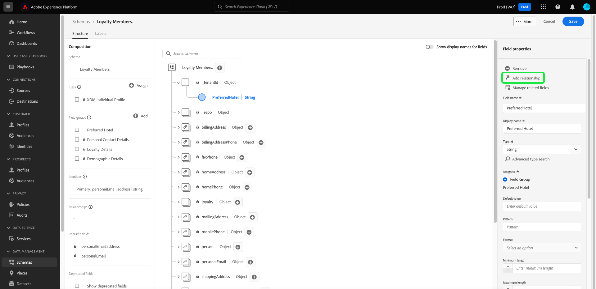
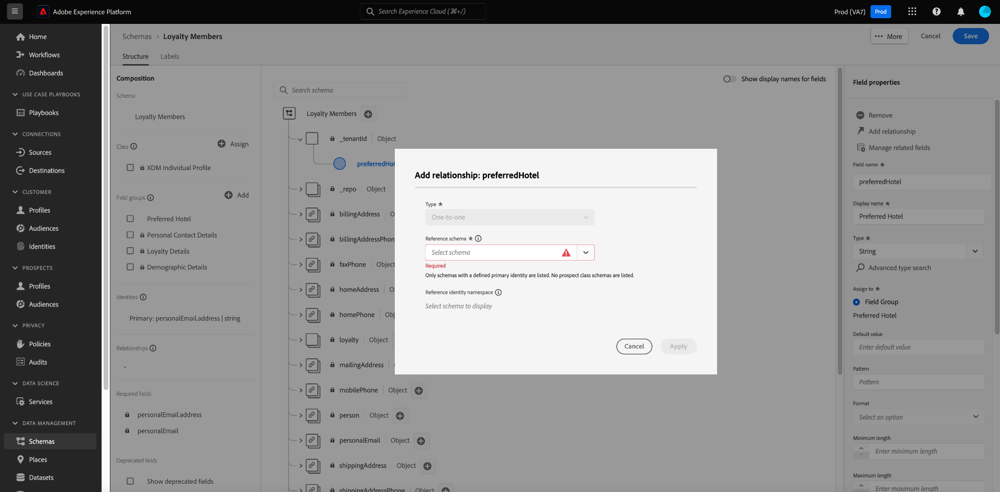
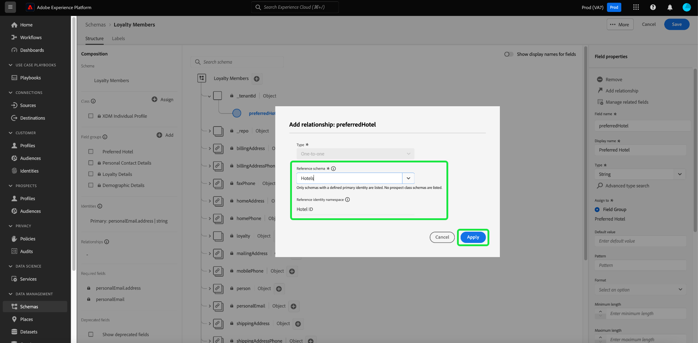
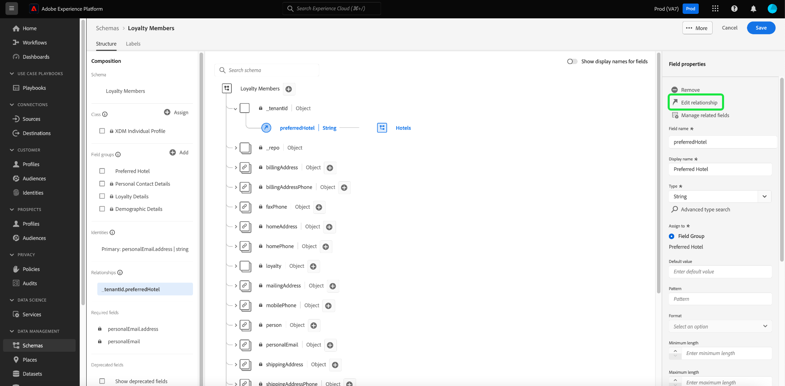
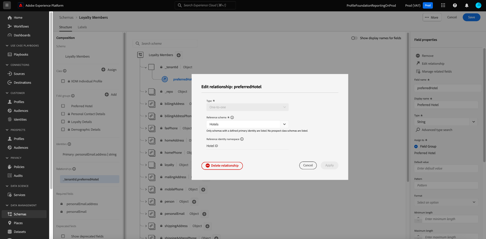

# Définir une relation un-à-un entre deux schémas à l’aide de [!DNL Schema Editor] {#relationship-ui}

>[!CONTEXTUALHELP]
>id="platform_schemas_relationships"
>title="Relations de schéma"
>abstract="Les schémas appartenant à différentes classes peuvent être liés de manière contextuelle par le biais de champs de relation, ce qui vous permet de créer des règles de segmentation plus complexes. Pour plus d&#39;informations sur les relations de schéma, consultez la documentation."

>[!CONTEXTUALHELP]
>id="platform_xdm_1to1_reference_schema"
>title="Schéma de référence"
>abstract="Sélectionnez le schéma avec lequel vous souhaitez établir une relation. Ce schéma peut être une classe différente du schéma actuel. Pour plus d&#39;informations sur les relations de schéma, consultez la documentation."

>[!CONTEXTUALHELP]
>id="platform_xdm_1to1_identity_namespace"
>title="Espace de noms d&#39;identité de référence"
>abstract="L&#39;espace de noms (type) du champ d&#39;identité principal du schéma de référence. Le schéma de référence doit disposer d&#39;un champ d&#39;identité principal établi pour pouvoir participer à une relation. Pour plus d&#39;informations sur les relations de schéma, consultez la documentation."

Comprendre les relations entre vos clients et leurs interactions avec votre marque sur divers canaux est un aspect important d’Adobe Experience Platform. La définition de ces relations dans la structure de vos schémas [!DNL Experience Data Model] (XDM) vous permet d’obtenir des informations complexes sur vos données client.

Bien que les relations de schéma puissent être déduites par l’utilisation du schéma d’union et [!DNL Real-Time Customer Profile], cela s’applique uniquement aux schémas partageant la même classe. Pour établir une relation entre deux schémas appartenant à des classes différentes, un champ de relation dédié doit être ajouté à un schéma source, qui fait référence à l’identité de l’autre schéma associé.

>[!NOTE]
>
>Si les schémas source et de destination appartiennent à la même classe, un champ de relation dédié ne doit **pas** être utilisé. Dans ce cas, utilisez l’interface utilisateur du schéma d’union pour afficher la relation. Vous trouverez des instructions pour ce faire dans la section [Afficher les relations](../../profile/ui/union-schema.md#view-relationships) du guide de l’interface utilisateur du schéma d’union .

Ce document fournit un tutoriel expliquant comment définir une relation entre deux schémas à l’aide de l’éditeur de schémas dans l’interface utilisateur de [!DNL Experience Platform]. Les étapes de la définition des relations de schémas à l’aide de l’API sont décrites dans le tutoriel sur la [définition d’une relation à l’aide de l’API Schema Registry](relationship-api.md).

>[!NOTE]
>
>Pour savoir comment créer une relation multiple-à-un dans Adobe Real-Time Customer Data Platform B2B edition, consultez le guide sur la [création de relations B2B](./relationship-b2b.md).

## Commencer

Ce tutoriel nécessite une compréhension pratique de [!DNL XDM System] et de l’éditeur de schémas dans l’interface utilisateur de [!DNL Experience Platform]. Avant de commencer ce tutoriel, consultez la documentation suivante :

* [Système XDM dans Experience Platform](../home.md) : présentation de XDM et de sa mise en œuvre dans [!DNL Experience Platform].
* [Principes de base de composition des schémas](../schema/composition.md) : une présentation des blocs de création de schémas XDM.
* [Création d’un schéma à l’aide de l’ [!DNL Schema Editor]](create-schema-ui.md) : tutoriel présentant les principes de base de l’utilisation de l’[!DNL Schema Editor].

## Définition d’un schéma source et de référence

Vous devez avoir déjà créé les deux schémas qui seront définis dans la relation. À des fins de démonstration, ce tutoriel crée une relation entre les membres du programme de fidélité d’une organisation (défini dans un schéma « [!DNL Loyalty Members] ») et leur hôtel préféré (défini dans un schéma « [!DNL Hotels] »).

>[!IMPORTANT]
>
>Pour établir une relation, les deux schémas doivent avoir défini des identités principales et être activés pour la [!DNL Real-Time Customer Profile]. Consultez la section relative à l’[activation d’un schéma à utiliser dans Profile](./create-schema-ui.md#profile) dans le tutoriel sur la création de schémas si vous avez besoin de conseils sur la configuration de vos schémas en conséquence.

Les relations de schéma sont représentées par un champ dédié dans un **schéma source** qui pointe vers un autre champ dans un **schéma de référence**. Dans les étapes qui suivent, « [!DNL Loyalty Members] » sera le schéma source, tandis que « [!DNL Hotels] » agira comme schéma de référence.

Les sections suivantes décrivent la structure de chaque schéma utilisé dans ce tutoriel avant la définition d’une relation.

### [!DNL Loyalty Members] le schéma

Le schéma source « [!DNL Loyalty Members] » est basé sur la classe [!DNL XDM Individual Profile] , qui contient des champs décrivant les membres d’un programme de fidélité. L’un de ces champs, `personalEmail.addess`, sert d’identité principale pour le schéma sous l’espace de noms [!UICONTROL Email]. Comme indiqué sous **[!UICONTROL Schema Properties]**, ce schéma a été activé pour une utilisation dans [!DNL Real-Time Customer Profile].

### [!DNL Hotels] le schéma

Le schéma de référence « [!DNL Hotels] » est basé sur une classe « [!DNL Hotels] » personnalisée et contient des champs qui décrivent un hôtel. Pour participer à une relation, le schéma de référence doit également avoir une identité principale définie et activée pour [!UICONTROL Profile]. Dans ce cas, `_tenantId.hotelId`agit comme identité principale pour le schéma, en utilisant un espace de noms d’identité « [!DNL Hotel ID] » personnalisé.

>[!NOTE]
>
>Pour savoir comment créer des espaces de noms d’identité personnalisés, reportez-vous à la documentation du [Service d’identités](../../identity-service/features/namespaces.md#manage-namespaces).

## Créer un groupe de champs de relation

>[!NOTE]
>
>Cette étape n’est nécessaire que si votre schéma source ne dispose pas d’un champ de type chaîne dédié à utiliser comme pointeur vers l’identité principale du schéma de référence. Si ce champ est déjà défini dans votre schéma source, passez à l’étape suivante de la [définition d’un champ de relation](#relationship-field).

Pour définir une relation entre deux schémas, le schéma source doit disposer d’un champ dédié qui indique l’identité principale du schéma de référence. Vous pouvez ajouter ce champ au schéma source en créant un nouveau groupe de champs de schéma ou en étendant un groupe existant.

Dans le cas du schéma [!DNL Loyalty Members], un nouveau champ de `preferredHotel` est ajouté pour indiquer l’hôtel préféré du membre du programme de fidélité pour les visites d’entreprise. Commencez par sélectionner l’icône plus (**+**) en regard du nom du schéma source.

Un espace réservé pour le nouveau champ s’affiche dans la zone de travail. Sous **[!UICONTROL Field properties]**, indiquez un nom de champ et un nom d’affichage pour le champ, puis définissez son type sur « [!UICONTROL String] ». Sous **[!UICONTROL Assign to]**, sélectionnez un groupe de champs existant à étendre, ou saisissez un nom unique pour créer un groupe de champs. Dans ce cas, un nouveau groupe de champs « [!DNL Preferred Hotel] » est créé.

Lorsque vous avez terminé, sélectionnez **[!UICONTROL Apply]**.

Le champ `preferredHotel` mis à jour s’affiche dans la zone de travail, sous un objet `_tenantId`, car il s’agit d’un champ personnalisé. Sélectionnez **[!UICONTROL Save]** pour finaliser les modifications apportées au schéma.

## Définir un champ de relation pour le schéma source {#relationship-field}

Une fois que le champ de référence dédié de votre schéma source est défini, vous pouvez le désigner comme champ de relation.

>[!NOTE]
>
>Les relations ne peuvent être prises en charge que sur les champs de chaîne ou de tableau de chaîne.

Sélectionnez le champ `preferredHotel` dans la zone de travail, puis sélectionnez **[!UICONTROL Add relationship]** dans la barre latérale **[!UICONTROL Field properties]**.

La boîte de dialogue [!UICONTROL Add relationship] s’affiche. Dans cette boîte de dialogue, vous pouvez définir les paramètres requis pour configurer un champ de relation. Pour les utilisateurs B2C de Real-Time CDP, vous pouvez **uniquement** définir une relation un-à-un entre le schéma source et le schéma de référence.

>[!NOTE]
>
>Si vous avez accès à Real-Time CDP B2B edition, vous pouvez utiliser les contrôles du rail de droite de la zone de travail pour définir un champ de relation et créer une relation multiple-à-un à l’aide de la [&#x200B; boîte de dialogue identique &#x200B;](./relationship-b2b.md#relationship-field).

Utilisez la liste déroulante pour **[!UICONTROL Reference schema]** et sélectionnez le schéma de référence de la relation (« [!DNL Hotels] » dans cet exemple).

>[!NOTE]
>
>Seuls les schémas contenant une identité principale sont inclus dans le menu déroulant du schéma de référence. Cette protection vous empêche de créer accidentellement une relation avec un schéma qui n’est pas encore correctement configuré.

L’espace de noms d’identité du schéma de référence (dans ce cas, « [!DNL Hotel ID] ») est automatiquement renseigné sous **[!UICONTROL Reference identity namespace]**. Sélectionnez **[!UICONTROL Apply]** (Enregistrer) une fois terminé.

Le champ `preferredHotel` est désormais mis en surbrillance en tant que relation dans la zone de travail, affichant le nom du schéma de référence. Sélectionnez **[!UICONTROL Save]** pour enregistrer vos modifications et terminer le workflow.

### Modifier un champ de relation existant {#edit-relationship}

Pour modifier le schéma de référence, sélectionnez un champ avec une relation existante, puis sélectionnez **[!UICONTROL Edit relationship]** dans la barre latérale **[!UICONTROL Field properties]**.

La boîte de dialogue [!UICONTROL Edit relationship] s’affiche. À partir de là, vous pouvez suivre le processus décrit dans [définition d’un champ de relation](#relationship-field) ou supprimer la relation. Sélectionnez **[!UICONTROL Delete relationship]** pour supprimer la relation avec le schéma de référence.

## Filtrer et rechercher des relations {#filter-and-search}

Vous pouvez filtrer et rechercher des relations spécifiques dans vos schémas à partir de l’onglet [!UICONTROL Relationships] de l’espace de travail [!UICONTROL Schemas]. Vous pouvez utiliser cette vue pour localiser et gérer rapidement vos relations. Lisez le document [exploration des ressources de schéma](../ui/explore.md#lookup) pour obtenir des instructions détaillées sur les options de filtrage.

## Étapes suivantes

Ce tutoriel vous a permis de créer une relation un-à-un entre deux schémas à l’aide de l’[!DNL Schema Editor] . Les étapes de la définition des relations à l’aide de l’API sont décrites dans le tutoriel sur la [définition d’une relation à l’aide de l’API Schema Registry](relationship-api.md).
