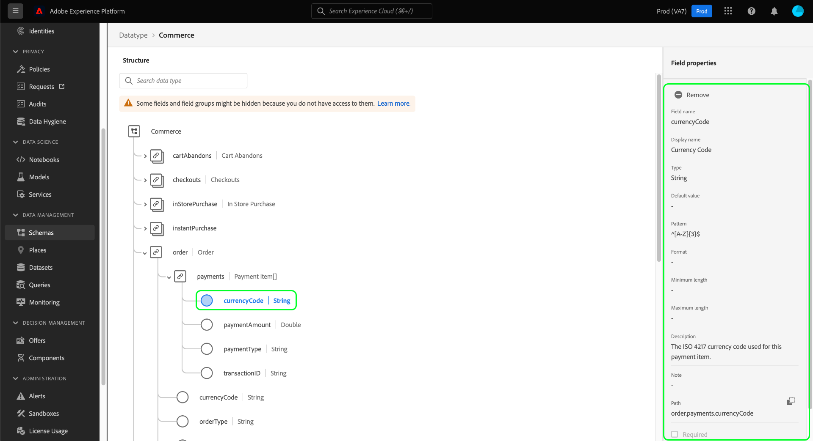

# Explorer les ressources de schéma dans l’interface utilisateur

Dans Adobe Experience Platform, toutes les ressources de schéma du modèle de données d’expérience (XDM) sont stockées dans le [!DNL Schema Library], y compris les ressources standard fournies par Adobe et les ressources personnalisées définies par votre organisation. Dans l’interface utilisateur d’Experience Platform, vous pouvez afficher la structure et les champs de n’importe quel schéma, classe, groupe de champs ou type de données existant dans le [!DNL Schema Library]. Cela s’avère particulièrement utile lors de la planification et de la préparation de l’ingestion de données, car l’interface utilisateur fournit des informations sur les types de données attendus et les cas d’utilisation de chaque champ fourni par ces ressources XDM.

Ce tutoriel décrit les étapes à suivre pour explorer les schémas, classes, groupes de champs et types de données existants dans l’interface utilisateur d’Experience Platform.

## Recherche d’une ressource de schéma {#lookup}

Dans l’interface utilisateur d’Experience Platform, sélectionnez **[!UICONTROL Schémas]** dans le volet de navigation de gauche. L’espace de travail [!UICONTROL Schémas] fournit un onglet **[!UICONTROL Parcourir]** pour explorer tous les schémas de votre organisation, ainsi que des onglets dédiés supplémentaires pour explorer respectivement **[!UICONTROL Classes]**, **[!UICONTROL Groupes de champs]**, **[!UICONTROL Types de données]** et **[!UICONTROL Relations]**.

L’icône de filtre () affiche des commandes dans le rail de gauche pour réduire les résultats répertoriés. Les filtres de ressources sont disponibles pour les schémas et les relations dans les onglets **[!UICONTROL Parcourir]** et **[!UICONTROL Relations]** respectivement.

Dans l’onglet [!UICONTROL  Parcourir ] de l’espace de travail [!UICONTROL Schémas], vous pouvez filtrer l’inventaire des schémas. Utilisez le bouton (bascule) **[!UICONTROL Inclus dans le profil]** pour afficher uniquement les schémas qui ont été activés pour une utilisation dans [Profil client en temps réel](../../profile/home.md). Utilisez le bouton (bascule) **[!UICONTROL Afficher les schémas ad hoc]** pour filtrer la liste des schémas créés avec un espace de noms de champs à utiliser uniquement par un seul jeu de données.

![Onglet [!UICONTROL Schémas] de l’espace de travail [!UICONTROL Parcourir] avec le panneau Filtres en surbrillance.](../images/ui/explore/filters.png)

Dans l’onglet [!UICONTROL Relation] de l’espace de travail [!UICONTROL Schémas], vous pouvez filtrer la liste des relations en fonction de quatre critères. Les filtres incluent [!UICONTROL le schéma Source], [!UICONTROL le schéma de destination], [!UICONTROL la classe Source] et la [!UICONTROL classe de destination]. Le tableau ci-dessous fournit une description des filtres.

| Filtre | Description |
|-----------------------------------|------------|
| [!UICONTROL Schéma Source] | Pour afficher toutes les relations où le schéma sélectionné est le point de départ ou la « source », sélectionnez un schéma dans le menu déroulant [!UICONTROL Schéma Source]. |
| [!UICONTROL Schéma destination] | Pour afficher toutes les relations où le schéma sélectionné est la cible ou la « destination », sélectionnez un schéma dans le menu déroulant [!UICONTROL Schéma de destination]. |
| [!UICONTROL classe Source] | Pour filtrer les relations en fonction de la classe du schéma initiateur, sélectionnez une classe dans le menu déroulant [!UICONTROL Classe Source]. |
| [!UICONTROL Classe de destination] | Pour afficher les relations qui se terminent par des schémas d’une classe spécifique, sélectionnez une classe dans le menu déroulant [!UICONTROL Classe de destination]. |

{style="table-layout:auto"}

Vous pouvez également utiliser la barre de recherche pour affiner davantage les résultats.

Les ressources affichées dans les résultats de recherche sont d’abord classées par correspondance de titre, puis par correspondance de description. Plus il y a de correspondances de mots dans l’une de ces catégories, plus la ressource apparaît en haut de la liste.

Lorsque vous avez trouvé la ressource à explorer, sélectionnez son nom dans la liste pour afficher sa structure dans la zone de travail.

## Explorer une ressource XDM dans la zone de travail {#explore}

Une fois que vous avez sélectionné une ressource, sa structure s’ouvre dans la zone de travail.

Tous les champs de type objet contenant des sous-propriétés sont réduits par défaut lorsqu’ils apparaissent pour la première fois dans la zone de travail. Pour afficher les sous-propriétés d’un champ, sélectionnez l’icône en regard de son nom.

### Classe standard et indicateur de groupe de champs {#standard-class-and-field-group-indicator}

Dans l’éditeur de schémas, les classes et les groupes de champs standard (générés par Adobe) sont indiqués par l’icône de cadenas (icône de cadenas . Le cadenas s’affiche dans le rail de gauche à côté du nom de la classe ou du groupe de champs, ainsi qu’à côté de tout champ du diagramme de schéma qui fait partie d’une ressource générée par le système.

Consultez la documentation [Ajouter des champs personnalisés aux groupes de champs standard](./resources/schemas.md) pour obtenir des conseils. Vous ne pouvez pas modifier une classe standard.

### Champs générés par le système {#system-fields}

Certains noms de champ sont précédés d’un trait de soulignement, tels que `_repo` et `_id`. Il s’agit d’espaces réservés pour les champs que le système génère et attribue automatiquement au fur et à mesure de l’ingestion des données.

Par conséquent, la plupart de ces champs doivent être exclus de la structure de vos données lors de l’ingestion dans Experience Platform. La principale exception à cette règle est le champ [`_{TENANT_ID}` , sous lequel tous les champs XDM créés sous votre organisation doivent ](../api/getting-started.md#know-your-tenant_id) un espace de noms.

### Types de données {#data-types}

Pour chaque champ affiché dans la zone de travail, le type de données correspondant s’affiche en regard de son nom, indiquant en un coup d’œil le type de données attendu par le champ pour l’ingestion.

Tout type de données ajouté entre crochets (`[]`) représente un tableau de ce type de données particulier. Par exemple, un type de données **[!UICONTROL Chaîne]\[]** indique que le champ attend un tableau de valeurs de chaîne. Un type de données **[!UICONTROL Élément de paiement]\[]** indique un tableau d’objets conformes au type de données [!UICONTROL Élément de paiement].

Si un champ de tableau est basé sur un type d’objet, vous pouvez sélectionner son icône dans la zone de travail pour afficher les attributs attendus pour chaque élément de tableau.

### [!UICONTROL Propriétés du champ] {#field-properties}

Lorsque vous sélectionnez le nom d’un champ de la zone de travail, le rail de droite se met à jour pour afficher les détails de ce champ sous **[!UICONTROL Propriétés du champ]**. Vous pouvez y trouver une description du cas d’utilisation prévu du champ, des valeurs par défaut, des modèles, des formats, si le champ est obligatoire ou non, etc.

Si le champ que vous inspectez est un champ d’énumération, le rail de droite affiche également les valeurs acceptables que le champ s’attend à recevoir.

### Champs d’identité {#identity}

Lors de l’inspection des schémas qui contiennent des champs d’identité, ces champs sont répertoriés dans le rail de gauche sous la classe ou le groupe de champs qui les fournit au schéma. Sélectionnez le nom du champ d’identité dans le rail de gauche pour afficher le champ dans la zone de travail, quelle que soit sa profondeur d’imbrication.

Les champs d’identité sont mis en surbrillance dans la zone de travail avec une icône d’empreinte digitale (). Si vous sélectionnez le nom du champ d’identité, vous pouvez afficher des informations supplémentaires telles que l’[espace de noms d’identité](../../identity-service/features/namespaces.md) et déterminer si le champ est l’identité principale du schéma.

>[!NOTE]
>
>Pour plus d’informations sur les champs d’identité et leur relation avec les services Experience Platform en aval](./fields/identity.md) consultez le guide sur la [ définition des champs d’identité .

### Champs de relation {#relationship}

Si vous inspectez un schéma qui contient un champ de relation, le champ est répertorié dans le rail de gauche sous **[!UICONTROL Relations]**. Sélectionnez le nom du champ de relation dans le rail de gauche pour afficher le champ dans la zone de travail, quelle que soit sa profondeur d’imbrication. Les champs de relation sont également mis en surbrillance de manière unique dans la zone de travail, affichant le nom du schéma de référence auquel le champ renvoie. Pour les organisations disposant de fonctionnalités B2B, des noms de relation personnalisés peuvent être écrits et s’affichent sur la zone de travail dans ces cas.

Pour afficher l’espace de noms d’identité de l’identité principale du schéma de référence, sélectionnez le champ de relation, puis **[!UICONTROL Modifier la relation]** dans la barre latérale [!UICONTROL Propriétés du champ]. Les paramètres de la relation s’affichent dans la boîte de dialogue [!UICONTROL Modifier la relation] qui s’affiche.

Pour plus d’informations sur l’utilisation des relations dans les schémas XDM, consultez le tutoriel sur la [création d’une relation dans l’interface utilisateur](../tutorials/relationship-ui.md).

## Étapes suivantes

Ce document explique comment explorer les ressources XDM existantes dans l’interface utilisateur d’Experience Platform. Pour plus d’informations sur les différentes fonctionnalités de l’espace de travail et des [!DNL Schema Editor] [!UICONTROL Schémas], consultez la présentation de l’espace de travail [[!UICONTROL Schémas]](./overview.md).
