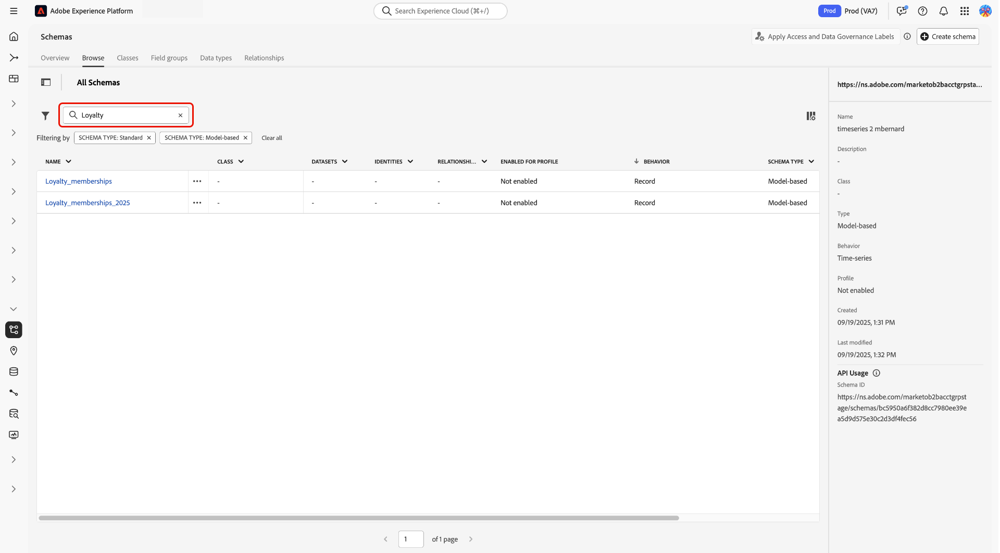
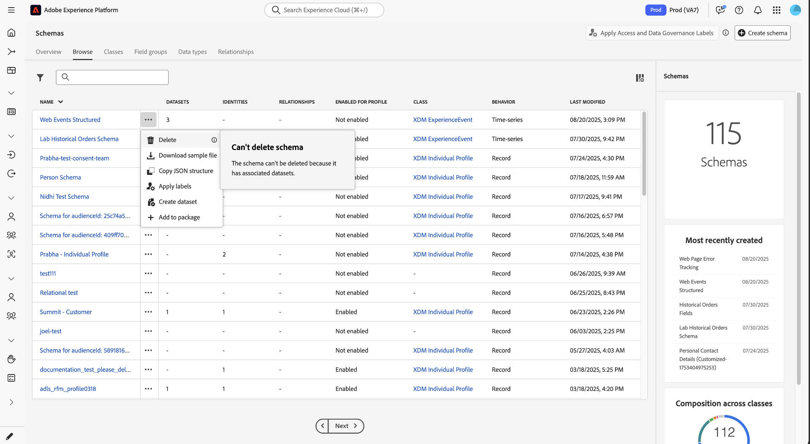
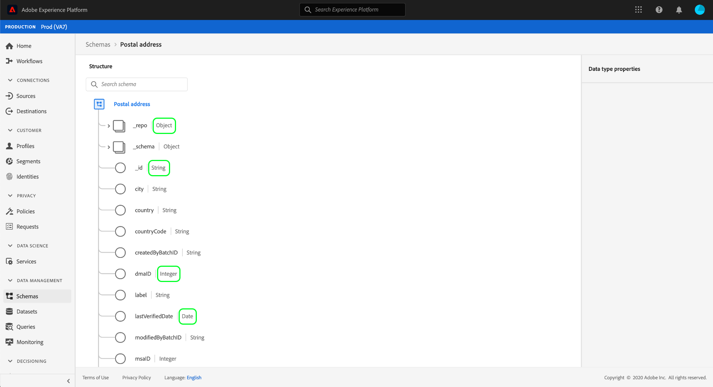
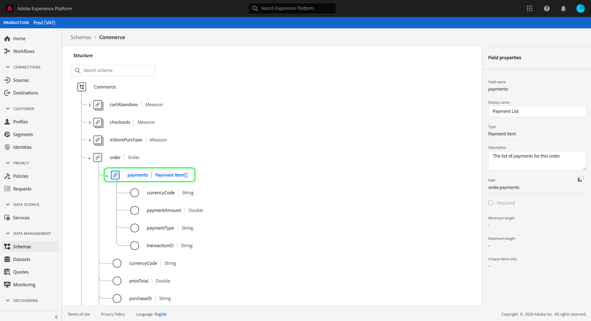
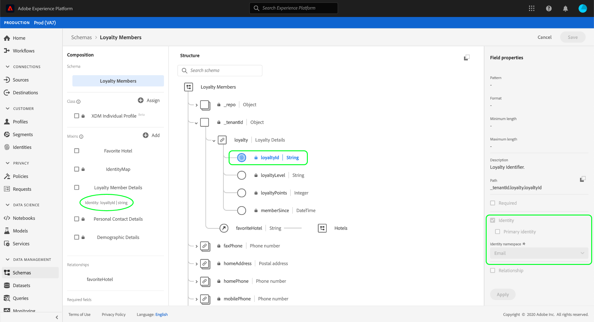

# Explorer les ressources de schéma dans l’interface utilisateur

Dans Adobe Experience Platform, toutes les ressources de schéma du modèle de données d’expérience (XDM) sont stockées dans le [!DNL Schema Library], y compris les ressources standard fournies par Adobe et les ressources personnalisées définies par votre organisation. Dans l’interface utilisateur d’Experience Platform, vous pouvez afficher la structure et les champs de n’importe quel schéma, classe, groupe de champs ou type de données existant dans le [!DNL Schema Library]. Cela s’avère particulièrement utile lors de la planification et de la préparation de l’ingestion de données, car l’interface utilisateur fournit des informations sur les types de données attendus et les cas d’utilisation de chaque champ fourni par ces ressources XDM.

Ce tutoriel décrit les étapes à suivre pour explorer les schémas, classes, groupes de champs et types de données existants dans l’interface utilisateur d’Experience Platform.

## Recherche d’une ressource de schéma {#lookup}

Dans l’interface utilisateur d’Experience Platform, sélectionnez **[!UICONTROL Schemas]** dans le volet de navigation de gauche. L’espace de travail [!UICONTROL Schemas] propose un onglet **[!UICONTROL Browse]** pour explorer tous les schémas de votre organisation, ainsi que des onglets dédiés supplémentaires pour explorer respectivement **[!UICONTROL Classes]**, **[!UICONTROL Field groups]**, **[!UICONTROL Data types]** et **[!UICONTROL Relationships]**.

L’icône de filtre () affiche des commandes dans le rail de gauche pour réduire les résultats répertoriés. Les filtres de ressources sont disponibles pour les schémas et les relations dans les onglets **[!UICONTROL Browse]** et **[!UICONTROL Relationships]**, respectivement.

Dans l’onglet [!UICONTROL Browse] de l’espace de travail [!UICONTROL Schemas], vous pouvez filtrer l’inventaire des schémas. Utilisez le bouton **[!UICONTROL Included in Profile]** pour afficher uniquement les schémas qui ont été activés pour une utilisation dans [Real-Time Customer Profile](../../profile/home.md). Utilisez le bouton **[!UICONTROL Show adhoc schemas]** pour filtrer la liste des schémas créés avec un espace de noms de champs à utiliser uniquement par un seul jeu de données.

![Onglet [!UICONTROL Schemas] de l’espace de travail [!UICONTROL Browse] avec le panneau Filtres mis en surbrillance.](../images/ui/explore/filters.png)

Dans l’onglet [!UICONTROL Relationship] de l’espace de travail [!UICONTROL Schemas], vous pouvez filtrer la liste des relations en fonction de quatre critères. Les filtres incluent [!UICONTROL Source schema], [!UICONTROL Destination schema], [!UICONTROL Source class] et le [!UICONTROL Destination class]. Le tableau ci-dessous fournit une description des filtres.

| Filtre | Description |
|-----------------------------------|------------|
| [!UICONTROL Source schema] | Pour afficher toutes les relations où le schéma sélectionné est le point de départ ou la « source », sélectionnez un schéma dans le menu déroulant [!UICONTROL Source schema]. |
| [!UICONTROL Destination schema] | Pour afficher toutes les relations où le schéma sélectionné est la cible ou la « destination », sélectionnez un schéma dans le menu déroulant [!UICONTROL Destination schema]. |
| [!UICONTROL Source class] | Pour filtrer les relations en fonction de la classe du schéma initiateur, sélectionnez une classe dans le menu déroulant [!UICONTROL Source class]. |
| [!UICONTROL Destination class] | Pour afficher les relations qui se terminent par des schémas d’une classe spécifique, sélectionnez une classe dans le menu déroulant [!UICONTROL Destination class]. |

{style="table-layout:auto"}

Vous pouvez également utiliser la barre de recherche pour affiner davantage les résultats.

Les ressources affichées dans les résultats de recherche sont d’abord classées par correspondance de titre, puis par correspondance de description. Plus il y a de correspondances de mots dans l’une de ces catégories, plus la ressource apparaît en haut de la liste.

Lorsque vous avez trouvé la ressource à explorer, sélectionnez son nom dans la liste pour afficher sa structure dans la zone de travail.

## Gérer les schémas, les classes, les groupes de champs et les types de données : actions et suppression {#xdm-resource-actions}

Utilisez cette section lorsque vous devez gérer ou supprimer des ressources XDM ou lorsqu’une action (telle que la suppression) n’est pas disponible et que vous devez en comprendre la raison.

### Où trouver les actions (page en ligne ou page de détails) {#where-to-find-actions}

Pour effectuer des actions telles que la suppression, l’exportation ou la copie d’une ressource, utilisez l’un des points d’entrée suivants :

Sur les onglets **[!UICONTROL Browse]**, **[!UICONTROL Classes]**, **[!UICONTROL Field groups]** et **[!UICONTROL Data types]**, les actions de gestion sont disponibles à deux emplacements :

- **En ligne dans le tableau** : chaque ligne de ressource comprend un menu d’actions (par exemple, **[!UICONTROL …]**) qui permet d’accéder directement aux actions disponibles.

- **Vue détaillée des ressources** : pour accéder aux actions complètes dans la vue détaillée, vous devez sélectionner une ressource **personnalisée (définie par le client)**. Les ressources standard (fournies par Adobe) ont des actions limitées et n’affichent pas d’options telles que Supprimer, Copier la structure JSON ou Ajouter au package. Sélectionnez une ressource personnalisée dans l’inventaire pour ouvrir sa vue détaillée, puis utilisez le menu **[!UICONTROL More]** dans l’en-tête de la page pour accéder aux mêmes actions disponibles.

Ces actions sont cohérentes sur les deux points d’entrée pour les types de ressources pris en charge (schémas, classes, groupes de champs et types de données).

### Actions disponibles {#available-actions}

Selon le type de ressource et vos autorisations, les actions suivantes peuvent être disponibles :

- **[!UICONTROL Delete]** — Supprimer définitivement une ressource personnalisée de votre organisation (lorsque les contraintes le permettent). Si la suppression est bloquée, voir [ Contraintes ](#delete-constraints).
- **[!UICONTROL Download sample file]** — Générer un fichier de données d&#39;exemple en fonction de la structure des ressources. Étape par étape : [générer des exemples de données XDM](./sample.md).
- **[!UICONTROL Copy JSON structure]** — Copiez la définition de la ressource au format JSON pour la réutilisation, l&#39;exportation ou le contrôle. Procédure pas à pas : [Exporter des schémas XDM](./export.md).
- **[!UICONTROL Add to package]** — Incluez la ressource dans un package sandbox pour l&#39;exportation ou l&#39;importation dans des sandbox. Etape par étape : [Exporter des objets dans un package](../../sandboxes/ui/sandbox-tooling.md#export-objects).

Ce qui suit s’applique à différents types de ressources :

- Pour les **schémas personnalisés (définis par le client)** les classes, les groupes de champs et les types de données, toutes les actions ci-dessus peuvent être disponibles.
- Pour les classes, les groupes de champs et les types de données **standard** (définis par Adobe) :
   - Seul **[!UICONTROL Download sample file]** est disponible.
   - Les **Supprimer**, **Copier la structure JSON** et **Ajouter au package** ne sont pas disponibles.

### Comportement de suppression {#delete-behavior}

Utilisez l’action **[!UICONTROL Delete]** lorsque vous souhaitez supprimer une ressource personnalisée qui n’est plus nécessaire.

>[!IMPORTANT]
>
> La suppression d’une ressource la supprime définitivement de votre organisation et ne peut pas être annulée. Certaines ressources ne peuvent pas être supprimées en raison de contraintes d’utilisation, d’autorisations ou de système.

Pour supprimer une ressource :

1. Recherchez la ressource dans la table ou ouvrez sa vue détaillée.
2. Sélectionnez le menu d’actions (**[!UICONTROL …]** ou **[!UICONTROL More]**).
3. Sélectionnez **[!UICONTROL Delete]**.
4. Confirmez l’action dans la boîte de dialogue en sélectionnant à nouveau **[!UICONTROL Delete]**.

La ressource est définitivement supprimée de votre organisation après confirmation.

Si la suppression n’est pas disponible pour une ressource, l’option apparaît désactivée avec une info-bulle expliquant pourquoi l’action ne peut pas être effectuée.

### Contraintes (jeu de données, profil, RBAC, client par rapport au global) {#delete-constraints}

Si une action telle que **[!UICONTROL Delete]** n’est pas disponible ou est désactivée, cela est généralement dû à l’une des conditions suivantes :

- **Autorisations (RBAC)** : vous devez disposer des autorisations requises (telles que **[!UICONTROL Manage Schemas]**) pour effectuer des actions de gestion. Si des autorisations sont manquantes, les actions sont désactivées avec des info-bulles. Pour en savoir plus sur la configuration des autorisations, consultez la [présentation de l’interface utilisateur du contrôle d’accès](../../access-control/ui/overview.md).

- **Association de jeux de données** : les ressources utilisées par un ou plusieurs jeux de données (tels que les schémas associés aux jeux de données) ne peuvent pas être supprimées. Pour identifier et supprimer les dépendances des jeux de données, voir [Supprimer un jeu de données](../../catalog/datasets/user-guide.md#delete).

- **Activation du profil** : les schémas activés pour le profil client en temps réel ne peuvent pas être supprimés. Pour savoir comment l’activation du profil affecte votre schéma, consultez [Planification de l’activation du profil client en temps réel](../schema/profile-enablement-planning.md).

- **Ressources client ou globales** : les ressources définies par le client (personnalisées) peuvent être supprimées (sous réserve de contraintes), tandis que les classes, groupes de champs et types de données standard (fournis par Adobe) ne peuvent pas être supprimés.

Ces contraintes sont directement reflétées dans l’interface utilisateur. Lorsqu’une action n’est pas disponible, elle apparaît désactivée et comprend une info-bulle expliquant la limitation spécifique.

Si vous ne pouvez pas supprimer une ressource, consultez les conditions ci-dessus pour déterminer si vous devez mettre à jour les autorisations, supprimer les dépendances ou ajuster votre modèle de données.

Pour d’autres workflows de modification de schéma dans la zone de travail, consultez [Création et modification de schémas dans l’interface utilisateur](./resources/schemas.md).

## Explorer une ressource XDM dans la zone de travail {#explore}

Une fois que vous avez sélectionné une ressource, sa structure s’ouvre dans la zone de travail.

Tous les champs de type objet contenant des sous-propriétés sont réduits par défaut lorsqu’ils apparaissent pour la première fois dans la zone de travail. Pour afficher les sous-propriétés d’un champ, sélectionnez l’icône en regard de son nom.

### Classe standard et indicateur de groupe de champs {#standard-class-and-field-group-indicator}

Dans l’éditeur de schémas, les classes et les groupes de champs standard (générés par Adobe) sont indiqués par l’icône de cadenas (icône de cadenas . Le cadenas s’affiche dans le rail de gauche à côté du nom de la classe ou du groupe de champs, ainsi qu’à côté de tout champ du diagramme de schéma qui fait partie d’une ressource générée par le système.

Consultez la documentation [Ajouter des champs personnalisés aux groupes de champs standard](./resources/schemas.md) pour obtenir des conseils. Vous ne pouvez pas modifier une classe standard.

### Champs générés par le système {#system-fields}

Certains noms de champ sont précédés d’un trait de soulignement, tels que `_repo` et `_id`. Il s’agit d’espaces réservés pour les champs que le système génère et attribue automatiquement au fur et à mesure de l’ingestion des données.

Par conséquent, la plupart de ces champs doivent être exclus de la structure de vos données lors de l’ingestion dans Experience Platform. La principale exception à cette règle est le champ [`_{TENANT_ID}` , sous lequel tous les champs XDM créés sous votre organisation doivent ](../api/getting-started.md#know-your-tenant_id) un espace de noms.

### Types de données {#data-types}

Pour chaque champ affiché dans la zone de travail, le type de données correspondant s’affiche en regard de son nom, indiquant en un coup d’œil le type de données attendu par le champ pour l’ingestion.

Tout type de données ajouté entre crochets (`[]`) représente un tableau de ce type de données particulier. Par exemple, un type de données **[!UICONTROL String]\[]** indique que le champ attend un tableau de valeurs de chaîne. Un type de données **[!UICONTROL Payment Item]\[]** indique un tableau d’objets conformes au type de données [!UICONTROL Payment Item].

Si un champ de tableau est basé sur un type d’objet, vous pouvez sélectionner son icône dans la zone de travail pour afficher les attributs attendus pour chaque élément de tableau.

### [!UICONTROL Field properties] {#field-properties}

Lorsque vous sélectionnez le nom d’un champ de la zone de travail, le rail de droite se met à jour pour afficher les détails de ce champ sous **[!UICONTROL Field properties]**. Vous pouvez y trouver une description du cas d’utilisation prévu du champ, des valeurs par défaut, des modèles, des formats, si le champ est obligatoire ou non, etc.

Si le champ que vous inspectez est un champ d’énumération, le rail de droite affiche également les valeurs acceptables que le champ s’attend à recevoir.

### Champs d’identité {#identity}

Lors de l’inspection des schémas qui contiennent des champs d’identité, ces champs sont répertoriés dans le rail de gauche sous la classe ou le groupe de champs qui les fournit au schéma. Sélectionnez le nom du champ d’identité dans le rail de gauche pour afficher le champ dans la zone de travail, quelle que soit sa profondeur d’imbrication.

Les champs d’identité sont mis en surbrillance dans la zone de travail avec une icône d’empreinte digitale (). Si vous sélectionnez le nom du champ d’identité, vous pouvez afficher des informations supplémentaires telles que l’[espace de noms d’identité](../../identity-service/features/namespaces.md) et déterminer si le champ est l’identité principale du schéma.

>[!NOTE]
>
>Pour plus d’informations sur les champs d’identité et leur relation avec les services Experience Platform en aval[ consultez le guide sur la ](./fields/identity.md) définition des champs d’identité .

### Champs de relation {#relationship}

Si vous inspectez un schéma contenant un champ de relation, le champ est répertorié dans le rail de gauche sous **[!UICONTROL Relationships]**. Sélectionnez le nom du champ de relation dans le rail de gauche pour afficher le champ dans la zone de travail, quelle que soit sa profondeur d’imbrication. Les champs de relation sont également mis en surbrillance de manière unique dans la zone de travail, affichant le nom du schéma de référence auquel le champ renvoie. Pour les organisations disposant de fonctionnalités B2B, des noms de relation personnalisés peuvent être écrits et s’affichent sur la zone de travail dans ces cas.

Pour afficher l’espace de noms d’identité de l’identité principale du schéma de référence, sélectionnez le champ de relation, puis **[!UICONTROL Edit relationship]** dans la barre latérale [!UICONTROL Field properties]. Les paramètres de la relation s’affichent dans la boîte de dialogue [!UICONTROL Edit relationship] qui s’affiche.

Pour plus d’informations sur l’utilisation des relations dans les schémas XDM, consultez le tutoriel sur la [création d’une relation dans l’interface utilisateur](../tutorials/relationship-ui.md).

## Étapes suivantes

Ce document explique comment explorer les ressources XDM existantes dans l’interface utilisateur d’Experience Platform. Pour plus d’informations sur les différentes fonctionnalités de l’espace de travail [!UICONTROL Schemas] et de [!DNL Schema Editor], consultez la présentation de l’espace de travail [[!UICONTROL Schemas]](./overview.md).
