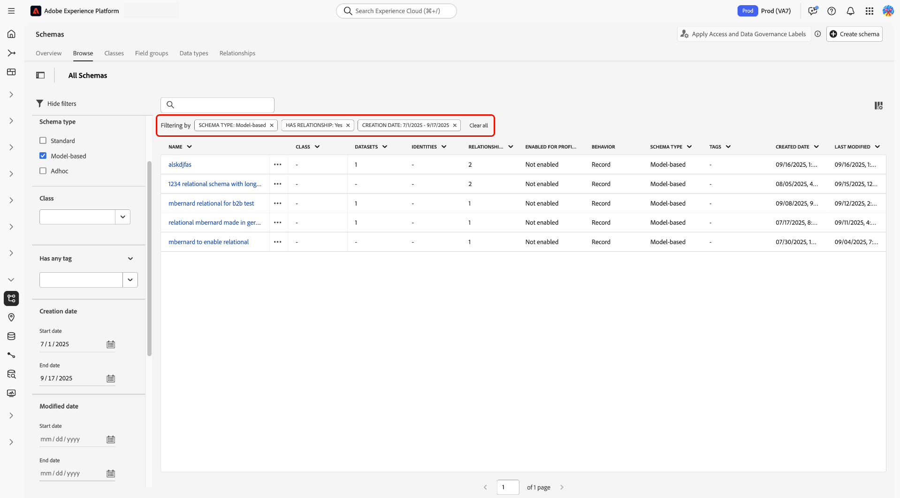
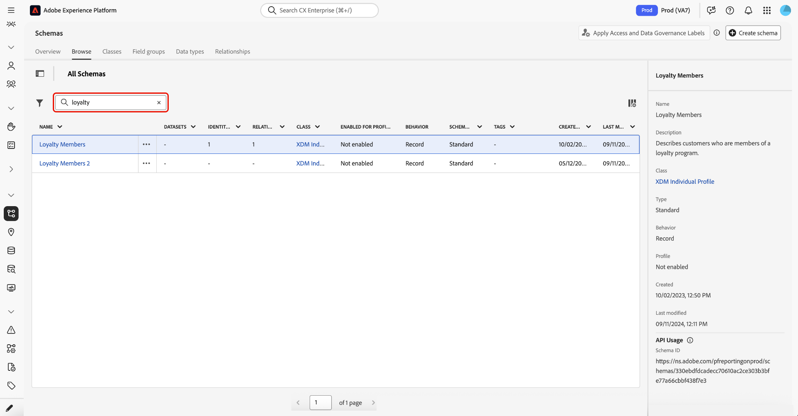
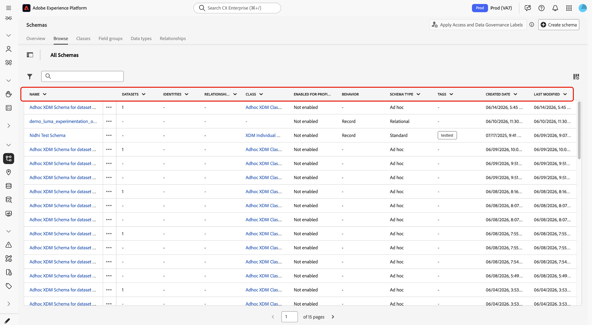
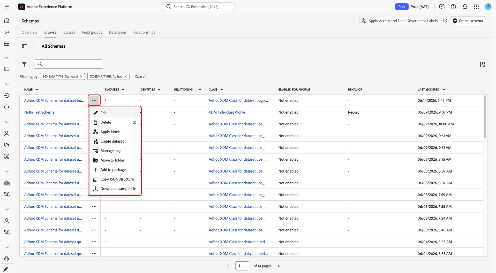
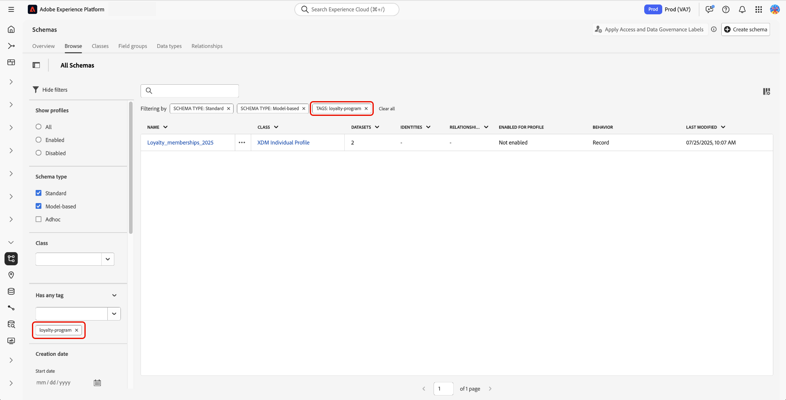
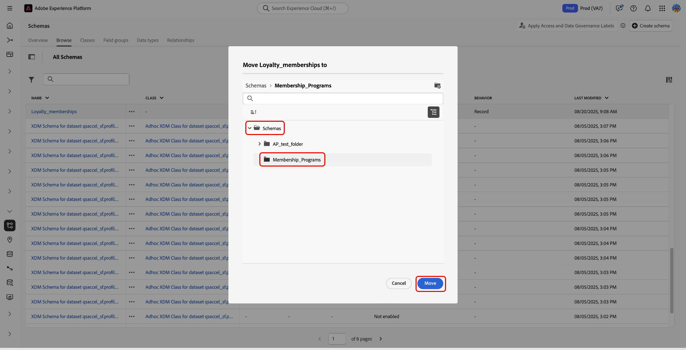
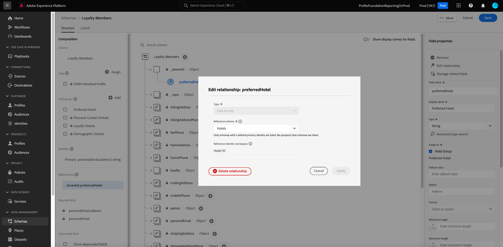
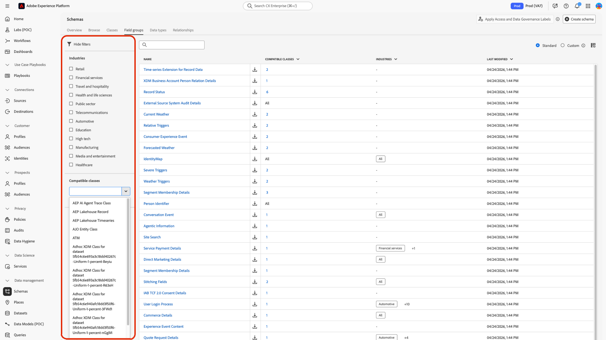
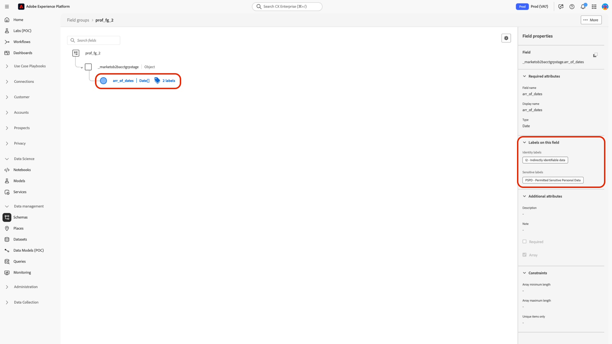

# Explorer les ressources de schéma dans l’interface utilisateur

Dans Adobe Experience Platform, toutes les ressources de schéma du modèle de données d’expérience (XDM) sont stockées dans le [!DNL Schema Library], y compris les ressources standard fournies par Adobe et les ressources personnalisées définies par votre organisation. Dans l’interface utilisateur d’Experience Platform, vous pouvez afficher la structure et les champs de n’importe quel schéma, classe, groupe de champs ou type de données existant dans le [!DNL Schema Library]. Cela s’avère particulièrement utile lors de la planification et de la préparation de l’ingestion de données, car l’interface utilisateur fournit des informations sur les types de données attendus et les cas d’utilisation de chaque champ fourni par ces ressources XDM.

Ce guide explique comment explorer les schémas, classes, groupes de champs, types de données et relations existants dans l’interface utilisateur d’Experience Platform.

## Recherche d’une ressource de schéma {#lookup}

Dans l’interface utilisateur d’Experience Platform, sélectionnez **[!UICONTROL Schémas]** dans le rail de gauche. L’espace de travail [!UICONTROL Schémas] fournit un onglet **[!UICONTROL Parcourir]** dans lequel vous pouvez afficher tous les schémas de votre organisation. Vous pouvez également utiliser les onglets **[!UICONTROL Classes]**, **[!UICONTROL Groupes de champs]**, **[!UICONTROL Types de données]** et **[!UICONTROL Relations]** pour afficher ces ressources.

## Filtrage et recherche de schémas {#filter-search}

Utilisez les outils de filtrage et de recherche de l’espace de travail **[!UICONTROL Schémas]** pour affiner la liste des schémas et localiser plus rapidement des ressources spécifiques. L’icône de filtre () ouvre le panneau de filtrage, où vous pouvez filtrer les schémas à l’aide de métadonnées, d’identité, de relation, de date et de critères de propriété. Les filtres de ressources sont disponibles dans les onglets **[!UICONTROL Parcourir]** et **[!UICONTROL Relations]**.

![Onglet [!UICONTROL Schémas] de l’espace de travail [!UICONTROL Parcourir] avec le panneau de filtres complet en surbrillance.](../images/ui/explore/schemas-filter-sidebar.png)

### Filtres de métadonnées de schéma

Filtrez les schémas en fonction de leurs caractéristiques fondamentales et de leurs attributs d’organisation.

| Filtre | Type de contrôle | Description |
|--------|-------------|-------------|
| [!UICONTROL Afficher les profils] | Cases d&#39;option | Afficher [!UICONTROL Tous], [!UICONTROL Activé] uniquement ou [!UICONTROL Désactivé] uniquement. Les schémas activés pour Profil participent au [profil client en temps réel](../../profile/home.md) et prennent en charge les vues unifiées des clients dans l’ensemble de votre organisation. |
| [!UICONTROL  Type de schéma ] | Cases à cocher | Filtrer par origine de schéma : schémas [!UICONTROL standard] (fournis par Adobe), [!UICONTROL relationnels] (fonctionnalités de modélisation des données structurées et relationnelles) ou [!UICONTROL ad hoc] (espaces de noms de champs utilisables par un seul jeu de données). |
| [!UICONTROL Classe] | Liste déroulante | Affichez uniquement les schémas créés sur des bases de classe spécifiques telles que XDM Individual Profile, XDM ExperienceEvent ou les classes personnalisées définies par votre organisation. |
| [!UICONTROL Balises] | Liste déroulante | Filtrage des schémas par balises définies par l’utilisateur et appliquées par l’utilisateur. Les options incluent [!UICONTROL A une balise] et [!UICONTROL A toutes les balises]. Utilisez les balises pour localiser les schémas organisés par projet, équipe, domaine d’activité ou taxonomies personnalisées qui prennent en charge les pratiques de gestion des schémas de votre organisation. |

{style="table-layout:auto"}

### Filtres d’attributs de schéma

Limitation des résultats en fonction de la structure du schéma et de la configuration des identités.

| Filtre | Type de contrôle | Description |
|--------|-------------|-------------|
| [!UICONTROL A une relation] | Cases à cocher Oui/Non | Afficher uniquement les schémas contenant des champs de relation se connectant à d’autres schémas. Les champs de relation permettent des connexions de données entre différents schémas et prennent en charge des scénarios de modélisation de données complexes. |
| [!UICONTROL A une identité principale] | Cases à cocher Oui/Non | Filtrez les schémas avec des champs d’identité principaux désignés. Les champs d’identité de Principal sont requis pour l’activation du profil et servent de base à l’unification des données client. |
| [!UICONTROL Espace de noms d’identité du Principal ] | Liste déroulante | Recherchez des schémas à l’aide de types d’identité particuliers tels que l’e-mail, l’ECID, le téléphone ou des espaces de noms personnalisés comme identifiant principal. |

{style="table-layout:auto"}

### Filtres temporels et de créateur

Filtrez les schémas en fonction des modèles de création et de la propriété.

| Filtre | Type de contrôle | Description |
|--------|-------------|-------------|
| [!UICONTROL Date de création] | Sélecteurs de date de début et de fin | Filtrez les schémas par périodes de création. Recherchez les schémas récemment créés ou recherchez les schémas créés au cours de phases de projet ou de périodes spécifiques. |
| [!UICONTROL Date de modification] | Sélecteurs de date de début et de fin | Filtrage des schémas par périodes de modification. Identifiez les schémas avec des mises à jour ou des modifications récentes pour prendre en charge les workflows de maintenance et de gouvernance. |
| [!UICONTROL Créé par] | Liste déroulante | Filtrez les schémas selon leur créateur d’origine. Localisez les schémas créés par des membres de l’équipe, des systèmes ou des comptes de service spécifiques pour prendre en charge le suivi de la propriété et la collaboration. |

{style="table-layout:auto"}

### Filtres de l’onglet Relation

Lors de l’affichage des relations de schéma dans l’onglet [!UICONTROL Relations], utilisez des filtres supplémentaires pour explorer les connexions de schéma :

| Filtre | Type de contrôle | Description |
|--------|-------------|-------------|
| [!UICONTROL Schéma ] | Liste déroulante | Afficher les relations dans lesquelles le schéma sélectionné est le point de départ ou la « source ». |
| [!UICONTROL Schéma destination] | Liste déroulante | Afficher les relations dans lesquelles le schéma sélectionné est la cible ou la « destination ». |
| [!UICONTROL classe ] | Liste déroulante | Filtrez les relations en fonction de la classe du schéma initiateur. |
| [!UICONTROL Classe de destination] | Liste déroulante | Afficher les relations qui se terminent par les schémas d’une classe spécifique. |

{style="table-layout:auto"}

### Combinaison de plusieurs filtres

Combinez des filtres pour limiter la liste des schémas et rechercher plus rapidement des ressources spécifiques. Par exemple, vous pouvez rechercher des schémas standard [!UICONTROL activés pour Profil] avec des balises personnalisées qui ont été créées au cours du dernier mois, ou localiser des schémas ad hoc qui utilisent une identité principale d’e-mail et qui contiennent des champs de relation.

Les filtres appliqués apparaissent sous forme de puces amovibles dans la ligne d&#39;en-tête d&#39;inventaire. Pour supprimer un filtre, sélectionnez le ×**sur sa puce.** Pour supprimer tous les filtres actifs en même temps, sélectionnez **[!UICONTROL Effacer tout]**.

Utilisez la barre de recherche pour affiner davantage les résultats.

Les résultats de recherche sont classés en fonction des correspondances dans les titres et les descriptions des ressources. Les correspondances de titres sont prioritaires sur les correspondances de descriptions, et les ressources comportant davantage de termes correspondants apparaissent plus haut dans la liste des résultats.

Lorsque vous avez trouvé la ressource à explorer, sélectionnez son nom dans la liste pour afficher sa structure dans la zone de travail.

## Parcourir, organiser et gérer les schémas {#browse-organize-manage-schemas}

Utilisez l’espace de travail [!UICONTROL Schémas] pour rechercher, organiser et gérer des schémas. Vous pouvez filtrer l’inventaire des schémas, trier les colonnes de métadonnées et effectuer des actions de schéma courantes directement à partir de la vue d’inventaire.

### Parcourir et filtrer les métadonnées

L’inventaire des schémas affiche les métadonnées clés des schémas dans une seule vue de tableau. Vous pouvez afficher les balises, le type de schéma, le statut d’activation du profil, la date de création, la date de dernière modification, la classe, les identités, les relations, le comportement et d’autres métadonnées sans ouvrir les schémas individuels.

Pour trier l’inventaire, sélectionnez un en-tête de colonne. Sélectionnez à nouveau le même en-tête de colonne pour inverser l’ordre de tri.

Si l’inventaire contient plus de résultats que nécessaire sur une seule page, utilisez les commandes de page au bas de la liste pour naviguer entre les pages.

### Actions intégrées sur les schémas

Utilisez le menu représentant des points de suspension pour une ligne de schéma afin d’effectuer des actions de schéma courantes directement à partir de la vue d’inventaire.

Les actions sont disponibles dans les vues Inventaire et Détails des ressources. Certaines actions ne sont disponibles que pour les ressources personnalisées (définies par le client). Les ressources standard fournies par Adobe peuvent avoir des options d’action limitées.

Selon le type de ressource et les autorisations, vous pouvez modifier les propriétés du schéma, appliquer des libellés de gouvernance des données, supprimer des schémas et gérer les balises sans ouvrir le schéma. Les autres actions incluent le déplacement des schémas vers des dossiers, l’ajout de schémas aux packages de déploiement, la copie du schéma JSON et le téléchargement de fichiers d’exemple à des fins de test.

>[!NOTE]
>
>Utilisez des fichiers d’exemple uniquement pour tester la structure du schéma. N’incluez pas de données de production.

Pour obtenir des instructions détaillées sur chaque action, consultez le [guide des actions de schéma](./resources/schemas.md#manage-from-browse).

### Navigation dans les schémas à l’aide de balises et de dossiers

Utilisez des balises et des dossiers pour organiser et localiser les schémas dans l’inventaire. Les balises vous permettent de regrouper des schémas par projet, équipe, domaine de données ou autres catégories définies par votre organisation. Les dossiers fournissent une structure hiérarchique pour organiser les schémas associés.

Pour filtrer les schémas par balise, sélectionnez l’icône de filtre () pour ouvrir le panneau de filtrage. Sélectionnez ensuite une ou plusieurs balises dans le menu déroulant **[!UICONTROL A n’importe quelle balise]**.

Pour parcourir les schémas par dossier, sélectionnez l’icône Afficher les dossiers (). La hiérarchie des dossiers s’affiche dans le rail de gauche. Sélectionnez un dossier pour afficher ses schémas associés.

Les balises et les dossiers fonctionnent avec le système de filtrage d’inventaire, ce qui vous permet de réduire la liste des schémas en fonction des balises et des emplacements de dossiers qui leur sont attribués.

Pour plus d’informations sur la création et la gestion des balises dans Experience Platform, consultez le guide [gestion des balises unifiées](../../administrative-tags/ui/managing-tags.md).

## Explorer une ressource XDM dans la zone de travail {#explore}

Une fois que vous avez sélectionné une ressource, sa structure s’ouvre dans la zone de travail.

Tous les champs de type objet contenant des sous-propriétés sont réduits par défaut lorsqu’ils apparaissent pour la première fois dans la zone de travail. Pour afficher les sous-propriétés d’un champ, sélectionnez l’icône en regard de son nom.

### Classe standard et indicateur de groupe de champs {#standard-class-and-field-group-indicator}

Dans l’éditeur de schémas, les classes et groupes de champs standard affichent une icône de cadenas (). L’icône identifie les ressources générées par Adobe qui comportent des restrictions de modification. Il s’affiche dans le rail de gauche à côté des noms de classe et de groupe de champs, ainsi qu’à côté des champs qui appartiennent aux ressources générées par Adobe dans le diagramme de schéma.

Vous ne pouvez pas modifier une classe standard. Pour étendre un groupe de champs standard, consultez la documentation [Ajouter des champs personnalisés aux groupes de champs standard](./resources/schemas.md#custom-fields-for-standard-groups).

### Champs générés par le système {#system-fields}

Certains noms de champ sont précédés d’un trait de soulignement, tels que `_repo` et `_id`. Il s’agit d’espaces réservés pour les champs que le système génère et attribue automatiquement au fur et à mesure de l’ingestion des données.

Par conséquent, la plupart de ces champs doivent être exclus de la structure de vos données lors de l’ingestion dans Experience Platform. La principale exception à cette règle est le champ [`_{TENANT_ID}` , sous lequel tous les champs XDM créés sous votre organisation doivent ](../api/getting-started.md#know-your-tenant_id) un espace de noms.

### Types de données {#data-types}

Pour chaque champ affiché dans la zone de travail, le type de données correspondant s’affiche en regard de son nom, indiquant en un coup d’œil le type de données attendu par le champ pour l’ingestion.

Tout type de données ajouté entre crochets (`[]`) représente un tableau de ce type de données particulier. Par exemple, un type de données **[!UICONTROL Chaîne]\[]** indique que le champ attend un tableau de valeurs de chaîne. Un type de données **[!UICONTROL Élément de paiement]\[]** indique un tableau d’objets conformes au type de données [!UICONTROL Élément de paiement].

Si un champ de tableau est basé sur un type d’objet, vous pouvez sélectionner son icône dans la zone de travail pour afficher les attributs attendus pour chaque élément de tableau.

### [!UICONTROL Propriétés du champ] {#field-properties}

Lorsque vous sélectionnez le nom d’un champ de la zone de travail, le rail de droite se met à jour pour afficher les détails de ce champ sous **[!UICONTROL Propriétés du champ]**. Vous pouvez y trouver une description du cas d’utilisation prévu du champ, **[!UICONTROL Valeur par défaut]** (métadonnées de schéma d’information qui ne sont pas appliquées lors de l’ingestion), des modèles, des formats, si le champ est obligatoire, etc. Voir [Propriétés de champ spécifiques au type](./fields/overview.md#type-specific-properties) pour connaître les différences entre **[!UICONTROL Valeur par défaut]** et les paramètres de validation de l’ingestion. Lorsque vous explorez un groupe de champs, les détails liés aux libellés du champ sélectionné peuvent également s’afficher à cet emplacement ; consultez [ Libellés dans la vue de structure ](#field-group-labels-in-structure).

Si le champ que vous inspectez est un champ d’énumération, le rail de droite affiche également les valeurs acceptables que le champ s’attend à recevoir.

### Champs d’identité {#identity}

Lors de l’inspection des schémas qui contiennent des champs d’identité, ces champs sont répertoriés dans le rail de gauche sous la classe ou le groupe de champs qui les fournit au schéma. Sélectionnez le nom du champ d’identité dans le rail de gauche pour afficher le champ dans la zone de travail, quelle que soit sa profondeur d’imbrication.

Les champs d’identité sont mis en surbrillance dans la zone de travail avec une icône d’empreinte digitale (). Si vous sélectionnez le nom du champ d’identité, vous pouvez afficher des informations supplémentaires telles que l’[espace de noms d’identité](../../identity-service/features/namespaces.md) et déterminer si le champ est l’identité principale du schéma.

>[!NOTE]
>
>Pour plus d’informations sur les champs d’identité et leur relation avec les services Experience Platform en aval](./fields/identity.md) consultez le guide sur la [ définition des champs d’identité .

### Champs de relation {#relationship}

Si vous inspectez un schéma qui contient un champ de relation, le champ est répertorié dans le rail de gauche sous **[!UICONTROL Relations]**. Sélectionnez le nom du champ de relation dans le rail de gauche pour afficher le champ dans la zone de travail, quelle que soit sa profondeur d’imbrication. Les champs de relation sont également mis en surbrillance de manière unique dans la zone de travail, affichant le nom du schéma de référence auquel le champ renvoie. Pour les organisations disposant de fonctionnalités B2B, des noms de relation personnalisés peuvent être écrits et s’affichent sur la zone de travail dans ces cas.

Pour afficher l’espace de noms d’identité de l’identité principale du schéma de référence, sélectionnez le champ de relation, puis **[!UICONTROL Modifier la relation]** dans la barre latérale [!UICONTROL Propriétés du champ]. Les paramètres de la relation s’affichent dans la boîte de dialogue [!UICONTROL Modifier la relation] qui s’affiche.

Pour plus d’informations sur l’utilisation des relations dans les schémas XDM, consultez le tutoriel sur la [création d’une relation dans l’interface utilisateur](../tutorials/relationship-ui.md).

## Explorer les groupes de champs : utilisation et métadonnées {#explore-field-groups}

Accédez à **[!UICONTROL Schémas]** > **[!UICONTROL Groupes de champs]** pour explorer les groupes de champs. Dans l’onglet **[!UICONTROL Groupes de champs]** des fonctionnalités supplémentaires vous permettent de comprendre où un groupe de champs est utilisé sur l’ensemble des schémas et ce qu’il inclut, comme la compatibilité, les champs obligatoires (qui appliquent les exigences d’ingestion) et les signaux de gouvernance.

Ces fonctionnalités vous permettent d’évaluer l’impact avant d’apporter des modifications et d’identifier plus efficacement les groupes de champs pertinents lors de la conception du schéma.

### Afficher l’utilisation du schéma pour les groupes de champs {#view-schema-usage-for-field-groups}

Dans le tableau **[!UICONTROL Groupes de champs]**, sélectionnez un groupe de champs pour ouvrir sa vue détaillée. La zone de travail se met à jour pour afficher la structure du groupe de champs, et le rail des propriétés affiche des informations supplémentaires sur la ressource sélectionnée.

#### Schémas utilisant ce groupe de champs

Dans le rail de propriétés de droite, la section **[!UICONTROL Schémas utilisant ce groupe de champs]** répertorie les schémas qui incluent actuellement le groupe de champs.

- Si le groupe de champs est utilisé par trois schémas ou moins, tous les noms de schéma s’affichent.
- S’il est utilisé par plus de trois schémas, seuls certains noms sont affichés, ainsi qu’une option permettant d’afficher la liste complète.

Sélectionnez un nom de schéma pour ouvrir sa vue détaillée dans un nouvel onglet et inspecter la manière dont le groupe de champs est implémenté dans ce schéma.

#### Afficher plus et la liste complète des schémas

S’il existe plus de schémas que ce qui peut être affiché en ligne, sélectionnez **[!UICONTROL Afficher plus]** pour ouvrir la boîte de dialogue complète.

La boîte de dialogue **[!UICONTROL Schémas utilisant ce groupe de champs]** s’affiche, affichant la liste complète des schémas qui utilisent le groupe de champs.

Dans la boîte de dialogue **[!UICONTROL Schémas utilisant ce groupe de champs]** vous pouvez :

- Parcourir tous les schémas qui utilisent le groupe de champs
- Parcourir les grands ensembles de résultats
- Sélectionnez un schéma pour ouvrir sa vue détaillée dans un nouvel onglet

Vous pouvez afficher les détails du schéma, tels que le nom, la classe et d’autres attributs du schéma.

Ce workflow est destiné uniquement à l’analyse et à l’exploration d’impact **.** Elle ne modifie pas les schémas ou les groupes de champs. Pour modifier la structure du schéma, voir [Création et modification de schémas dans l’interface utilisateur](./resources/schemas.md).

### Métadonnées et filtrage des groupes de champs {#field-group-metadata-and-filtering}

L’onglet **[!UICONTROL Groupes de champs]** fournit des outils de métadonnées et de filtrage pour vous aider à localiser et à évaluer les groupes de champs avant de les sélectionner.

#### Parcourir le tableau et les filtres

Le tableau d’inventaire des groupes de champs comprend des colonnes supplémentaires qui exposent les métadonnées directement dans la vue Liste, telles que **[!UICONTROL Classes compatibles]**, qui indique à quelles classes un groupe de champs peut être appliqué. Les groupes de champs ne peuvent être ajoutés qu’aux schémas qui utilisent l’une des classes compatibles répertoriées, en fonction du comportement des données qu’ils représentent (par exemple, les données basées sur des enregistrements ou des séries temporelles). Le tableau peut afficher **[!UICONTROL Tous]** lorsque le groupe de champs est compatible avec toutes les classes. **[!UICONTROL Balises de secteur]** permettent de classer les groupes de champs à découvrir.

Pour affiner la liste, sélectionnez l’icône de filtre () pour ouvrir le panneau de filtrage dans le rail de gauche. L’image suivante montre l’ouverture du panneau de filtrage dans le rail de gauche.

Dans le panneau de filtrage, vous pouvez :

- **[!UICONTROL Classes compatibles]** — Utilisez la liste déroulante pour filtrer les groupes de champs par compatibilité de classe
- **[!UICONTROL Balises de secteur]** — Utilisez des cases à cocher pour filtrer par une ou plusieurs catégories de secteur

Lors de la navigation, sélectionnez une ligne dans le tableau pour déclencher le rail d’informations. Le rail d’informations affiche des métadonnées telles que les classes compatibles et les balises de secteur afin que vous puissiez consulter les détails clés sans ouvrir le groupe de champs.

#### Métadonnées des détails du groupe de champs

Lorsque vous ouvrez un groupe de champs, le rail des propriétés affiche des métadonnées supplémentaires associées à la ressource.

Le rail des propriétés peut afficher les métadonnées suivantes :

- **[!UICONTROL Classes compatibles]** — Classes que le groupe de champs peut étendre
- **[!UICONTROL Attributs requis]** — Attributs qui doivent avoir des valeurs valides lorsqu’ils sont requis par le groupe de champs lors de l’ingestion des données. Les exigences dépendent de la structure des données et les enregistrements dont les valeurs requises sont manquantes ou non valides ne sont pas validés
- **[!UICONTROL Libellés]** — Les libellés ne s’affichent pas au niveau du groupe de champs. Sélectionnez un champ pour afficher les détails du libellé dans le rail **[!UICONTROL Propriétés du champ]**

Ces informations vous aident à comprendre les contraintes et les exigences avant d’utiliser ou de modifier le groupe de champs.

#### Libellés dans la vue Structure

Lorsqu’un groupe de champs est ouvert dans la zone de travail, vous pouvez afficher les informations de libellé directement dans la structure. Sélectionnez l’icône des paramètres () dans la barre d’outils de la zone de travail et activez **[!UICONTROL Afficher les libellés dans l’arborescence]** pour afficher les indicateurs de libellé dans les champs de la zone de travail.

Sélectionnez un champ dans la zone de travail pour afficher les détails du libellé dans le rail **[!UICONTROL Propriétés du champ]**, y compris les libellés appliqués à ce champ.

Les libellés sont regroupés par catégorie (par exemple, libellés d’identité et sensibles) et offrent une visibilité sur les contraintes de gouvernance ou d’accès appliquées aux données.

Ces indicateurs sont utilisés à des fins de visibilité uniquement et ne modifient pas la structure du schéma. Pour plus d’informations, voir [Gestion des libellés d’utilisation des données pour un schéma](../tutorials/labels.md).

## Étapes suivantes

Utilisez les ressources suivantes pour continuer à travailler avec les schémas XDM et les fonctionnalités Experience Platform associées :

- Pour en savoir plus sur l’espace de travail et les **[!DNL Schema Editor]** **[!UICONTROL Schémas]**, consultez la présentation de l’espace de travail [[!UICONTROL Schémas]](./overview.md).
- Pour plus d’informations sur la création et la gestion des balises, consultez le guide [gestion des balises unifiées](../../administrative-tags/ui/managing-tags.md).
- Pour plus d’informations sur les vues d’inventaire, le filtrage, la recherche et les modèles de navigation de l’espace de travail, consultez le guide d’utilisation [jeux de données](../../catalog/datasets/user-guide.md).
- Pour plus d’informations sur l’application et la gestion des libellés de gouvernance des données, consultez le guide d’utilisation [libellés d’utilisation des données](../../data-governance/labels/user-guide.md).
