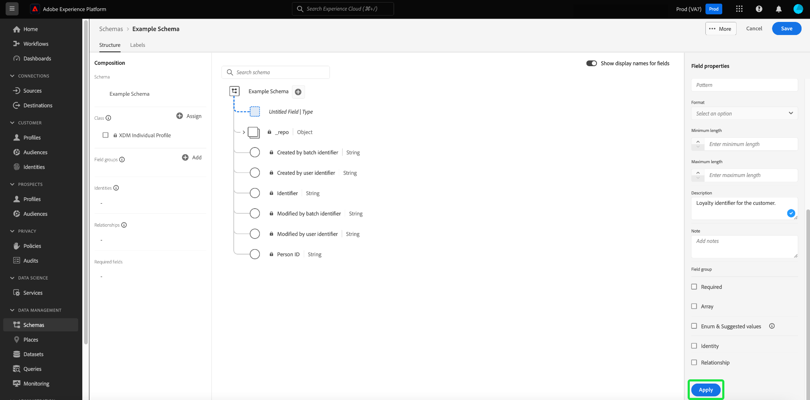

# Workflows basés sur les champs dans l’éditeur de schémas

Adobe Experience Platform fournit un ensemble robuste de [groupes de champs](../schema/composition.md#field-group) à utiliser dans les schémas de modèle de données d’expérience (XDM). La structure et la sémantique derrière ces groupes de champs sont soigneusement conçues pour répondre à un large éventail de cas d’utilisation de la segmentation et à d’autres applications en aval dans Platform. Vous pouvez également définir vos propres groupes de champs personnalisés pour répondre à des besoins professionnels uniques.

Lorsque vous ajoutez un groupe de champs à un schéma, ce schéma hérite de tous les champs contenus dans ce groupe. Cependant, vous pouvez maintenant ajouter des champs individuels à votre schéma sans avoir à inclure d’autres champs du groupe de champs associé que vous ne pouvez pas nécessairement utiliser.

Ce guide décrit les différentes méthodes d’ajout de champs individuels à un schéma dans l’interface utilisateur de Platform.

## Conditions préalables

Ce tutoriel suppose que vous connaissez les [composition des schémas XDM](../schema/composition.md) et comment utiliser l’éditeur de schémas dans l’interface utilisateur de Platform. Pour poursuivre, vous devez lancer le processus de [création d’un nouveau schéma](./resources/schemas.md) et l’affecter à une classe standard avant de poursuivre avec ce guide.

## Supprimer les champs ajoutés des groupes de champs standard {#remove-field-group}

Après avoir ajouté un groupe de champs standard à un schéma, vous pouvez supprimer tous les champs standard dont vous n’avez pas besoin.

>[!NOTE]
>
>La suppression de champs d’un groupe de champs standard affecte uniquement le schéma en cours de traitement et n’affecte pas le groupe de champs lui-même. Si vous supprimez des champs standard dans un schéma, ces champs sont toujours disponibles dans tous les autres schémas qui utilisent le même groupe de champs.

Dans l&#39;exemple suivant, le groupe de champs standard **[!UICONTROL Détails démographiques]** a été ajouté à un schéma. Pour supprimer un seul champ, par exemple `taxId`, sélectionnez le champ dans la zone de travail, puis sélectionnez **[!UICONTROL Supprimer]** dans le rail de droite.

Si vous souhaitez supprimer plusieurs champs, vous pouvez gérer le groupe dans son ensemble. Sélectionnez un champ appartenant au groupe dans la zone de travail, puis sélectionnez **[!UICONTROL Gestion des champs associés]** dans le rail de droite.

Une boîte de dialogue s’affiche, indiquant la structure du groupe de champs en question. À partir de là, vous pouvez utiliser les cases à cocher fournies pour sélectionner ou désélectionner les champs dont vous avez besoin. Lorsque vous êtes satisfait, sélectionnez **[!UICONTROL Confirmer]**.

Le canevas réapparaît avec uniquement les champs sélectionnés présents dans la structure du schéma.

## Ajout direct de champs standard à un schéma

Vous pouvez ajouter directement à un schéma des champs provenant de groupes de champs standard sans avoir à connaître au préalable le groupe de champs correspondant. Pour ajouter un champ standard à un schéma, sélectionnez le plus (**+**) en regard du nom du schéma dans la zone de travail. Un **[!UICONTROL Champ sans titre]** un espace réservé apparaît dans la structure du schéma et le rail de droite est mis à jour pour afficher les commandes permettant de configurer le champ.

Sous **[!UICONTROL Nom du champ]**, commencez à saisir le nom du champ à ajouter. Le système recherche automatiquement les champs standard correspondant à la requête et les répertorie sous **[!UICONTROL Champs standard recommandés]**, y compris les groupes de champs auxquels ils appartiennent.

Bien que certains champs standard portent le même nom, leur structure peut varier en fonction du groupe de champs d’où ils proviennent. Si un champ standard est imbriqué dans un objet parent dans la structure du groupe de champs, le champ parent sera également inclus dans le schéma si le champ enfant est ajouté.

Sélectionnez l’icône d’aperçu () en regard d’un champ standard pour afficher la structure de son groupe de champs et mieux comprendre comment il peut être imbriqué. Pour ajouter le champ standard au schéma, sélectionnez l’icône plus ().

Le canevas se met à jour pour afficher le champ standard ajouté au schéma, y compris tous les champs parents sous lesquels il est imbriqué dans la structure du groupe de champs. Le nom du groupe de champs figure également sous **[!UICONTROL Groupes de champs]** dans le rail de gauche. Si vous souhaitez ajouter d’autres champs à partir du même groupe de champs, sélectionnez **[!UICONTROL Gestion des champs associés]** dans le rail de droite.

## Ajout direct de champs personnalisés à un schéma

Tout comme le workflow pour les champs standard, vous pouvez également ajouter vos propres champs personnalisés directement à un schéma.

Pour ajouter des champs au niveau racine d’un schéma, sélectionnez le plus (**+**) en regard du nom du schéma dans la zone de travail. Un **[!UICONTROL Champ sans titre]** un espace réservé apparaît dans la structure du schéma et le rail de droite est mis à jour pour afficher les commandes permettant de configurer le champ.

Commencez à saisir le nom du champ que vous souhaitez ajouter, et le système commence automatiquement à rechercher les champs standards correspondants. Pour créer un champ personnalisé à la place, sélectionnez l’option supérieure annexée avec **([!UICONTROL Nouveau champ])**.

À partir de là, indiquez un nom d’affichage et un type de données pour le champ. Sous **[!UICONTROL Attribuer un groupe de champs]**, vous devez sélectionner un groupe de champs pour le nouveau champ à associer. Commencez à saisir le nom du groupe de champs, et si vous avez déjà [création de groupes de champs personnalisés](./resources/field-groups.md#create) elles s’affichent dans la liste déroulante. Vous pouvez également saisir un nom unique dans le champ pour créer un groupe de champs à la place.

>[!WARNING]
>
>Si vous sélectionnez un groupe de champs personnalisé existant, tout autre schéma qui l’emploie héritera également du nouveau champ ajouté après avoir enregistré vos modifications. Pour cette raison, sélectionnez un groupe de champs existant uniquement si vous souhaitez ce type de propagation. Dans le cas contraire, vous devez choisir de créer un groupe de champs personnalisé.

Lorsque vous avez terminé, sélectionnez **[!UICONTROL Appliquer]**.

Le nouveau champ est ajouté à la zone de travail et est un espace de noms sous votre [identifiant du client](../api/getting-started.md#know-your-tenant_id) pour éviter les conflits avec les champs XDM standard. Le groupe de champs auquel vous avez associé le nouveau champ apparaît également sous **[!UICONTROL Groupes de champs]** dans le rail de gauche.

>[!NOTE]
>
>Les autres champs fournis par le groupe de champs personnalisé sélectionné sont supprimés du schéma par défaut. Si vous souhaitez ajouter certains de ces champs au schéma, sélectionnez un champ appartenant au groupe, puis sélectionnez **[!UICONTROL Gestion des champs associés]** dans le rail de droite.

### Ajouter des champs personnalisés à la structure des groupes de champs standard

Si le schéma sur lequel vous travaillez comporte un champ de type objet fourni par un groupe de champs standard, vous pouvez ajouter vos propres champs personnalisés à cet objet standard. Sélectionnez le plus (**+**) en regard de la racine de l’objet et fournissez les détails du champ personnalisé dans le rail de droite.

Après avoir appliqué vos modifications, le nouveau champ s’affiche sous l’espace de noms de l’identifiant du client dans l’objet standard. Cet espace de noms imbriqué empêche les conflits de nom de champ dans le groupe de champs lui-même afin d’éviter de rompre les modifications dans d’autres schémas qui utilisent le même groupe de champs.

## Étapes suivantes

Ce guide décrit les nouveaux workflows basés sur les champs de l’éditeur de schémas dans l’interface utilisateur de Platform. Pour plus d’informations sur la gestion des schémas dans l’interface utilisateur, voir [Présentation de l’interface utilisateur](./overview.md).
