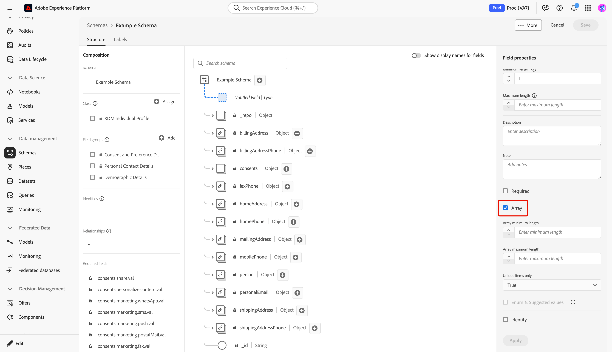
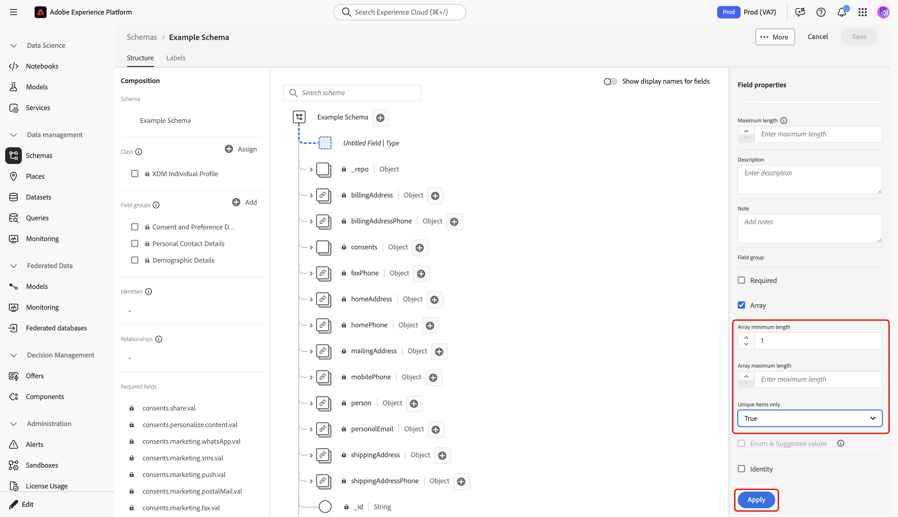
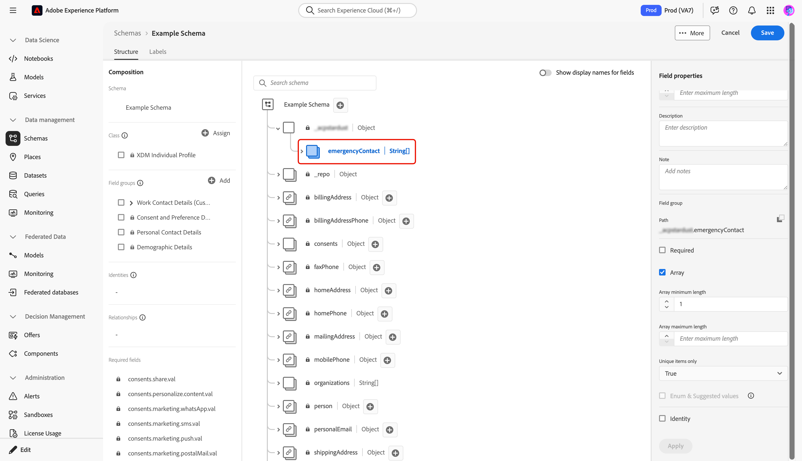

# Définir des champs de tableau dans l’interface utilisateur

Lors de la définition d’un champ Modèle de données d’expérience (XDM) dans l’interface utilisateur de Adobe Experience Platform, vous pouvez désigner ce champ sous la forme d’un tableau.

Le contenu du tableau dépend du [!UICONTROL Type] sélectionné pour ce champ. Par exemple, si le [!UICONTROL Type] d’un champ est défini sur « [!UICONTROL Chaîne] », la définition de ce champ en tant que tableau désigne le champ en tant que tableau de chaînes. Si le [!UICONTROL Type] du champ est défini sur un type de données à plusieurs champs tel que « [!UICONTROL Adresse postale] », il devient un tableau d’objets d’adresse postale conformes au type de données.

Après avoir [défini un nouveau champ dans l’interface utilisateur](./overview.md#define), vous pouvez le définir en tant que champ de tableau en cochant la case **[!UICONTROL Tableau]** dans le rail de droite.

Une fois la case à cocher sélectionnée, d’autres commandes s’affichent dans le rail de droite pour vous permettre de contraindre davantage le tableau. Si vous ne souhaitez pas appliquer une contrainte particulière, laissez le champ vide.

Les commandes de configuration supplémentaires pour les tableaux sont les suivantes :

| Propriété du champ | Description |
| --- | --- |
| [!UICONTROL Longueur minimale] | Nombre minimal d’éléments que le tableau doit contenir pour que l’ingestion réussisse. |
| [!UICONTROL Longueur maximale] | Nombre maximal d’éléments que le tableau doit contenir pour que l’ingestion réussisse. |
| [!UICONTROL Éléments uniques uniquement] | S’il est défini sur « [!UICONTROL True] », chaque élément du tableau doit être unique pour que l’ingestion réussisse. |

{style="table-layout:auto"}

Une fois le champ configuré, sélectionnez **[!UICONTROL Appliquer]** pour appliquer la modification au schéma.

La zone de travail se met à jour pour refléter les modifications apportées au champ. Notez que le type de données affiché à côté du nom du champ dans la zone de travail est ajouté avec une paire de crochets (`[]`), indiquant que le champ représente un tableau de ce type de données.

## Étapes suivantes

Ce guide explique comment définir un champ de tableau dans l’interface utilisateur. Consultez la présentation sur la [définition de champs dans l’interface utilisateur](./overview.md#special) pour savoir comment définir d’autres types de champs XDM dans l’[!DNL Schema Editor].
