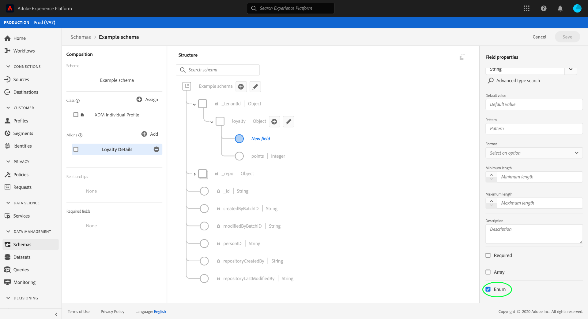

# Définition des champs d’énumération dans l’interface utilisateur {#enum}

>[!CONTEXTUALHELP]
>id="platform_xdm_enumsuggestedvalue"
>title="Enumérations et valeurs suggérées"
>abstract="Une énumération limite un champ de chaîne pour autoriser uniquement l’ingestion des données correspondant à un ensemble prédéfini de valeurs. Vous pouvez également définir un ensemble de valeurs suggérées pour le champ qui ne limite pas l’ingestion, mais qui définit à la place les attributs parmi lesquels vous pouvez choisir dans la segmentation. Pour plus d’informations, consultez la documentation."

Dans le modèle de données d’expérience (XDM), un champ d’énumération représente un champ limité à une liste prédéfinie de valeurs acceptables.

When [définition d’un nouveau champ](./overview.md#define) dans l’interface utilisateur de Adobe Experience Platform, vous pouvez la définir comme un champ d’énumération en sélectionnant l’option **[!UICONTROL Enum]** dans le rail de droite.

D’autres contrôles s’affichent après avoir coché la case, ce qui vous permet de spécifier les contraintes de valeur pour l’énumération. Sous , **[!UICONTROL Valeur]** , vous devez indiquer la valeur exacte à laquelle vous souhaitez limiter le champ. Cette valeur doit respecter la variable [!UICONTROL Type] vous avez sélectionné pour le champ énumération. Vous pouvez éventuellement fournir une **[!UICONTROL Libellé]** pour la contrainte également.

Pour ajouter des contraintes supplémentaires à l’énumération, sélectionnez **[!UICONTROL Ajouter une ligne]**.

Continuez à ajouter les contraintes souhaitées et les libellés facultatifs à l’énumération. Lorsque vous avez terminé, sélectionnez **[!UICONTROL Appliquer]** pour appliquer les modifications au schéma.

Le canevas se met à jour pour refléter les modifications. Lorsque vous explorez ce schéma à l’avenir, vous pouvez afficher et modifier les contraintes du champ d’énumération dans le rail de droite.

## Étapes suivantes

Ce guide explique comment définir un champ d’énumération dans l’interface utilisateur. Consultez la présentation sur [définition des champs dans l’interface utilisateur](./overview.md#special) pour savoir comment définir d’autres types de champ XDM dans [!DNL Schema Editor].
