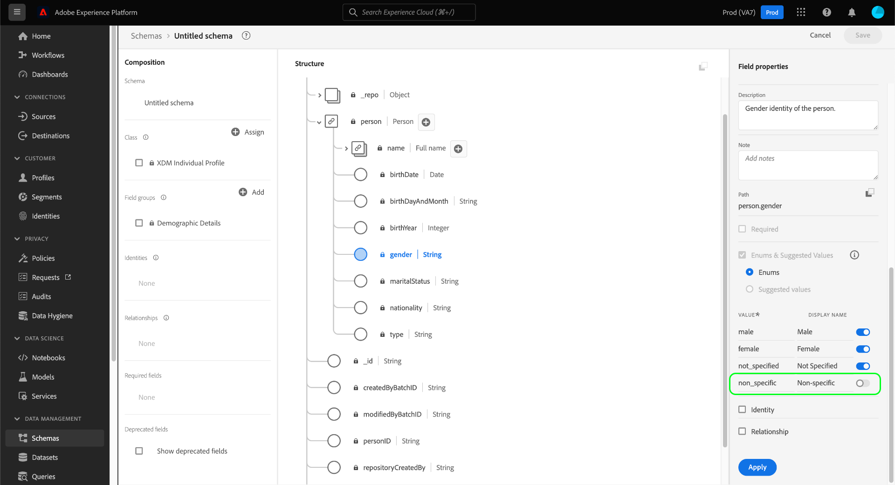

# Définir des énumérations et des valeurs suggérées dans l’interface utilisateur {#enums-and-suggested-values}

>[!CONTEXTUALHELP]
>id="platform_xdm_enum_suggestedvalue"
>title="Énumérations et valeurs suggérées"
>abstract="Une **Énumération** limite un champ de chaîne pour autoriser uniquement l&#39;ingestion des données correspondant à un jeu prédéfini de valeurs à ingérer. Chaque limite d&#39;énumération peut se voir attribuer un **Nom d&#39;affichage** qui renseigne les listes déroulantes d&#39;attributs dans l&#39;interface utilisateur de segmentation. Les **valeurs suggérées** pour un champ ne limitent pas l&#39;ingestion et ne déterminent que les noms d&#39;affichage présents dans Segmentation. Si plusieurs schémas partagent un champ appartenant à une classe ou à un groupe de champs commun et que vous définissez différentes énumérations ou valeurs suggérées pour ce champ entre chaque schéma, ces valeurs sont fusionnées et ajoutées dans le schéma d&#39;union."

Dans le modèle de données d’expérience (XDM), un champ de chaîne peut se voir attribuer un jeu prédéfini de valeurs acceptées ou suggérées afin de mieux contrôler les valeurs ingérées dans ce champ ou leur comportement dans la segmentation.

**[!UICONTROL Enums]** limite à un jeu prédéfini les valeurs pouvant être ingérées pour un champ de chaîne. Si vous tentez d’ingérer des données dans un champ d’énumération et que la valeur ne correspond à aucune de celles définies dans sa configuration, l’ingestion sera refusée.

Contrairement aux énumérations, l’option **[!UICONTROL Valeurs proposées]** permet de représenter un ensemble de valeurs recommandées pour un champ de chaîne qui ne limite pas les valeurs qu’il peut ingérer. Au lieu de cela, les valeurs suggérées affectent les valeurs prédéfinies disponibles dans l’ [interface utilisateur de segmentation](../../../segmentation/ui/overview.md) lors de l’inclusion du champ de chaîne en tant qu’attribut.

Lorsque [vous définissez un nouveau champ](./overview.md#define) dans l’interface utilisateur de Adobe Experience Platform et que vous définissez le type sur [!UICONTROL String], vous avez la possibilité de définir une [enum](#enum) ou des [valeurs suggérées](#suggested-values) pour ce champ.

Ce document explique comment définir des énumérations et des valeurs suggérées dans l’espace de travail de l’interface utilisateur [!UICONTROL Schemas]. Pour un aperçu rapide des énumérations et des valeurs suggérées, y compris la manière de les configurer dans l’interface utilisateur et de leurs effets en aval, regardez la vidéo suivante :

>[!VIDEO](https://video.tv.adobe.com/v/3409501/?quality=12&learn=on)

## Définition d’une énumération {#enum}

Sélectionnez **[!UICONTROL Enums et valeurs proposées]**, puis **[!UICONTROL Enums]**. Des contrôles supplémentaires s’affichent, vous permettant de spécifier les contraintes de valeur pour l’énumération. Pour ajouter une contrainte, sélectionnez **[!UICONTROL Ajouter une ligne]**.

Sous la colonne **[!UICONTROL Valeur]** , vous devez fournir la valeur exacte à laquelle vous souhaitez limiter le champ. Vous pouvez également fournir un **[!UICONTROL nom d’affichage]** convivial pour la contrainte, ce qui affecte la manière dont la valeur sera représentée dans la segmentation.

Continuez à utiliser **[!UICONTROL Ajouter une ligne]** pour ajouter les contraintes souhaitées et les libellés facultatifs à l’énumération, ou sélectionnez l’icône de suppression () en regard d’une ligne précédemment ajoutée pour la supprimer. Lorsque vous avez terminé, sélectionnez **[!UICONTROL Appliquer]** pour appliquer les modifications au schéma.

Le canevas se met à jour pour refléter les modifications. Lorsque vous explorez ce schéma à l’avenir, vous pouvez afficher et modifier les contraintes du champ d’énumération dans le rail de droite.

## Définir les valeurs suggérées {#suggested-values}

Sélectionnez **[!UICONTROL Enumérations et valeurs proposées]**, puis **[!UICONTROL Valeurs proposées]** pour afficher des commandes supplémentaires. À partir de là, sélectionnez **[!UICONTROL Ajouter une ligne]** pour commencer à ajouter les valeurs suggérées.

Dans la colonne **[!UICONTROL Nom d’affichage]**, indiquez un nom convivial pour la valeur telle que vous souhaitez la voir apparaître dans l’interface utilisateur de segmentation. Pour ajouter d’autres valeurs suggérées, sélectionnez à nouveau **[!UICONTROL Ajouter une ligne]** et répétez le processus selon vos besoins. Pour supprimer une ligne précédemment ajoutée, sélectionnez  en regard de la ligne en question.

Lorsque vous avez terminé, sélectionnez **[!UICONTROL Appliquer]** pour appliquer les modifications au schéma.

>[!NOTE]
>
>Il existe un délai d’environ cinq minutes pour que les valeurs suggérées d’un champ soient répercutées dans l’interface utilisateur de segmentation.

### Gestion des valeurs suggérées pour les champs standard

Certains champs des composants XDM standard contiennent leurs propres valeurs suggérées, telles que `eventType` de la classe [[!UICONTROL XDM ExperienceEvent]](../../classes/experienceevent.md). Bien que vous puissiez créer d’autres valeurs suggérées pour un champ standard, vous ne pouvez pas modifier ni supprimer les valeurs suggérées qui ne sont pas définies par votre organisation. Lors de l’affichage d’un champ standard dans l’interface utilisateur, les valeurs proposées sont affichées, mais sont en lecture seule.

Pour ajouter de nouvelles valeurs suggérées pour un champ standard, sélectionnez **[!UICONTROL Ajouter une ligne]**. Pour supprimer une valeur suggérée précédemment ajoutée par votre organisation, sélectionnez  en regard de la ligne en question.

<!-- ### Removing suggested values for standard fields

Only suggested values that you define can be removed from a standard field. Existing suggested values can be disabled so that they no longer appear in the segmentation dropdown, but they cannot be removed outright.

For example, consider a profile schema where the a suggested value for the standard `person.gender` field is disabled:

In this example, the display name "[!UICONTROL Non-specific]" is now disabled from being shown in the segmentation dropdown list. However, the value `non_specific` is still part of the list of enumerated fields and is therefore still allowed on ingestion. In other words, you cannot disable the actual enum value for the standard field as it would go against the principle of only allowing changes that make a field less restrictive.

See the [section below](#evolution) for more information on the rules for updating enums and suggested values for existing schema fields. -->

## Règles d’évolution pour les énumérations et les valeurs proposées {#evolution}

Une fois qu’un schéma avec un champ d’énumération a été utilisé pour ingérer des données dans Platform, toute modification supplémentaire apportée à la définition de schéma doit être conforme aux données déjà présentes dans le système. En règle générale, les modifications apportées à un champ existant peuvent uniquement rendre ce champ **less** restrictif. Un champ ne peut pas être rendu plus restrictif qu’il ne l’est déjà.

En ce qui concerne les énumérations et les valeurs proposées, les règles suivantes s’appliquent après l’ingestion :

* Vous **CAN** ajoutez des valeurs suggérées pour les champs standard et personnalisés avec des valeurs suggérées existantes.
* Vous **CAN** supprimez les valeurs suggérées des champs personnalisés avec les valeurs suggérées existantes.
* Vous **CAN** ajoutez de nouvelles valeurs d’énumération pour un champ d’énumération personnalisé existant.
* Vous **CAN** pouvez changer les valeurs d’énumération d’un champ personnalisé en valeurs suggérées uniquement ou les convertir en chaîne sans énumération ou valeurs suggérées. **L&#39;annulation de ce commutateur une fois appliqué est impossible.**
* Vous **CANNOT** supprimez les énumérations ou les valeurs suggérées des champs standard.
* Vous **CANNOT** ajoutez des valeurs d’énumération à un champ sans énumération existante.
* Vous **CANNOT** supprimez moins de valeurs d’énumération existantes pour un champ personnalisé.
* Vous **CANNOT** passez des valeurs suggérées à une énumération.

## Fusion de règles pour les énumérations et les valeurs proposées {#merging}

Si plusieurs schémas utilisent le même champ d’énumération avec des configurations différentes et que ces schémas sont inclus dans une union, certaines règles s’appliquent lorsqu’il s’agit de la manière dont les différences d’énumération sont réconciliées. Les règles exactes dépendent si les schémas référençant le même champ standard (comme `eventType`) ou s’ils référencent le même chemin de champ personnalisé dans différents groupes de champs.

Si vous référencez le même champ standard :

* Toutes les autres valeurs suggérées sont **APPENDED** dans l’union.
* Les mises à jour apportées aux valeurs suggérées pour la même clé d’énumération sont **UPDATED** dans l’union.

Si vous référencez le même chemin de champ personnalisé dans différents groupes de champs :

* Toutes les autres valeurs suggérées sont **APPENDED** dans l’union.
* Si la même valeur supplémentaire suggérée est définie dans plusieurs schémas, ces valeurs sont **MERGED** dans l’union. En d’autres termes, la même valeur suggérée n’apparaîtra pas deux fois après la fusion.

## Limites de validation

En raison des limitations actuelles du système, il existe deux cas où une énumération n’est pas validée par le système lors de l’ingestion :

1. L’énumération est définie sur un [champ de tableau](./array.md).
1. L’énumération est définie à plusieurs niveaux au sein de la hiérarchie des schémas.

## Étapes suivantes

Ce guide explique comment définir des énumérations et des valeurs suggérées pour les champs de chaîne dans l’interface utilisateur. Pour plus d’informations sur la gestion des énumérations et des valeurs suggérées à l’aide de l’API Schema Registry, consultez le [tutoriel](../../tutorials/suggested-values.md) suivant.

Pour savoir comment définir d’autres types de champs XDM dans [!DNL Schema Editor], consultez la présentation de la [définition de champs dans l’interface utilisateur](./overview.md#special).
