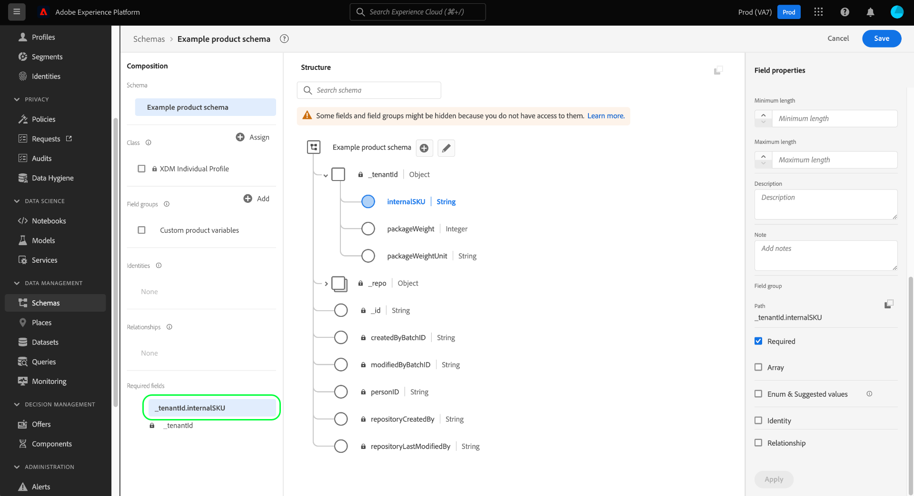

# Définir les champs obligatoires dans l’interface utilisateur

Dans le modèle de données d’expérience (XDM), un champ obligatoire indique qu’une valeur valide doit être fournie pour qu’un enregistrement ou un événement de série temporelle particulier soit accepté lors de l’ingestion des données. Les cas d’utilisation courants des champs obligatoires incluent les informations d’identité utilisateur et les horodatages.

>[!IMPORTANT]
>
>Qu’un champ de schéma soit obligatoire ou non, Experience Platform n’accepte pas les valeurs `null` ou vides pour les champs ingérés. S’il n’existe aucune valeur pour un champ particulier dans un enregistrement ou un événement, la clé de ce champ doit être exclue de la payload d’ingestion.

Lors de la [définition d’un nouveau champ](./overview.md#define) dans l’interface utilisateur de Adobe Experience Platform, vous pouvez le définir comme champ obligatoire en cochant la case **[!UICONTROL Obligatoire]** dans le rail de droite. Sélectionnez **[!UICONTROL Appliquer]** pour appliquer la modification au schéma.

Si le champ est un attribut de niveau racine sous l’objet d’identifiant client, son chemin d’accès s’affiche immédiatement sous **[!UICONTROL Champs obligatoires]** dans le rail de gauche.

Cependant, si un champ obligatoire est imbriqué dans un objet qui n’est pas marqué comme obligatoire, le champ imbriqué n’apparaît pas sous **[!UICONTROL Champs obligatoires]** dans le rail de gauche.

Dans l’exemple ci-dessous, le champ `internalSKU` est défini comme requis, mais pas son `SKUs` d’objet parent. Dans ce cas, aucune erreur de validation ne se produit si `SKUs` est exclu lors de l’ingestion de données, même si le champ enfant `internalSKU` est marqué comme requis. En d’autres termes, bien que `SKUs` soit facultatif, il doit contenir un champ `internalSKU` dans le cas où il est inclus.

Si vous souhaitez qu’un champ imbriqué soit toujours obligatoire dans un schéma, vous devez également définir tous les champs parents selon les besoins (à l’exception de l’objet d’identifiant client).

## Étapes suivantes

Ce guide explique comment définir un champ obligatoire dans l’interface utilisateur. Consultez la présentation sur la [définition de champs dans l’interface utilisateur](./overview.md#special) pour savoir comment définir d’autres types de champs XDM dans l’[!DNL Schema Editor].
