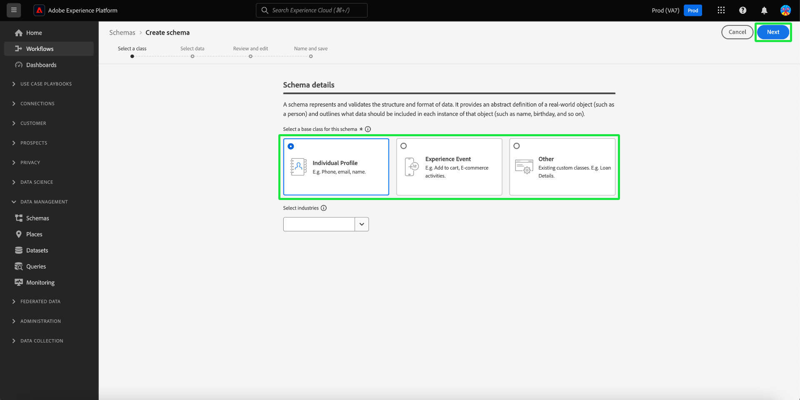
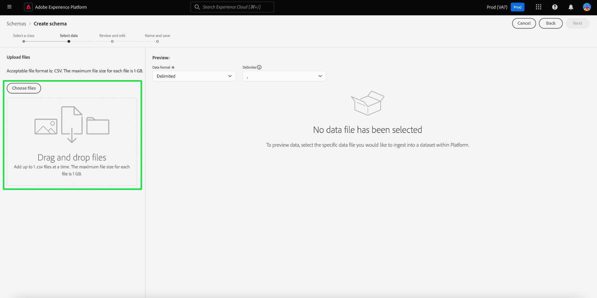
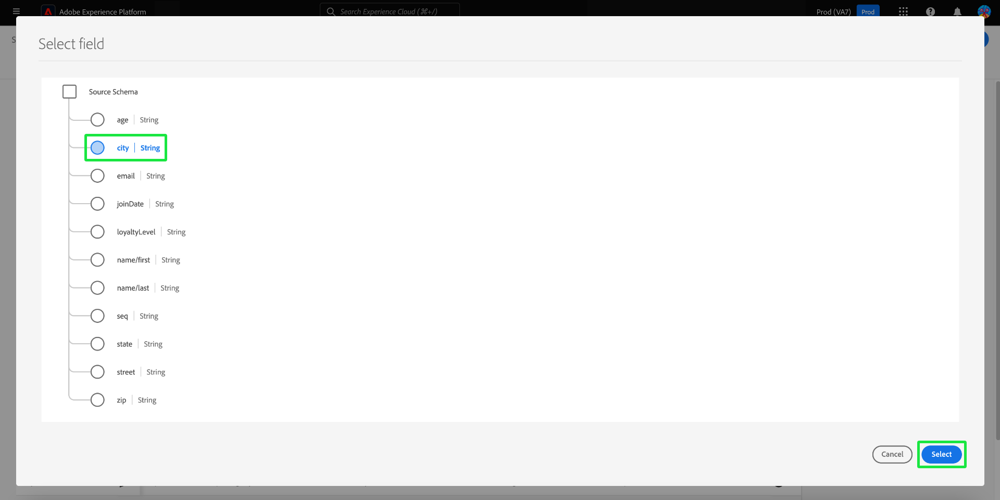
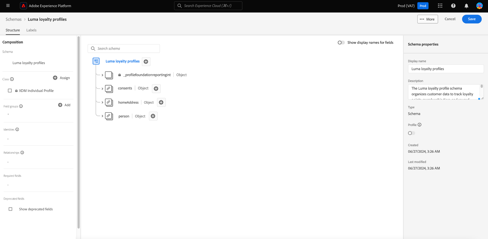

# Création de schémas assistés par l’apprentissage automatique

Utilisez des algorithmes ML pour générer un schéma à partir de données d’exemple. Ce processus permet de gagner du temps et d’accroître la précision lors de la définition de la structure, des champs et des types de données pour les jeux de données complexes volumineux.

Grâce à la génération de schémas ML, vous pouvez rapidement intégrer de nouvelles sources de données et réduire les erreurs liées à la création manuelle. Les utilisateurs non techniques peuvent l’utiliser pour générer des schémas ou gérer des jeux de données volumineux et complexes sans effort supplémentaire. Cette assistance accélère le processus, de l’obtention de données à l’obtention d’informations, en facilitant la combinaison de nouvelles sources de données et l’analyse des données.

## Commencer

Ce tutoriel nécessite une compréhension pratique des exigences relatives à la création de schémas. Avant de poursuivre avec ce guide, vous devez lire le [guide de l’interface utilisateur pour la création et l’édition de schémas](./resources/schemas.md).

Ce guide explique comment créer des schémas à l’aide d’algorithmes d’apprentissage automatique (ML) pour générer un schéma à partir de données d’exemple. Pour plus d’informations sur la création de schémas ou pour consulter le document sur les [workflows basés sur des champs dans l’éditeur de schémas](https://experienceleague.adobe.com/en/docs/experience-platform/xdm/ui/field-based-workflows), reportez-vous au [guide manuel de création de schémas](https://experienceleague.adobe.com/en/docs/experience-platform/xdm/ui/resources/schemas#add-field-groups) pour mieux comprendre le processus de création de schémas.

>[!NOTE]
>
>Vous pouvez également composer un schéma à l’aide de l’API [!DNL Schema Registry]. Pour créer un schéma manuellement à l’aide de l’API, lisez d’abord le [[!DNL Schema Registry] guide de développement](../api/getting-started.md) avant de lancer le tutoriel sur la [création d’un schéma à l’aide de l’API](../tutorials/create-schema-api.md).

## Accédez au workflow Créer un schéma {#navigate-to-schema-creation-workflow}

Dans le volet de navigation de gauche de l’interface utilisateur de Platform, sélectionnez l’espace de travail **[!UICONTROL Schémas]** . L’espace de travail **[!UICONTROL Schémas]** s’affiche. Sélectionnez **[!UICONTROL Créer un schéma]** pour ajouter un nouveau schéma afin de démarrer un workflow de création de schéma.

## Créer un schéma {#create-a-schema}

La boîte de dialogue [!UICONTROL Créer un schéma] s’affiche. Sélectionnez l’option de création de schéma **[ML-Assisted]**, suivie de **[!UICONTROL Select]** pour confirmer votre choix.

![La boîte de dialogue [!UICONTROL Créer un schéma] avec [!UICONTROL ML-Assisted] mise en surbrillance.](../images/ui/ml-schema-creation/use-sample-csv.png)

### Sélectionner une classe de base {#select-base-class}

Le workflow [!UICONTROL Créer un schéma] s’affiche. Sélectionnez une classe de base pour votre schéma, suivie de **[!UICONTROL Next]**.

### Chargement d’un fichier CSV {#upload-csv}

L&#39;étape **[!UICONTROL Sélectionner les données]** du workflow de création s&#39;affiche. Dans la section **[!UICONTROL Télécharger les fichiers]** , sélectionnez **[!UICONTROL Choisir les fichiers]** ou la section **[!UICONTROL Glisser-déposer des fichiers]** . Sélectionnez un fichier .csv sur votre ordinateur pour générer un schéma.

### Aperçu des données {#preview-data}

La section [!UICONTROL Télécharger le fichier] affiche le nom du fichier CSV que vous avez importé et la section **[!UICONTROL Aperçu]** affiche des lignes d’exemples de données du fichier que vous avez téléchargé. Sélectionnez **[!UICONTROL Suivant]** pour continuer le workflow.

### Révision et modification du schéma {#review-schema}

L’étape **[!UICONTROL Révision et modification]** du processus de création s’affiche désormais, affichant la **[!UICONTROL recommandation de schéma]** assistée par l’apprentissage automatique dans une vue tabulée. À ce stade, vous pouvez modifier, ajouter ou supprimer des champs du schéma recommandé généré par le modèle d’apprentissage automatique. Le tableau contient les champs suivants :

| Nom du champ | Description |
|------------------|---------------------------------------------------------|
| [!UICONTROL Table de données] | Jeu de données ou base de données d’où provient le champ. |
| [!UICONTROL Champ Source] | Nom du champ d’origine du système source. |
| [!UICONTROL Champ cible] | Nom du champ dans le système cible où les données seront mappées. |
| [!UICONTROL Nom d’affichage] | Nom utilisé pour afficher le champ dans l’interface utilisateur. Ce nom doit être plus convivial ou descriptif. |
| [!UICONTROL Type de données] | Type de données stockées dans le champ (par exemple, `String`, `Date`). |
| [!UICONTROL Groupe de champs] | Une catégorisation du champ en fonction de son utilisation ou de son contexte (par exemple, [!UICONTROL Demographic Details], [!UICONTROL Commerce Details]). |

#### Ajouter un champ {#add-field}

Pour ajouter un champ au schéma, sélectionnez **[!UICONTROL Ajouter un nouveau champ]**.

La boîte de dialogue [!UICONTROL Sélectionner un champ] s’affiche. La boîte de dialogue contient un schéma tel qu’il existe actuellement. Sélectionnez le champ de votre choix et sélectionnez **[Sélectionner]** pour ajouter un nouveau champ au schéma. Sélectionnez **[Annuler]** pour fermer la boîte de dialogue si nécessaire.

Une nouvelle ligne s’affiche sur votre schéma recommandé. Vous pouvez maintenant modifier le champ.

#### Modifier un champ {#edit-field}

Pour modifier un champ, sélectionnez l’icône en forme de crayon de la ligne à modifier. Un panneau de détails s’affiche à droite, où vous pouvez modifier le mappage de champ personnalisé. Le panneau Détails contient le [!UICONTROL champ cible], le [!UICONTROL nom d’affichage], le [!UICONTROL type de données] et le [!UICONTROL groupe de champs]. Apportez les modifications nécessaires et sélectionnez **[!UICONTROL Appliquer]** pour confirmer. Sélectionnez à nouveau l’icône en forme de crayon pour fermer le panneau des détails.

#### Supprimer un champ {#remove-field}

Pour supprimer un champ, sélectionnez l’icône moins sur la ligne à supprimer.

>[!CAUTION]
>
>Aucune boîte de dialogue de confirmation ne s’affiche lors de la suppression de cet élément.

#### Approbation du schéma recommandé {#approve}

Pour approuver le schéma recommandé et poursuivre le workflow **[!UICONTROL Créer un schéma]**, sélectionnez **[Suivant]**.

### Nom et enregistrement du schéma {#name-and-save}

L’étape **[!UICONTROL Nom et enregistrement]** du workflow de création s’affiche. Saisissez un **[nom d’affichage du schéma]** et une description facultative. La section **[Schéma généré]** fournit un diagramme du schéma généré par ML. Sélectionnez **[Terminer]** pour terminer le workflow de création de schéma.

### Affichage dans l’éditeur de schémas {#view-in-editor}

L’éditeur de schémas s’affiche avec le nouveau schéma affiché dans la zone de travail. Sélectionnez **[!UICONTROL Enregistrer]** pour revenir à l’espace de travail [!UICONTROL Schémas].

## Étapes suivantes

Après avoir créé votre schéma, vous pouvez utiliser l’éditeur de schémas pour apporter d’autres modifications, si nécessaire. Votre nouveau schéma est maintenant prêt à être intégré à vos sources de données et utilisé pour l’analyse des données.

Pour plus d’informations sur l’utilisation de l’éditeur de schémas, consultez le [guide de modification d’un schéma existant](https://experienceleague.adobe.com/en/docs/experience-platform/xdm/ui/resources/schemas#edit) .
