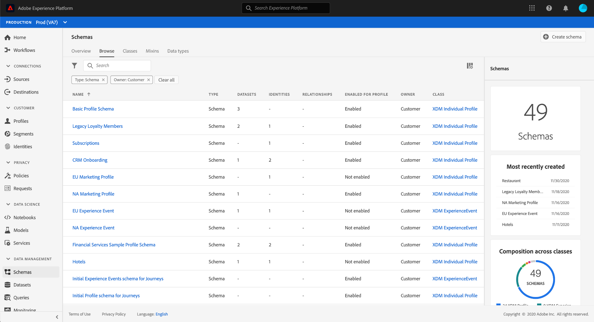

# Présentation de l’interface utilisateur de [!UICONTROL Schemas]

L’espace de travail [!UICONTROL Schemas] de l’interface utilisateur de Adobe Experience Platform vous permet de gérer les ressources du modèle de données d’expérience (XDM), y compris les schémas, les classes, les groupes de champs de schéma et les types de données. Vous pouvez afficher et explorer les ressources de base fournies par Adobe, ainsi que créer des ressources et des schémas personnalisés pour votre organisation.

Pour accéder à l’espace de travail dans l’interface utilisateur d’Experience Platform, sélectionnez **[!UICONTROL Schemas]** dans le rail de gauche.

## Prise en main

Si vous utilisez l’espace de travail pour la première fois, commencez par consulter le guide sur [l’exploration des ressources existantes dans l’interface utilisateur](./explore.md) pour vous familiariser avec les différents onglets et la zone de travail des schémas.

Il est également recommandé de suivre le tutoriel [création de schéma](../tutorials/create-schema-ui.md) pour créer un exemple de schéma et obtenir une présentation complète des fonctionnalités de l’[!DNL Schema Editor] dans le processus.

## Créer et gérer des ressources XDM

>[!NOTE]
>
>Les actions XDM sont disponibles à partir du tableau d’inventaire et de la vue des détails de la ressource (**[!UICONTROL More]**). Les actions complètes s’appliquent uniquement aux ressources personnalisées (définies par le client) ; les ressources standard ont des options limitées. Voir [Gérer les schémas, les classes, les groupes de champs et les types de données : actions et suppression](./explore.md#xdm-resource-actions).

L’espace de travail [!UICONTROL Schemas] fournit des outils puissants pour créer et personnaliser les ressources XDM de votre entreprise. Consultez la documentation suivante pour savoir comment créer et modifier chaque type de ressource dans l’interface utilisateur :

* [Schémas](./resources/schemas.md)
* [Classes](./resources/classes.md)
* [Groupes de champs](./resources/field-groups.md)
* [Types de données](./resources/data-types.md)

## Définir des champs XDM

Les classes, les groupes de champs et les types de données contribuent tous à un schéma. Vous pouvez effectuer votre choix dans une liste de types de champs standard lors de l’ajout de champs à ces ressources et pouvez également définir des champs spécialisés pour certains cas d’utilisation. Reportez-vous au guide sur la [définition des champs XDM dans l’interface utilisateur](./fields/overview.md) pour plus d’informations.

## Étapes suivantes

Ce document vous a présenté l’espace de travail [!UICONTROL Schemas] dans l’interface utilisateur d’Experience Platform. Pour en savoir plus sur la gestion des schémas et d’autres ressources XDM, reportez-vous à la documentation référencée tout au long de cette présentation .
