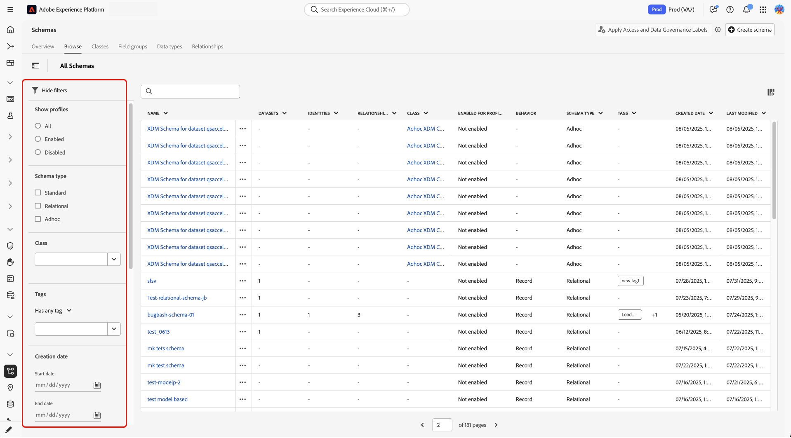

# Présentation de l’interface utilisateur [!UICONTROL Schémas]

Utilisez l’espace de travail **[!UICONTROL Schémas]** dans Adobe Experience Platform pour créer, gérer et organiser des ressources du modèle de données d’expérience (XDM). Dans cet espace de travail, vous pouvez utiliser des schémas, des classes, des groupes de champs de schéma, des types de données et des relations. Vous pouvez également afficher les ressources fournies par Adobe et créer des ressources personnalisées pour votre organisation.

Pour accéder à l’espace de travail dans l’interface utilisateur d’Experience Platform, sélectionnez **[!UICONTROL Schémas]** dans le rail de gauche.

## Prise en main {#getting-started}

Si vous utilisez l’espace de travail pour la première fois, commencez par consulter le guide [exploration des ressources de schéma dans l’interface utilisateur](./explore.md) pour savoir comment parcourir les ressources, filtrer les vues d’inventaire, utiliser des balises et des dossiers et gérer les schémas à partir de l’inventaire.

Pour créer votre premier schéma, suivez le tutoriel [création de schémas](../tutorials/create-schema-ui.md). Le tutoriel décrit le processus de création de schémas et présente les principales fonctionnalités du **[!DNL Schema Editor]**.

## Découverte et organisation des schémas {#discover-and-organize-schemas}

Utilisez l’espace de travail **[!UICONTROL Parcourir]** pour localiser et organiser les schémas. Vous pouvez rechercher et filtrer des schémas, trier les colonnes d’inventaire, afficher les métadonnées des schémas et organiser les ressources à l’aide de balises et de dossiers.

Pour plus d’informations sur le filtrage, la gestion des stocks, les balises, les dossiers et les actions intégrées, consultez le guide [explorer les ressources de schéma](./explore.md).

## Gestion de la gouvernance des schémas {#manage-schema-governance}

Appliquez des contrôles de gouvernance directement aux schémas pour vous aider à maintenir les exigences de gestion des données et de conformité dans votre organisation. Vous pouvez appliquer des libellés de gouvernance des données aux schémas, organiser les ressources avec des balises et des dossiers et gérer les métadonnées de schéma à partir des vues d’inventaire.

Pour plus d’informations, consultez la documentation suivante :

- [Étiquettes d’utilisation des données](../../data-governance/labels/user-guide.md)
- [Gestion des balises unifiées](../../administrative-tags/ui/managing-tags.md)

## Gestion des schémas à partir des vues d’inventaire {#manage-schemas-from-inventory-views}

Utilisez des actions intégrées pour effectuer des tâches courantes de gestion des schémas sans ouvrir de schémas individuels. Selon le type de ressource, vous pouvez modifier les propriétés du schéma, appliquer des libellés, gérer les balises, déplacer des ressources vers des dossiers, ajouter des ressources aux packages de déploiement et effectuer d’autres actions au niveau de l’inventaire.

Pour plus d’informations, consultez le guide [explorer les ressources de schéma](./explore.md#browse-organize-manage-schemas).

## Créer et gérer des ressources XDM {#create-and-manage-xdm-resources}

L’espace de travail **[!UICONTROL Schémas]** fournit des outils pour créer et gérer des ressources XDM. Utilisez la documentation suivante pour en savoir plus sur chaque type de ressource :

- [Schémas](./resources/schemas.md)
- [Actions et workflows de schéma](./resources/schemas.md#manage-schemas)
- [Création de schéma assistée par ML](./ml-assisted-schema-creation.md)
- [Modèles de données du secteur](../schema/industries/overview.md)
- [Classes](./resources/classes.md)
- [Groupes de champs](./resources/field-groups.md)
- [Types de données](./resources/data-types.md)
- [Relations](../tutorials/relationship-ui.md)

## Intégration avec les services Experience Platform {#integration-with-experience-platform-services}

Les schémas prennent en charge plusieurs workflows et services Experience Platform. Selon votre cas d’utilisation, les schémas peuvent être utilisés avec les services suivants :

- [Profil client en temps réel](../../profile/home.md)
- [Service de requête](../../query-service/home.md)
- [Destinations](../../destinations/home.md)

Reportez-vous à la documentation de chaque service pour savoir comment les schémas sont utilisés dans ces workflows.

## Définir des champs XDM {#define-xdm-fields}

Les schémas, les classes, les groupes de champs et les types de données contribuent tous aux champs de votre modèle de données XDM. Lors de la création de ressources personnalisées, vous pouvez définir des types de champs standard et des champs spécialisés pour des cas d’utilisation spécifiques.

Pour plus d’informations, consultez le guide sur la [définition des champs XDM dans l’interface utilisateur](./fields/overview.md).

## Étapes suivantes {#next-steps}

Utilisez les ressources suivantes pour continuer à en savoir plus sur les schémas XDM et les fonctionnalités associées :

- [Explorer les ressources de schéma dans l’interface utilisateur](./explore.md)
- [Création et modification de schémas](./resources/schemas.md)
- [Présentation du modèle de données d’expérience (XDM)](../home.md)

