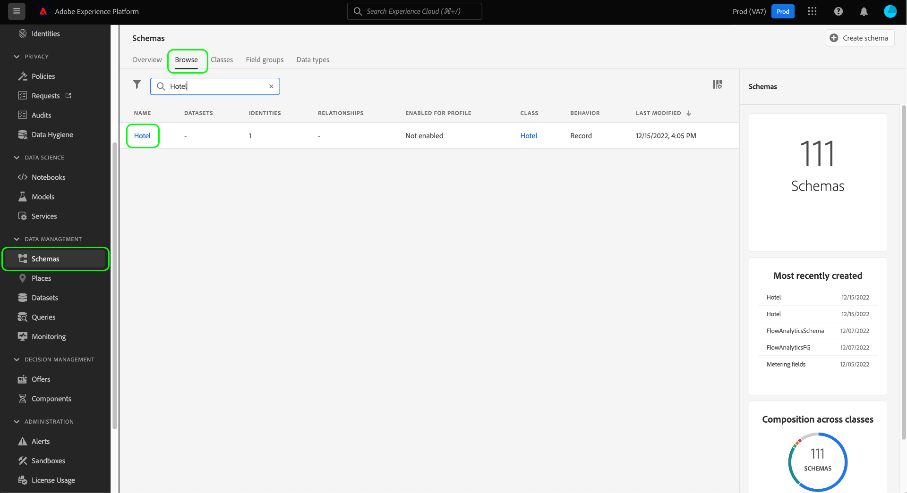

# Création et modification de classes dans l’interface utilisateur

Dans le modèle de données d’expérience (XDM), les classes définissent les aspects comportementaux des données qu’un schéma contiendra (enregistrement ou série chronologique). En outre, les classes décrivent le plus petit de nombres de propriétés communes que tous les schémas basés sur cette classe doivent inclure et fournir une manière de fusionner plusieurs jeux de données compatibles.

Adobe fournit plusieurs classes XDM standard (&quot;core&quot;), dont [!DNL XDM Individual Profile] et [!DNL XDM ExperienceEvent]. Outre ces classes de base, vous pouvez également créer vos propres classes personnalisées afin de décrire des cas d’utilisation plus spécifiques pour votre entreprise.

Ce document fournit un aperçu de la création, de la modification et de la gestion des classes personnalisées dans l’interface utilisateur de Adobe Experience Platform.

## Conditions préalables  

Ce guide nécessite une bonne compréhension de XDM System. Pour une présentation du rôle de XDM dans l&#39;écosystème Experience Platform, voir [Présentation de XDM](../../home.md) et les [bases de la composition du schéma](../../schema/composition.md) pour savoir comment les classes contribuent aux schémas de XDM.

Bien que ce guide ne soit pas obligatoire, il est recommandé de suivre également le tutoriel sur [la composition d&#39;un schéma dans l&#39;interface utilisateur](../../tutorials/create-schema-ui.md) pour vous familiariser avec les diverses fonctionnalités du [!DNL Schema Editor].

## Création d’une nouvelle classe {#create}

Dans l&#39;espace de travail **[!UICONTROL Schémas]**, sélectionnez **[!UICONTROL Créer un schéma]**, puis **[!UICONTROL Parcourir]** dans la liste déroulante.

Une boîte de dialogue s&#39;affiche, vous permettant de choisir parmi une liste de classes disponibles. Dans la partie supérieure de la boîte de dialogue, sélectionnez **[!UICONTROL Créer une nouvelle classe]**. Vous pouvez ensuite attribuer à votre nouvelle classe un nom d&#39;affichage (un nom court, descriptif, unique et convivial pour la classe), une description et un comportement pour les données que le schéma va définir (&quot;[!UICONTROL Enregistrer]&quot; ou &quot;[!UICONTROL Série chronologique]&quot;).

Lorsque vous avez terminé, sélectionnez **[!UICONTROL Attribuer la classe]**.

Le [!DNL Schema Editor] s&#39;affiche, affichant un nouveau schéma dans la trame qui est basé sur la classe personnalisée que vous venez de créer. Comme aucun champ n&#39;a encore été ajouté à la classe, le schéma ne contient qu&#39;un champ `_id`, qui représente l&#39;identifiant unique généré par le système qui est automatiquement appliqué à toutes les ressources dans [!DNL Schema Registry].

>[!IMPORTANT]
>
>Lors de la création d&#39;un schéma qui implémente une classe définie par votre organisation, n&#39;oubliez pas que les groupes de champs de schéma ne sont disponibles que pour une utilisation avec des classes compatibles. La classe que vous avez définie étant nouvelle, aucun groupe de champs compatible n&#39;est répertorié dans la boîte de dialogue **[!UICONTROL Ajouter le groupe de champs]**. Vous devez à la place [créer de nouveaux groupes de champs](./field-groups.md#create) pour les utiliser avec cette classe. La prochaine fois que vous composez un schéma qui implémente la nouvelle classe, les groupes de champs que vous avez définis seront répertoriés et disponibles pour utilisation.

Vous pouvez désormais début [l&#39;ajout de champs à la classe](#add-fields), qui sera partagée par tous les schémas qui utilisent la classe.

## Modifier une classe existante {#edit}

>[!NOTE]
>
>Seules les classes personnalisées définies par votre organisation peuvent être entièrement modifiées et personnalisées. Pour les classes de base définies par Adobe, seuls les noms d’affichage de leurs champs peuvent être modifiés dans le contexte de schémas individuels. Pour plus d&#39;informations, consultez la section [modification des noms d&#39;affichage pour les champs de schéma](./schemas.md#display-names).
>
>Une fois qu&#39;une classe personnalisée a été enregistrée et utilisée dans l&#39;assimilation de données, seules des modifications supplémentaires peuvent être apportées par la suite. Pour plus d&#39;informations, consultez les [règles d&#39;évolution des schémas](../../schema/composition.md#evolution).

Pour modifier une classe existante, sélectionnez l&#39;onglet **[!UICONTROL Parcourir]**, puis sélectionnez le nom d&#39;un schéma qui utilise la classe à modifier.

>[!TIP]
>
>Vous pouvez utiliser les fonctionnalités de recherche et de filtrage de l’espace de travail pour faciliter la recherche du schéma. Pour plus d&#39;informations, consultez le guide [exploration des ressources XDM](../explore.md).

Le [!DNL Schema Editor] apparaît, la structure du schéma étant affichée dans la trame. Vous pouvez désormais début [l&#39;ajout de champs à la classe](#add-fields).

## Ajouter des champs à une classe {#add-fields}

Une fois que vous disposez d&#39;un schéma qui utilise une classe personnalisée ouverte dans l&#39;[!UICONTROL éditeur de Schéma], vous pouvez début d&#39;ajouter des champs à la classe. Pour ajouter un nouveau champ, sélectionnez l’icône **plus (+)** en regard du nom du schéma.

>[!IMPORTANT]
>
>N&#39;oubliez pas que tous les champs que vous ajoutez à une classe seront utilisés dans tous les schémas qui utilisent cette classe. Vous devez donc examiner attentivement les champs qui seront utiles dans tous les cas d&#39;utilisation de schéma. Si vous envisagez d&#39;ajouter un champ qui ne peut être utilisé que dans certains schémas sous cette classe, vous pouvez envisager de l&#39;ajouter à ces schémas en créant à la place [un groupe de champs](./field-groups.md#create).

Un **[!UICONTROL nouveau champ]** apparaît dans le canevas et le rail de droite se met à jour pour afficher les commandes permettant de configurer les propriétés du champ. Consultez le guide sur la [définition des champs dans l&#39;interface utilisateur](../fields/overview.md#define) pour connaître les étapes spécifiques de configuration et d&#39;ajout du champ à la classe.

Continuez à ajouter autant de champs que nécessaire à la classe. Une fois terminé, sélectionnez **[!UICONTROL Enregistrer]** pour enregistrer le schéma et la classe.

Si vous avez déjà créé des schémas qui utilisent cette classe, les champs nouvellement ajoutés s’affichent automatiquement dans ces schémas.

## Modification de la classe d’un schéma {#schema}

Vous pouvez modifier la classe du schéma à tout moment au cours du processus de création initial avant de l’enregistrer. Pour plus d&#39;informations, consultez le guide [Création et modification de schémas](./schemas.md#change-class).

## Étapes suivantes

Ce document décrit comment créer et modifier des classes à l’aide de l’interface utilisateur de la plateforme. Pour plus d&#39;informations sur les fonctionnalités de l&#39;espace de travail [!UICONTROL Schémas], consultez la présentation de l&#39;espace de travail [[!UICONTROL Schémas]](../overview.md).

Pour savoir comment gérer les classes à l&#39;aide de l&#39;API [!DNL Schema Registry], consultez le guide du point de terminaison [classes](../../api/classes.md).
