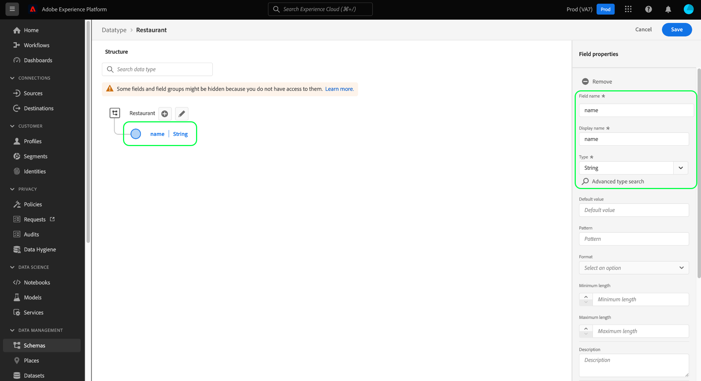

# Création et modification de types de données à l’aide de l’interface utilisateur

Dans le modèle de données d’expérience (XDM), les types de données sont utilisés comme champs de type référence dans les classes ou les groupes de champs de schéma de la même manière que les champs littéraux de base, la différence majeure étant que les types de données peuvent définir plusieurs sous-champs. Bien que semblables aux groupes de champs en ce qu’ils permettent l’utilisation cohérente d’une structure à champs multiples, les types de données sont plus flexibles car ils peuvent être inclus n’importe où dans la structure de schéma alors que les groupes de champs ne peuvent être ajoutés qu’au niveau racine.

Adobe Experience Platform fournit de nombreux types de données standard qui peuvent être utilisés pour couvrir un large éventail de cas d’utilisation courants de la gestion de l’expérience. Cependant, vous pouvez également définir vos propres types de données personnalisées afin de répondre à vos besoins spécifiques.

Ce didacticiel décrit les étapes de création et de modification des types de données personnalisées dans l’interface utilisateur de la plate-forme.

## Conditions préalables  

Ce guide nécessite une bonne compréhension de XDM System. Pour une présentation du rôle de XDM dans l&#39;écosystème Experience Platform, voir [Présentation de XDM](../../home.md) et les [bases de la composition du schéma](../../schema/composition.md) pour savoir comment les types de données contribuent aux schémas de XDM.

Bien que ce guide ne soit pas obligatoire, il est recommandé de suivre également le tutoriel sur [la composition d&#39;un schéma dans l&#39;interface utilisateur](../../tutorials/create-schema-ui.md) pour vous familiariser avec les diverses fonctionnalités du [!DNL Schema Editor].

## Ouvrez [!DNL Schema Editor] pour un type de données.

Dans l’interface utilisateur de la plate-forme, sélectionnez **[!UICONTROL Schémas]** dans le volet de navigation de gauche pour ouvrir l’espace de travail [!UICONTROL Schémas], puis sélectionnez l’onglet **[!UICONTROL Types de données]**. Une liste des types de données disponibles s’affiche, y compris ceux définis par l’Adobe et ceux créés par votre organisation.

Vous disposez de deux options :

- [Créer un nouveau type de données](#create)
- [Sélectionner un type de données existant à modifier](#edit)

### Créer un nouveau type de données {#create}

Dans l&#39;onglet **[!UICONTROL Types de données]**, sélectionnez **[!UICONTROL Créer un type de données]**.

Le [!DNL Schema Editor] apparaît, indiquant la structure actuelle du nouveau type de données dans la trame. Sur le côté droit de l’éditeur, vous pouvez fournir un nom d’affichage et une description facultative pour le type de données. Veillez à fournir un nom unique et concis pour votre type de données, tel qu’il sera identifié lors de son ajout à un schéma.

Ce didacticiel crée un type de données qui décrit une propriété de restaurant, de sorte que le type de données se voit attribuer un nom d&#39;affichage &quot;Restaurant&quot;.

A partir de là, vous pouvez passer à la section [suivante](#add-fields) pour début d’ajouter des champs au nouveau type de données.

### Modification d’un type de données existant

Seuls les types de données personnalisés définis par votre organisation peuvent être modifiés. Pour réduire la liste affichée, sélectionnez l’icône de filtre () afin d’afficher les commandes de filtrage en fonction de [!UICONTROL Propriétaire]. Sélectionnez **[!UICONTROL Client]** pour afficher uniquement les types de données personnalisés appartenant à votre organisation.

Sélectionnez le type de données à modifier dans la liste pour ouvrir le rail de droite, en indiquant les détails du type de données. Sélectionnez le nom du type de données dans le rail de droite pour ouvrir sa structure dans [!DNL Schema Editor].

## Ajouter les champs au type de données {#add-fields}

Pour début d’ajouter des champs au type de données, sélectionnez l’icône **plus (+)** en regard du champ de niveau racine dans la trame. Un nouveau champ apparaît ci-dessous et le rail droit est mis à jour pour afficher les commandes du nouveau champ.

Utilisez les commandes du rail de droite pour configurer les détails du nouveau champ. Consultez le guide sur la [définition des champs dans l&#39;interface utilisateur](../fields/overview.md#define) pour connaître les étapes spécifiques de configuration et d&#39;ajout du champ au type de données.

Le type de données Restaurant requiert un champ de chaîne pour représenter le nom du restaurant. Ainsi, le [!UICONTROL nom du champ] est défini comme &quot;nom&quot; et le [!UICONTROL type] est défini comme &quot;[!UICONTROL chaîne]&quot;. Sélectionnez **[!UICONTROL Appliquer]** pour appliquer les modifications au champ.

Continuez à ajouter d’autres champs au type de données si nécessaire. L’exemple de type de données Restaurant comporte désormais des champs supplémentaires pour la marque, la capacité de sièges et l’espace au sol.

Outre les champs de base, vous pouvez également imbriquer d’autres types de données dans votre type de données personnalisé. Par exemple, le type de données Restaurant requiert un champ qui représente l’adresse physique de la propriété. Dans ce scénario, vous pouvez ajouter un nouveau champ &quot;adresse&quot; auquel est affecté le type de données standard &quot;[!UICONTROL Adresse postale]&quot;.

Cela montre à quel point les types de données peuvent être flexibles en termes de description de vos données : les types de données peuvent utiliser des champs qui sont également des types de données, qui peuvent eux-mêmes contenir d’autres types de données, etc. Cela vous permet d’abstraire et de réutiliser des modèles de données courants dans vos schémas XDM, ce qui facilite la représentation de structures de données complexes.

Une fois les champs ajoutés au type de données, sélectionnez **[!UICONTROL Enregistrer]** pour enregistrer vos modifications et ajouter le type de données à [!DNL Schema Library].

## Ajouter le type de données à une classe ou un groupe de champs

Une fois que vous avez créé un type de données, vous pouvez le début dans vos schémas. Les schémas XDM étant composés d&#39;une classe et de zéro ou de plusieurs groupes de champs, les champs fournis par un type de données ne peuvent pas être ajoutés directement à un schéma. Ils doivent être inclus dans une classe ou un groupe de champs.

Début en suivant les étapes nécessaires pour ajouter [un champ à une classe](./classes.md#add-fields) ou [ajouter un champ à un groupe de champs](./field-groups.md#add-fields). Lorsque vous choisissez **[!UICONTROL Type]** pour le nouveau champ, sélectionnez le nom de votre type de données dans le menu déroulant.

## Conversion d’un objet à plusieurs champs en un type de données {#convert}

Lorsque vous créez un champ de type objet avec plusieurs sous-champs dans [!DNL Schema Editor], vous pouvez convertir ce champ en un type de données afin d’utiliser la même structure de champ dans une classe ou un groupe de champs différent.

Pour convertir un champ de type objet en type de données, sélectionnez le champ dans la trame. Avant de convertir le champ, assurez-vous que le **[!UICONTROL nom d’affichage]** est descriptif des données que l’objet contiendra, car il deviendra le nom du type de données. Lorsque vous êtes prêt à convertir le champ, sélectionnez **[!UICONTROL Convertir en nouveau type de données]** dans le rail de droite.

Le canevas met à jour le type de données du champ de &quot;[!UICONTROL Objet]&quot; vers le nouveau type de données. Les sous-champs comportent également de petites icônes de verrouillage indiquant qu’il ne s’agit plus de champs individuels mais d’un type de données à champs multiples. Cette structure peut désormais être réutilisée dans d&#39;autres classes et groupes de champs en sélectionnant ce type de données dans la liste déroulante **[!UICONTROL Type]** lors de la définition d&#39;un nouveau champ.

## Étapes suivantes

Ce guide explique comment créer et modifier des types de données à l’aide de l’interface utilisateur de la plate-forme. Pour plus d&#39;informations sur les fonctionnalités de l&#39;espace de travail [!UICONTROL Schémas], consultez la présentation de l&#39;espace de travail [[!UICONTROL Schémas]](../overview.md).

Pour savoir comment gérer les types de données à l&#39;aide de l&#39;API [!DNL Schema Registry], consultez le [guide du point de terminaison des types de données](../../api/data-types.md).
